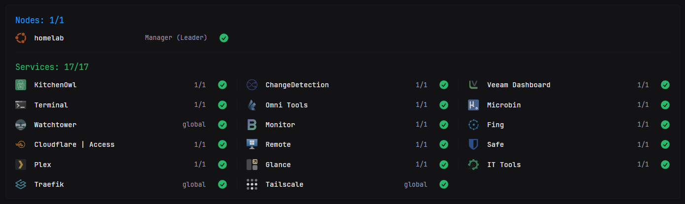
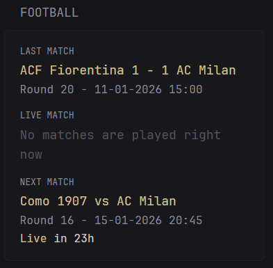
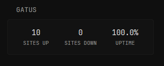
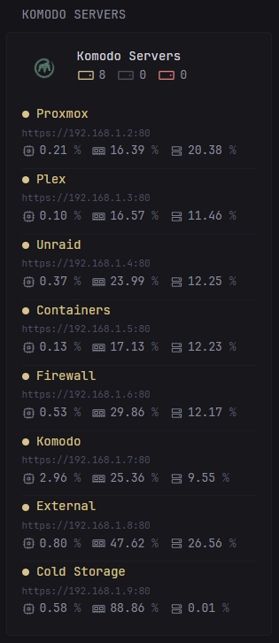
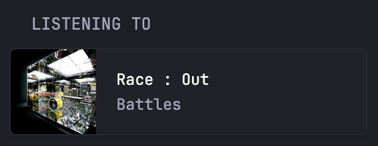
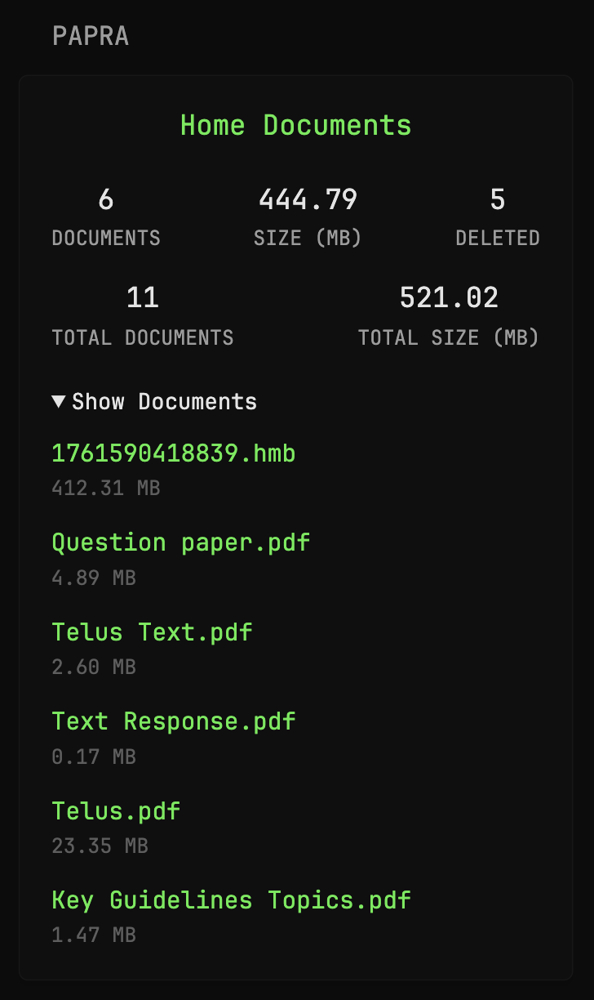
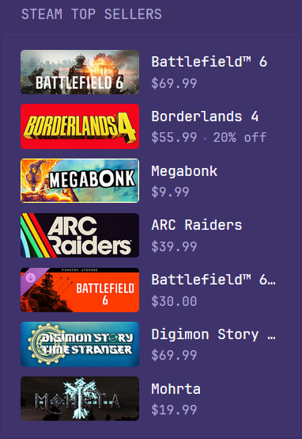

<table>
  <tr>
    <td valign="top">
    
<a href="widgets/afl-widgets/README.md">AFL Widgets</a> by <a href="https://github.com/0099FF">@0099FF</a>

    

</td>
    <td valign="top">
    
<a href="widgets/air-quality/README.md">Air Quality</a> by <a href="https://github.com/painfultruths">@painfultruths</a>

    

</td>
    <td valign="top">
    
<a href="widgets/algal-bloom-update/README.md">Algal Bloom Update</a> by <a href="https://github.com/stonkage">@stonkage</a>

    

</td>
  </tr>
  <tr>
    <td valign="top">
    
<a href="widgets/animals-display/README.md">Animals Display</a> by <a href="https://github.com/panonim">@panonim</a>

    

</td>
    <td valign="top">
    
<a href="widgets/arr-releases/README.md">Arr Releases</a> by <a href="https://github.com/erkston">@erkston</a>

    

</td>
    <td valign="top">
    
<a href="widgets/astronomy-picture-of-the-day/README.md">Astronomy Picture of the Day</a> by <a href="https://github.com/Saisamarth21">@Saisamarth21</a>

    

</td>
  </tr>
  <tr>
    <td valign="top">
    
<a href="widgets/audiobookshelf-personalized/README.md">AudioBookshelf Personalized Shelfs</a> by <a href="https://github.com/Nedra1998">@Nedra1998</a>

    

</td>
    <td valign="top">
    
<a href="widgets/audiobookshelf/README.md">Audiobookshelf stats</a> by <a href="https://github.com/ferdyverse">@ferdyverse</a>

    

</td>
    <td valign="top">
    
<a href="widgets/azirevpn-connection-status/README.md">AzireVPN Connection Status</a> by <a href="https://github.com/mattiasghodsian">@mattiasghodsian</a>

    

</td>
  </tr>
  <tr>
    <td valign="top">
    
<a href="widgets/backrest-job-status/README.md">Backrest Job Status</a> by <a href="https://github.com/stonkage">@stonkage</a>

    

</td>
    <td valign="top">
    
<a href="widgets/beszel-metrics/README.md">Beszel Metrics</a> by <a href="https://github.com/panonim">@panonim</a>

    

</td>
    <td valign="top">
    
<a href="widgets/beszel-server-stats/README.md">Beszel Server Stats</a> by <a href="https://github.com/Nedra1998">@Nedra1998</a>

    

</td>
  </tr>
  <tr>
    <td valign="top">
    
<a href="widgets/calibre-web-stats/README.md">Calibre-Web Stats</a> by <a href="https://github.com/rvelasq">@rvelasq</a>

    

</td>
    <td valign="top">
    
<a href="widgets/cats-as-a-service-photos/README.md">Cats As A Service Photos</a> by <a href="https://github.com/gugugiyu">@gugugiyu</a>

    

</td>
    <td valign="top">
    
<a href="widgets/chess-puzzle/README.md">Chess.com Daily Puzzle</a> by <a href="https://github.com/panonim">@panonim</a>

    

</td>
  </tr>
  <tr>
    <td valign="top">
    
<a href="widgets/cloudflared-tunnels/README.md">Cloudflare Tunnels</a> by <a href="https://github.com/drshajul">@drshajul</a>

    

</td>
    <td valign="top">
    
<a href="widgets/crafty-controller-minecraft-server/README.md">Crafty Minecraft Server Stats</a> by <a href="https://github.com/MartyX98">@MartyX98</a>

    

</td>
    <td valign="top">
    
<a href="widgets/cryptopanic-news/README.md">Cryptopanic News</a> by <a href="https://github.com/herculosh">@herculosh</a>

    

</td>
  </tr>
  <tr>
    <td valign="top">
    
<a href="widgets/cup-updates/README.md">Cup Updates</a> by <a href="https://github.com/panonim">@panonim</a>

    

</td>
    <td valign="top">
    
<a href="widgets/docker-swarm/README.md">Docker Swarm</a> by <a href="https://github.com/tonineri">@tonineri</a>

    

</td>
    <td valign="top">
    
<a href="widgets/duolingo-stats/README.md">Duolingo Stats</a> by <a href="https://github.com/RealTong">@RealTong</a>

    

</td>
  </tr>
  <tr>
    <td valign="top">
    
<a href="widgets/football-livescore/README.md">ESPN Live Football Scores Widget</a> by <a href="https://github.com/Beyeshooter">@Beyeshooter</a>

    

</td>
    <td valign="top">
    
<a href="widgets/epic-free-widget/README.md">Epic Games Free Games</a> by <a href="https://github.com/marocainperdu">@marocainperdu</a>

    

</td>
    <td valign="top">
    
<a href="widgets/football-fixtures/README.md">Football Fixtures</a> by <a href="https://github.com/cristiandiiorio">@cristiandiiorio</a>

    

</td>
  </tr>
  <tr>
    <td valign="top">
    
<a href="widgets/football-league-table/README.md">Football League Table</a> by <a href="https://github.com/nicl-dev">@nicl-dev</a>

    

</td>
    <td valign="top">
    
<a href="widgets/forgejo-repos/README.md">Forgejo repos</a> by <a href="https://github.com/dodecube">@dodecube</a>

    

</td>
    <td valign="top">
    
<a href="widgets/formula1-widgets/README.md">Formula 1 Widgets</a> by <a href="https://github.com/abaza738">@abaza738</a>

    

</td>
  </tr>
  <tr>
    <td valign="top">
    
<a href="widgets/frigate-stats/README.md">Frigate stats</a> by <a href="https://github.com/Pimer0">@Pimer0</a>

    

</td>
    <td valign="top">
    
<a href="widgets/gatus/README.md">Gatus</a> by <a href="https://github.com/Jack-Overflow">@Jack-Overflow</a>

    

</td>
    <td valign="top">
    
<a href="widgets/gatus-monitor/README.md">Gatus Monitor</a> by <a href="https://github.com/Nedra1998">@Nedra1998</a>

    

</td>
  </tr>
  <tr>
    <td valign="top">
    
<a href="widgets/ghostfolio-stats/README.md">Ghostfolio stats</a> by <a href="https://github.com/ziritione85">@ziritione85</a>

    

</td>
    <td valign="top">
    
<a href="widgets/github-notifications/README.md">GitHub Notifications</a> by <a href="https://github.com/luboszima">@luboszima</a>

    

</td>
    <td valign="top">
    
<a href="widgets/github-personal-repos/README.md">GitHub personal repositories</a> by <a href="https://github.com/menitz">@menitz</a>

    

</td>
  </tr>
  <tr>
    <td valign="top">
    
<a href="widgets/gluetun-vpn-status/README.md">Gluetun VPN status</a> by <a href="https://github.com/Hyptu">@Hyptu</a>

    

</td>
    <td valign="top">
    
<a href="widgets/google-calendar-list/README.md">Google Calendar List</a> by <a href="https://github.com/anant-j">@anant-j</a>

    

</td>
    <td valign="top">
    
<a href="widgets/grafana/README.md">Grafana</a> by <a href="https://github.com/koalalorenzo">@koalalorenzo</a>

    

</td>
  </tr>
  <tr>
    <td valign="top">
    
<a href="widgets/hardcover-currently-reading/README.md">Hardcover Currently Reading</a> by <a href="https://github.com/Akasiek">@Akasiek</a>

    

</td>
    <td valign="top">
    
<a href="widgets/homeassistant-sensor-stats/README.md">Home Assistant Sensor Stats</a> by <a href="https://github.com/AWildLeon">@AWildLeon</a>

    

</td>
    <td valign="top">
    
<a href="widgets/immich-stats/README.md">Immich stats</a> by <a href="https://github.com/svilenmarkov">@svilenmarkov</a>

    

</td>
  </tr>
  <tr>
    <td valign="top">
    
<a href="widgets/jellyfin-latest/README.md">Jellyfin Latest/Next Up</a> by <a href="https://github.com/Nedra1998">@Nedra1998</a>

    

</td>
    <td valign="top">
    
<a href="widgets/jellyfin-emby-stats/README.md">Jellyfin Stats</a> by <a href="https://github.com/lfvelosoh">@lfvelosoh</a>

    

</td>
    <td valign="top">
    
<a href="widgets/karakeep-dashboard/README.md">Karakeep Dashboard</a> by <a href="https://github.com/razdnut">@razdnut</a>

    

</td>
  </tr>
  <tr>
    <td valign="top">
    
<a href="widgets/kavita-latest/README.md">Kavita Latest</a> by <a href="https://github.com/Nedra1998">@Nedra1998</a>

    

</td>
    <td valign="top">
    
<a href="widgets/komga-latest/README.md">Komga Recently Added Series</a> by <a href="https://github.com/VictorMitr">@VictorMitr</a>

    

</td>
    <td valign="top">
    
<a href="widgets/komodo-container-manager-stunt-and-gimmicks-alex/README.md">Komodo Container Manager Monitor</a> by <a href="https://github.com/stunt-and-gimmicks-alex">@stunt-and-gimmicks-alex</a>

    

</td>
  </tr>
  <tr>
    <td valign="top">
    
<a href="widgets/lastfm-recent-tracks/README.md">Last.FM Recent Tracks</a> by <a href="https://github.com/Akasiek">@Akasiek</a>

    

</td>
    <td valign="top">
    
<a href="widgets/latest-community-widgets/README.md">Latest Community Widgets</a> by <a href="https://github.com/svilenmarkov">@svilenmarkov</a>

    

</td>
    <td valign="top">
    
<a href="widgets/leetcode-daily-question/README.md">LeetCode Daily Question</a> by <a href="https://github.com/hohaithuy">@hohaithuy</a>

    

</td>
  </tr>
  <tr>
    <td valign="top">
    
<a href="widgets/lemmy/README.md">Lemmy</a> by <a href="https://github.com/stonkage">@stonkage</a>

    

</td>
    <td valign="top">
    
<a href="widgets/linkwarden-latest-bookmarks/README.md">Linkwarden Latest Bookmarks</a> by <a href="https://github.com/josevictorferreira">@josevictorferreira</a>

    

</td>
    <td valign="top">
    
<a href="widgets/listenbrainz-latest/README.md">ListenBrainz Listen</a> by <a href="https://github.com/zliebersbach">@zliebersbach</a>

    

</td>
  </tr>
  <tr>
    <td valign="top">
    
<a href="widgets/london-tube-status/README.md">London Tube Status</a> by <a href="https://github.com/tomdaly">@tomdaly</a>

    

</td>
    <td valign="top">
    
<a href="widgets/mlb-scores-tracker/README.md">MLB Scores</a> by <a href="https://github.com/ShmoobiJones">@ShmoobiJones</a>

    

</td>
    <td valign="top">
    
<a href="widgets/mealie-todays-meal/README.md">Mealie Today's Meal</a> by <a href="https://github.com/wtoa">@wtoa</a>

    

</td>
  </tr>
  <tr>
    <td valign="top">
    
<a href="widgets/media-server-history/README.md">Media Server History</a> by <a href="https://github.com/titembaataar">@titembaataar</a>

    

</td>
    <td valign="top">
    
<a href="widgets/media-server-playing/README.md">Media Server Playing</a> by <a href="https://github.com/titembaataar">@titembaataar</a>

    

</td>
    <td valign="top">
    
<a href="widgets/minecraft-server/README.md">Minecraft server</a> by <a href="https://github.com/not-first">@not-first</a>

    

</td>
  </tr>
  <tr>
    <td valign="top">
    
<a href="widgets/mullvad-vpn-status/README.md">Mullvad VPN status</a> by <a href="https://github.com/DelMonteAJ">@DelMonteAJ</a>

    

</td>
    <td valign="top">
    
<a href="widgets/myanimelist-widgets/README.md">MyanimeList Widgets</a> by <a href="https://github.com/Zephyr73">@Zephyr73</a>

    

</td>
    <td valign="top">
    
<a href="widgets/nba-scores-tracker/README.md">NBA Scores Tracker</a> by <a href="https://github.com/ShmoobiJones">@ShmoobiJones</a>

    

</td>
  </tr>
  <tr>
    <td valign="top">
    
<a href="widgets/ncaa-cfb-scoreboard/README.md">NCAA CFB Scoreboard</a> by <a href="https://github.com/maxo99">@maxo99</a>

    

</td>
    <td valign="top">
    
<a href="widgets/nfl-scoreboard/README.md">NFL Scoreboard</a> by <a href="https://github.com/maxo99">@maxo99</a>

    

</td>
    <td valign="top">
    
<a href="widgets/nhl-scores/README.md">NHL Scores</a> by <a href="https://github.com/jo-nike">@jo-nike</a>

    

</td>
  </tr>
  <tr>
    <td valign="top">
    
<a href="widgets/nzbget-status/README.md">NZBGet Status</a> by <a href="https://github.com/0ui">@0ui</a>

    

</td>
    <td valign="top">
    
<a href="widgets/nearby-aircraft/README.md">Nearby Aircraft</a> by <a href="https://github.com/cristiandiiorio">@cristiandiiorio</a>

    

</td>
    <td valign="top">
    
<a href="widgets/netalertx/README.md">NetAlertX Device Status</a> by <a href="https://github.com/razdnut">@razdnut</a>

    

</td>
  </tr>
  <tr>
    <td valign="top">
    
<a href="widgets/netbird-devices/README.md">Netbird devices</a> by <a href="https://github.com/menitz">@menitz</a>

    

</td>
    <td valign="top">
    
<a href="widgets/nextdns-stats/README.md">NextDNS Stats</a> by <a href="https://github.com/ziritione85">@ziritione85</a>

    

</td>
    <td valign="top">
    
<a href="widgets/nextcloud-deck/README.md">Nextcloud Deck</a> by <a href="https://github.com/drakkein">@drakkein</a>

    

</td>
  </tr>
  <tr>
    <td valign="top">
    
<a href="widgets/nginx-proxy-manager/README.md">Nginx Proxy Manager</a> by <a href="https://github.com/saif191020">@saif191020</a>

    

</td>
    <td valign="top">
    
<a href="widgets/overseerr-requests-stats/README.md">Overseerr Requests Stats</a> by <a href="https://github.com/GiamBoscaro">@GiamBoscaro</a>

    

</td>
    <td valign="top">
    
<a href="widgets/overseerr-trending-discovery/README.md">Overseerr Trending/Discovery</a> by <a href="https://github.com/flamechair">@flamechair</a>

    

</td>
  </tr>
  <tr>
    <td valign="top">
    
<a href="widgets/pagerduty-incidents/README.md">PagerDuty Incidents</a> by <a href="https://github.com/koalalorenzo">@koalalorenzo</a>

    

</td>
    <td valign="top">
    
<a href="widgets/paperlessngx-stats/README.md">Paperless NGX Stats</a> by <a href="https://github.com/ralphocdol">@ralphocdol</a>

    

</td>
    <td valign="top">
    
<a href="widgets/papra-stats/README.md">Papra Stats</a> by <a href="https://github.com/Saisamarth21">@Saisamarth21</a>

    

</td>
  </tr>
  <tr>
    <td valign="top">
    
<a href="widgets/peanut-ups-status/README.md">PeaNut UPS Stats</a> by <a href="https://github.com/razdnut">@razdnut</a>

    

</td>
    <td valign="top">
    
<a href="widgets/portainer-dashboard/README.md">Portainer Dashboard</a> by <a href="https://github.com/RealTong">@RealTong</a>

    

</td>
    <td valign="top">
    
<a href="widgets/prowlarr-indexers/README.md">Prowlarr Indexers</a> by <a href="https://github.com/mattiasghodsian">@mattiasghodsian</a>

    

</td>
  </tr>
  <tr>
    <td valign="top">
    
<a href="widgets/proxmox-backup-server-stats/README.md">Proxmox Backup Server Stats</a> by <a href="https://github.com/danielweeber">@danielweeber</a>

    

</td>
    <td valign="top">
    
<a href="widgets/proxmox-ve-nodes/README.md">Proxmox VE Nodes</a> by <a href="https://github.com/ralphocdol">@ralphocdol</a>

    

</td>
    <td valign="top">
    
<a href="widgets/proxmox-ve-stats/README.md">Proxmox VE Stats</a> by <a href="https://github.com/ralphocdol">@ralphocdol</a>

    

</td>
  </tr>
  <tr>
    <td valign="top">
    
<a href="widgets/proxmox-detailed-resources/README.md">Proxmox VE Table Stats</a> by <a href="https://github.com/lfvelosoh">@lfvelosoh</a>

    

</td>
    <td valign="top">
    
<a href="widgets/raindrop-latest-links/README.md">Raindrop Bookmarks</a> by <a href="https://github.com/herculosh">@herculosh</a>

    

</td>
    <td valign="top">
    
<a href="widgets/random-bible-verse/README.md">Random Bible Verse</a> by <a href="https://github.com/pypp">@pypp</a>

    

</td>
  </tr>
  <tr>
    <td valign="top">
    
<a href="widgets/random-fact/README.md">Random fact</a> by <a href="https://github.com/svilenmarkov">@svilenmarkov</a>

    

</td>
    <td valign="top">
    
<a href="widgets/retroachievement-of-the-week/README.md">RetroAchievement</a> by <a href="https://github.com/milktoastrat">@milktoastrat</a>

    

</td>
    <td valign="top">
    
<a href="widgets/romm-stats/README.md">RomM Stats</a> by <a href="https://github.com/milktoastrat">@milktoastrat</a>

    

</td>
  </tr>
  <tr>
    <td valign="top">
    
<a href="widgets/sabnzbd-stats/README.md">SABnzbd Status</a> by <a href="https://github.com/Neo11Neo">@Neo11Neo</a>

    

</td>
    <td valign="top">
    
<a href="widgets/scrutiny/README.md">Scrutiny</a> by <a href="https://github.com/SkyAllinott">@SkyAllinott</a>

    

</td>
    <td valign="top">
    
<a href="widgets/should-i-deploy-today/README.md">Should I Deploy Today</a> by <a href="https://github.com/hohaithuy">@hohaithuy</a>

    

</td>
  </tr>
  <tr>
    <td valign="top">
    
<a href="widgets/slack-status/README.md">Slack Status</a> by <a href="https://github.com/cartwatson">@cartwatson</a>

    

</td>
    <td valign="top">
    
<a href="widgets/speedtest-tracker/README.md">Speedtest Tracker</a> by <a href="https://github.com/not-first">@not-first</a>

    

</td>
    <td valign="top">
    
<a href="widgets/spotify-now-playing/README.md">Spotify Now Playing</a> by <a href="https://github.com/needsadjustment">@needsadjustment</a>

    

</td>
  </tr>
  <tr>
    <td valign="top">
    
<a href="widgets/spotify-player/README.md">Spotify Player</a> by <a href="https://github.com/anant-j">@anant-j</a>

    

</td>
    <td valign="top">
    
<a href="widgets/st-louis-fed-us-mortgage-rates/README.md">St. Louis Fed US Mortgage Rates</a> by <a href="https://github.com/ehaughee">@ehaughee</a>

    

</td>
    <td valign="top">
    
<a href="widgets/steam-recently-played-games/README.md">Steam Recently Played Games</a> by <a href="https://github.com/lunnosmp4">@lunnosmp4</a>

    

</td>
  </tr>
  <tr>
    <td valign="top">
    
<a href="widgets/steam-top-sellers/README.md">Steam Top Sellers</a> by <a href="https://github.com/GuiguiBlitz">@GuiguiBlitz</a>

    

</td>
    <td valign="top">
    
<a href="widgets/steam-user/README.md">Steam User</a> by <a href="https://github.com/lunnosmp4">@lunnosmp4</a>

    

</td>
    <td valign="top">
    
<a href="widgets/steam-user-list/README.md">Steam User List</a> by <a href="https://github.com/maplefluff">@maplefluff</a>

    

</td>
  </tr>
  <tr>
    <td valign="top">
    
<a href="widgets/steam-specials/README.md">Steam specials</a> by <a href="https://github.com/svilenmarkov">@svilenmarkov</a>

    

</td>
    <td valign="top">
    
<a href="widgets/syncthing/README.md">Syncthing</a> by <a href="https://github.com/JohnCannon97">@JohnCannon97</a>

    

</td>
    <td valign="top">
    
<a href="widgets/synology-disk-station/README.md">Synology Disk Station</a> by <a href="https://github.com/Chachigo">@Chachigo</a>

    

</td>
  </tr>
  <tr>
    <td valign="top">
    
<a href="widgets/tailscale-devices/README.md">Tailscale devices</a> by <a href="https://github.com/not-first">@not-first</a>

    

</td>
    <td valign="top">
    
<a href="widgets/tautulli-stats/README.md">Tautulli Stats</a> by <a href="https://github.com/SkyAllinott">@SkyAllinott</a>

    

</td>
    <td valign="top">
    
<a href="widgets/technitium-dns-stats/README.md">Technitium DNS Stats</a> by <a href="https://github.com/eribbey">@eribbey</a>

    

</td>
  </tr>
  <tr>
    <td valign="top">
    
<a href="widgets/time-bar/README.md">Time Bar</a> by <a href="https://github.com/anant-j">@anant-j</a>

    

</td>
    <td valign="top">
    
<a href="widgets/trakt/README.md">Trakt</a> by <a href="https://github.com/RxBrad">@RxBrad</a>

    

</td>
    <td valign="top">
    
<a href="widgets/trending-bluesky-news/README.md">Trending Bluesky News</a> by <a href="https://github.com/tomcasavant">@tomcasavant</a>

    

</td>
  </tr>
  <tr>
    <td valign="top">
    
<a href="widgets/trending-github-repositories/README.md">Trending GitHub Repositories</a> by <a href="https://github.com/jelkuweiss">@jelkuweiss</a>

    

</td>
    <td valign="top">
    
<a href="widgets/trending-mastodon-links/README.md">Trending Mastodon Links</a> by <a href="https://github.com/tomcasavant">@tomcasavant</a>

    

</td>
    <td valign="top">
    
<a href="widgets/truenas-scale-pools/README.md">TrueNAS Scale Pools</a> by <a href="https://github.com/drakkein">@drakkein</a>

    

</td>
  </tr>
  <tr>
    <td valign="top">
    
<a href="widgets/tsumego-daily/README.md">Tsumego Daily</a> by <a href="https://github.com/ccarpo">@ccarpo</a>

    

</td>
    <td valign="top">
    
<a href="widgets/unifi/README.md">Unifi</a> by <a href="https://github.com/prozn">@prozn</a>

    

</td>
    <td valign="top">
    
<a href="widgets/uptime-kuma/README.md">Uptime Kuma</a> by <a href="https://github.com/not-first">@not-first</a>

    

</td>
  </tr>
  <tr>
    <td valign="top">
    
<a href="widgets/vikunja-taskboard/README.md">Vikunja Taskboard</a> by <a href="https://github.com/gugugiyu">@gugugiyu</a>

    

</td>
    <td valign="top">
    
<a href="widgets/wg-easy-clients/README.md">WG-Easy Enabled Clients</a> by <a href="https://github.com/lmriccardo">@lmriccardo</a>

    

</td>
    <td valign="top">
    
<a href="widgets/weather-seven-day/README.md">Weather Seven Day</a> by <a href="https://github.com/brandonsie">@brandonsie</a>

    

</td>
  </tr>
  <tr>
    <td valign="top">
    
<a href="widgets/wud-monitor/README.md">What's Up Docker Monitor</a> by <a href="https://github.com/panonim">@panonim</a>

    

</td>
    <td valign="top">
    
<a href="widgets/youtube-embedded-player/README.md">YouTube Embedded Player</a> by <a href="https://github.com/ralphocdol">@ralphocdol</a>

    

</td>
    <td valign="top">
    
<a href="widgets/qbittorrent-stats/README.md">qBittorrent Stats</a> by <a href="https://github.com/danzkigg">@danzkigg</a>

    

</td>
  </tr>
  <tr>
    <td valign="top">
    
<a href="widgets/xkcd-widget/README.md">xkcd Widget</a> by <a href="https://github.com/AllanAAbraham">@AllanAAbraham</a>

    

</td>
    <td valign="top"></td>
    <td valign="top"></td>
  </tr>
</table>
