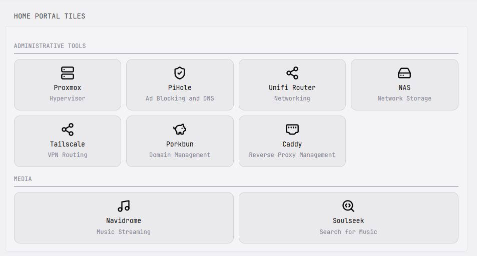

## Preview



## Configuration

```yaml
- type: custom-api
  title: Home Portal Tiles
  cache: 1h
  url: http://localhost:8080/assets/home-tiles.json
  template: |
    <style>
      .grid-home-portal-tiles {
        display: grid;
        grid-template-columns: repeat(auto-fit, minmax(180px, 1fr));
        gap: 1rem;
      }
      .section-title-home-portal-tiles {
        border-bottom: 1px solid var(--color-text-subdue);
        padding-bottom: 0.5rem;
        margin-top: 1.5rem;
        margin-bottom: 1rem;
      }
      .section-title-home-portal-tiles:first-child { margin-top: 0; }
      .card-home-portal-tiles {
        background-color: color-mix(in srgb, var(--color-text-base) 6%, transparent);
        border: 1px solid color-mix(in srgb, var(--color-text-base) 12%, transparent);
        padding: 1.25rem;
        border-radius: 12px;
        text-decoration: none;
        display: flex;
        flex-direction: column;
        align-items: center;
        text-align: center;
        transition: transform 0.2s, border-color 0.2s, box-shadow 0.2s;
      }
      .card-home-portal-tiles:hover {
        transform: translateY(-3px);
        border-color: var(--color-primary);
        box-shadow: 0 10px 20px rgba(0,0,0,0.15);
      }
      .card-home-portal-tiles img {
        width: 28px;
        height: 28px;
        margin-bottom: 0.6rem;
      }
      .card-home-portal-tiles h3 { margin: 0 0 0.2rem 0; }
    </style>

    {{ if eq .Response.StatusCode 200 }}
      {{ range .JSON.Array "sections" }}
        <div class="section-title-home-portal-tiles size-h5 uppercase color-subdue">{{ .String "title" }}</div>
        <div class="grid-home-portal-tiles">
          {{ range .Array "tiles" }}
            <a href="{{ .String "url" }}" class="card-home-portal-tiles" target="_blank" rel="noreferrer">
              
              <h3 class="color-highlight">{{ .String "title" }}</h3>
              <p class="color-subdue size-h5">{{ .String "subtitle" }}</p>
            </a>
          {{ end }}
        </div>
      {{ end }}
    {{ else }}
      <p>Failed to load tiles: {{ .Response.Status }}</p>
    {{ end }}
```

A grid of icon-tiles grouped into custom sections — like the built-in `bookmarks` widget, but with a subtitle line under each tile and a card-hover style. All tiles/sections are defined in a plain JSON file you edit directly, so adding, removing, or reordering tiles never requires touching YAML or the template.

## Setup

1. Make sure your `glance.yml` has an assets path configured:
```yaml
   server:
     assets-path: /app/assets
```
2. Save the following as a file in that assets folder (e.g. `home-tiles.json`), editing the sections/tiles to your liking:
```json
   {
     "sections": [
       {
         "title": "Servers",
         "tiles": [
           { "title": "Example App", "subtitle": "What it does", "url": "https://example.com/", "icon": "https://unpkg.com/lucide-static@latest/icons/server.svg" }
         ]
       }
     ]
   }
```
3. Add the widget config above to your `glance.yml`/page file, updating the `url` field's filename to match what you named your JSON file in step 2.

## Notes

- If you've changed Glance's default port via `server.port`, update `localhost:8080` in the `url` field to match.
- Icons can be any direct image URL — [Lucide static icons](https://unpkg.com/lucide-static@latest/icons/), [selfh.st icons](https://selfh.st/icons/), [Dashboard Icons](https://dashboardicons.com/), or your own hosted images all work.
- `cache` controls how quickly edits to the JSON file are reflected — lower it temporarily while you're actively tweaking tiles.