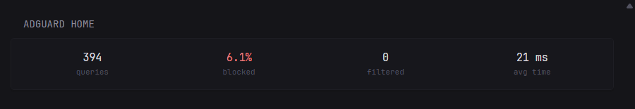
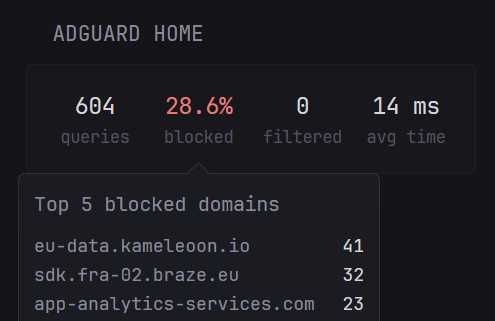

At-a-glance DNS query stats from an [AdGuard Home](https://adguard.com/en/adguard-home/overview.html) instance.



## Features

- Total DNS query count, filter-blocked percentage, and average query processing time
- Queries replaced by safe browsing, safe search, and parental control, summed into a single "filtered" count
- Hover any stat for a breakdown - top 5 queried domains, top 5 blocked domains, filtered-by-category counts, or average response time per upstream resolver



## Requirements

- `ADGUARDHOME_URL` - the URL of your AdGuard Home instance, without trailing slash, e.g. `http://192.168.1.2:3000` or `https://adguard.example.com`
- `ADGUARDHOME_USERNAME` / `ADGUARDHOME_PASSWORD` - credentials for a user with access to the AdGuard Home web UI. The `/control/stats` endpoint uses the same HTTP Basic Auth as the dashboard login


```yaml
- type: custom-api
  title: AdGuard Home
  title-url: ${ADGUARDHOME_URL}
  cache: 1m

  url: ${ADGUARDHOME_URL}/control/stats

  basic-auth:
    username: ${ADGUARDHOME_USERNAME}
    password: ${ADGUARDHOME_PASSWORD}

  template: |
    {{ $total := .JSON.Int "num_dns_queries" }}
    {{ $blocked := .JSON.Int "num_blocked_filtering" }}
    {{ $safebrowsing := .JSON.Int "num_replaced_safebrowsing" }}
    {{ $safesearch := .JSON.Int "num_replaced_safesearch" }}
    {{ $parental := .JSON.Int "num_replaced_parental" }}
    {{ $filtered := add (add $safebrowsing $safesearch) $parental }}
    {{ $avgSeconds := .JSON.Float "avg_processing_time" }}
    {{ $avgMs := mul $avgSeconds 1000 }}
    {{ $ratioPercent := 0.0 }}
    {{ if gt $total 0 }}
      {{ $ratioPercent = mul (div (toFloat $blocked) (toFloat $total)) 100 }}
    {{ end }}

    {{ $topQueried := .JSON.Array "top_queried_domains" }}
    {{ $topBlocked := .JSON.Array "top_blocked_domains" }}
    {{ $topUpstreamTimes := .JSON.Array "top_upstreams_avg_time" }}

    <div style="display:flex; justify-content:space-between; gap:12px;">

      <div data-popover-type="html" data-popover-position="below" data-popover-margin="0.2rem"
           style="flex:1; display:flex; flex-direction:column; align-items:center;">
        <div class="size-h3 color-highlight">{{ formatNumber $total }}</div>
        <div class="size-h6 color-subdue">queries</div>
        <div data-popover-html="">
          <div style="margin-bottom:0.75rem;">Top 5 queried domains</div>
          {{ range $i, $item := $topQueried }}
            {{ if lt $i 5 }}
              {{ range $domain, $count := $item.Map }}
                <div style="display:flex; justify-content:space-between; gap:1rem; min-width:220px;">
                  <div class="size-h5 text-compact">{{ $domain }}</div>
                  <div class="size-h5 color-highlight">{{ $count.Int }}</div>
                </div>
              {{ end }}
            {{ end }}
          {{ end }}
          {{ if eq (len $topQueried) 0 }}
            <div class="size-h5 color-subdue">None</div>
          {{ end }}
        </div>
      </div>

      <div data-popover-type="html" data-popover-position="below" data-popover-margin="0.2rem"
           style="flex:1; display:flex; flex-direction:column; align-items:center;">
        <div class="size-h3 {{ if gt $blocked 0 }}color-negative{{ else }}color-highlight{{ end }}">{{ printf "%.1f%%" $ratioPercent }}</div>
        <div class="size-h6 color-subdue">blocked</div>
        <div data-popover-html="">
          <div style="margin-bottom:0.75rem;">Top 5 blocked domains</div>
          {{ range $i, $item := $topBlocked }}
            {{ if lt $i 5 }}
              {{ range $domain, $count := $item.Map }}
                <div style="display:flex; justify-content:space-between; gap:1rem; min-width:220px;">
                  <div class="size-h5 text-compact">{{ $domain }}</div>
                  <div class="size-h5 color-highlight">{{ $count.Int }}</div>
                </div>
              {{ end }}
            {{ end }}
          {{ end }}
          {{ if eq (len $topBlocked) 0 }}
            <div class="size-h5 color-subdue">None</div>
          {{ end }}
        </div>
      </div>

      <div data-popover-type="html" data-popover-position="below" data-popover-margin="0.2rem"
           style="flex:1; display:flex; flex-direction:column; align-items:center;">
        <div class="size-h3 {{ if gt $filtered 0 }}color-negative{{ else }}color-highlight{{ end }}">{{ formatNumber $filtered }}</div>
        <div class="size-h6 color-subdue">filtered</div>
        <div data-popover-html="">
          <div style="margin-bottom:0.75rem;">Filtered by category</div>
          <div style="display:flex; justify-content:space-between; gap:1rem; min-width:220px;">
            <div class="size-h5 text-compact">Safe browsing</div>
            <div class="size-h5 color-highlight">{{ $safebrowsing }}</div>
          </div>
          <div style="display:flex; justify-content:space-between; gap:1rem; min-width:220px;">
            <div class="size-h5 text-compact">Safe search</div>
            <div class="size-h5 color-highlight">{{ $safesearch }}</div>
          </div>
          <div style="display:flex; justify-content:space-between; gap:1rem; min-width:220px;">
            <div class="size-h5 text-compact">Parental control</div>
            <div class="size-h5 color-highlight">{{ $parental }}</div>
          </div>
        </div>
      </div>

      <div data-popover-type="html" data-popover-position="below" data-popover-margin="0.2rem"
           style="flex:1; display:flex; flex-direction:column; align-items:center;">
        <div class="size-h3 color-highlight">{{ printf "%.0f ms" $avgMs }}</div>
        <div class="size-h6 color-subdue">avg time</div>
        <div data-popover-html="">
          <div style="margin-bottom:0.75rem;">Avg time per upstream</div>
          {{ range $topUpstreamTimes }}
            {{ range $upstream, $seconds := .Map }}
              <div style="display:flex; justify-content:space-between; gap:1rem; min-width:220px;">
                <div class="size-h5 text-compact">{{ $upstream }}</div>
                <div class="size-h5 color-highlight">{{ printf "%.0f ms" (mul $seconds.Float 1000) }}</div>
              </div>
            {{ end }}
          {{ end }}
          {{ if eq (len $topUpstreamTimes) 0 }}
            <div class="size-h5 color-subdue">None</div>
          {{ end }}
        </div>
      </div>

    </div>
```

## Notes

- "Blocked" and "filtered" are two separate AdGuard Home categories: blocked reflects filter-rule blocks (`num_blocked_filtering`), filtered sums safe browsing, safe search, and parental control replacements (`num_replaced_safebrowsing` + `num_replaced_safesearch` + `num_replaced_parental`)
- `/control/stats` covers whatever statistics retention period is configured in AdGuard Home under `Settings -> General settings`, not all-time totals
