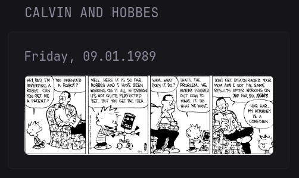

# Calvin and Hobbes daily strip
A Glance widget for displaying the daily Calvin and Hobbes strip.
The daily images are not fetched from GoComics, but from a publicly accessible archive hosted on GitHub, due to GoComic's paywall. It is therefore possible that the archive could be taken down at any time. The archive contains all daily strips from the entire runtime (November 18th, 1985 until December 31st, 1995).

Clicking on the image opens it in a new tab to improve readability if placed in a small side column or viewed on mobile.

The template contains a `yearOffset` variable, which you can customize. It then fetches the strip from `today - yearOffset`. I've set it to 37 by default.

Updates will be available in this [repository](https://github.com/cpt-metal/glance-calvin-and-hobbes) first.

### Preview



### Code

``` yml
- type: custom-api
  title: Calvin and Hobbes
  template: |
    {{ $yearOffset := 37 }}
    {{ $targetYear := sub (now).Year $yearOffset }}
    {{ $month := now | formatTime "01" }}
    {{ $day := now | formatTime "02" }}
    {{ $url := concat "https://positron11.github.io/watterson/Comic/" (printf "%d" $targetYear) $month $day ".gif" }}

    {{ $isoDate := concat (printf "%d" $targetYear) "-" $month "-" $day }}
    {{ $displayDate := $isoDate | parseTime "2006-01-02" | formatTime "Monday, 01.02.2006" }}

    <body>{{ $displayDate }}</body>
    <a href="{{ $url }}" target="_blank" rel="noreferrer noopener">
      
    </a>
```