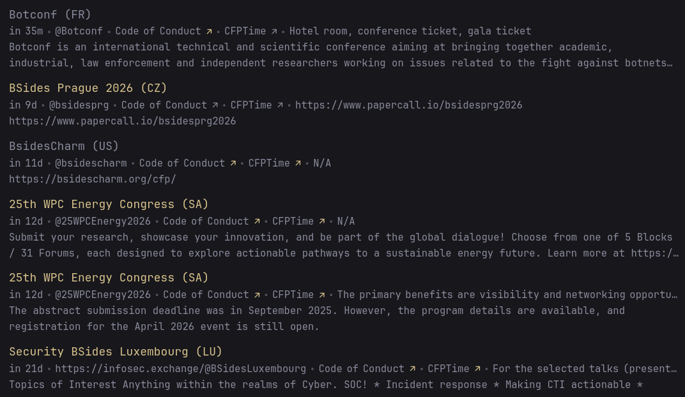

# CFPTime
Get a list of upcoming security conferences around the world using the [CFPTime API](https://api.cfptime.org/api/docs)! Displays:
- Conference name
- Country
- Relative time until start date
- Twitter handle
- Code of Conduct and CFPTime links
- Speaker benefits
- Conference description/details

## Configuration
```yaml
- type: custom-api
  title: CFPTime
  url: https://api.cfptime.org/api/upcoming/
  cache: 1d
  template: |
    <ul class="list list-gap-10 collapsible-container" data-collapse-after="5">
      {{ range .JSON.Array "" }}
        <li class="list-item">
          <a href="{{ .String "website" }}" target="_blank" class="size-title-dynamic color-primary-if-not-visited">{{ .String "name" }} ({{ .String "country" }})</a>
          <ul class="list-horizontal-text flex-nowrap text-compact">
            <li class="shrink-0" {{ findMatch ".+T" (.String "conf_start_date") | trimSuffix "T" | parseRelativeTime "DateOnly" }}></li>
            <li class="shrink-0">{{ .String "twitter" }}</li>
            <li class="shrink-0"><a href="{{ .String "code_of_conduct" }}" target="_blank" class="visited-indicator">Code of Conduct</a></li>
            <li class="shrink-0"><a href="{{ concat "https://www.cfptime.org/conferences/" (.String "id") }}" target="_blank" class="visited-indicator">CFPTime</a></li>
            <li class="text-truncate block">{{ .String "speaker_benefits" }}</li>
          </ul>
          <p class="text-truncate-2-lines">{{ .String "cfp_details" }}</p>
        </li>
      {{ end }}
    </ul>
```

## Preview

