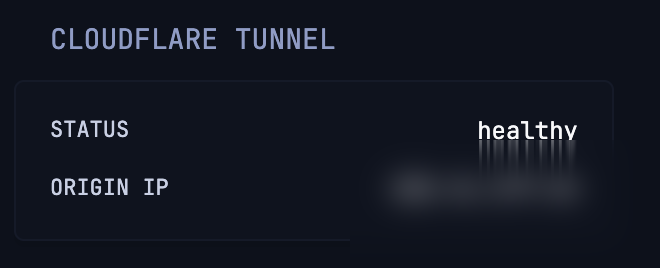

# Cloudflare Tunnel Status

Cloudflare connector tunnel live health status and origin IP.



```yaml
- type: custom-api
  title: Cloudflare Tunnel
  refresh-interval: 5s
  cache: 2s
  url: https://api.cloudflare.com/client/v4/accounts/${CF_ACCOUNT_ID}/cfd_tunnel/${CF_TUNNEL_ID}
  headers:
    Authorization: "Bearer ${CF_API_TOKEN}"
    Content-Type: application/json
  template: |
    <ul class="list list-gap-10">
      <li class="flex justify-between align-center">
        <span class="size-h6 color-paragraph">STATUS</span>
        <span class="size-h5 color-highlight">{{ .JSON.String "result.status" }}</span>
      </li>
      <li class="flex justify-between align-center">
        <span class="size-h6 color-paragraph">ORIGIN IP</span>
        <span class="size-h5 color-highlight">{{ $ip := .JSON.String "result.connections.0.origin_ip" }}{{ if eq $ip "" }}N/A{{ else }}{{ $ip }}{{ end }}</span>
      </li>
    </ul>
```

## Environment variables

- `CF_ACCOUNT_ID` - Your Cloudflare Account ID
- `CF_TUNNEL_ID` - The specific ID of the Cloudflare tunnel
- `CF_API_TOKEN` - Cloudflare API Token with `Account.Cloudflare Tunnel:Read` permission
