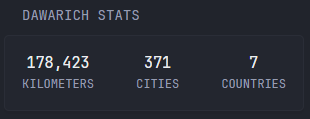

# Dawarich Stats

Displays total lifetime distance, tracked points, cities, and countries from your Dawarich server. The API only provides total distance in Kilometers at this time.



## Configuration

You will need to copy your API key from your Dawarich account settings and provide your server URL.

* `DAWARICH_URL` - The URL to your Dawarich instance, e.g., `http://<ip_address>:<port>` or `https://<domain>`
* `DAWARICH_API_KEY` - Your personal Dawarich API Token. Click profile photo in top right then Account.

```yaml
- type: custom-api
  title: "Dawarich Stats"
  cache: 1h # Adjust based on how often your data syncs
  base-url: ${DAWARICH_URL}
  options:
    url: ${DAWARICH_URL}
    key: ${DAWARICH_API_KEY}
  template: |
    {{ $url := .Options.StringOr "url" "" }}
    {{ $key := .Options.StringOr "key" "" }}
    {{- if or (eq $url "") (eq $key "") -}}
      <p>Error: URL or API Key not configured.</p>
    {{- else -}}
      {{- $requestUrl := printf "%s/api/v1/stats" $url -}}
      {{- $dawarichData := newRequest $requestUrl | withHeader "Authorization" (printf "Bearer %s" $key) | getResponse -}}
      {{- if eq $dawarichData.Response.StatusCode 200 -}}
        <div class="flex flex-column gap-5">
          <div class="flex justify-between text-center">
            <div>
              <div class="color-highlight size-h3">{{ $dawarichData.JSON.Float "totalDistanceKm" | formatNumber }}</div>
              <div class="size-h5 uppercase">Kilometers</div>
            </div>
            <div>
              <div class="color-highlight size-h3">{{ $dawarichData.JSON.Int "totalCitiesVisited" | formatNumber }}</div>
              <div class="size-h5 uppercase">Cities</div>
            </div>
            <div>
              <div class="color-highlight size-h3">{{ $dawarichData.JSON.Int "totalCountriesVisited" | formatNumber }}</div>
              <div class="size-h5 uppercase">Countries</div>
            </div>
          </div>
        </div>
      {{- else -}}
        <p>Failed: {{ $dawarichData.Response.Status }}</p>
      {{- end -}}
    {{- end -}}
```
