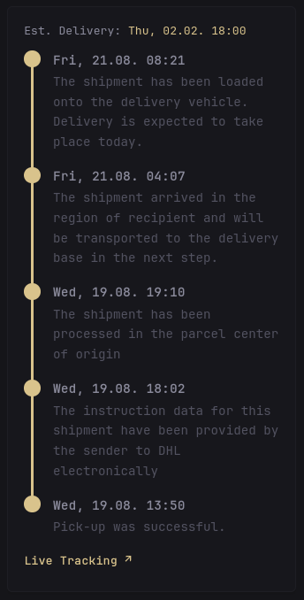

# DHL Tracking
A Glance widget for displaying the tracking status of DHL parcels.

Updates will be available in this [repository](https://github.com/cpt-metal/glance-dhl-tracking) first.

### Preview



### DHL API Key

- sign up at https://developer.dhl.com/
- create a new app and include the "Shipment Tracking - Unified" API
- Note: after creation it may take a few days until API access is granted (you'll receive an email when it's active)

### Setup

- set the shipment tracking number in the options field
- add your DHL API key to the `.env` file `DHL_API_KEY=xxx`
- you can change the [language key](https://en.wikipedia.org/wiki/List_of_ISO_639_language_codes) in the options, which affects the language of the descriptions in the response
- adjust the cache timer to your liking (API rate limit is 250 per day)

### Other

- [API reference](https://developer.dhl.com/tracking?language_content_entity=en#reference-docs-section/)


### Code

``` yml
- type: custom-api
  title: DHL Tracking
  cache: 6h
  options:
    trackingNumber: "your-tracking-number-here"
    language: "en"
  template: |
    <style>
      .timeline-dhl-tracking {
        list-style: none;
        margin: 0;
        padding: 0;
        position: relative;
      }
      .timeline-dhl-tracking li {
        position: relative;
        padding-left: 3rem;
        padding-bottom: 1.5rem;
      }
      .timeline-dhl-tracking li:last-child {
        padding-bottom: 0;
      }
      .timeline-dhl-tracking li::before {
        content: "";
        position: absolute;
        left: 0.75rem;
        top: 1.4rem;
        bottom: -0.1rem;
        width: 2px;
        background: var(--color-primary);
      }
      .timeline-dhl-tracking li:last-child::before {
        display: none;
      }
      .dot-dhl-tracking {
        position: absolute;
        left: 0;
        top: 0.1rem;
        width: 1.7rem;
        height: 1.7rem;
        border-radius: 50%;
        background: var(--color-primary);
        display: flex;
        align-items: center;
        justify-content: center;
      }
      .live-link-dhl-tracking:hover {
        text-decoration: underline;
      }
    </style>


    {{ $url := printf "https://api-eu.dhl.com/track/shipments?trackingNumber=%s&language=%s"
      (.Options.StringOr "trackingNumber" "")
      (.Options.StringOr "language" "en")
    }}

    {{
      $resp := newRequest $url
      | withHeader "Accept" "application/json"
      | withHeader "DHL-API-Key" "${DHL_API_KEY}"
      | getResponse
    }}

    {{ if ne $resp.Response.StatusCode 200 }}
        <p class="color-negative">Failed to load DHL tracking data ({{ $resp.Response.Status }})</p>
    {{ else }}
      {{ range $resp.JSON.Array "shipments" }}
        <div class="margin-bottom-15">
          <div class="list-horizontal-text size-h5 margin-bottom-10">
            {{ if .Exists "estimatedTimeOfDelivery" }}
              <p>Est. Delivery: <span style="color: var(--color-primary);">{{ .String "estimatedTimeOfDelivery" | parseTime "2006-01-02T15:04:05" | formatTime "Mon, 02.01. 15:04" }}</span></p>
            {{ else if .Exists "estimatedDeliveryTimeFrame" }}
              <p>Est. Delivery: <span style="color: var(--color-primary);">{{ .String "estimatedDeliveryTimeFrame.estimatedFrom" | parseTime "2006-01-02T15:04:05" | formatTime "02.01. 15:04" }} – {{ .String "estimatedDeliveryTimeFrame.estimatedThrough" | parseTime "2006-01-02T15:04:05" | formatTime "15:04" }}</span></p>
            {{ else }}
              <p>No delivery estimate</p>
            {{ end }}
          </div>

          <ul class="timeline-dhl-tracking">
          {{ range .Array "events" }}
            <li>
              <span class="dot-dhl-tracking"></span>
              <span style="font-weight: 600;">{{ .String "timestamp" | parseTime "2006-01-02T15:04:05" | formatTime "Mon, 02.01. 15:04" }}</span>
              <div class="color-subdue size-base" style="margin-top: 0.15rem;">{{ .String "description" }}</div>
            </li>
          {{ end }}
          </ul>
        </div>

        <div class="flex justify-between items-center margin-bottom-7">
          <a class="live-link-dhl-tracking color-primary size-h5" style="font-weight: 600; text-decoration: none;" href="{{ .String "serviceUrl" }}" target="_blank">Live Tracking &#8599;</a>
        </div>
      {{ end }}
    {{ end }}
```