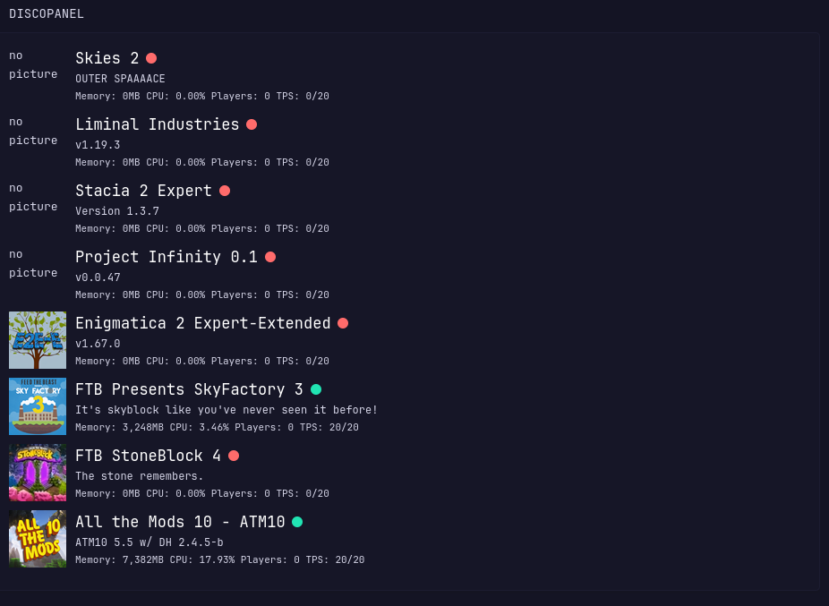

# Discopanel Widget
Lists all servers in your Discopanel host. Server icon functionality requires using a url for the picture. These can be obtained from the curseforge or modrinth page directly. I imagine that using direct file paths would also work, you just might have to adjust how the picture file path is read in glance.

# Environment Variables
`DISCOPANEL_HOST` = URL/IP of Discopanel host. Requires http/https prefix. 

# Preview


# YAML
```yaml
- type: custom-api
  title: Discopanel
  cache: 30s
  url: ${DISCOPANEL_HOST}/discopanel.v1.AuthService/Login
  headers:
    Connect-Protocol-Version: 1
    Connect-Timeout-Ms: 2000
    Content-Type: application/json
  method: POST
  body-type: json
  body:
    username: $(DISCOPANEL_USERNAME)
    password: $(DISCOPANEL_PASS)
  skip-json-validation: true
  template: |
    {{ $token := .JSON.String "0.token" }}
    <p>{{ $token }}</p>

    {{ $serverList := newRequest "${DISCOPANEL_HOST}/discopanel.v1.ServerService/ListServers"
        | withHeader "Connect-Protocol-Version" "1"
        | withHeader "Connect-Timeout-Ms" "2000"
        | withHeader "Content-Type" "application/json"
        | withHeader "Authorization" (printf `{"Bearer %s"}` $token)
        | withStringBody (printf `{"fullStats": true}`)
        | getResponse
    }}

    {{ range $serverList.JSON.Array "servers" }}
      {{ $mem_usage := .Int "memoryUsage" }}
      {{ $mem_total := .Int "memory" }}
      {{ $cpu := .Float "cpuPercent" }}
      {{ $players := .Int "playersOnline" }}
      {{ $max_players := .Int "maxPlayers" }}
      {{ $tps := .Float "tps" }}
      {{ $id := .String "id" }}
      {{ $status := .String "status" }}

      {{ $serverConfig := newRequest "${DISCOPANEL_HOST}/discopanel.v1.ConfigService/GetServerConfig"
        | withHeader "Connect-Protocol-Version" "1"
        | withHeader "Connect-Timeout-Ms" "2000"
        | withHeader "Content-Type" "application/json"
        | withHeader "Authorization" (printf `{"Bearer %s"}` $token)
        | withStringBody (printf `{"serverId": %q}` $id)
        | getResponse
      }}
      {{ $icon := $serverConfig.JSON.String "categories.1.properties.6.value" }}

      <div style="margin-bottom: 1rem;">
        <div style="display: flex; align-items: center; gap: 1rem;">
          <a href="${DISCOPANEL_HOST}/servers/{{ $id }}"></a>
          <div style="flex-grow:1; min-width:0;">
            <span><a href="${DISCOPANEL_HOST}/servers/{{ $id }}" class="color-highlight size-h1">{{ .String "name" }}</a></span>
            {{ if eq "SERVER_STATUS_RUNNING" $status }}
              <span style="display: inline-block; background-color: var(--color-positive); width: 12px; height: 12px; border-radius: 50%;"></span>
            {{ else if eq "SERVER_STATUS_STARTING" $status }}
              <span style="display: inline-block; background-color: var(--color-separator); width: 12px; height: 12px; border-radius: 50%;"></span>
            {{ else }}
              <span style="display: inline-block; background-color: var(--color-negative); width: 12px; height: 12px; border-radius: 50%;"></span>
            {{ end }}
            <p class="size-h5">{{ .String "description" }}</p>
            <div class="size-h6">
              <span>Memory: {{ formatNumber $mem_usage }}/{{ formatNumber $mem_total }} MB</span>
              <span>CPU: {{ printf "%.2f" $cpu }}%</span>
              <span>Players: {{ $players }}/{{ $max_players }}</span>
              <span>TPS: {{ $tps }}/20</span>
            </div>
          </div>
        </div>
      </div>
    {{ end }}

```
