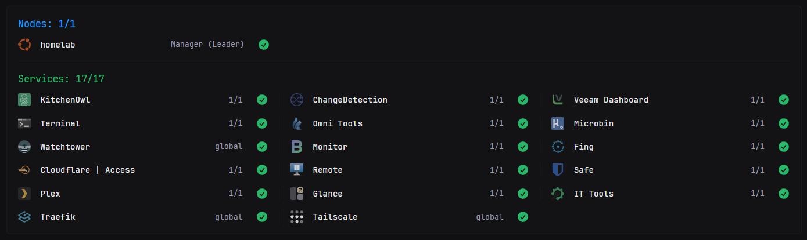
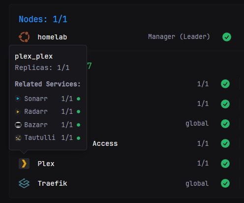

# Docker Swarm Monitor

A comprehensive Docker Swarm monitoring widget for Glance that displays node status and service health with support for service grouping based on the built-in docker-containers widget.



## Features

- **Node Monitoring**: Display all Swarm nodes with their status, role, and availability
- **Service Monitoring**: Track service replica status and health
- **Parent/Child Service Grouping**: Organize related services using `glance.id` and `glance.parent` labels
- **Customizable Colors**: Adjust section header colors via template variables
- **Icon Support**: Multiple icon prefixes supported (si:, di:, sh:, mdi:)
- **Deployment Mode Display**: Shows replica counts (1/1) or "global" for global services
- **Real-time Status**: Visual status indicators for nodes and services
- **Hover Details**: Interactive popovers showing additional information

## Prerequisites

- Docker Swarm cluster (single or multi-node)
- [Tecnativa's docker-socket-proxy](https://github.com/Tecnativa/docker-socket-proxy) for secure Docker API access
- Glance dashboard

## Installation

### 1. Deploy Docker Socket Proxy

Add the following service in your current `glance` Docker Swarm or `docker-compose.yml` file

```yaml
version: '3.8'

services:
  glance:
    image: glanceapp/glance
    networks:
      - glance-docker-api   # Must have the same network attached
    # ---- Rest of your glance service ----

  # docker-swarm-proxy service to be added
  glance-docker-swarm-proxy:
    image: tecnativa/docker-socket-proxy
    environment:
      - LOG_LEVEL=info
      - SERVICES=1 # Required
      - NODES=1 # Required
      - TASKS=1 # Required
      - NETWORKS=1
      - CONTAINERS=1
      - INFO=1
      - POST=0 # Disable write operations
      - BUILD=0
      - COMMIT=0
      - EXEC=0
      - IMAGES=0
    volumes:
      - /var/run/docker.sock:/var/run/docker.sock:ro
    networks:
      - glance-docker-api # Must have the same network attached
    deploy:
      mode: replicated
      replicas: 1
      placement:
        constraints:
          - node.role == manager

# === Networks ===
networks:
  glance-docker-api:
    driver: overlay
    internal: true
```

Deploy with:

```sh
docker stack deploy -c docker-compose.yml glance-stack
```


### 2. Configure Glance

Add the widget to your `glance.yml`:

```yaml
- type: custom-api
  title: Docker Swarm
  url: http://glance-docker-swarm-proxy:2375/services ## CHANGE THIS TO MATCH YOUR SETUP
  cache: 1m
  template: |
    {{/* Define base URL and colors as template variables - CHANGE THIS TO MATCH YOUR SETUP */}}
    {{ $baseURL := "http://glance-docker-swarm-proxy:2375" }}
    {{ $nodesColor := "204 93 53" }}
    {{ $servicesColor := "147 64 44" }}
    
    <style>
      /* Match bookmark icon sizing */
      .docker-container-icon {
        display: block;
        filter: grayscale(0.4);
        object-fit: contain;
        aspect-ratio: 1 / 1;
        width: 2rem;
        height: 2rem;
        opacity: 0.8;
        transition: filter 0.3s, opacity 0.3s;
      }
      
      .docker-container-icon.flat-icon {
        opacity: 0.7;
      }
      
      .docker-container:hover .docker-container-icon {
        opacity: 1;
      }
      
      .docker-container:hover .docker-container-icon:not(.flat-icon) {
        filter: grayscale(0);
      }
      
      .docker-container-status-icon {
        width: 2rem;
        height: 2rem;
      }
      
      /* Match bookmark text sizing and alignment */
      .service-name {
        flex: 1;
        min-width: 0;
      }
      
      .service-name a,
      .service-name span {
        display: block;
        overflow: hidden;
        text-overflow: ellipsis;
        white-space: nowrap;
        font-size: var(--font-size-base);
        line-height: 2rem;
      }
      
      .service-replicas {
        flex-shrink: 0;
        font-size: var(--font-size-h5);
        color: var(--color-text-base);
        padding: 0.125rem 0.5rem;
        background: var(--color-background-hover);
        border-radius: var(--border-radius);
        white-space: nowrap;
      }
      
      /* Section header styles - match bookmark group titles */
      .section-header {
        font-size: var(--font-size-h3);
        font-weight: 400;
        margin-bottom: 1rem;
        text-transform: capitalize;
      }
      
      /* Horizontal separator */
      .section-separator {
        height: 1px;
        background: var(--color-separator);
        margin: 1.5rem 0;
      }
      
      /* Node hostname styling - match bookmark text */
      .node-hostname {
        flex: 1;
        min-width: 0;
        font-size: var(--font-size-base);
        line-height: 2rem;
        overflow: hidden;
        text-overflow: ellipsis;
        white-space: nowrap;
      }
      
      .node-role {
        flex-shrink: 0;
        font-size: var(--font-size-h5);
        color: var(--color-text-base);
        padding: 0.125rem 0.5rem;
        background: var(--color-background-hover);
        border-radius: var(--border-radius);
        text-transform: capitalize;
      }
      
      /* Ensure vertical alignment */
      .docker-container {
        align-items: center;
      }
      
      /* Child service styles in popover */
      .child-service {
        display: flex;
        align-items: center;
        gap: 0.5rem;
        padding: 0.25rem 0;
      }
      
      .child-service-icon {
        width: 1.25rem;
        height: 1.25rem;
        opacity: 0.8;
      }
      
      .child-service-name {
        flex: 1;
        font-size: var(--font-size-h5);
      }
      
      .child-service-status {
        width: 1rem;
        height: 1rem;
      }
    </style>
    
    {{/* Fetch nodes data */}}
    {{
      $nodesResponse := newRequest (concat $baseURL "/nodes")
        | getResponse
    }}
    
    {{/* Count nodes */}}
    {{ $totalNodes := 0 }}
    {{ $readyNodes := 0 }}
    
    {{ if eq $nodesResponse.Response.StatusCode 200 }}
      {{ range $nodesResponse.JSON.Array "" }}
        {{ $totalNodes = add $totalNodes 1 }}
        {{ if eq (.String "Status.State") "ready" }}
          {{ $readyNodes = add $readyNodes 1 }}
        {{ end }}
      {{ end }}
    {{ end }}
    
    {{/* Count services - only count parent/standalone services */}}
    {{ $totalServices := 0 }}
    {{ $healthyServices := 0 }}
    
    {{ range .JSON.Array "" }}
      {{ $serviceID := .String "ID" }}
      {{ $serviceName := .String "Spec.Name" }}
      
      {{
        $details := newRequest (concat $baseURL "/services/" $serviceID)
          | getResponse
      }}
      
      {{ if eq $details.Response.StatusCode 200 }}
        {{ $name := $details.JSON.String "Spec.Labels.glance\\.name" }}
        {{ $glanceParent := $details.JSON.String "Spec.Labels.glance\\.parent" }}
        
        {{/* Only count if not a child service */}}
        {{ if and $name (not $glanceParent) }}
          {{ $totalServices = add $totalServices 1 }}
          
          {{ $isGlobal := $details.JSON.Exists "Spec.Mode.Global" }}
          {{ $desired := $details.JSON.String "Spec.Mode.Replicated.Replicas" }}
          
          {{ if $isGlobal }}
            {{ $healthyServices = add $healthyServices 1 }}
          {{ else }}
            {{
              $tasks := newRequest (concat $baseURL "/tasks?filters={\"service\":[\"" $serviceName "\"]}")
                | getResponse
            }}
            {{ if eq $tasks.Response.StatusCode 200 }}
              {{ $runningCount := 0 }}
              {{ range $tasks.JSON.Array "" }}
                {{ if eq (.String "Status.State") "running" }}
                  {{ $runningCount = add $runningCount 1 }}
                {{ end }}
              {{ end }}
              
              {{ $runningStr := printf "%d" $runningCount }}
              {{ if eq $runningStr $desired }}
                {{ $healthyServices = add $healthyServices 1 }}
              {{ end }}
            {{ end }}
          {{ end }}
        {{ end }}
      {{ end }}
    {{ end }}
    
    {{/* NODES SECTION */}}
    <div class="section-header" style="color: hsl({{ $nodesColor }}); font-weight: 400;">Nodes: {{ $readyNodes }}/{{ $totalNodes }}</div>
    
    <ul class="list-gap-20 list-with-separator" style="display: flex; flex-wrap: wrap; gap: 1.25rem;">
      {{ if eq $nodesResponse.Response.StatusCode 200 }}
        {{ range $nodesResponse.JSON.Array "" }}
          {{ $nodeID := .String "ID" }}
          {{ $nodeHostname := .String "Description.Hostname" }}
          {{ $nodeRole := .String "Spec.Role" }}
          {{ $nodeState := .String "Status.State" }}
          {{ $nodeAvailability := .String "Spec.Availability" }}
          {{ $isLeader := .Bool "ManagerStatus.Leader" }}
          
          {{/* Fetch node details for glance labels */}}
          {{
            $nodeDetails := newRequest (concat $baseURL "/nodes/" $nodeID)
              | getResponse
          }}
          
          {{ $nodeIcon := "" }}
          {{ if eq $nodeDetails.Response.StatusCode 200 }}
            {{ $nodeIcon = $nodeDetails.JSON.String "Spec.Labels.glance\\.icon" }}
          {{ end }}
          
          {{ $statusClass := "warn" }}
          {{ $statusText := "down" }}
          
          {{ if eq $nodeState "ready" }}
            {{ if eq $nodeAvailability "active" }}
              {{ $statusClass = "ok" }}
              {{ $statusText = "ready" }}
            {{ else if eq $nodeAvailability "pause" }}
              {{ $statusClass = "paused" }}
              {{ $statusText = "paused" }}
            {{ else if eq $nodeAvailability "drain" }}
              {{ $statusClass = "paused" }}
              {{ $statusText = "draining" }}
            {{ end }}
          {{ end }}
          
          {{/* Process node icon */}}
          {{ $iconUrl := "" }}
          {{ $isFlat := false }}
          
          {{ if $nodeIcon }}
            {{ if eq (findMatch "^si:" $nodeIcon) "si:" }}
              {{ $iconName := trimPrefix "si:" $nodeIcon }}
              {{ $iconUrl = concat "https://cdn.jsdelivr.net/npm/simple-icons@latest/icons/" $iconName ".svg" }}
              {{ $isFlat = true }}
            {{ else if eq (findMatch "^di:" $nodeIcon) "di:" }}
              {{ $iconName := trimPrefix "di:" $nodeIcon }}
              {{ if findMatch "\\.(svg|png)$" $iconName }}
                {{ $iconUrl = concat "https://cdn.jsdelivr.net/gh/homarr-labs/dashboard-icons/" (replaceMatches ".*\\.(svg|png)$" "$1" $iconName) "/" $iconName }}
              {{ else }}
                {{ $iconUrl = concat "https://cdn.jsdelivr.net/gh/homarr-labs/dashboard-icons/svg/" $iconName ".svg" }}
              {{ end }}
            {{ else if eq (findMatch "^sh:" $nodeIcon) "sh:" }}
              {{ $iconName := trimPrefix "sh:" $nodeIcon }}
              {{ if findMatch "\\.(svg|png)$" $iconName }}
                {{ $iconUrl = concat "https://cdn.jsdelivr.net/gh/selfhst/icons/" (replaceMatches ".*\\.(svg|png)$" "$1" $iconName) "/" $iconName }}
              {{ else }}
                {{ $iconUrl = concat "https://cdn.jsdelivr.net/gh/selfhst/icons/svg/" $iconName ".svg" }}
              {{ end }}
            {{ else if eq (findMatch "^mdi:" $nodeIcon) "mdi:" }}
              {{ $iconName := trimPrefix "mdi:" $nodeIcon }}
              {{ $iconUrl = concat "https://cdn.jsdelivr.net/npm/@mdi/svg@latest/svg/" $iconName ".svg" }}
              {{ $isFlat = true }}
            {{ else if findMatch "^https?://" $nodeIcon }}
              {{ $iconUrl = $nodeIcon }}
            {{ else }}
              {{ $iconUrl = $nodeIcon }}
            {{ end }}
          {{ else }}
            {{ $iconUrl = "https://cdn.jsdelivr.net/npm/@mdi/svg@latest/svg/server.svg" }}
            {{ $isFlat = true }}
          {{ end }}
          
          <li class="docker-container flex items-center gap-15" style="flex: 1 1 0; min-width: 0; max-width: calc(33.333% - 0.84rem);">
            <div class="shrink-0"
                 data-popover-type="text"
                 data-popover-position="above"
                 data-popover-text="{{ $nodeHostname }} - {{ $nodeRole }}{{ if $isLeader }} (leader){{ end }}"
                 aria-hidden="true">
              
            </div>
            
            <div class="min-width-0 grow flex items-center gap-10">
              <div class="node-hostname color-highlight" style="flex: 1; min-width: 0;">{{ $nodeHostname }}</div>
              
              <div class="node-role">
                {{ $nodeRole }}{{ if $isLeader }} (leader){{ end }}
              </div>
            </div>
            
            <div class="shrink-0"
                 data-popover-type="text"
                 data-popover-position="above"
                 data-popover-text="{{ $statusText }}"
                 aria-label="{{ $statusText }}">
              {{ if eq $statusClass "ok" }}
                <svg class="docker-container-status-icon" fill="var(--color-positive)" xmlns="http://www.w3.org/2000/svg" viewBox="0 0 20 20" aria-hidden="true">
                  <path fill-rule="evenodd" d="M10 18a8 8 0 1 0 0-16 8 8 0 0 0 0 16Zm3.857-9.809a.75.75 0 0 0-1.214-.882l-3.483 4.79-1.88-1.88a.75.75 0 1 0-1.06 1.061l2.5 2.5a.75.75 0 0 0 1.137-.089l4-5.5Z" clip-rule="evenodd" />
                </svg>
              {{ else if eq $statusClass "warn" }}
                <svg class="docker-container-status-icon" fill="var(--color-negative)" xmlns="http://www.w3.org/2000/svg" viewBox="0 0 20 20" aria-hidden="true">
                  <path fill-rule="evenodd" d="M8.485 2.495c.673-1.167 2.357-1.167 3.03 0l6.28 10.875c.673 1.167-.17 2.625-1.516 2.625H3.72c-1.347 0-2.189-1.458-1.515-2.625L8.485 2.495ZM10 5a.75.75 0 0 1 .75.75v3.5a.75.75 0 0 1-1.5 0v-3.5A.75.75 0 0 1 10 5Zm0 9a1 1 0 1 0 0-2 1 1 0 0 0 0 2Z" clip-rule="evenodd" />
                </svg>
              {{ else if eq $statusClass "paused" }}
                <svg class="docker-container-status-icon" fill="var(--color-text-base)" xmlns="http://www.w3.org/2000/svg" viewBox="0 0 20 20" aria-hidden="true">
                  <path fill-rule="evenodd" d="M2 10a8 8 0 1 1 16 0 8 8 0 0 1-16 0Zm5-2.25A.75.75 0 0 1 7.75 7h.5a.75.75 0 0 1 .75.75v4.5a.75.75 0 0 1-.75.75h-.5a.75.75 0 0 1-.75-.75v-4.5Zm4 0a.75.75 0 0 1 .75-.75h.5a.75.75 0 0 1 .75.75v4.5a.75.75 0 0 1-.75.75h-.5a.75.75 0 0 1-.75-.75v-4.5Z" clip-rule="evenodd" />
                </svg>
              {{ end }}
            </div>
          </li>
        {{ end }}
      {{ else }}
        <div class="text-center">Unable to fetch nodes data.</div>
      {{ end }}
    </ul>
    
    {{/* HORIZONTAL SEPARATOR */}}
    <div class="section-separator"></div>
    
    {{/* SERVICES SECTION */}}
    <div class="section-header" style="color: hsl({{ $servicesColor }}); font-weight: 400;">Services: {{ $healthyServices }}/{{ $totalServices }}</div>
    
    <ul class="dynamic-columns list-gap-20 list-with-separator">
      {{ range .JSON.Array "" }}
        {{ $serviceID := .String "ID" }}
        {{ $serviceName := .String "Spec.Name" }}
        
        {{
          $details := newRequest (concat $baseURL "/services/" $serviceID)
            | getResponse
        }}
        
        {{ if eq $details.Response.StatusCode 200 }}
          {{ $name := $details.JSON.String "Spec.Labels.glance\\.name" }}
          {{ $glanceParent := $details.JSON.String "Spec.Labels.glance\\.parent" }}
          
          {{/* Only display if not a child service */}}
          {{ if and $name (not $glanceParent) }}
            {{ $glanceID := $details.JSON.String "Spec.Labels.glance\\.id" }}
            {{ $icon := $details.JSON.String "Spec.Labels.glance\\.icon" }}
            {{ $url := $details.JSON.String "Spec.Labels.glance\\.url" }}
            {{ $description := $details.JSON.String "Spec.Labels.glance\\.description" }}
            {{ $isGlobal := $details.JSON.Exists "Spec.Mode.Global" }}
            {{ $desired := $details.JSON.String "Spec.Mode.Replicated.Replicas" }}
            
            {{ $running := "" }}
            {{ $statusClass := "warn" }}
            
            {{ if not $isGlobal }}
              {{
                $tasks := newRequest (concat $baseURL "/tasks?filters={\"service\":[\"" $serviceName "\"]}")
                  | getResponse
              }}
              {{ if eq $tasks.Response.StatusCode 200 }}
                {{ $runningCount := 0 }}
                {{ range $tasks.JSON.Array "" }}
                  {{ if eq (.String "Status.State") "running" }}
                    {{ $runningCount = add $runningCount 1 }}
                  {{ end }}
                {{ end }}
                {{ $running = printf "%d" $runningCount }}
                
                {{ if eq $running $desired }}
                  {{ $statusClass = "ok" }}
                {{ else if gt $runningCount 0 }}
                  {{ $statusClass = "paused" }}
                {{ else }}
                  {{ $statusClass = "warn" }}
                {{ end }}
              {{ end }}
            {{ else }}
              {{ $statusClass = "ok" }}
            {{ end }}
            
            {{/* Process icon */}}
            {{ $iconUrl := "" }}
            {{ $isFlat := false }}
            
            {{ if $icon }}
              {{ if eq (findMatch "^si:" $icon) "si:" }}
                {{ $iconName := trimPrefix "si:" $icon }}
                {{ $iconUrl = concat "https://cdn.jsdelivr.net/npm/simple-icons@latest/icons/" $iconName ".svg" }}
                {{ $isFlat = true }}
              {{ else if eq (findMatch "^di:" $icon) "di:" }}
                {{ $iconName := trimPrefix "di:" $icon }}
                {{ if findMatch "\\.(svg|png)$" $iconName }}
                  {{ $iconUrl = concat "https://cdn.jsdelivr.net/gh/homarr-labs/dashboard-icons/" (replaceMatches ".*\\.(svg|png)$" "$1" $iconName) "/" $iconName }}
                {{ else }}
                  {{ $iconUrl = concat "https://cdn.jsdelivr.net/gh/homarr-labs/dashboard-icons/svg/" $iconName ".svg" }}
                {{ end }}
              {{ else if eq (findMatch "^sh:" $icon) "sh:" }}
                {{ $iconName := trimPrefix "sh:" $icon }}
                {{ if findMatch "\\.(svg|png)$" $iconName }}
                  {{ $iconUrl = concat "https://cdn.jsdelivr.net/gh/selfhst/icons/" (replaceMatches ".*\\.(svg|png)$" "$1" $iconName) "/" $iconName }}
                {{ else }}
                  {{ $iconUrl = concat "https://cdn.jsdelivr.net/gh/selfhst/icons/svg/" $iconName ".svg" }}
                {{ end }}
              {{ else if eq (findMatch "^mdi:" $icon) "mdi:" }}
                {{ $iconName := trimPrefix "mdi:" $icon }}
                {{ $iconUrl = concat "https://cdn.jsdelivr.net/npm/@mdi/svg@latest/svg/" $iconName ".svg" }}
                {{ $isFlat = true }}
              {{ else if findMatch "^https?://" $icon }}
                {{ $iconUrl = $icon }}
              {{ else }}
                {{ $iconUrl = $icon }}
              {{ end }}
            {{ else }}
              {{ $iconUrl = "https://cdn.jsdelivr.net/npm/simple-icons@latest/icons/docker.svg" }}
              {{ $isFlat = true }}
            {{ end }}
            
            <li class="docker-container flex items-center gap-15">
              <div class="shrink-0" 
                   data-popover-type="html" 
                   data-popover-position="above" 
                   data-popover-offset="0.25"
                   data-popover-margin="0.1rem"
                   data-popover-max-width="400px"
                   aria-hidden="true">
                
                <div data-popover-html>
                  <div class="color-highlight text-truncate block">{{ $serviceName }}</div>
                  {{ if $isGlobal }}
                    <div>Mode: Global</div>
                  {{ else }}
                    <div>Replicas: {{ $running }}/{{ $desired }}</div>
                  {{ end }}
                  {{ if $description }}
                    <div class="margin-top-10 size-h5">{{ $description }}</div>
                  {{ end }}
                  
                  {{/* Display child services if this service has glance.id */}}
                  {{ if $glanceID }}
                    {{ $hasChildren := false }}
                    {{ range $.JSON.Array "" }}
                      {{ $childServiceID := .String "ID" }}
                      {{
                        $childDetails := newRequest (concat $baseURL "/services/" $childServiceID)
                          | getResponse
                      }}
                      {{ if eq $childDetails.Response.StatusCode 200 }}
                        {{ $childParent := $childDetails.JSON.String "Spec.Labels.glance\\.parent" }}
                        {{ if eq $childParent $glanceID }}
                          {{ $hasChildren = true }}
                        {{ end }}
                      {{ end }}
                    {{ end }}
                    
                    {{ if $hasChildren }}
                      <div class="margin-top-10">
                        <div class="size-h5" style="font-weight: 600; margin-bottom: 0.5rem;">Related Services:</div>
                        {{ range $.JSON.Array "" }}
                          {{ $childServiceID := .String "ID" }}
                          {{ $childServiceName := .String "Spec.Name" }}
                          {{
                            $childDetails := newRequest (concat $baseURL "/services/" $childServiceID)
                              | getResponse
                          }}
                          {{ if eq $childDetails.Response.StatusCode 200 }}
                            {{ $childParent := $childDetails.JSON.String "Spec.Labels.glance\\.parent" }}
                            {{ if eq $childParent $glanceID }}
                              {{ $childName := $childDetails.JSON.String "Spec.Labels.glance\\.name" }}
                              {{ $childIcon := $childDetails.JSON.String "Spec.Labels.glance\\.icon" }}
                              
                              {{/* Get child status */}}
                              {{ $childIsGlobal := $childDetails.JSON.Exists "Spec.Mode.Global" }}
                              {{ $childDesired := $childDetails.JSON.String "Spec.Mode.Replicated.Replicas" }}
                              {{ $childStatusClass := "warn" }}
                              {{ $childRunning := "" }}
                              
                              {{ if $childIsGlobal }}
                                {{ $childStatusClass = "ok" }}
                                {{ $childRunning = "global" }}
                              {{ else }}
                                {{
                                  $childTasks := newRequest (concat $baseURL "/tasks?filters={\"service\":[\"" $childServiceName "\"]}")
                                    | getResponse
                                }}
                                {{ if eq $childTasks.Response.StatusCode 200 }}
                                  {{ $childRunningCount := 0 }}
                                  {{ range $childTasks.JSON.Array "" }}
                                    {{ if eq (.String "Status.State") "running" }}
                                      {{ $childRunningCount = add $childRunningCount 1 }}
                                    {{ end }}
                                  {{ end }}
                                  {{ $childRunning = printf "%d" $childRunningCount }}
                                  
                                  {{ if eq $childRunning $childDesired }}
                                    {{ $childStatusClass = "ok" }}
                                  {{ else if gt $childRunningCount 0 }}
                                    {{ $childStatusClass = "paused" }}
                                  {{ end }}
                                {{ end }}
                              {{ end }}
                              
                              {{/* Process child icon */}}
                              {{ $childIconUrl := "" }}
                              {{ if $childIcon }}
                                {{ if eq (findMatch "^si:" $childIcon) "si:" }}
                                  {{ $childIconName := trimPrefix "si:" $childIcon }}
                                  {{ $childIconUrl = concat "https://cdn.jsdelivr.net/npm/simple-icons@latest/icons/" $childIconName ".svg" }}
                                {{ else if eq (findMatch "^sh:" $childIcon) "sh:" }}
                                  {{ $childIconName := trimPrefix "sh:" $childIcon }}
                                  {{ if findMatch "\\.(svg|png)$" $childIconName }}
                                    {{ $childIconUrl = concat "https://cdn.jsdelivr.net/gh/selfhst/icons/" (replaceMatches ".*\\.(svg|png)$" "$1" $childIconName) "/" $childIconName }}
                                  {{ else }}
                                    {{ $childIconUrl = concat "https://cdn.jsdelivr.net/gh/selfhst/icons/svg/" $childIconName ".svg" }}
                                  {{ end }}
                                {{ else if eq (findMatch "^mdi:" $childIcon) "mdi:" }}
                                  {{ $childIconName := trimPrefix "mdi:" $childIcon }}
                                  {{ $childIconUrl = concat "https://cdn.jsdelivr.net/npm/@mdi/svg@latest/svg/" $childIconName ".svg" }}
                                {{ else }}
                                  {{ $childIconUrl = $childIcon }}
                                {{ end }}
                              {{ else }}
                                {{ $childIconUrl = "https://cdn.jsdelivr.net/npm/simple-icons@latest/icons/docker.svg" }}
                              {{ end }}
                              
                              <div class="child-service">
                                
                                <span class="child-service-name">{{ $childName }}</span>
                                <span style="font-size: var(--font-size-h5); color: var(--color-text-base); margin-left: auto;">
                                  {{ if $childIsGlobal }}
                                    global
                                  {{ else }}
                                    {{ $childRunning }}/{{ $childDesired }}
                                  {{ end }}
                                </span>
                                {{ if eq $childStatusClass "ok" }}
                                  <svg class="child-service-status" fill="var(--color-positive)" xmlns="http://www.w3.org/2000/svg" viewBox="0 0 20 20">
                                    <circle cx="10" cy="10" r="6"/>
                                  </svg>
                                {{ else if eq $childStatusClass "paused" }}
                                  <svg class="child-service-status" fill="var(--color-text-base)" xmlns="http://www.w3.org/2000/svg" viewBox="0 0 20 20">
                                    <circle cx="10" cy="10" r="6"/>
                                  </svg>
                                {{ else }}
                                  <svg class="child-service-status" fill="var(--color-negative)" xmlns="http://www.w3.org/2000/svg" viewBox="0 0 20 20">
                                    <circle cx="10" cy="10" r="6"/>
                                  </svg>
                                {{ end }}
                              </div>
                            {{ end }}
                          {{ end }}
                        {{ end }}
                      </div>
                    {{ end }}
                  {{ end }}
                </div>
              </div>
              
              <div class="min-width-0 grow flex items-center gap-10">
                <div class="service-name">
                  {{ if $url }}
                    <a href="{{ $url }}" class="color-highlight text-truncate" target="_blank" rel="noreferrer">{{ $name }}</a>
                  {{ else }}
                    <span class="color-highlight text-truncate">{{ $name }}</span>
                  {{ end }}
                </div>
                
                <div class="service-replicas">
                  {{ if $isGlobal }}
                    global
                  {{ else if and $running $desired }}
                    {{ $running }}/{{ $desired }}
                  {{ else }}
                    -/-
                  {{ end }}
                </div>
              </div>
              
              <div class="shrink-0" 
                   data-popover-type="text" 
                   data-popover-position="above" 
                   data-popover-text="{{ if $isGlobal }}running (global){{ else if eq $statusClass "ok" }}running{{ else if eq $statusClass "paused" }}scaling{{ else }}stopped{{ end }}"
                   aria-label="{{ if $isGlobal }}running (global){{ else if eq $statusClass "ok" }}running{{ else if eq $statusClass "paused" }}scaling{{ else }}stopped{{ end }}">
                {{ if eq $statusClass "ok" }}
                  <svg class="docker-container-status-icon" fill="var(--color-positive)" xmlns="http://www.w3.org/2000/svg" viewBox="0 0 20 20" aria-hidden="true">
                    <path fill-rule="evenodd" d="M10 18a8 8 0 1 0 0-16 8 8 0 0 0 0 16Zm3.857-9.809a.75.75 0 0 0-1.214-.882l-3.483 4.79-1.88-1.88a.75.75 0 1 0-1.06 1.061l2.5 2.5a.75.75 0 0 0 1.137-.089l4-5.5Z" clip-rule="evenodd" />
                  </svg>
                {{ else if eq $statusClass "warn" }}
                  <svg class="docker-container-status-icon" fill="var(--color-negative)" xmlns="http://www.w3.org/2000/svg" viewBox="0 0 20 20" aria-hidden="true">
                    <path fill-rule="evenodd" d="M8.485 2.495c.673-1.167 2.357-1.167 3.03 0l6.28 10.875c.673 1.167-.17 2.625-1.516 2.625H3.72c-1.347 0-2.189-1.458-1.515-2.625L8.485 2.495ZM10 5a.75.75 0 0 1 .75.75v3.5a.75.75 0 0 1-1.5 0v-3.5A.75.75 0 0 1 10 5Zm0 9a1 1 0 1 0 0-2 1 1 0 0 0 0 2Z" clip-rule="evenodd" />
                  </svg>
                {{ else if eq $statusClass "paused" }}
                  <svg class="docker-container-status-icon" fill="var(--color-text-base)" xmlns="http://www.w3.org/2000/svg" viewBox="0 0 20 20" aria-hidden="true">
                    <path fill-rule="evenodd" d="M2 10a8 8 0 1 1 16 0 8 8 0 0 1-16 0Zm5-2.25A.75.75 0 0 1 7.75 7h.5a.75.75 0 0 1 .75.75v4.5a.75.75 0 0 1-.75.75h-.5a.75.75 0 0 1-.75-.75v-4.5Zm4 0a.75.75 0 0 1 .75-.75h.5a.75.75 0 0 1 .75.75v4.5a.75.75 0 0 1-.75.75h-.5a.75.75 0 0 1-.75-.75v-4.5Z" clip-rule="evenodd" />
                  </svg>
                {{ else }}
                  <svg class="docker-container-status-icon" fill="var(--color-text-base)" xmlns="http://www.w3.org/2000/svg" viewBox="0 0 20 20" aria-hidden="true">
                    <path fill-rule="evenodd" d="M18 10a8 8 0 1 1-16 0 8 8 0 0 1 16 0ZM8.94 6.94a.75.75 0 1 1-1.061-1.061 3 3 0 1 1 2.871 5.026v.345a.75.75 0 0 1-1.5 0v-.5c0-.72.57-1.172 1.081-1.287A1.5 1.5 0 1 0 8.94 6.94ZM10 15a1 1 0 1 0 0-2 1 1 0 0 0 0 2Z" clip-rule="evenodd" />
                  </svg>
                {{ end }}
              </div>
              
              <div class="visually-hidden" aria-label="{{ if $isGlobal }}Mode: Global{{ else }}Replicas: {{ $running }}/{{ $desired }}{{ end }}"></div>
            </li>
          {{ end }}
        {{ end }}
      {{ end }}
    </ul>
```

### 3. Customize Configuration

Edit the template variables at the top (line 8-10):

```yaml
{{ $baseURL := "http://glance-docker-swarm-proxy:2375" }} # Change if needed
{{ $nodesColor := "139 92 46" }} # HSL color for Nodes section
{{ $servicesColor := "204 93 53" }} # HSL color for Services section
```

## Service Labels

### Basic Service Labels

Add these labels to your Docker Swarm services:

```yaml
deploy:
  labels:
    - "glance.name=My Service" # Display name (required)
    - "glance.icon=sh:plex" # Icon (optional)
    - "glance.url=https://myservice.example.com" # Service URL (optional)
    - "glance.description=My service description" # Description (optional)
```

### Icon Prefixes

Supported icon sources:

- `si:` - [Simple Icons](https://simpleicons.org/) (e.g., `si:docker`)
- `sh:` - [Selfh.st Icons](https://github.com/selfhst/icons) (e.g., `sh:plex`)
- `di:` - [Dashboard Icons](https://github.com/homarr-labs/dashboard-icons) (e.g., `di:sonarr`)
- `mdi:` - [Material Design Icons](https://pictogrammers.com/library/mdi/) (e.g., `mdi:server`)
- Direct URL: `https://example.com/icon.svg`

### Service Grouping (Parent/Child)

Group related services together:



**Parent Service:**

```yaml
deploy:
  labels:
    - "glance.name=Plex"
    - "glance.id=plex-stack" # Unique identifier
    - "glance.icon=sh:plex"
```

**Child Services:**

```yaml
deploy:
  labels:
    - "glance.name=Overseerr"
    - "glance.parent=plex-stack" # Reference to parent ID
    - "glance.icon=sh:overseerr"
```

Child services will:

- Be hidden from the main service list
- Appear in the parent's icon hover popover
- Show their own status and replica counts

### Node Labels

Optionally customize node icons:

```sh
docker node update --label-add glance.icon=mdi:server <node-name>
```

## Configuration Options

| Variable | Default | Description |
|----------|---------|-------------|
| `$baseURL` | `http://glance-docker-swarm-proxy:2375` | Docker API endpoint |
| `$nodesColor` | `139 92 46` | HSL color for Nodes header |
| `$servicesColor` | `204 93 53` | HSL color for Services header |

## Features in Detail

### Node Display

- Hostname
- Role (manager/worker)
- Leader indicator (for manager nodes)
- Status: ready, paused, or down
- Custom icons via node labels

### Service Display

- Service name (clickable if URL provided)
- Replica count (X/Y) or "global" mode
- Status indicators:
  - 🟢 Green: All replicas running
  - 🟡 Yellow: Some replicas running (scaling)
  - 🔴 Red: No replicas running
- Hover popover showing:
  - Full service name
  - Replica details
  - Description (if provided)
  - Related child services (if any)

### Service Grouping

Parent services show related child services when hovering over the icon, creating a clean hierarchical view.

## Troubleshooting

### Services not appearing

Check that services have the `glance.name` label:

```sh
docker service inspect <service-name> --format '{{json .Spec.Labels}}'
```

### Connection errors

Ensure:

1. Docker socket proxy service is running
2. Glance and proxy are on the same network
3. The `$baseURL` matches your proxy service name

### Child services still visible

Verify the `glance.parent` value exactly matches the parent's `glance.id`.
