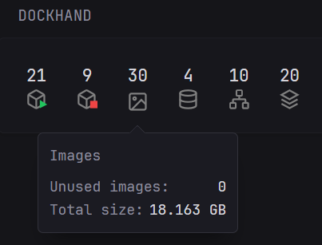

```yaml
- type: custom-api
  title: Dockhand
  title-url: ${DOCKHAND_URL}
  cache: 1h

  url: ${DOCKHAND_URL}/api/environments?env=1

  subrequests:
    containers:
      url: ${DOCKHAND_URL}/api/containers?env=1
    images:
      url: ${DOCKHAND_URL}/api/images?env=1
    networks:
      url: ${DOCKHAND_URL}/api/networks?env=1
    volumes:
      url: ${DOCKHAND_URL}/api/volumes?env=1
    stacks:
      url: ${DOCKHAND_URL}/api/stacks?env=1

  template: |
    <style>
      svg.icon {
        height: 1.5em;
        stroke: gray;
        fill: none;
        margin-bottom: 0.25em;
      }
    </style>

    {{ $containers := (.Subrequest "containers").JSON.Array "" }}
    {{ $images := (.Subrequest "images").JSON.Array "" }}
    {{ $networks := (.Subrequest "networks").JSON.Array "" }}
    {{ $volumes := (.Subrequest "volumes").JSON.Array "" }}
    {{ $stacks := (.Subrequest "stacks").JSON.Array "" }}

    {{ $running := 0 }}
    {{ $stopped := 0 }}
    {{ range $containers }}
      {{ if eq (.String "state") "running" }}
        {{ $running = add $running 1 }}
      {{ else }}
        {{ $stopped = add $stopped 1 }}
      {{ end }}
    {{ end }}

    <div style="display:flex; justify-content:space-between; gap:12px; margin-top:0.5em;">

      <div data-popover-type="text" data-popover-text="Running containers"
           style="flex:1; display:flex; flex-direction:column; align-items:center;">
        <div class="size-h3 color-highlight">{{ $running }}</div>
        <svg xmlns="http://www.w3.org/2000/svg" class="icon" viewBox="0 0 24 24" stroke-width="2">
          <path d="M21 8a2 2 0 0 0-1-1.73l-7-4a2 2 0 0 0-2 0l-7 4A2 2 0 0 0 3 8v8a2 2 0 0 0 1 1.73l7 4a2 2 0 0 0 2 0l7-4A2 2 0 0 0 21 16Z"/>
          <path d="m3.3 7 8.7 5 8.7-5"/>
          <path d="M12 22V12"/>
          <polygon points="16,12.75 16,22 24.25,17.875" fill="#22c55e" stroke="none"/>
        </svg>
      </div>

      <div data-popover-type="text" data-popover-text="Stopped containers"
           style="flex:1; display:flex; flex-direction:column; align-items:center;">
        <div class="size-h3 color-highlight">{{ $stopped }}</div>
        <svg xmlns="http://www.w3.org/2000/svg" class="icon" viewBox="0 0 24 24" stroke-width="2">
          <path d="M21 8a2 2 0 0 0-1-1.73l-7-4a2 2 0 0 0-2 0l-7 4A2 2 0 0 0 3 8v8a2 2 0 0 0 1 1.73l7 4a2 2 0 0 0 2 0l7-4A2 2 0 0 0 21 16Z"/>
          <path d="m3.3 7 8.7 5 8.7-5"/>
          <path d="M12 22V12"/>
          <rect x="16.0" y="13.75" width="8.25" height="8.25" fill="#ef4444" stroke="none" />
        </svg>
      </div>

      <div data-popover-type="html" data-popover-position="bottom"
          data-popover-margin="0.2rem"
          style="flex:1; display:flex; flex-direction:column; align-items:center;">

        <div class="size-h3 color-highlight">{{ len $images }}</div>
        <div data-popover-html="">
          <div style="margin-bottom:0.75rem;">Images</div>

          {{ $unused := 0 }}
          {{ $totalBytes := 0 }}
          {{ range $images }}
            {{ if eq (.Int "containers") 0 }}
              {{ $unused = add $unused 1 }}
            {{ end }}
            {{ $totalBytes = add $totalBytes (.Int "size") }}
          {{ end }}

          {{ $totalGB := div $totalBytes 1073741824 }}
          {{ $decimal := mod (div $totalBytes 1048576) 1024 }}

          <div style="display:flex; justify-content:space-between; gap:0.5rem;">
            <div>Unused images: </div>
            <div class="color-highlight">{{ $unused }}</div>
          </div>
          <div style="display:flex; justify-content:space-between; gap:0.5rem;">
            <div>Total size:</div>
            <div class="color-highlight">{{ printf "%d.%02d GB" $totalGB $decimal }}</div>
          </div>
        </div>
        <svg xmlns="http://www.w3.org/2000/svg" class="icon" viewBox="0 0 24 24" stroke-width="2" style="margin-top:0.25rem;">
          <rect x="3" y="3" width="18" height="18" rx="2"/>
          <circle cx="8.5" cy="8.5" r="1.5"/>
          <path d="M21 15l-5-5L5 21"/>
        </svg>
      </div>

      <div data-popover-type="text" data-popover-text="Volumes"
           style="flex:1; display:flex; flex-direction:column; align-items:center;">
        <div class="size-h3 color-highlight">{{ len $volumes }}</div>
        <svg xmlns="http://www.w3.org/2000/svg" class="icon" viewBox="0 0 24 24" stroke-width="2">
          <ellipse cx="12" cy="5" rx="9" ry="3"/>
          <path d="M3 5V19A9 3 0 0 0 21 19V5"/>
          <path d="M3 12A9 3 0 0 0 21 12"/>
        </svg>
      </div>

      <div data-popover-type="html" data-popover-margin="0.2rem" data-popover-position="bottom"
           style="flex:1; display:flex; flex-direction:column; align-items:center;">
        <div data-popover-html="">
          <div style="margin-bottom:0.75rem;">Networks</div>
          {{ range $networks }}
            <div style="display:flex; justify-content:space-between; gap:1rem; min-width:220px;">
              <div class="size-h5 text-compact">{{ .String "name" }}</div>
              <div class="size-h5 color-highlight">
                {{ $cfg := .Array "ipam.config" }}
                {{ if gt (len $cfg) 0 }}
                  {{ (index $cfg 0).String "subnet" }}
                {{ else }}
                  —
                {{ end }}
              </div>
            </div>
          {{ end }}
        </div>
        <div class="size-h3 color-highlight">{{ len $networks }}</div>
        <svg xmlns="http://www.w3.org/2000/svg" class="icon" viewBox="0 0 24 24" stroke-width="2">
          <rect x="16" y="16" width="6" height="6" rx="1"/>
          <rect x="2" y="16" width="6" height="6" rx="1"/>
          <rect x="9" y="2" width="6" height="6" rx="1"/>
          <path d="M5 16v-3a1 1 0 0 1 1-1h12a1 1 0 0 1 1 1v3"/>
          <path d="M12 12V8"/>
        </svg>
      </div>

      <div data-popover-type="text" data-popover-text="Stacks"
           style="flex:1; display:flex; flex-direction:column; align-items:center;">
        <div class="size-h3 color-highlight">{{ len $stacks }}</div>
        <svg xmlns="http://www.w3.org/2000/svg" class="icon" viewBox="0 0 24 24" stroke-width="2">
          <path d="M12 2 3 7l9 5 9-5-9-5z"/>
          <path d="M3 12l9 5 9-5"/>
          <path d="M3 17l9 5 9-5"/>
        </svg>
      </div>

    </div>
```

## Environment variables

- `DOCKHAND_URL` - The URL for your running Dockhand container, including port but without trailing slash, e.g.: 'http://192.168.1.2:2283', or 'https://dockhand.example.com'

## Dockhand environment

- Update the number in `?env=1` to match the environment of which you want to display information

