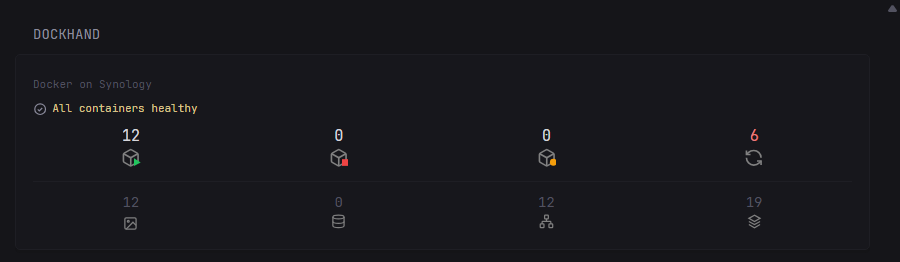
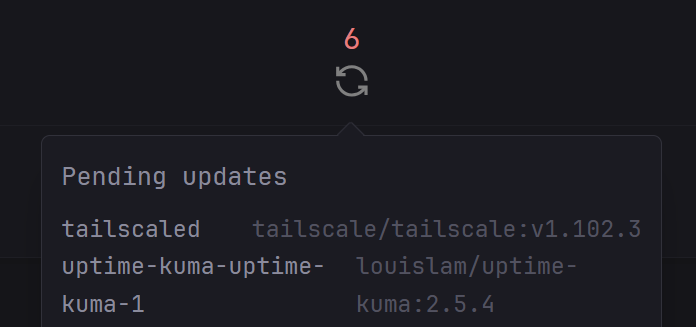

At-a-glance health and inventory dashboard for a [Dockhand](https://dockhand.pro)-managed Docker environment.



## Features

- Running, stopped, and unhealthy container counts, plus an overall health summary
- Containers with a pending image update
- Image, volume, network, and stack totals
- Hover (or tap on touch devices) any count for a breakdown - container names, exit status, stack groupings, etc.



## Requirements

- `DOCKHAND_URL` - the URL of your Dockhand instance, without trailing slash, e.g. `http://192.168.1.2:3002` or `https://dockhand.example.com`
- `DOCKHAND_API_TOKEN` - an API token created in Dockhand under `Settings -> API tokens`. Only required if authentication is enabled on your instance (leave the header out entirely if it isn't)
- `DOCKHAND_ENV_ID` - the numeric ID of the Dockhand environment to report on, e.g. `1`. Find it by opening the environment in Dockhand and checking the URL, or via `GET /api/environments`

```yaml
- type: custom-api
  title: Dockhand
  title-url: ${DOCKHAND_URL}
  cache: 1h

  url: ${DOCKHAND_URL}/api/environments

  headers:
    Authorization: Bearer ${DOCKHAND_API_TOKEN}

  subrequests:
    containers:
      url: ${DOCKHAND_URL}/api/containers?env=${DOCKHAND_ENV_ID}
      headers:
        Authorization: Bearer ${DOCKHAND_API_TOKEN}
    images:
      url: ${DOCKHAND_URL}/api/images?env=${DOCKHAND_ENV_ID}
      headers:
        Authorization: Bearer ${DOCKHAND_API_TOKEN}
    networks:
      url: ${DOCKHAND_URL}/api/networks?env=${DOCKHAND_ENV_ID}
      headers:
        Authorization: Bearer ${DOCKHAND_API_TOKEN}
    volumes:
      url: ${DOCKHAND_URL}/api/volumes?env=${DOCKHAND_ENV_ID}
      headers:
        Authorization: Bearer ${DOCKHAND_API_TOKEN}
    stacks:
      url: ${DOCKHAND_URL}/api/stacks?env=${DOCKHAND_ENV_ID}
      headers:
        Authorization: Bearer ${DOCKHAND_API_TOKEN}
    updates:
      url: ${DOCKHAND_URL}/api/containers/check-updates?env=${DOCKHAND_ENV_ID}
      headers:
        Authorization: Bearer ${DOCKHAND_API_TOKEN}

  template: |
    {{ $envName := .JSON.String "#(id==${DOCKHAND_ENV_ID}).name" }}
    {{ $iconStyle := "height: 1.5em; stroke: gray; fill: none; margin-bottom: 0.25em;" | safeCSS }}
    {{ $iconStyleSmall := "height: 1.15em; stroke: gray; fill: none; margin-bottom: 0.25em;" | safeCSS }}

    {{ $containers := (.Subrequest "containers").JSON.Array "" }}
    {{ $images := (.Subrequest "images").JSON.Array "" }}
    {{ $networks := (.Subrequest "networks").JSON.Array "" }}
    {{ $volumes := (.Subrequest "volumes").JSON.Array "" }}
    {{ $stacks := (.Subrequest "stacks").JSON.Array "" }}
    {{ $pendingUpdates := (.Subrequest "updates").JSON.Array "pendingUpdates" }}

    {{ $running := 0 }}
    {{ $stopped := 0 }}
    {{ $unhealthy := 0 }}
    {{ range $containers }}
      {{ if ne (.String "state") "running" }}
        {{ $stopped = add $stopped 1 }}
      {{ else if eq (.String "health") "unhealthy" }}
        {{ $unhealthy = add $unhealthy 1 }}
      {{ else }}
        {{ $running = add $running 1 }}
      {{ end }}
    {{ end }}

    {{ if $envName }}
      <div class="size-h6 color-subdue" style="margin-top:0.5em;">{{ $envName }}</div>
    {{ end }}

    {{ $totalUp := add $running $unhealthy }}
    <div class="flex items-center gap-5" style="margin-top:0.5em;">
      {{ if eq $totalUp 0 }}
        <svg xmlns="http://www.w3.org/2000/svg" viewBox="0 0 24 24" stroke-width="2" style="height:1.1em; stroke:currentColor; fill:none;">
          <path d="M12 2v10"/>
          <path d="M18.4 6.6a9 9 0 1 1-12.77.04"/>
        </svg>
        <span class="size-h6 color-negative">No containers running</span>
      {{ else if gt $unhealthy 0 }}
        <svg xmlns="http://www.w3.org/2000/svg" viewBox="0 0 24 24" stroke-width="2" style="height:1.1em; stroke:currentColor; fill:none;">
          <path d="m21.73 18-8-14a2 2 0 0 0-3.48 0l-8 14A2 2 0 0 0 4 21h16a2 2 0 0 0 1.73-3Z"/>
          <path d="M12 9v4"/>
          <path d="M12 17h.01"/>
        </svg>
        <span class="size-h6 color-negative">{{ $unhealthy }} container{{ if gt $unhealthy 1 }}s{{ end }} unhealthy</span>
      {{ else }}
        <svg xmlns="http://www.w3.org/2000/svg" viewBox="0 0 24 24" stroke-width="2" style="height:1.1em; stroke:currentColor; fill:none;">
          <circle cx="12" cy="12" r="9"/>
          <path d="m8 12.5 2.5 2.5 5-5"/>
        </svg>
        <span class="size-h6 color-positive">All containers healthy</span>
      {{ end }}
    </div>

    <div style="display:flex; justify-content:space-between; gap:12px; margin-top:0.5em;">

      <div data-popover-type="html" data-popover-position="below" data-popover-margin="0.2rem"
           style="flex:1; display:flex; flex-direction:column; align-items:center;">
        <div class="size-h3 color-highlight">{{ $running }}</div>
        <div data-popover-html="">
          <div style="margin-bottom:0.75rem;">Running containers</div>
          {{ range $containers }}
            {{ if and (eq (.String "state") "running") (ne (.String "health") "unhealthy") }}
              <div style="display:flex; justify-content:space-between; gap:1rem; min-width:220px;">
                <div class="size-h5 text-compact">{{ .String "name" }}</div>
                <div class="size-h5 color-subdue">{{ .String "image" }}</div>
              </div>
            {{ end }}
          {{ end }}
          {{ if eq $running 0 }}
            <div class="size-h5 color-subdue">None</div>
          {{ end }}
        </div>
        <svg xmlns="http://www.w3.org/2000/svg" viewBox="0 0 24 24" stroke-width="2" style="{{ $iconStyle }}">
          <path d="M21 8a2 2 0 0 0-1-1.73l-7-4a2 2 0 0 0-2 0l-7 4A2 2 0 0 0 3 8v8a2 2 0 0 0 1 1.73l7 4a2 2 0 0 0 2 0l7-4A2 2 0 0 0 21 16Z"/>
          <path d="m3.3 7 8.7 5 8.7-5"/>
          <path d="M12 22V12"/>
          <polygon points="16,12.75 16,22 24.25,17.875" fill="#22c55e" stroke="none"/>
        </svg>
      </div>

      <div data-popover-type="html" data-popover-position="below" data-popover-margin="0.2rem"
           style="flex:1; display:flex; flex-direction:column; align-items:center;">
        <div class="size-h3 color-highlight">{{ $stopped }}</div>
        <div data-popover-html="">
          <div style="margin-bottom:0.75rem;">Stopped containers</div>
          {{ range $containers }}
            {{ if ne (.String "state") "running" }}
              <div style="display:flex; justify-content:space-between; gap:1rem; min-width:220px;">
                <div class="size-h5 text-compact">{{ .String "name" }}</div>
                <div class="size-h5 color-subdue">{{ .String "status" }}</div>
              </div>
            {{ end }}
          {{ end }}
          {{ if eq $stopped 0 }}
            <div class="size-h5 color-subdue">None</div>
          {{ end }}
        </div>
        <svg xmlns="http://www.w3.org/2000/svg" viewBox="0 0 24 24" stroke-width="2" style="{{ $iconStyle }}">
          <path d="M21 8a2 2 0 0 0-1-1.73l-7-4a2 2 0 0 0-2 0l-7 4A2 2 0 0 0 3 8v8a2 2 0 0 0 1 1.73l7 4a2 2 0 0 0 2 0l7-4A2 2 0 0 0 21 16Z"/>
          <path d="m3.3 7 8.7 5 8.7-5"/>
          <path d="M12 22V12"/>
          <rect x="16.0" y="13.75" width="8.25" height="8.25" fill="#ef4444" stroke="none" />
        </svg>
      </div>

      <div data-popover-type="html" data-popover-position="below" data-popover-margin="0.2rem"
           style="flex:1; display:flex; flex-direction:column; align-items:center;">
        <div class="size-h3 color-highlight">{{ $unhealthy }}</div>
        <div data-popover-html="">
          <div style="margin-bottom:0.75rem;">Unhealthy containers</div>
          {{ range $containers }}
            {{ if and (eq (.String "state") "running") (eq (.String "health") "unhealthy") }}
              <div style="display:flex; justify-content:space-between; gap:1rem; min-width:220px;">
                <div class="size-h5 text-compact">{{ .String "name" }}</div>
                <div class="size-h5 color-subdue">{{ .String "status" }}</div>
              </div>
            {{ end }}
          {{ end }}
          {{ if eq $unhealthy 0 }}
            <div class="size-h5 color-subdue">None</div>
          {{ end }}
        </div>
        <svg xmlns="http://www.w3.org/2000/svg" viewBox="0 0 24 24" stroke-width="2" style="{{ $iconStyle }}">
          <path d="M21 8a2 2 0 0 0-1-1.73l-7-4a2 2 0 0 0-2 0l-7 4A2 2 0 0 0 3 8v8a2 2 0 0 0 1 1.73l7 4a2 2 0 0 0 2 0l7-4A2 2 0 0 0 21 16Z"/>
          <path d="m3.3 7 8.7 5 8.7-5"/>
          <path d="M12 22V12"/>
          <circle cx="20.125" cy="17.5" r="4.25" fill="#f59e0b" stroke="none"/>
        </svg>
      </div>

      <div data-popover-type="html" data-popover-margin="0.2rem" data-popover-position="below"
           style="flex:1; display:flex; flex-direction:column; align-items:center;">
        <div data-popover-html="">
          <div style="margin-bottom:0.75rem;">Pending updates</div>
          {{ range $pendingUpdates }}
            <div style="display:flex; justify-content:space-between; gap:1rem; min-width:220px;">
              <div class="size-h5 text-compact">{{ .String "containerName" }}</div>
              <div class="size-h5 color-subdue">{{ .String "currentImage" }}</div>
            </div>
          {{ end }}
          {{ if eq (len $pendingUpdates) 0 }}
            <div class="size-h5 color-subdue">Everything up to date</div>
          {{ end }}
        </div>
        <div class="size-h3 {{ if gt (len $pendingUpdates) 0 }}color-negative{{ else }}color-highlight{{ end }}">{{ len $pendingUpdates }}</div>
        <svg xmlns="http://www.w3.org/2000/svg" viewBox="0 0 24 24" stroke-width="2" style="{{ $iconStyle }}">
          <path d="M21 12a9 9 0 0 0-9-9 9.75 9.75 0 0 0-6.74 2.74L3 8"/>
          <path d="M3 3v5h5"/>
          <path d="M3 12a9 9 0 0 0 9 9 9.75 9.75 0 0 0 6.74-2.74L21 16"/>
          <path d="M16 16h5v5"/>
        </svg>
      </div>

    </div>

    <div style="display:flex; justify-content:space-between; gap:12px; margin-top:0.75em; padding-top:0.75em; border-top: 1px solid var(--color-separator);">

      <div data-popover-type="html" data-popover-position="below"
          data-popover-margin="0.2rem"
          style="flex:1; display:flex; flex-direction:column; align-items:center;">

        <div class="size-h4 color-subdue">{{ len $images }}</div>
        <div data-popover-html="">
          <div style="margin-bottom:0.75rem;">Images</div>

          {{ $unused := 0 }}
          {{ $totalBytes := 0 }}
          {{ range $images }}
            {{ if eq (.Int "containers") 0 }}
              {{ $unused = add $unused 1 }}
            {{ end }}
            {{ $totalBytes = add $totalBytes (.Int "size") }}
          {{ end }}

          {{ $totalGB := div $totalBytes 1073741824 }}
          {{ $decimal := mod (div $totalBytes 1048576) 1024 }}

          <div style="display:flex; justify-content:space-between; gap:0.5rem;">
            <div>Unused images: </div>
            <div class="color-highlight">{{ $unused }}</div>
          </div>
          <div style="display:flex; justify-content:space-between; gap:0.5rem;">
            <div>Total size:</div>
            <div class="color-highlight">{{ printf "%d.%02d GB" $totalGB $decimal }}</div>
          </div>
        </div>
        <svg xmlns="http://www.w3.org/2000/svg" viewBox="0 0 24 24" stroke-width="2" style="{{ $iconStyleSmall }} margin-top:0.25rem;">
          <rect x="3" y="3" width="18" height="18" rx="2"/>
          <circle cx="8.5" cy="8.5" r="1.5"/>
          <path d="M21 15l-5-5L5 21"/>
        </svg>
      </div>

      <div data-popover-type="text" data-popover-text="Volumes"
           style="flex:1; display:flex; flex-direction:column; align-items:center;">
        <div class="size-h4 color-subdue">{{ len $volumes }}</div>
        <svg xmlns="http://www.w3.org/2000/svg" viewBox="0 0 24 24" stroke-width="2" style="{{ $iconStyleSmall }}">
          <ellipse cx="12" cy="5" rx="9" ry="3"/>
          <path d="M3 5V19A9 3 0 0 0 21 19V5"/>
          <path d="M3 12A9 3 0 0 0 21 12"/>
        </svg>
      </div>

      <div data-popover-type="html" data-popover-margin="0.2rem" data-popover-position="below"
           style="flex:1; display:flex; flex-direction:column; align-items:center;">
        <div data-popover-html="">
          <div style="margin-bottom:0.75rem;">Networks</div>
          {{ range $networks }}
            <div style="display:flex; justify-content:space-between; gap:1rem; min-width:220px;">
              <div class="size-h5 text-compact">{{ .String "name" }}</div>
              <div class="size-h5 color-highlight">
                {{ $cfg := .Array "ipam.config" }}
                {{ if gt (len $cfg) 0 }}
                  {{ (index $cfg 0).String "subnet" }}
                {{ else }}
                  —
                {{ end }}
              </div>
            </div>
          {{ end }}
        </div>
        <div class="size-h4 color-subdue">{{ len $networks }}</div>
        <svg xmlns="http://www.w3.org/2000/svg" viewBox="0 0 24 24" stroke-width="2" style="{{ $iconStyleSmall }}">
          <rect x="16" y="16" width="6" height="6" rx="1"/>
          <rect x="2" y="16" width="6" height="6" rx="1"/>
          <rect x="9" y="2" width="6" height="6" rx="1"/>
          <path d="M5 16v-3a1 1 0 0 1 1-1h12a1 1 0 0 1 1 1v3"/>
          <path d="M12 12V8"/>
        </svg>
      </div>

      <div data-popover-type="html" data-popover-position="below" data-popover-margin="0.2rem"
           style="flex:1; display:flex; flex-direction:column; align-items:center;">
        <div class="size-h4 color-subdue">{{ len $stacks }}</div>
        <div data-popover-html="">
          <div style="margin-bottom:0.75rem;">Stacks</div>

          {{ $runningStacks := 0 }}
          {{ range $stacks }}{{ if eq (.String "status") "running" }}{{ $runningStacks = add $runningStacks 1 }}{{ end }}{{ end }}
          {{ if gt $runningStacks 0 }}
            <div class="size-h6 color-subdue" style="margin-top:0.5rem;">running</div>
            {{ range $stacks }}
              {{ if eq (.String "status") "running" }}
                <div class="size-h5 text-compact" style="min-width:220px;">{{ .String "name" }}</div>
              {{ end }}
            {{ end }}
          {{ end }}

          {{ $partialStacks := 0 }}
          {{ range $stacks }}{{ if eq (.String "status") "partial" }}{{ $partialStacks = add $partialStacks 1 }}{{ end }}{{ end }}
          {{ if gt $partialStacks 0 }}
            <div class="size-h6 color-negative" style="margin-top:0.5rem;">partial</div>
            {{ range $stacks }}
              {{ if eq (.String "status") "partial" }}
                <div class="size-h5 text-compact" style="min-width:220px;">{{ .String "name" }}</div>
              {{ end }}
            {{ end }}
          {{ end }}

          {{ $stoppedStacks := 0 }}
          {{ range $stacks }}{{ if eq (.String "status") "stopped" }}{{ $stoppedStacks = add $stoppedStacks 1 }}{{ end }}{{ end }}
          {{ if gt $stoppedStacks 0 }}
            <div class="size-h6 color-subdue" style="margin-top:0.5rem;">stopped</div>
            {{ range $stacks }}
              {{ if eq (.String "status") "stopped" }}
                <div class="size-h5 text-compact" style="min-width:220px;">{{ .String "name" }}</div>
              {{ end }}
            {{ end }}
          {{ end }}

          {{ $createdStacks := 0 }}
          {{ range $stacks }}{{ if eq (.String "status") "created" }}{{ $createdStacks = add $createdStacks 1 }}{{ end }}{{ end }}
          {{ if gt $createdStacks 0 }}
            <div class="size-h6 color-subdue" style="margin-top:0.5rem;">created</div>
            {{ range $stacks }}
              {{ if eq (.String "status") "created" }}
                <div class="size-h5 text-compact" style="min-width:220px;">{{ .String "name" }}</div>
              {{ end }}
            {{ end }}
          {{ end }}

          {{ if eq (len $stacks) 0 }}
            <div class="size-h5 color-subdue">None</div>
          {{ end }}
        </div>
        <svg xmlns="http://www.w3.org/2000/svg" viewBox="0 0 24 24" stroke-width="2" style="{{ $iconStyleSmall }}">
          <path d="M12 2 3 7l9 5 9-5-9-5z"/>
          <path d="M3 12l9 5 9-5"/>
          <path d="M3 17l9 5 9-5"/>
        </svg>
      </div>

    </div>
```

## Notes

- A container counts as unhealthy only while it's running and Docker's healthcheck reports `unhealthy`; containers without a healthcheck configured are counted as running as long as they're up
- Pending updates reflect Dockhand's own background update checker, not a live scan on every widget refresh — make sure "Check for updates" is enabled on the environment in Dockhand's settings
