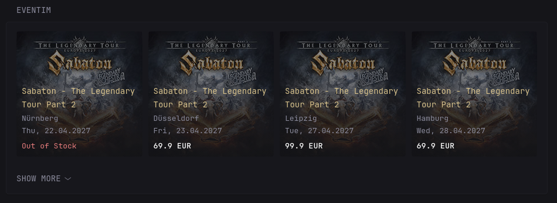

# Eventim
A Glance widget for displaying upcoming events on the European ticket seller's site, Eventim.

Updates will be available in this [repository](https://github.com/cpt-metal/glance-eventim) first.

### Preview



### Customizaton

- `searchTerm`: what you are looking for, e.g. event or band name, type of event like "concert" or "sport event", etc.
- `cities`: where to look for events. Can be contain multiple comma-separated cities

You can leave the fields empty.

### Code

``` yml
- type: custom-api
  title: Eventim
  cache: 24h
  options:
    searchTerm: "Sabaton"
    cities: ""
  template: |
    {{ $url := "https://public-api.eventim.com/websearch/search/api/exploration/v1/products"}}

    {{
      $req := newRequest $url
      | withHeader "User-Agent" "Mozilla/5.0 (Windows NT 10.0; Win64; x64) AppleWebKit/537.36 (KHTML, like Gecko) Chrome/120.0.0.0 Safari/537.36"
      | withHeader "Accept" "application/json"
      | withHeader "Accept-Language" "de-DE,de;q=0.9,en;q=0.8"
      | withHeader "Sec-Fetch-Dest" "empty"
      | withHeader "Sec-Fetch-Mode" "cors"
      | withParameter "webId" "web__eventim-de"
      | withParameter "top" "50"
      | withParameter "page" "1"
      | withParameter "sort" "DateAsc"
      | withParameter "ptype" "tickets"
      | withParameter "retail_partner" "EVE"
    }}

    {{ $searchTerm := .Options.StringOr "searchTerm" "" }}
    {{ $cities := .Options.StringOr "cities" "" }}

    {{ if ne $searchTerm "" }}
      {{ $req = $req | withParameter "search_term" $searchTerm }}
    {{ end }}
    
    {{ if ne $cities "" }}
      {{ $req = $req | withParameter "city_names" $cities }}
    {{ end }}

    {{ $resp := $req | getResponse }}

    {{ if ne $resp.Response.StatusCode 200 }}
        <p class="color-negative">Failed to load Eventim data ({{ $resp.Response.Status }})</p>
    {{ else }}

      <ul class="list collapsible-container" data-collapse-after="4" style="display: grid; grid-template-columns: repeat(auto-fill, minmax(180px, 1fr)); gap: 1rem;">

        {{ $sorted := sortByInt "productId" "asc" ($resp.JSON.Array "products") }}
        {{ $products := unique "{typeAttributes.liveEntertainment.location.name,typeAttributes.liveEntertainment.startDate}" $sorted }}
        
        {{ range $products }}

          {{ $img := .String "imageUrl" }}

          <li>
            <a class="event-card" style="background-image: url('{{ $img }}'); display: block; position: relative; border-radius: var(--border-radius); overflow: hidden; margin-bottom: 1rem; aspect-ratio: 1/1; background-size: cover; background-position: center; text-decoration: none;" href="{{ .String "link" }}" target="_blank" rel="noreferrer noopener">

              <div style="position: absolute; inset: 0; background: linear-gradient(to top, hsl(var(--bgh) var(--bgs) var(--bgl) / 0.85) 30%, hsl(var(--bgh) var(--bgs) var(--bgl) / 0.5) 70%); display: flex; flex-direction: column; justify-content: flex-end; padding: 0.9rem;">

                <p class="size-h4 color-primary-if-not-visited" style="margin: 0 0 0.2rem 0;">{{ .String "name" }}</p>

                <span class="color-secondary" style="margin: 0 0 0.5rem 0; font-size: 1.3rem;">
                  {{ .String "typeAttributes.liveEntertainment.location.city" }}<br>{{ .String "typeAttributes.liveEntertainment.startDate" | parseTime "2006-01-02T15:04:05Z07:00" | formatTime "Mon, 02.01.2006" }}
                </span>

                {{ if (.Exists "price") }}
                    <span style="color: #fff; font-weight: 600; ">{{ .String "price" }} {{ .String "currency" }}</span>
                {{ else }}
                  <span class="color-negative">Out of Stock</span>
                {{ end }}

              </div>
            </a>
          </li>

        {{ end }}
      </ul>    
    {{ end }}
```
