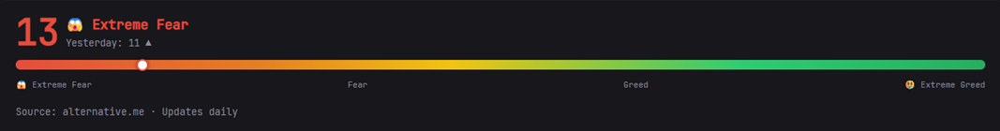

# Crypto Fear & Greed Index

A [Glance](https://github.com/glanceapp/glance) widget that displays the current **Crypto Fear & Greed Index** — a widely followed market sentiment indicator that measures whether crypto investors are driven by fear or greed at any given moment. The widget shows a live score from 0 to 100, a color-coded gradient bar with a moving indicator, a sentiment label, an emoji, and a trend arrow comparing today's value against yesterday's.

No API key, no sign-up, no configuration beyond pasting the YAML.

---

## Preview



---

## What is the Fear & Greed Index?

The Crypto Fear & Greed Index was originally inspired by CNN's Fear & Greed Index for traditional stock markets, adapted for the cryptocurrency ecosystem. It distills complex market signals into a single number between **0** (Extreme Fear) and **100** (Extreme Greed).

The idea is simple: when the market is driven by **fear**, prices tend to be suppressed and may represent buying opportunities. When the market is driven by **greed**, prices may be overextended and due for a correction.


### Index scale

| Range | Classification | Color | Emoji | What it means |
|---|---|---|---|---|
| 0 – 25 | **Extreme Fear** | 🔴 Red | 😱 | Investors are very worried. Historically a potential buying opportunity. |
| 26 – 45 | **Fear** | 🟠 Orange | 😨 | Market sentiment is cautious and uncertain. |
| 46 – 54 | **Neutral** | 🟡 Yellow | 😐 | Market is balanced between buyers and sellers. |
| 55 – 75 | **Greed** | 🟢 Green | 😏 | Investors are increasingly confident, FOMO may be building. |
| 76 – 100 | **Extreme Greed** | 💚 Dark Green | 🤑 | Market may be overheated and due for a correction. |

---

## Features

- 📊 **Live sentiment score** — numeric value from 0 to 100 displayed prominently
- 🎨 **Dynamic color coding** — the score and label change color automatically based on the current classification
- 📍 **Gradient progress bar** — a full spectrum bar (red → orange → yellow → green) with a white indicator dot that moves to the exact position of the current score
- 😱 → 🤑 **Emoji + sentiment label** — human-readable classification shown alongside the score
- **▲ ▼ → Trend arrow** — compares today's score against yesterday's so you can see at a glance whether sentiment is improving or deteriorating
- 🗓 **Yesterday's value** — displayed as secondary text beneath the classification
- 🆓 **Completely free** — uses the public [alternative.me](https://alternative.me/crypto/fear-and-greed-index/) API with no authentication required

---

## API

This widget relies on the **alternative.me Crypto Fear & Greed Index API**, a free and widely used public API that has been running since 2018.

| Property | Value |
|---|---|
| **Endpoint** | `https://api.alternative.me/fng/?limit=2` |
| **Authentication** | None — no API key required |
| **Rate limit** | None enforced for normal usage |
| **Update frequency** | Once per day (scores are published daily) |
| **Response format** | JSON |

The `?limit=2` query parameter tells the API to return the **two most recent daily entries**: today's value (`data.0`) and yesterday's (`data.1`). This is what enables the trend arrow comparison.

### Example API response

```json
{
  "name": "Fear and Greed Index",
  "data": [
    {
      "value": "13",
      "value_classification": "Extreme Fear",
      "timestamp": "1708905600",
      "time_until_update": "74093"
    },
    {
      "value": "18",
      "value_classification": "Extreme Fear",
      "timestamp": "1708819200",
      "time_until_update": null
    }
  ],
  "metadata": {
    "error": null
  }
}
```

### Fields used by this widget

| JSON path | Type | Used for |
|---|---|---|
| `data.0.value` | `Int` | Current day's score (0–100) |
| `data.1.value` | `Int` | Yesterday's score for trend comparison |
| `data.0.value_classification` | `String` | Sentiment label (e.g. `"Extreme Fear"`) |

---

## Installation

### 1. Open your Glance config file

Typically located at `glance.yml` or wherever you have your Glance configuration set up (local install or Docker volume mount).

### 2. Add the widget

Paste the following block into the `widgets` list of any column on any page:

```yaml
- type: custom-api
  title: Crypto Fear & Greed Index
  cache: 1h
  url: https://api.alternative.me/fng/?limit=2
  template: |
    {{ $value := .JSON.Int "data.0.value" }}
    {{ $prev  := .JSON.Int "data.1.value" }}
    {{ $label := .JSON.String "data.0.value_classification" }}

    {{ $color := "#e74c3c" }}
    {{ if ge $value 26 }}{{ $color = "#e67e22" }}{{ end }}
    {{ if ge $value 46 }}{{ $color = "#f1c40f" }}{{ end }}
    {{ if ge $value 55 }}{{ $color = "#2ecc71" }}{{ end }}
    {{ if ge $value 76 }}{{ $color = "#27ae60" }}{{ end }}

    {{ $emoji := "😱" }}
    {{ if ge $value 26 }}{{ $emoji = "😨" }}{{ end }}
    {{ if ge $value 46 }}{{ $emoji = "😏" }}{{ end }}
    {{ if ge $value 76 }}{{ $emoji = "🤑" }}{{ end }}

    {{ $arrow := "→" }}
    {{ if gt $value $prev }}{{ $arrow = "▲" }}{{ end }}
    {{ if lt $value $prev }}{{ $arrow = "▼" }}{{ end }}

    <div style="display: flex; flex-direction: column; gap: 0.75em;">

      <div style="display: flex; align-items: center; gap: 0.5em;">
        <span style="font-size: 3em; font-weight: bold; color: {{ $color }}; line-height: 1;">
          {{ $value }}
        </span>
        <div style="display: flex; flex-direction: column;">
          <span style="font-size: 1.1em; font-weight: bold; color: {{ $color }};">
            {{ $emoji }} {{ $label }}
          </span>
          <span style="font-size: 0.78em; color: var(--color-subdue);">
            Yesterday: {{ $prev }} {{ $arrow }}
          </span>
        </div>
      </div>

      <div style="position: relative; height: 10px; border-radius: 5px;
                  background: linear-gradient(to right, #e74c3c 0%, #e67e22 25%, #f1c40f 45%, #2ecc71 75%, #27ae60 100%);">
        <div style="
          position: absolute;
          left: calc({{ $value }}% - 6px);
          top: 50%;
          transform: translateY(-50%);
          width: 13px; height: 13px;
          background: white;
          border-radius: 50%;
          border: 2px solid {{ $color }};
          box-shadow: 0 0 4px rgba(0,0,0,0.5);
        "></div>
      </div>

      <div style="display: flex; justify-content: space-between; font-size: 0.68em; color: var(--color-subdue);">
        <span>😱 Extreme Fear</span>
        <span>Fear</span>
        <span>Greed</span>
        <span>🤑 Extreme Greed</span>
      </div>

      <div style="font-size: 0.8em; color: var(--color-subdue); border-top: 1px solid var(--color-border); padding-top: 0.4em;">
        Source: alternative.me · Updates daily
      </div>

    </div>
```

### 3. Restart or reload Glance

```bash
# If running locally
./glance

# If running with Docker
docker compose restart glance
```

The widget will appear immediately on your dashboard.

---

## Configuration

This widget has no required configuration — it works out of the box. The only optional field you may want to adjust is `cache`.

### Cache

```yaml
cache: 1h
```

Since the index only updates **once per day**, a cache of `1h` is more than sufficient. Setting it lower (e.g. `5m`) will not give you fresher data and only creates unnecessary HTTP requests to the free API. You could even set it as high as `12h` if you prefer.

---

## How the template works

The widget uses Glance's `custom-api` widget type with a Go template. Here is a breakdown of what each section does:

**Variable extraction**
```
{{ $value := .JSON.Int "data.0.value" }}
{{ $prev  := .JSON.Int "data.1.value" }}
{{ $label := .JSON.String "data.0.value_classification" }}
```
Reads today's score, yesterday's score, and the text classification from the API JSON response. Note that the API returns `value` as a string in the JSON, but Glance's `.JSON.Int` helper automatically coerces it to an integer.

**Dynamic color**
```
{{ $color := "#e74c3c" }}
{{ if ge $value 26 }}{{ $color = "#e67e22" }}{{ end }}
{{ if ge $value 46 }}{{ $color = "#f1c40f" }}{{ end }}
{{ if ge $value 55 }}{{ $color = "#2ecc71" }}{{ end }}
{{ if ge $value 76 }}{{ $color = "#27ae60" }}{{ end }}
```
Uses `ge` (greater than or equal) comparisons to progressively override the color variable as the score crosses each threshold. The comparisons are chained so only the highest matching band wins — a value of `80` will pass all four checks, ending on dark green `#27ae60`.

**Trend arrow**
```
{{ $arrow := "→" }}
{{ if gt $value $prev }}{{ $arrow = "▲" }}{{ end }}
{{ if lt $value $prev }}{{ $arrow = "▼" }}{{ end }}
```
Compares today vs yesterday. Arrow points up if sentiment improved, down if it worsened, and stays sideways if the value is identical.

**Gradient bar indicator**
```css
left: calc({{ $value }}% - 6px);
```
The indicator dot is positioned using the raw score as a CSS percentage. A value of `72` places the dot at `72%` along the bar, which naturally lands in the green "Greed" zone. The `-6px` offset re-centers the 13px dot on that exact position.

---

## Credits
- Index data provided by [alternative.me](https://alternative.me/crypto/fear-and-greed-index/)
- Built for [Glance](https://github.com/glanceapp/glance) using the `custom-api` widget type with Go templates
