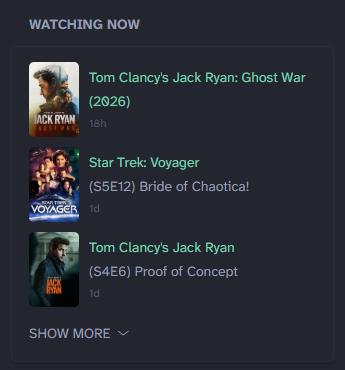

## Preview



This widget uses the [Floppy](https://github.com/dannyvfilms/Floppy) & TMDB APIs. No paid subscriptions are required.

> [!NOTE]
>
> By default, this widget pulls ten DAYS of data (via the `url: ${FLOPPY_URL}/api/v1/history/?limit=10` line). If there are days where only non-TV & non-movie entries are logged in Floppy, it can reduce the number of possible entries that can be displayed.


## Environment variables
- `FLOPPY_API_KEY` - Your Floppy API Key.  It is listed under Settings --> Integrations --> API Token.
- `FLOPPY_URL` - The base URL for your Floppy server, e.g. `https://floppy.example.com` or `http://192.168.1.123:8000` 
- `TMDB_API_KEY` - TMDB API Key (to fetch correct media metadata, as Floppy often provides incorrect data via its API). It is listed as the "API Key" on your TMDB API dashboard

## Options
These entries can be configured near the beginning of the `template` section of the Widget YAML:

| Setting | Description | Default | Type |
|:-------:|:----:|:--------:|:------------:|
| collapseAfter | Number of items to show before SHOW MORE appears | 3 | integer |
| itemsExtracted | Maximum number of items to show after you click SHOW MORE | 10 | integer |
| showEpisodeNumber | Visibility for S##E## description on TV Shows | true | boolean |
| showMovieYear | Show year next to movie title | false | boolean |
| showTVYear | Show starting year next to TV Show title | false | boolean |
| artTypeTV | Art type to show for TV episodes | show | `show`, `season`, `still` |
| mediaTypeFilter | Which type(s) of media to show in list | movies,tv | `tv`, `movies`, `movies,tv` | 
| useFloppyLinks | Set to `true` to link to Floppy, `false` to link to TMDB | false | boolean |

## Changelog
- v1.0 - August 3, 2026
  - Initial release

## Widget YAML
```
- type: custom-api
  title: Watching Now
  cache: 30m
  url: ${FLOPPY_URL}/api/v1/history/?limit=10
  headers:
	X-API-Key: ${FLOPPY_API_KEY}
	Accept: application/json
	User-Agent: GlanceWidget/1.0
  template: |
	{{/* USER VARIABLES BEGIN */}}
		{{ $collapseAfter := 3 }}
		{{ $itemsExtracted := 10 }}
		{{ $showEpisodeNumber := true }}
		{{ $showMovieYear := true }}
		{{ $showTVYear := false }}
		{{ $artTypeTV := "show" }} {{/* OPTIONS: show | season | still */}}
		{{ $mediaTypeFilter := "movies,tv" }} {{/* OPTIONS: movies | tv | movies,tv */}}
		{{ $useFloppyLinks := false }}
	{{/* USER VARIABLES END */}}
	{{ $allowMovies := false }}
	{{ $allowTV := false }}
	{{ if eq $mediaTypeFilter "movies" }}
		{{ $allowMovies = true }}
	{{ else if eq $mediaTypeFilter "tv" }}
		{{ $allowTV = true }}
	{{ else if or (eq $mediaTypeFilter "movies,tv") (eq $mediaTypeFilter "tv,movies") }}
		{{ $allowMovies = true }}
		{{ $allowTV = true }}
	{{ else }}
		{{ $allowMovies = true }}
		{{ $allowTV = true }}
	{{ end }}
	{{ $count := 0 }}
	<ul class="list list-gap-10 collapsible-container" data-collapse-after="{{ $collapseAfter }}">
	{{ range .JSON.Array "results" }}{{ range .Array "entries" }}
	{{ $mediaType := .String "media_type" }}
	{{ if eq $mediaType "movie" }}
		{{ if not $allowMovies }}{{ continue }}{{ end }}
	{{ else if eq $mediaType "episode" }}
		{{ if not $allowTV }}{{ continue }}{{ end }}
	{{ else }}
		{{ continue }}
	{{ end }}
	{{ if ge $count $itemsExtracted }}{{ continue }}{{ end }}
	{{ $count = add $count 1 }}
	{{ $tmdbID := .String "item.media_id" }}
	{{ $tmdbPageUrl := "" }}
	{{ $floppyPageUrl := "" }}
	{{ $year := "" }}
	{{ $posterPath := "" }}
	{{ $showTitle := "" }}
	{{ $episodeTitle := "" }}
	{{ if eq $mediaType "movie" }}
		{{ $floppyPageUrl = printf "%s/details/tmdb/movie/%s/detail" "${FLOPPY_URL}" $tmdbID }}
		{{ $tmdbMovieData := newRequest (printf "https://api.themoviedb.org/3/movie/%s?api_key=%s" $tmdbID "${TMDB_API_KEY}") | withHeader "Accept" "application/json" | getResponse }}
		{{ $tmdbPageUrl = printf "https://www.themoviedb.org/movie/%s" $tmdbID }}
		{{ if $tmdbMovieData }}
			{{ $year = $tmdbMovieData.JSON.String "release_date" }}
			{{ if ne $year "" }}{{ $year = (slice $year 0 4) }}{{ end }}
			{{ $posterPath = $tmdbMovieData.JSON.String "poster_path" }}
			{{ $showTitle = $tmdbMovieData.JSON.String "title" }}
		{{ end }}
	{{ else }}
		{{ $season := .String "item.season_number" }}
		{{ $episode := .String "item.episode_number" }}
		{{ $floppyPageUrl = printf "%s/details/tmdb/tv/%s/detail/season/%s/episode/%s" "${FLOPPY_URL}" $tmdbID $season $episode }}
		{{ $tmdbShowData := newRequest (printf "https://api.themoviedb.org/3/tv/%s?api_key=%s" $tmdbID "${TMDB_API_KEY}") | withHeader "Accept" "application/json" | getResponse }}
		{{ if $tmdbShowData }}
			{{ $showTitle = $tmdbShowData.JSON.String "name" }}
			{{ $year = $tmdbShowData.JSON.String "first_air_date" }}
			{{ if ne $year "" }}{{ $year = (slice $year 0 4) }}{{ end }}
			{{ $posterPath = $tmdbShowData.JSON.String "poster_path" }}
		{{ end }}
		{{ $tmdbEpisodeData := newRequest (printf "https://api.themoviedb.org/3/tv/%s/season/%s/episode/%s?api_key=%s" $tmdbID $season $episode "${TMDB_API_KEY}") | withHeader "Accept" "application/json" | getResponse }}
		{{ if $tmdbEpisodeData }}
			{{ $episodeTitle = $tmdbEpisodeData.JSON.String "name" }}
		{{ end }}
		{{ if eq $artTypeTV "season" }}
			{{ $tmdbSeasonData := newRequest (printf "https://api.themoviedb.org/3/tv/%s/season/%s?api_key=%s" $tmdbID $season "${TMDB_API_KEY}") | withHeader "Accept" "application/json" | getResponse }}
			{{ if $tmdbSeasonData }}
				{{ $seasonPoster := $tmdbSeasonData.JSON.String "poster_path" }}
				{{ if ne $seasonPoster "" }}{{ $posterPath = $seasonPoster }}{{ end }}
			{{ end }}
		{{ end }}
		{{ if eq $artTypeTV "still" }}
			{{ if $tmdbEpisodeData }}
				{{ $still := $tmdbEpisodeData.JSON.String "still_path" }}
				{{ if ne $still "" }}{{ $posterPath = $still }}{{ end }}
			{{ end }}
		{{ end }}
		{{ $tmdbPageUrl = printf "https://www.themoviedb.org/tv/%s/season/%s/episode/%s" $tmdbID $season $episode }}
	{{ end }}
	{{ $posterUrl := "" }}
	{{ if ne $posterPath "" }}{{ $posterUrl = printf "https://image.tmdb.org/t/p/w185%s" $posterPath }}{{ end }}
	{{ $finalUrl := "" }}
	{{ if $useFloppyLinks }}{{ $finalUrl = $floppyPageUrl }}{{ else }}{{ $finalUrl = $tmdbPageUrl }}{{ end }}
	<li class="flex items-center gap-10"><a href={{ $finalUrl }} target="_blank"></a><div class="flex-1"><a href={{ $finalUrl }} target="_blank"><p class="color-positive size-h5">{{ $showTitle }}{{ if eq $mediaType "movie" }}{{ if $showMovieYear }}{{ if ne $year "" }} ({{ $year }}) {{ end }}{{ end }}{{ else }}{{ if $showTVYear }}{{ if ne $year "" }} ({{ $year }}) {{ end }}{{ end }}{{ end }}</p></a><a href={{ $finalUrl }} target="_blank">{{ if eq $mediaType "episode" }}<p class="size-h5">{{ if $showEpisodeNumber }}(S{{ .String "item.season_number" }}E{{ .String "item.episode_number" }}){{ end }} {{ $episodeTitle }}</p>{{ end }}</a><p class="size-h6"><span class="color-subdue" {{ .String "played_at_local" | parseRelativeTime "2006-01-02T15:04:05-07:00" }}></span></p></div></li>
	{{ end }}{{ end }}
	</ul>
```
