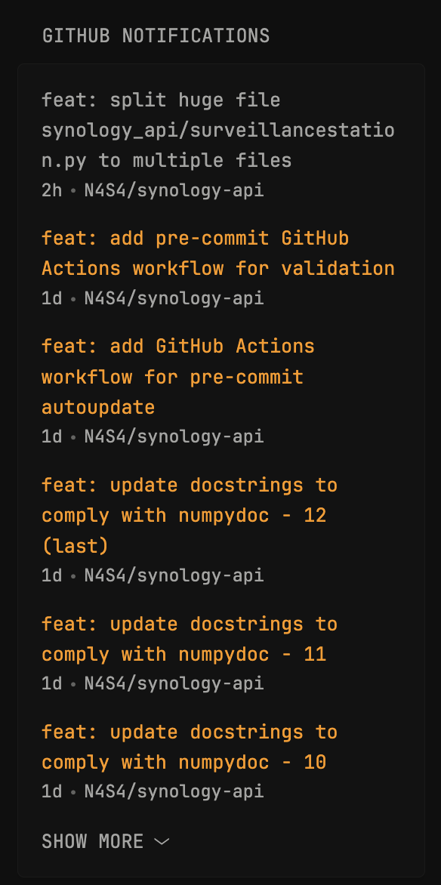

```yaml
- type: custom-api
  title: GitHub Notifications
  url: https://api.github.com/notifications?all=true&per_page=20
  headers:
    Authorization: Bearer ${GITHUB_TOKEN}
    Accept: application/vnd.github+json
  template: |
    <ul class="list list-gap-14 collapsible-container" data-collapse-after="6">
    {{ range .JSON.Array "" }}
      {{ if (.String "subject.url") }}
        {{
          $notification := newRequest (.String "subject.url")
            | withHeader "Authorization" "Bearer ${GITHUB_TOKEN}"
            | getResponse
        }}
      <li>
        <a href="{{ $notification.JSON.String "html_url" }}" class="size-title-dynamic color-primary-if-not-visited" target="_blank" rel="noreferrer">{{ .String "subject.title" }}</a>
        <ul class="list-horizontal-text flex-nowrap">
          <li class="min-width-0" {{ .String "updated_at" | parseTime "rfc3339" | toRelativeTime }}></li>
          <li class="min-width-0"><a target="_blank" href="https://github.com/{{ .String "repository.full_name" }}">{{ .String "repository.full_name" }}</a></li>
        </ul>
      </li>
      {{ end }}
    {{ end }}
    </ul>
```

## Environment variables

- `GITHUB_TOKEN`: Your GitHub Personal Access Token, you can create a token from Github settings. Navigate to *GitHub Settings > Developer settings > Personal access tokens > Tokens (classic)*, and create a new token with *notifications* scope selected.

## Notes

Every request can take a few seconds to complete, so it's recommended to set a cache duration of at least 30 minutes.