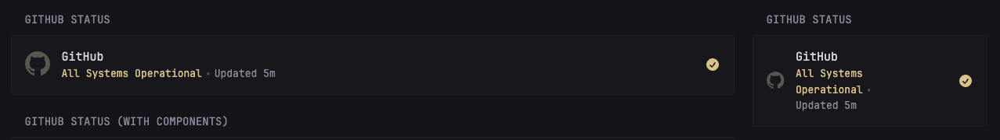

# GitHub Status

Display the current operational status of GitHub services with a visual indicator and detailed component status.

## Basic Status



```yaml
- type: custom-api
  title: GitHub Status
  cache: 5m
  url: https://www.githubstatus.com/api/v2/summary.json
  template: |
    <div class="flex items-center gap-15">
      <svg class="monitor-site-icon flat-icon" alt="GitHub Logo" role="img" viewBox="0 0 24 24" xmlns="http://www.w3.org/2000/svg"><path fill="currentColor" d="M12 0c-6.626 0-12 5.373-12 12 0 5.302 3.438 9.8 8.207 11.387.599.111.793-.261.793-.577v-2.234c-3.338.726-4.033-1.416-4.033-1.416-.546-1.387-1.333-1.756-1.333-1.756-1.089-.745.083-.729.083-.729 1.205.084 1.839 1.237 1.839 1.237 1.07 1.834 2.807 1.304 3.492.997.107-.775.418-1.305.762-1.604-2.665-.305-5.467-1.334-5.467-5.931 0-1.311.469-2.381 1.236-3.221-.124-.303-.535-1.524.117-3.176 0 0 1.008-.322 3.301 1.23.957-.266 1.983-.399 3.003-.404 1.02.005 2.047.138 3.006.404 2.291-1.552 3.297-1.23 3.297-1.23.653 1.653.242 2.874.118 3.176.77.84 1.235 1.911 1.235 3.221 0 4.609-2.807 5.624-5.479 5.921.43.372.823 1.102.823 2.222v 3.293c0 .319.192.694.801.576 4.765-1.589 8.199-6.086 8.199-11.386 0-6.627-5.373-12-12-12z"/></svg>
      <div class="grow min-width-0">
        <a class="size-h3 color-highlight text-truncate block" href="https://www.githubstatus.com/" target="_blank" rel="noreferrer" title="GitHub Status">GitHub</a>
        <ul class="list-horizontal-text">
          {{ $indicator := .JSON.String "status.indicator" }}
          {{ if eq $indicator "none" }}
            <li class="color-positive">All Systems Operational</li>
          {{ else if eq $indicator "minor" }}
            <li class="color-highlight">Minor Issues</li>
          {{ else if eq $indicator "major" }}
            <li class="color-negative">Major Outage</li>
          {{ else if eq $indicator "critical" }}
            <li class="color-negative">Critical Issues</li>
          {{ else }}
            <li>{{ .JSON.String "status.description" }}</li>
          {{ end }}
          <li>
            Updated <span {{ .JSON.String "page.updated_at" | parseTime "rfc3339" | toRelativeTime }}></span>
          </li>
        </ul>
      </div>

      <div class="monitor-site-status-icon">
        {{ $indicator := .JSON.String "status.indicator" }}
        {{ if eq $indicator "none" }}
          <svg fill="var(--color-positive)" xmlns="http://www.w3.org/2000/svg" viewBox="0 0 20 20">
            <path fill-rule="evenodd" d="M10 18a8 8 0 1 0 0-16 8 8 0 0 0 0 16Zm3.857-9.809a.75.75 0 0 0-1.214-.882l-3.483 4.79-1.88-1.88a.75.75 0 1 0-1.06 1.061l2.5 2.5a.75.75 0 0 0 1.137-.089l4-5.5Z" clip-rule="evenodd" />
          </svg>
        {{ else }}
          <svg fill="var(--color-negative)" xmlns="http://www.w3.org/2000/svg" viewBox="0 0 20 20">
            <path fill-rule="evenodd" d="M8.485 2.495c.673-1.167 2.357-1.167 3.03 0l6.28 10.875c.673 1.167-.17 2.625-1.516 2.625H3.72c-1.347 0-2.189-1.458-1.515-2.625L8.485 2.495ZM10 5a.75.75 0 0 1 .75.75v3.5a.75.75 0 0 1-1.5 0v-3.5A.75.75 0 0 1 10 5Zm0 9a1 1 0 1 0 0-2 1 1 0 0 0 0 2Z" clip-rule="evenodd"></path>
          </svg>
        {{ end }}
      </div>
    </div>
```

## Advanced Status with Components

 

To display individual component statuses alongside the overall status:

```yaml
- type: custom-api
  title: GitHub Status (With Components)
  cache: 5m
  url: https://www.githubstatus.com/api/v2/summary.json
  template: |
    <div>
      <!-- Overall Status -->
      <div class="flex items-center gap-15 margin-bottom-20">
        <svg class="monitor-site-icon flat-icon" alt="GitHub Logo" role="img" viewBox="0 0 24 24" xmlns="http://www.w3.org/2000/svg"><path fill="currentColor" d="M12 0c-6.626 0-12 5.373-12 12 0 5.302 3.438 9.8 8.207 11.387.599.111.793-.261.793-.577v-2.234c-3.338.726-4.033-1.416-4.033-1.416-.546-1.387-1.333-1.756-1.333-1.756-1.089-.745.083-.729.083-.729 1.205.084 1.839 1.237 1.839 1.237 1.07 1.834 2.807 1.304 3.492.997.107-.775.418-1.305.762-1.604-2.665-.305-5.467-1.334-5.467-5.931 0-1.311.469-2.381 1.236-3.221-.124-.303-.535-1.524.117-3.176 0 0 1.008-.322 3.301 1.23.957-.266 1.983-.399 3.003-.404 1.02.005 2.047.138 3.006.404 2.291-1.552 3.297-1.23 3.297-1.23.653 1.653.242 2.874.118 3.176.77.84 1.235 1.911 1.235 3.221 0 4.609-2.807 5.624-5.479 5.921.43.372.823 1.102.823 2.222v 3.293c0 .319.192.694.801.576 4.765-1.589 8.199-6.086 8.199-11.386 0-6.627-5.373-12-12-12z"/></svg>
        <div class="grow min-width-0">
          <a class="size-h3 color-highlight text-truncate block" href="https://www.githubstatus.com/" target="_blank" rel="noreferrer" title="GitHub Status">GitHub</a>
          <ul class="list-horizontal-text">
            {{ $indicator := .JSON.String "status.indicator" }}
            {{ if eq $indicator "none" }}
              <li class="color-positive">All Systems Operational</li>
            {{ else if eq $indicator "minor" }}
              <li class="color-highlight">Minor Issues</li>
            {{ else if eq $indicator "major" }}
              <li class="color-negative">Major Outage</li>
            {{ else if eq $indicator "critical" }}
              <li class="color-negative">Critical Issues</li>
            {{ else }}
              <li>{{ .JSON.String "status.description" }}</li>
            {{ end }}
          </ul>
        </div>
      </div>

      <!-- Component Statuses -->
      <ul class="list list-gap-8">
        {{ range .JSON.Array "components" }}
          {{ if ne (.String "description") "" }}
            <li class="flex items-center gap-10" style="margin: 0.5rem 0;">
              <div style="width: 0.5rem; height: 0.5rem; border-radius: 50%; margin-right: 0.5rem; {{ if eq (.String "status") "operational" }}background-color: var(--color-positive){{ else if eq (.String "status") "degraded_performance" }}background-color: var(--color-highlight){{ else if eq (.String "status") "partial_outage" }}background-color: var(--color-negative){{ else if eq (.String "status") "major_outage" }}background-color: var(--color-negative); opacity: 0.7;{{ end }}"></div>
              <span class="size-h6">{{ .String "name" }}</span>
              <span class="size-text-13 color-subdue" style="margin-left: auto;">
                {{ if eq (.String "status") "operational" }}
                  OK
                {{ else if eq (.String "status") "degraded_performance" }}
                  Degraded
                {{ else if eq (.String "status") "partial_outage" }}
                  Partial Outage
                {{ else if eq (.String "status") "major_outage" }}
                  Major Outage
                {{ end }}
              </span>
            </li>
          {{ end }}
        {{ end }}
      </ul>
    </div>
```

## Configuration Details

### Basic Properties

- **URL**: `https://www.githubstatus.com/api/v2/summary.json` - The GitHub Status API endpoint
- **Cache**: Recommended `5m` to `10m` - GitHub status updates typically happen every few minutes
- **Title**: Can be customized to your preference (e.g., "GitHub Status", "GitHub Services")

### Status Indicator Values

The GitHub Status API returns the following indicator values:
- `none` - All systems operational (displayed as green/positive)
- `minor` - Minor issues affecting some users (displayed as yellow/highlight)
- `major` - Major service outage (displayed as red/negative)
- `critical` - Critical system issues (displayed as red/negative)

### API Endpoints

The GitHub Status API provides several endpoints you can use:

- `/api/v2/summary.json` - Overall status and components (recommended)
- `/api/v2/status.json` - Simple status rollup
- `/api/v2/components.json` - Component details only
- `/api/v2/incidents/unresolved.json` - Current incidents
- `/api/v2/incidents.json` - Recent incidents (50 most recent)

Refer to [GitHub Status API Documentation](https://www.githubstatus.com/api) for more details.

## Notes

- No authentication is required for the GitHub Status API
- The API is public and rate-limited generously
- Cache duration of 5-10 minutes is recommended to avoid excessive API calls
- The widget automatically formats the update time using relative time (e.g., "Updated 2 minutes ago")

## Styling

The widget uses Glance's standard utility classes for styling:
- `color-positive` - Green (operational)
- `color-highlight` - Yellow (minor issues)
- `color-negative` - Red (major issues/outage)
- `color-subdue` - Muted gray text

## Examples

**Example 1: Simple Status Display**
```yaml
- type: custom-api
  title: GitHub Status
  cache: 5m
  url: https://www.githubstatus.com/api/v2/summary.json
  [template omitted for brevity]
```

**Example 2: Only Show If Issues Present**
If you want a widget that only displays when there are issues:
```yaml
- type: custom-api
  title: GitHub Issues
  cache: 5m
  url: https://www.githubstatus.com/api/v2/incidents/unresolved.json
  # Would require additional template logic to display incidents
```

Made by: [m1xzg](https://github.com/m1xzg)
