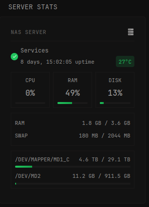

# What is Glances?

[Glances]((https://github.com/nicolargo/glances)) is a cross-platform system monitoring tool written in Python. It
provides a comprehensive overview of your system through a web interface and REST API, monitoring:
CPU, Memory, Swap, and Disk usage
Network interfaces and speeds
Sensors (temperature, fan speeds)
Processes and system load
And much more...



```yaml
- type: custom-api
  cache: 30s
  title: SERVER STATS
  options:
    glances-url: "http://${GLANCES_URL}:61208"
    server-name: "Server Name Here"
    show-temperature: "true"
    show-disk-bar: "true"
    show-network: "false"
    network-interface: "eth0"
  template: |
    {{ $glancesUrl := .Options.StringOr "glances-url" "http://127.0.0.1:61208" }}
    {{ $baseUrl := concat $glancesUrl "/api/4" }}
    {{ $serverName := .Options.StringOr "server-name" "Server" }}
    {{ $showTemp := eq (.Options.StringOr "show-temperature" "true") "true" }}
    {{ $showDiskBar := eq (.Options.StringOr "show-disk-bar" "true") "true" }}
    {{ $showNetwork := eq (.Options.StringOr "show-network" "false") "true" }}
    {{ $ifName := .Options.StringOr "network-interface" "eth0" }}

    {{ $cpu := newRequest (concat $baseUrl "/cpu") | getResponse }}
    {{ $mem := newRequest (concat $baseUrl "/mem") | getResponse }}
    {{ $fs := newRequest (concat $baseUrl "/fs") | getResponse }}
    {{ $uptime := newRequest (concat $baseUrl "/uptime") | getResponse }}
    {{ $swap := newRequest (concat $baseUrl "/memswap") | getResponse }}
    {{ $net := newRequest (concat $baseUrl "/network") | getResponse }}
    {{ $sensors := newRequest (concat $baseUrl "/sensors") | getResponse }}

    {{ $isOnline := and (eq $cpu.Response.StatusCode 200) (eq $mem.Response.StatusCode 200) }}

    {{ if $isOnline }}
      {{ $cpuPercent := $cpu.JSON.Float "total" | toInt }}
      {{ $memPercent := $mem.JSON.Float "percent" | toInt }}
      {{ $memUsedGB := div ($mem.JSON.Float "used") 1073741824 }}
      {{ $memTotalGB := div ($mem.JSON.Float "total") 1073741824 }}

      {{ $swapUsedMB := 0 }}
      {{ $swapTotalMB := 0 }}
      {{ if eq $swap.Response.StatusCode 200 }}
        {{ $swapUsedMB = div ($swap.JSON.Float "used") 1048576 | toInt }}
        {{ $swapTotalMB = div ($swap.JSON.Float "total") 1048576 | toInt }}
      {{ end }}

      {{ $uptimeStr := "" }}
      {{ if eq $uptime.Response.StatusCode 200 }}
        {{ $uptimeStr = $uptime.JSON.String "" }}
      {{ end }}

      {{ $temperature := 0 }}
      {{ if and $showTemp (eq $sensors.Response.StatusCode 200) }}
        {{ range $sensors.JSON.Array "" }}
          {{ $type := .String "type" }}
          {{ $unit := .String "unit" }}
          {{ $valueInt := .Float "value" | toInt }}
          {{ if and (eq $type "temperature_core") (eq $unit "C") (gt $valueInt 0) }}
            {{ if gt $valueInt 200 }}
              {{ $temperature = div $valueInt 1000 }}
            {{ else }}
              {{ $temperature = $valueInt }}
            {{ end }}
          {{ end }}
        {{ end }}
      {{ end }}

      {{ $netDownMBs := 0.0 }}
      {{ $netUpMBs := 0.0 }}
      {{ if and $showNetwork (eq $net.Response.StatusCode 200) }}
        {{ range $net.JSON.Array "" }}
          {{ if eq (.String "interface_name") $ifName }}
            {{ $netDownMBs = div (.Float "bytes_recv_rate_per_sec") 1048576 }}
            {{ $netUpMBs = div (.Float "bytes_sent_rate_per_sec") 1048576 }}
          {{ end }}
        {{ end }}
      {{ end }}

      <style>
        .server-container { padding: 0.5rem; }
        .server-header {
          display: flex;
          justify-content: space-between;
          align-items: center;
          margin-bottom: 1rem;
          padding-bottom: 0.75rem;
          border-bottom: 1px solid var(--color-separator);
        }
        .server-name-link {
          color: var(--color-text-subdue);
          text-decoration: none;
          transition: color 0.2s;
        }
        .server-name-link:hover { color: var(--color-primary); }
        .services-section {
          margin-bottom: 1rem;
          display: flex;
          align-items: center;
          gap: 0.5rem;
        }
        .status-indicator {
          display: flex;
          align-items: center;
          justify-content: center;
          width: 1.5rem;
          height: 1.5rem;
          border-radius: 50%;
          background: #22c55e;
          flex-shrink: 0;
        }
        .status-indicator.offline { background: #ef4444; }
        .status-icon { width: 1rem; height: 1rem; color: white; }
        .services-info { flex: 1; }
        .uptime-temp-row {
          display: flex;
          align-items: center;
          gap: 0.5rem;
          justify-content: space-between;
        }
        .temp-display {
          padding: 0.25rem 0.6rem;
          border-radius: 4px;
          white-space: nowrap;
        }
        .temp-low { background: rgba(34, 197, 94, 0.15); color: #22c55e; }
        .temp-medium { background: rgba(234, 179, 8, 0.15); color: #eab308; }
        .temp-high { background: rgba(239, 68, 68, 0.15); color: #ef4444; }
        .metrics-grid {
          display: grid;
          grid-template-columns: repeat(3, 1fr);
          gap: 0.75rem;
          margin-bottom: 1rem;
        }
        .metric-card {
          background: var(--color-widget-background);
          border: 1px solid var(--color-separator);
          border-radius: var(--border-radius-primary);
          padding: 0.75rem;
          text-align: center;
        }
        .metric-bar {
          width: 100%;
          height: 4px;
          background: var(--color-separator);
          border-radius: 2px;
          overflow: hidden;
          margin-top: 0.5rem;
          position: relative;
        }
        .metric-bar-fill {
          height: 100%;
          position: absolute;
          left: 0;
          top: 0;
          transition: width 0.3s ease;
        }
        .bar-low { background: linear-gradient(90deg, #22c55e 0%, #16a34a 100%); }
        .bar-medium { background: linear-gradient(90deg, #eab308 0%, #ca8a04 100%); }
        .bar-high { background: linear-gradient(90deg, #ef4444 0%, #dc2626 100%); }
        .memory-section {
          background: var(--color-widget-background);
          border: 1px solid var(--color-separator);
          border-radius: var(--border-radius-primary);
          padding: 0.75rem;
          margin-bottom: 1rem;
        }
        .memory-row {
          display: flex;
          justify-content: space-between;
          align-items: center;
          padding: 0.4rem 0;
        }
        .disks-section {
          background: var(--color-widget-background);
          border: 1px solid var(--color-separator);
          border-radius: var(--border-radius-primary);
          padding: 0.75rem;
          margin-bottom: 1rem;
        }
        .disk-item { margin-bottom: 0.75rem; }
        .disk-item:last-child { margin-bottom: 0; }
        .disk-header {
          display: flex;
          justify-content: space-between;
          align-items: center;
          margin-bottom: 0.35rem;
        }
        .network-section {
          display: grid;
          grid-template-columns: 1fr 1fr;
          gap: 0.75rem;
        }
        .network-card {
          background: var(--color-widget-background);
          border: 1px solid var(--color-separator);
          border-radius: var(--border-radius-primary);
          padding: 0.75rem;
          text-align: center;
        }
        .icon-server { width: 1.5rem; height: 1.5rem; }
      </style>

      <div class="server-container">
        <div class="server-header">
          {{ if ne $glancesUrl "" }}
          <a href="{{ $glancesUrl }}" target="_blank" class="server-name-link">
            <span class="size-h6 color-text-subdue" style="font-weight: 600; text-transform: uppercase; letter-spacing: 0.5px;">{{ $serverName }}</span>
          </a>
          {{ else }}
          <span class="size-h6 color-text-subdue" style="font-weight: 600; text-transform: uppercase; letter-spacing: 0.5px;">{{ $serverName }}</span>
          {{ end }}
          <svg class="icon-server" viewBox="0 0 24 24" fill="currentColor">
            <path d="M4,1H20A1,1 0 0,1 21,2V6A1,1 0 0,1 20,7H4A1,1 0 0,1 3,6V2A1,1 0 0,1 4,1M4,9H20A1,1 0 0,1 21,10V14A1,1 0 0,1 20,15H4A1,1 0 0,1 3,14V10A1,1 0 0,1 4,9M4,17H20A1,1 0 0,1 21,18V22A1,1 0 0,1 20,23H4A1,1 0 0,1 3,22V18A1,1 0 0,1 4,17M5,4V5H7V4H5M5,12V13H7V12H5M5,20V21H7V20H5M9,4V5H11V4H9M9,12V13H11V12H9M9,20V21H11V20H9Z"/>
          </svg>
        </div>

        <div class="services-section">
          <div class="status-indicator">
            <svg class="status-icon" viewBox="0 0 24 24" fill="currentColor">
              <path d="M21,7L9,19L3.5,13.5L4.91,12.09L9,16.17L19.59,5.59L21,7Z"/>
            </svg>
          </div>
          <div class="services-info">
            <div class="size-h5" style="margin-bottom: 0.15rem;">Services</div>
            <div class="uptime-temp-row">
              {{ if ne $uptimeStr "" }}
              <span class="size-h6 color-text-subdue">{{ $uptimeStr }} uptime</span>
              {{ end }}
              {{ if and $showTemp (gt $temperature 0) }}
              <span class="size-h6 temp-display {{ if lt $temperature 65 }}temp-low{{ else if lt $temperature 80 }}temp-medium{{ else }}temp-high{{ end }}">{{ $temperature }}°C</span>
              {{ end }}
            </div>
          </div>
        </div>

        <div class="metrics-grid">
          <div class="metric-card">
            <div class="size-h6 color-text-subdue" style="text-transform: uppercase; margin-bottom: 0.5rem;">CPU</div>
            <div class="size-h2" style="font-weight: 700; margin-bottom: 0.25rem;">{{ $cpuPercent }}%</div>
            <div class="metric-bar">
              <div class="metric-bar-fill {{ if lt $cpuPercent 60 }}bar-low{{ else if lt $cpuPercent 80 }}bar-medium{{ else }}bar-high{{ end }}" style="width: {{ $cpuPercent }}%"></div>
            </div>
          </div>

          <div class="metric-card">
            <div class="size-h6 color-text-subdue" style="text-transform: uppercase; margin-bottom: 0.5rem;">RAM</div>
            <div class="size-h2" style="font-weight: 700; margin-bottom: 0.25rem;">{{ $memPercent }}%</div>
            <div class="metric-bar">
              <div class="metric-bar-fill {{ if lt $memPercent 60 }}bar-low{{ else if lt $memPercent 80 }}bar-medium{{ else }}bar-high{{ end }}" style="width: {{ $memPercent }}%"></div>
            </div>
          </div>

          <div class="metric-card">
            <div class="size-h6 color-text-subdue" style="text-transform: uppercase; margin-bottom: 0.5rem;">DISK</div>
            <div class="size-h2" style="font-weight: 700; margin-bottom: 0.25rem;">
              {{ $totalDiskPercent := 0 }}
              {{ $diskCount := 0 }}
              {{ range $fs.JSON.Array "" }}
                {{ $totalDiskPercent = add $totalDiskPercent (.Float "percent" | toInt) }}
                {{ $diskCount = add $diskCount 1 }}
              {{ end }}
              {{ if gt $diskCount 0 }}{{ div $totalDiskPercent $diskCount }}%{{ else }}0%{{ end }}
            </div>
            {{ if $showDiskBar }}
            <div class="metric-bar">
              {{ $avgPercent := 0 }}
              {{ $diskCount := 0 }}
              {{ range $fs.JSON.Array "" }}
                {{ $avgPercent = add $avgPercent (.Float "percent" | toInt) }}
                {{ $diskCount = add $diskCount 1 }}
              {{ end }}
              {{ if gt $diskCount 0 }}{{ $avgPercent = div $avgPercent $diskCount }}{{ end }}
              <div class="metric-bar-fill {{ if lt $avgPercent 60 }}bar-low{{ else if lt $avgPercent 80 }}bar-medium{{ else }}bar-high{{ end }}" style="width: {{ $avgPercent }}%"></div>
            </div>
            {{ end }}
          </div>
        </div>

        <div class="memory-section">
          <div class="memory-row">
            <span class="size-h6 color-text-subdue" style="text-transform: uppercase;">RAM</span>
            <span class="size-h6" style="font-weight: 500;">{{ $memUsedGB | printf "%.1f" }} GB / {{ $memTotalGB | printf "%.1f" }} GB</span>
          </div>
          {{ if gt $swapTotalMB 0 }}
          <div class="memory-row">
            <span class="size-h6 color-text-subdue" style="text-transform: uppercase;">SWAP</span>
            <span class="size-h6" style="font-weight: 500;">{{ $swapUsedMB }} MB / {{ $swapTotalMB }} MB</span>
          </div>
          {{ end }}
        </div>

        {{ if eq $fs.Response.StatusCode 200 }}
        <div class="disks-section">
          {{ $device1 := "" }}
          {{ $device2 := "" }}
          {{ $device3 := "" }}
          {{ $device4 := "" }}
          {{ $device5 := "" }}
          {{ range $fs.JSON.Array "" }}
            {{ $deviceName := .String "device_name" }}
            {{ $isNewDevice := true }}
            {{ if or (eq $deviceName $device1) (eq $deviceName $device2) (eq $deviceName $device3) (eq $deviceName $device4) (eq $deviceName $device5) }}
              {{ $isNewDevice = false }}
            {{ end }}
            {{ if and $isNewDevice (ne $deviceName "") }}
              {{ if eq $device1 "" }}
                {{ $device1 = $deviceName }}
              {{ else if eq $device2 "" }}
                {{ $device2 = $deviceName }}
              {{ else if eq $device3 "" }}
                {{ $device3 = $deviceName }}
              {{ else if eq $device4 "" }}
                {{ $device4 = $deviceName }}
              {{ else if eq $device5 "" }}
                {{ $device5 = $deviceName }}
              {{ end }}
              {{ $diskPercent := .Float "percent" | toInt }}
              {{ $diskUsedGB := div (.Float "used") 1073741824 }}
              {{ $diskTotalGB := div (.Float "size") 1073741824 }}
              {{ $diskTotalGBInt := $diskTotalGB | toInt }}
              <div class="disk-item">
                <div class="disk-header">
                  <span class="size-h6 color-text-subdue" style="text-transform: uppercase;">{{ $deviceName }}</span>
                  {{ if gt $diskTotalGBInt 1000 }}
                  <span class="size-h6" style="font-weight: 500;">{{ div $diskUsedGB 1024 | printf "%.1f" }} TB / {{ div $diskTotalGB 1024 | printf "%.1f" }} TB</span>
                  {{ else }}
                  <span class="size-h6" style="font-weight: 500;">{{ $diskUsedGB | printf "%.1f" }} GB / {{ $diskTotalGB | printf "%.1f" }} GB</span>
                  {{ end }}
                </div>
                {{ if $showDiskBar }}
                <div class="metric-bar">
                  <div class="metric-bar-fill {{ if lt $diskPercent 60 }}bar-low{{ else if lt $diskPercent 80 }}bar-medium{{ else }}bar-high{{ end }}" style="width: {{ $diskPercent }}%"></div>
                </div>
                {{ end }}
              </div>
            {{ end }}
          {{ end }}
        </div>
        {{ end }}

        {{ if $showNetwork }}
        <div class="network-section">
          <div class="network-card">
            <div class="size-h6 color-text-subdue" style="text-transform: uppercase; margin-bottom: 0.5rem;">↓ Download</div>
            <div class="size-h4 color-highlight" style="font-weight: 700;">{{ $netDownMBs | printf "%.2f" }} MB/s</div>
          </div>
          <div class="network-card">
            <div class="size-h6 color-text-subdue" style="text-transform: uppercase; margin-bottom: 0.5rem;">↑ Upload</div>
            <div class="size-h4 color-highlight" style="font-weight: 700;">{{ $netUpMBs | printf "%.2f" }} MB/s</div>
          </div>
        </div>
        {{ end }}
      </div>
    {{ else }}
      <div class="server-container">
        <div class="server-header">
          <span class="size-h6 color-text-subdue" style="font-weight: 600; text-transform: uppercase; letter-spacing: 0.5px;">{{ $serverName }}</span>
          <svg class="icon-server" viewBox="0 0 24 24" fill="currentColor">
            <path d="M4,1H20A1,1 0 0,1 21,2V6A1,1 0 0,1 20,7H4A1,1 0 0,1 3,6V2A1,1 0 0,1 4,1M4,9H20A1,1 0 0,1 21,10V14A1,1 0 0,1 20,15H4A1,1 0 0,1 3,14V10A1,1 0 0,1 4,9M4,17H20A1,1 0 0,1 21,18V22A1,1 0 0,1 20,23H4A1,1 0 0,1 3,22V18A1,1 0 0,1 4,17M5,4V5H7V4H5M5,12V13H7V12H5M5,20V21H7V20H5M9,4V5H11V4H9M9,12V13H11V12H9M9,20V21H11V20H9Z"/>
          </svg>
        </div>
        <div class="services-section">
          <div class="status-indicator offline">
            <svg class="status-icon" viewBox="0 0 24 24" fill="currentColor">
              <path d="M19,6.41L17.59,5L12,10.59L6.41,5L5,6.41L10.59,12L5,17.59L6.41,19L12,13.41L17.59,19L19,17.59L13.41,12L19,6.41Z"/>
            </svg>
          </div>
          <div class="services-info">
            <div class="size-h5" style="margin-bottom: 0.15rem;">Services</div>
            <div class="size-h6 color-negative">Offline</div>
          </div>
        </div>
        <p class="color-negative" style="text-align: center; margin-top: 1rem;">Failed to fetch server data</p>
      </div>
    {{ end }}

```

## Environment variables

- `GLANCES_URL` - the URL of the Glances instance

### Set up options

`server-name` - Display name for the server

`show-temperature` - Show CPU temperature (if available)

`show-disk-bar` - Show progress bars for disk usage

`show-network` - Show network download/upload speeds

`network-interface` - Network interface to monitor (when enabled)

## 🍻 Cheers

* [andersonviudes](https://github.com/andersonviudes)
