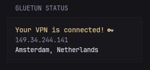
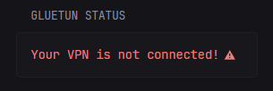

## Version 1
#### Normal

#### Not connected


```yaml
- type: custom-api
  title: Gluetun status
  cache: 1m
  url: http://${GLUETUN_URL}/v1/publicip/ip
  headers:
    X-API-Key: ${GLUETUN_API_KEY}
  template: |
    {{ if eq .Response.StatusCode 200 }}
      {{ $ip := (.JSON.String "public_ip") }}
      {{ $city := (.JSON.String "city") }}
      {{ $country := (.JSON.String "country") }}
      {{ if eq $ip "" }}
        {{ $ip = "-" }}
        {{ $city = "-" }}
        {{ $country = "-" }}
      {{ end }}
      <div class="flex justify-between text-center">
        <div>
            <div class="color-highlight size-h4">{{ $ip }}</div>
            <div class="size-h6">PUBLIC IP</div>
        </div>
        <div>
            <div class="color-highlight size-h4">{{ $country }}</div>
            <div class="size-h6">COUNTRY</div>
        </div>
        <div>
            <div class="color-highlight size-h4">{{ $city }}</div>
            <div class="size-h6">CITY</div>
        </div>
      </div>
    {{ else }}
      <div style="text-align: center; color: var(--color-negative);">
        Error: {{ .Response.StatusCode }} - {{ .Response.Status }}
      </div>
    {{ end }}
```
## Version 2
#### Normal

#### Not connected

```yaml
- type: custom-api
  title: Gluetun status
  cache: 1m
  url: http://${GLUETUN_URL}/v1/publicip/ip
  headers:
    X-API-Key: ${GLUETUN_API_KEY}
  template: |
    {{ if eq .Response.StatusCode 200 }}
      {{ $ip := (.JSON.String "public_ip") }}
      {{ $city := (.JSON.String "city") }}
      {{ $country := (.JSON.String "country") }}
      {{ if eq $ip "" }}
        <div>
          <div>
            <div>
              <div class="color-negative size-h3" style="display: inline-flex; align-items: center; white-space: nowrap;">
                <span>Your VPN is not connected!</span>
                <svg xmlns="http://www.w3.org/2000/svg" viewBox="0 0 24 24"
                    style="width: 1em; height: 1em; margin-left: 0.4em; fill: currentColor;">
                  <title>alert</title>
                  <path d="M13 14H11V9H13M13 18H11V16H13M1 21H23L12 2L1 21Z" />
                </svg>
              </div>
            </div>
          </div>
        </div>
      {{ else }}
        <div>
          <div>
            <div>
              <div class="color-positive size-h3" style="display: inline-flex; align-items: center; white-space: nowrap;">
                <span>Your VPN is connected!</span>
                <svg xmlns="http://www.w3.org/2000/svg" viewBox="0 0 24 24"
                    style="width: 1em; height: 1em; margin-left: 0.4em; fill: currentColor;">
                  <title>key</title>
                  <path d="M7 14C5.9 14 5 13.1 5 12S5.9 10 7 10 9 10.9 9 12 8.1 14 7 14M12.6 10C11.8 7.7 9.6 6 7 6C3.7 6 1 8.7 1 12S3.7 18 7 18C9.6 18 11.8 16.3 12.6 14H16V18H20V14H23V10H12.6Z"/>
                </svg>
              </div>
            </div>
            <div class="size-h4">{{ $ip }}</div>
            <div class="color-highlight size-h4">{{ $city }}, {{ $country }}</div>
          </div>
        </div>
      {{ end }}
    {{ else }}
      <div style="text-align: center; color: var(--color-negative);">
        Error: {{ .Response.StatusCode }} - {{ .Response.Status }}
      </div>
    {{ end }}
```

## Notes
The Gluetun API `/v1/publicip/ip` returns more attributes than the ones used in the widget. You can change the attributes in the widget as you like.
Example response:
```json
{"public_ip":"79.115.174.19","region":"Zurich","country":"Switzerland","city":"Zürich","location":"47.3667,8.5500","organization":"AS209103 Proton AG","postal_code":"8000","timezone":"Europe/Zurich"}
```
## Environment variables
- `GLUETUN_URL` - Your Gluetun Control Server URL (default internal port is `:8000`), see https://github.com/qdm12/gluetun-wiki/blob/main/setup/advanced/control-server.md#setup for details on setting up Gluetun's Control server.
- `GLUETUN_API_KEY` - The API key configured in the `config.toml` file in Gluetun. See https://github.com/qdm12/gluetun-wiki/blob/main/setup/advanced/control-server.md#authentication for details on setting up Gluetun's Control Server Authentication.
