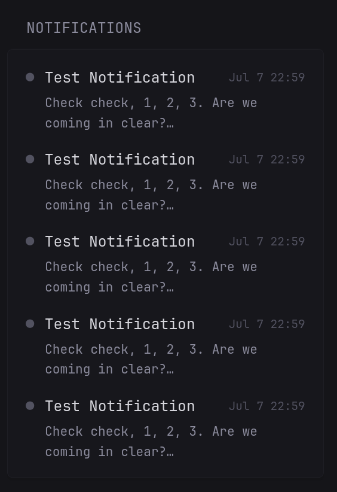

# Gotify Notifications

A widget to show the most recent [Gotify](https://gotify.net/) notifications.

Priority is indicated by a colored dot next to each notification's title: `color-negative` (red by default) for priority 8 and above, `color-primary` (your theme's accent color) for priority 4 to 7, and grey for anything below.

Widget created by [Owen-3456](https://github.com/Owen-3456).

Find the most recent version and submit issues on the [repository](https://github.com/Owen-3456/gotify-glance-widget).

## Widget yaml (v1.0)

```yaml
- type: custom-api
  title: Notifications
  title-url: ${SERVER_ADDRESS}      # example - http://192.168.1.1:8070
  cache: 1m
  url: ${SERVER_ADDRESS}/message
  parameters:
    limit: 10
    collapse-after: 5
  headers:
    X-Gotify-Key: ${GOTIFY_CLIENT_TOKEN}
  template: |
    {{ $messages := .JSON.Array "messages" }}
    {{ if eq (len $messages) 0 }}
      <p style="color: var(--color-text-subdue);">No notifications.</p>
    {{ else }}
      <ul class="list list-gap-14 collapsible-container" data-collapse-after="5">
        {{ range $messages }}
          {{ $priority := .Int "priority" }}
          {{ $date := .String "date" | parseTime "rfc3339" }}
          {{ $title := .String "title" }}
          {{ $message := .String "message" }}
          <li data-popover-type="text" data-popover-text="{{ $title }}: {{ $message }}">
            <div class="flex items-center gap-10" style="margin-bottom: 3px;">
              {{ if ge $priority 8 }}
                <span class="color-negative">●</span>
              {{ else if ge $priority 4 }}
                <span class="color-primary">●</span>
              {{ else }}
                <span style="color: var(--color-text-subdue);">●</span>
              {{ end }}
              <span class="color-highlight size-h4 grow" style="overflow: hidden; display: -webkit-box; -webkit-box-orient: vertical; -webkit-line-clamp: 2;">{{ $title }}</span>
              <span class="size-h6" style="color: var(--color-text-subdue); white-space: nowrap;">{{ $date.Format "Jan 2 15:04" }}</span>
            </div>
            <p class="size-h5" style="padding-left: 18px; white-space: pre-line; overflow: hidden; display: -webkit-box; -webkit-box-orient: vertical; -webkit-line-clamp: 2;">{{ $message }}</p>
          </li>
        {{ end }}
      </ul>
    {{ end }}
```

## Properties

| Name                      | Type     | Required | Description                                                                 |
| ------------------------- | -------- | -------- | --------------------------------------------------------------------------- |
| title                     | string   | no       | The title shown at the top of the widget                                    |
| title-url                 | string   | no       | The link the title navigates to when clicked, e.g. your Gotify server's URL |
| cache                     | duration | no       | How long to cache the response for before fetching again                    |
| url                       | string   | yes      | The Gotify server endpoint to fetch messages from                           |
| parameters.limit          | number   | no       | Maximum number of messages to fetch from the Gotify API                     |
| parameters.collapse-after | number   | no       | Number of messages shown before the list becomes collapsible                |
| headers.X-Gotify-Key      | string   | yes      | Your Gotify client token, used to authenticate the request                  |

## Environment variables

- `SERVER_ADDRESS` - the full base URL of your Gotify server reachable from Glance, including scheme and port, e.g. `http://192.168.1.1:8070` or `https://gotify.example.com`
- `GOTIFY_CLIENT_TOKEN` - a client token for your Gotify server, created from the Gotify web UI under *Clients*

*You can instead hardcode these values into the config but this is generally not recommended for security.*

### Getting a Gotify client token

This widget reads your messages, so it needs a **client** token, not an application token (those are only for sending messages).

1. Log in to your Gotify web UI
2. Go to the **Clients** tab
3. Click **Create Client** and give it a name, e.g. `Glance`
4. Copy the generated token and use it as `GOTIFY_CLIENT_TOKEN`

## Widget preview


