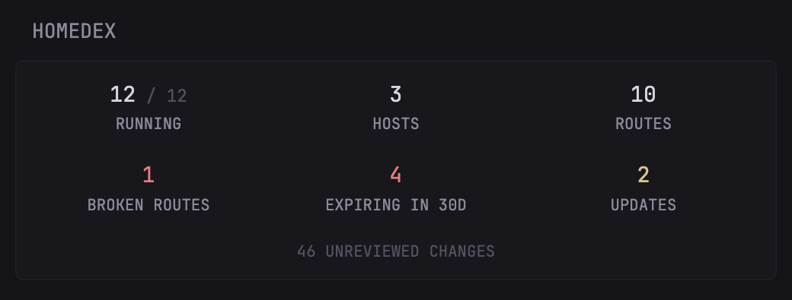

```yaml
- type: custom-api
  title: Homedex
  title-url: ${HOMEDEX_URL}
  cache: 5m
  url: ${HOMEDEX_URL}/api/summary
  headers:
    Authorization: Bearer ${HOMEDEX_TOKEN}
    Accept: application/json
  template: |
    {{ $broken := .JSON.Int "routes.broken" }}
    {{ $expiring := .JSON.Int "expiry.due_within_30_days" }}
    {{ $updates := .JSON.Int "updates.available" }}
    <div style="display:grid;grid-template-columns:repeat(3,1fr);gap:1.5rem 1rem;text-align:center">
      <div>
        <div class="color-highlight size-h3">{{ .JSON.Int "services.running" }}<span class="color-subdue size-h5"> / {{ .JSON.Int "services.total" }}</span></div>
        <div class="size-h6">RUNNING</div>
      </div>
      <div>
        <div class="color-highlight size-h3">{{ .JSON.Int "hosts.total" }}</div>
        <div class="size-h6">HOSTS</div>
      </div>
      <div>
        <div class="color-highlight size-h3">{{ .JSON.Int "routes.total" }}</div>
        <div class="size-h6">ROUTES</div>
      </div>
      <div>
        <div class="size-h3 {{ if gt $broken 0 }}color-negative{{ else }}color-highlight{{ end }}">{{ $broken }}</div>
        <div class="size-h6">BROKEN ROUTES</div>
      </div>
      <div>
        <div class="size-h3 {{ if gt $expiring 0 }}color-negative{{ else }}color-highlight{{ end }}">{{ $expiring }}</div>
        <div class="size-h6">EXPIRING IN 30D</div>
      </div>
      <div>
        <div class="size-h3 {{ if gt $updates 0 }}color-primary{{ else }}color-highlight{{ end }}">{{ $updates }}</div>
        <div class="size-h6">UPDATES</div>
      </div>
    </div>
    {{ $unseen := .JSON.Int "changes.unseen" }}
    {{ if gt $unseen 0 }}
      <a class="size-h6 color-subdue" style="display:block;text-align:center;margin-top:1.5rem" href="${HOMEDEX_URL}/changes" target="_blank" rel="noreferrer">{{ $unseen }} UNREVIEWED CHANGES</a>
    {{ end }}
```

Broken routes and items expiring within 30 days turn red when there are any, available updates use the primary color, and the unreviewed-changes line links to the Homedex change feed.

## Environment variables

- `HOMEDEX_URL` - the URL of your [Homedex](https://github.com/HarshShah0203/homedex) server, including port but without trailing slash, e.g. `http://192.168.1.2:7377` or `https://homedex.example.com`
- `HOMEDEX_TOKEN` - a read-only share token. In Homedex, open **Copy my lab**, create a read-only share named e.g. `glance`, and copy the link: the token is everything after `/share/`. It is shown once, can only read the inventory (never notes, custom fields or labels, and every write is refused), and can be revoked from the same panel.

The updates count needs Homedex v0.2.2 or newer and an **Image updates** source; older versions show 0 there. Homedex rescans every 15 minutes by default, so a shorter `cache` only adds requests.
