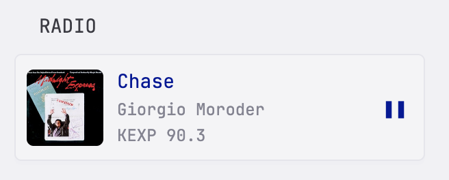
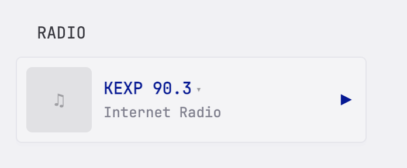

# Internet Radio Player

Stream internet radio stations from your Glance dashboard. Supports optional now-playing metadata (track title, artist, album art) via configurable API endpoints.

```yaml
- type: custom-api
  title: Radio
  cache: 30s
  frameless: true
  options:
    stations:
      - name: KEXP 90.3
        url: https://kexp.streamguys1.com/kexp160.aac
        metadata-url: https://api.kexp.org/v2/plays/?limit=1
        title-path: "results.0.song"
        artist-path: "results.0.artist"
        image-path: "results.0.thumbnail_uri"
      - name: SomaFM Groove Salad
        url: https://ice1.somafm.com/groovesalad-128-mp3
      - name: NTS Radio
        url: https://stream-relay-geo.ntslive.net/stream
  template: |
    <style>
      .widget-select-radio {
        position: absolute;
        opacity: 0;
        width: 100%;
        height: 100%;
        top: 0;
        left: 0;
        cursor: pointer;
      }
      .widget-stationlabel-radio {
        display: inline;
        cursor: pointer;
        font-weight: bold;
        color: var(--color-primary);
      }
      .widget-stationlabel-radio::after {
        content: "\25BE";
        margin-left: 0.3em;
        font-size: 1em;
        color: color-mix(in srgb, var(--color-text-base), transparent 50%);
      }
      .widget-art-radio {
        width: 56px;
        height: 56px;
        border-radius: var(--border-radius);
        flex-shrink: 0;
        object-fit: cover;
      }
      .widget-placeholder-radio {
        width: 56px;
        height: 56px;
        border-radius: var(--border-radius);
        flex-shrink: 0;
        display: flex;
        align-items: center;
        justify-content: center;
        background: color-mix(in srgb, var(--color-text-base), transparent 90%);
        font-size: 1.5rem;
        color: color-mix(in srgb, var(--color-text-base), transparent 60%);
      }
      .widget-btn-radio {
        border: none;
        background: transparent;
        color: var(--color-primary);
        font-size: 1.5rem;
        cursor: pointer;
        flex-shrink: 0;
        padding: 4px;
      }
      .widget-btn-radio:hover { opacity: 0.7; }
    </style>

    {{ $stations := .Options.stations }}
    {{ $metaTitle := "" }}
    {{ $metaArtist := "" }}
    {{ $metaImage := "" }}

    {{ $s0 := index $stations 0 }}
    {{ $metaUrl := index $s0 "metadata-url" }}
    {{ if $metaUrl }}
      {{ $res := newRequest $metaUrl | getResponse }}
      {{ if eq $res.Response.StatusCode 200 }}
        {{ $data := $res.JSON }}
        {{ $tp := index $s0 "title-path" }}
        {{ if $tp }}{{ $metaTitle = $data.String $tp }}{{ end }}
        {{ $ap := index $s0 "artist-path" }}
        {{ if $ap }}{{ $metaArtist = $data.String $ap }}{{ end }}
        {{ $ip := index $s0 "image-path" }}
        {{ if $ip }}{{ $metaImage = $data.String $ip }}{{ end }}
      {{ end }}
    {{ end }}

    {{ if $stations }}
    <div class="widget-content-frame widget-container-radio"
         data-meta-title="{{ $metaTitle }}"
         data-meta-artist="{{ $metaArtist }}"
         data-meta-image="{{ $metaImage }}">

      

      <div class="flex items-center gap-10" style="padding: 8px;">
        <div class="widget-placeholder-radio">&#9835;</div>
        
        <div class="flex flex-column grow" style="min-width: 0;">
          <div class="widget-title-radio size-h4 font-bold color-primary text-truncate" style="display: none;"></div>
          <div class="widget-selectrow-radio size-h4 text-truncate" style="position: relative; display: inline-block;">
            <span class="widget-stationlabel-radio">{{ (index $stations 0).name }}</span>
            <select class="widget-select-radio" aria-label="Select radio station"
              onchange="(function(sel){
                if (!window._glanceRadio) window._glanceRadio = { audio: null, stationIdx: 0 };
                var r = window._glanceRadio;
                r.stationIdx = sel.selectedIndex;
                if (r.audio) { r.audio.pause(); r.audio.removeAttribute('src'); r.audio.load(); }
                var c = sel.closest('.widget-container-radio');
                var btn = c.querySelector('.widget-btn-radio');
                var lbl = c.querySelector('.widget-stationlabel-radio');
                var opt = sel.options[sel.selectedIndex];
                lbl.textContent = opt.dataset.name;
                btn.innerHTML = '&#9654;';
                btn.setAttribute('aria-label', 'Play');
                c.querySelector('.widget-title-radio').style.display = 'none';
                c.querySelector('.widget-selectrow-radio').style.display = 'inline-block';
                c.querySelector('.widget-station-radio').style.display = 'none';
                c.querySelector('.widget-subtitle-radio').textContent = 'Internet Radio';
                c.querySelector('.widget-art-radio').style.display = 'none';
                c.querySelector('.widget-placeholder-radio').style.display = 'flex';
              })(this)">
              {{ range $i, $s := $stations }}
                <option value="{{ $i }}" data-url="{{ $s.url }}" data-name="{{ $s.name }}">{{ $s.name }}</option>
              {{ end }}
            </select>
          </div>
          <div class="widget-subtitle-radio color-subdue size-h5 text-truncate">
            Internet Radio
          </div>
          <div class="widget-station-radio color-subdue size-h5 text-truncate" style="display: none;"></div>
        </div>
        <button class="widget-btn-radio" type="button" aria-label="Play"
          onclick="(function(btn){
            var c = btn.closest('.widget-container-radio');
            if (!window._glanceRadio) window._glanceRadio = { audio: null, stationIdx: 0 };
            var r = window._glanceRadio;
            if (!r.audio) r.audio = new Audio();
            var sel = c.querySelector('.widget-select-radio');
            var lbl = c.querySelector('.widget-stationlabel-radio');
            var titleEl = c.querySelector('.widget-title-radio');
            var subEl = c.querySelector('.widget-subtitle-radio');
            var stEl = c.querySelector('.widget-station-radio');
            var artEl = c.querySelector('.widget-art-radio');
            var phEl = c.querySelector('.widget-placeholder-radio');
            var selRow = c.querySelector('.widget-selectrow-radio');
            if (!r.audio.paused) {
              r.audio.pause();
              btn.innerHTML = '&#9654;';
              btn.setAttribute('aria-label', 'Play');
              titleEl.style.display = 'none';
              selRow.style.display = 'inline-block';
              stEl.style.display = 'none';
              subEl.textContent = 'Internet Radio';
              artEl.style.display = 'none';
              phEl.style.display = 'flex';
            } else {
              var opt = sel.options[sel.selectedIndex];
              r.audio.src = opt.dataset.url;
              r.audio.play().catch(function() {
                btn.innerHTML = '&#9654;';
                btn.setAttribute('aria-label', 'Play');
              });
              r.stationIdx = sel.selectedIndex;
              btn.innerHTML = '&#10074;&#10074;';
              btn.setAttribute('aria-label', 'Pause');
              if (sel.selectedIndex === 0) {
                var mt = c.dataset.metaTitle;
                var ma = c.dataset.metaArtist;
                var mi = c.dataset.metaImage;
                if (mt) { titleEl.textContent = mt; titleEl.style.display = ''; selRow.style.display = 'none'; stEl.textContent = opt.dataset.name; stEl.style.display = ''; }
                if (ma) subEl.textContent = ma;
                if (mi) { artEl.src = mi; artEl.style.display = 'block'; phEl.style.display = 'none'; }
              }
            }
          })(this)">&#9654;</button>
      </div>
    </div>
    {{ else }}
    <p class="color-subdue">No stations configured</p>
    {{ end }}
```

## Configuration

### Station Fields

| Field | Required | Description |
|---|---|---|
| `name` | Yes | Display name shown in the station dropdown |
| `url` | Yes | Direct audio stream URL (MP3 or AAC over HTTP) |
| `metadata-url` | No | JSON API endpoint that returns now-playing info |
| `title-path` | No | JSON path to the track title in the metadata response |
| `artist-path` | No | JSON path to the artist name in the metadata response |
| `image-path` | No | JSON path to the album art URL in the metadata response |

### Metadata

Metadata fields (`metadata-url`, `title-path`, `artist-path`, `image-path`) are entirely optional. Stations without them display the station name when playing.

When configured, the widget fetches the metadata URL server-side and extracts fields using the JSON paths you provide. Paths use dot notation with array indices, for example `results.0.song` accesses `{"results": [{"song": "..."}]}`.

**Metadata is only fetched for the first station in the list.** If you switch to another station, the widget shows the station name only. Reorder your stations list to put your preferred metadata-enabled station first.

### Cache

The `cache` value controls how often Glance re-renders the widget and fetches fresh metadata. `30s` keeps track info current. Longer values (e.g. `5m`) reduce API calls but show stale track info.

Audio playback is **not** interrupted by cache refreshes — the player uses a persistent audio object that survives re-renders.

### Finding Stream URLs

Most internet radio stations publish their stream URLs on their websites. Look for "listen" or "stream" links, often ending in `.mp3`, `.aac`, or `.m3u`. If you get an `.m3u` file, open it in a text editor — the actual stream URL is inside.

### Example Stations

```yaml
# KEXP (Seattle) — has a public now-playing API
- name: KEXP 90.3
  url: https://kexp.streamguys1.com/kexp160.aac
  metadata-url: https://api.kexp.org/v2/plays/?limit=1
  title-path: "results.0.song"
  artist-path: "results.0.artist"
  image-path: "results.0.thumbnail_uri"

# SomaFM Groove Salad — no metadata API needed
- name: SomaFM Groove Salad
  url: https://ice1.somafm.com/groovesalad-128-mp3
```
