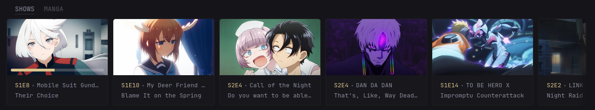
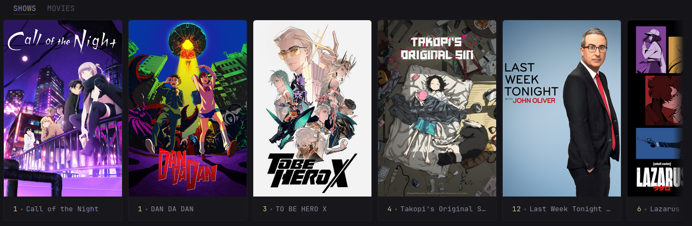

* [Introduction](#introduction)
* [Preview](#preview)
* [Environment Variables](#environment-variables)
* [Secrets](#secrets)
* [Options](#options)
* [Widget YAML](#widget-yaml)
* [🍻 Cheers](#cheers)

## Introduction
This is a widget for displaying the Next Up and Latest views for Jellyfin. It supports two modes:

1. `nextup` - Showing the next up for a given user, this includes the next
   episode in a show or continuing partially completed episodes/movies.
2. `latest` - Showing the latest new content added to a specific jellyfin
   library.

If you encounter any issues, please open an issue, tag me, and I’ll investigate further.

Customisation can be applied using the `options:` field. See [Options](#options) for more details.

## Preview
### Next Up Preview



### Latest Preview



## Environment Variables

> [!IMPORTANT]
>
> For URLs, you **MUST** include `http://` or `https://`.
> Do **NOT** include a trailing `/` at the end of URLs.

### Jellyfin
* `JELLYFIN_URL` - The Jellyfin URL, e.g., `http://<ip_address>:<port>` or `https://<domain>`
* `JELLYFIN_KEY` - The Jellyfin API key, available in `Administration` -> `Dashboard` -> `API Keys`

## Secrets
Since `v0.8.0`, you can use Docker secrets instead of environment variables. See [v0.8.0 Release Notes](https://github.com/glanceapp/glance/releases/tag/v0.8.0#g-rh-5) for more information.  
If you do, replace `${YOUR_API_KEY}` with `${secret:your-api-key-secret}`.

## Options
Since `v0.8.0`, you can use the `options:` field to customise the widget.  
See [v0.8.0 Release Notes](https://github.com/glanceapp/glance/releases/tag/v0.8.0#g-rh-15) for more information.

> [!CAUTION]
>
> Enabling thumbnails **will** expose your token/API keys in the HTML.
> Do **not** enable this in production or on internet-exposed services.

> [!IMPORTANT]
>
> The Jellyfin/Emby API only retrieves playback history for a specific user.
> You must set the `user-name` option to your Jellyfin/Emby username.

Default options are:
```yaml
options:
  # Required options
  base-url: ${JELLYFIN_URL} # Your environment-variables for the URL
  api-key: ${JELLYFIN_KEY}  # Your environment-variables for the API key/token. Can a secret as well `${secret:plex-token}`
  user-name: "yourUserName" # Your Jellyfin/Emby user name.
  # Required if `mode` is "latest"
  library-name: "Shows"      # Your Jellyfin library name.

  # Optional options
  mode: "latest"                          # Display mode for the widget, either `latest` or `nextup`
  item-count: "10"                        # number of items to fetch; must be between ""
  media-types: "Movie,Episode,MusicAlbum" # Which media types to include in the results
  small-column: false                     # `true` if using the widget in a small column
  show-thumbnail: false                   # `true` to show thumbnails
  progress-bar: true                      # `true` to display a progress bar (only applied in `nextup` mode)
  thumbnail-aspect-ratio: "default"       # see options below
```

* `thumbnail-aspect-ratio`:
    * `default`: original aspect ratio
    * `square`: aspect ratio of `1`
    * `portrait`: aspect ratio of `2/3`
    * `landscape`: aspect ratio of `16/9`

## Widget YAML
```yaml
- type: custom-api
  title: Latest Shows
  frameless: true
  cache: 5m
  options:
    base-url: ${JELLYFIN_URL}
    api-key: ${JELLYFIN_KEY}
    user-name: "yourUserName"
    library-name: "Shows"
    mode: "latest"
    item-count: "10"
    small-column: false
    show-thumbnail: false
    thumbnail-aspect-ratio: "default"
  template: |
    {{/* Required config options */}}
    {{ $baseURL := .Options.StringOr "base-url" "" }}
    {{ $apiKey := .Options.StringOr "api-key" "" }}
    {{ $userName := .Options.StringOr "user-name" "" }}

    {{/* Required config options for "latest" mode */}}
    {{ $libraryName := .Options.StringOr "library-name" "" }}

    {{/* Optional config options */}}
    {{ $mode := .Options.StringOr "mode" "latest" }}
    {{ $itemCount := .Options.StringOr "item-count" "10" }}
    {{ $mediaTypes := .Options.StringOr "media-types" "Movie,Episode,MusicAlbum" }}
    {{ $thumbAspectRatio := .Options.StringOr "thumbnail-aspect-ratio" "" }}
    {{ $isSmallColumn:= .Options.BoolOr "small-column" false }}
    {{ $showThumbnail := .Options.BoolOr "show-thumbnail" false }}
    {{ $showProgressBar := .Options.BoolOr "progress-bar" true }}

    {{/* Error message template */}}
    {{ define "errorMsg" }}
      <div class="widget-error-header">
        <div class="color-negative size-h3">ERROR</div>
        <svg class="widget-error-icon" xmlns="http://www.w3.org/2000/svg" fill="none" viewBox="0 0 24 24" stroke-width="1.5">
          <path stroke-linecap="round" stroke-linejoin="round" d="M12 9v3.75m-9.303 3.376c-.866 1.5.217 3.374 1.948 3.374h14.71c1.73 0 2.813-1.874 1.948-3.374L13.949 3.378c-.866-1.5-3.032-1.5-3.898 0L2.697 16.126ZM12 15.75h.007v.008H12v-.008Z"></path>
        </svg>
      </div>
      <p class="break-all">{{ . }}</p>
    {{ end }}

    {{/* Check required fields */}}
    {{ if or (eq $baseURL "") (eq $apiKey "") (eq $userName "") (eq $mode "") (and (eq $mode "latest") (eq $libraryName "")) }}
      {{ template "errorMsg" "Some required options are not set." }}
    {{ else }}

      {{/* Fetch user ID */}}
      {{ $userID := "" }}
      {{ $usersCall := newRequest (print $baseURL "/Users")
          | withParameter "api_key" $apiKey
          | withHeader "Accept" "application/json"
          | getResponse }}

      {{ range $i, $user := $usersCall.JSON.Array "" }}
        {{ if eq ($user.String "Name") $userName }}
          {{ $userID = $user.String "Id" }}
          {{ break }}
        {{ end }}
      {{ end }}
      {{ if eq $userID "" }}
        {{ template "errorMsg" (printf "User '%s' not found." $userName) }}
      {{ else }}

        {{ $items := "" }}

        {{ if eq $mode "latest" }}

          {{/* Fetch library ID */}}
          {{ $libraryID := "" }}
          {{ $userViewsCall := newRequest (print $baseURL "/UserViews")
              | withParameter "api_key" $apiKey
              | withParameter "userId" $userID
              | withHeader "Accept" "application/json"
              | getResponse }}

          {{ range $i, $item := $userViewsCall.JSON.Array "Items" }}
            {{ if eq ($item.String "Name") $libraryName }}
              {{ $libraryID = $item.String "Id" }}
              {{ break }}
            {{ end }}
          {{ end }}

          {{ if eq $libraryID "" }}
            {{ template "errorMsg" (printf "Library '%s' not found." $libraryName) }}
          {{ else }}
            {{/* Fetch latest items */}}
            {{ $latestCall := newRequest (print $baseURL "/Users/" $userID "/Items/Latest")
                | withParameter "api_key" $apiKey
                | withParameter "Limit" $itemCount
                | withParameter "ParentId" $libraryID
                | withParameter "IncludeItemTypes" $mediaTypes
                | withParameter "GroupItems" "true"
                | withHeader "Accept" "application/json"
                | getResponse }}
            {{ $items = $latestCall.JSON.Array "" }}
          {{ end }}

        {{ else if eq $mode "nextup" }}

          {{/* Fetch next up items */}}
          {{ $nextUpCall := newRequest (print $baseURL "/Shows/NextUp")
            | withParameter "api_key" $apiKey
            | withParameter "UserId" $userID
            | withParameter "Limit" $itemCount
            | withParameter "EnableResumable" "true"
            | withHeader "Accept" "application/json"
            | getResponse }}
          {{ $items = $nextUpCall.JSON.Array "Items" }}

        {{ else }}
          {{ template "errorMsg" "Unknown mode, expected 'latest' or 'nextup'" }}
        {{ end }}

        {{ if eq (len $items) 0 }}
          <p>No items found, start streaming something!</p>
        {{ else }}

          {{/* Display the item carousel */}}
          <div class="carousel-container show-right-cutoff">
            <div class="cards-horizontal carousel-items-container">
              {{ range $n, $item := $items }}
                {{/* Common item variables */}}
                {{ $mediaType := $item.String "Type" }}
                {{ $title := $item.String "Name" }}
                {{ $itemID := $item.String "Id" }}

                {{/* Media type specific variables */}}
                {{ $seriesTitle := "" }}
                {{ $artist := "" }}
                {{ $seriesID := "" }}
                {{ $season := "" }}
                {{ $episode := "" }}
                {{ $playPercentage := "" }}
                {{ $unwatchedEpisodeCount := "" }}

                {{ if eq $mediaType "Movie" }}
                {{ else if eq $mediaType "Series" }}
                  {{ $unwatchedEpisodeCount = $item.Int "UserData.UnplayedItemCount" }}
                {{ else if eq $mediaType "Episode" }}
                  {{ $unwatchedEpisodeCount = 1 }}
                  {{ $seriesTitle = $item.String "SeriesName" }}
                  {{ $seriesID = $item.String "SeriesId" }}
                  {{ $season = $item.Int "ParentIndexNumber" }}
                  {{ $episode = $item.Int "IndexNumber" }}

                  {{ if $item.Exists "UserData.PlayedPercentage" }}
                    {{ $playPercentage = $item.String "UserData.PlayedPercentage" }}
                  {{ end }}

                  {{/* For latest always refer to the series not individual episodes */}}
                  {{ if eq $mode "latest" }}
                    {{ $itemID = $seriesID }}
                    {{ $title = $seriesTitle }}
                  {{ end }}
                {{ else if eq $mediaType "MusicAlbum" }}
                  {{ $artist = $item.String "AlbumArtist" }}
                {{ end }}

                {{ $linkURL := print $baseURL "/web/#/details?id=" $itemID }}
                {{ $thumbURL := "" }}
                {{ if not (eq $playPercentage "") }}
                  {{/* $thumbURL = concat $baseURL "/Items/" $itemID "/Images/Primary?api_key=" $apiKey "&percentPlayed=" $playPercentage */}}
                  {{ $thumbURL = concat $baseURL "/Items/" $itemID "/Images/Primary?api_key=" $apiKey }}
                {{ else }}
                  {{ $thumbURL = concat $baseURL "/Items/" $itemID "/Images/Primary?api_key=" $apiKey }}
                {{ end }}

                <a class="card widget-content-frame" href="{{ $linkURL | safeURL }}">
                  {{ if $showThumbnail }}
                    <div style="position: relative;">
                      

                      {{ if and ($showProgressBar) (not (eq $playPercentage "")) }}
                        <div style="
                          position: absolute;
                          bottom: 8px;
                          left: 8px;
                          right: 8px;
                          height: 6px;
                          border-radius: var(--border-radius);
                          overflow: hidden;
                          background-color: rgba(255, 255, 255, 0.2);
                        ">
                          <div style="
                            width: {{ print $playPercentage "%" }};
                            height: 100%;
                            border-radius: var(--border-radius) 0 0 var(--border-radius);
                            background-color: var(--color-primary)
                          "></div>
                        </div>
                      {{ end }}
                    </div>
                  {{ end }}

                  <div class="grow padding-inline-widget margin-top-10 margin-bottom-10">
                    <ul class="flex flex-column justify-evenly margin-bottom-3 {{ if $isSmallColumn }}size-h6{{ end }}" style="height: 100%;">
                      {{ if eq $mode "latest" }}
                        {{ if or (eq $mediaType "Series") (eq $mediaType "Episode") }}
                          <ul class="list-horizontal-text flex-nowrap">
                            <li class="color-primary shrink-0">{{ $unwatchedEpisodeCount }}</li>
                            <li class="text-truncate">{{ $title }}</li>
                          </ul>
                        {{ else if eq $mediaType "MusicAlbum" }}
                          <ul class="list-horizontal-text flex-nowrap">
                            <li class="color-primary text-truncate">{{ $artist }}</li>
                            <li class="text-truncate">{{ $title }}</li>
                          </ul>
                        {{ else }}
                          <li class="text-truncate">{{ $title }}</li>
                        {{ end }}
                      {{ else if eq $mode "nextup" }}
                        <ul class="list-horizontal-text flex-nowrap">
                          <li class="color-primary shrink-0">S{{ $season }}E{{ $episode }}</li>
                          <li class="text-truncate">{{ $seriesTitle }}</li>
                        </ul>
                        <li class="text-truncate">{{ $title }}</li>
                      {{ end }}
                    </ul>
                  </div>
                </a>
              {{ end }}
            </div>
          </div>
        {{ end }}

      {{ end }}

    {{ end }}
```

## 🍻 Cheers

* [titembaatar](https://github.com/titembaatar) - For the [Media Server
  History](https://github.com/glanceapp/community-widgets/tree/main/widgets/media-server-history-by-titembaatar)
  widget that much of this was based on.
