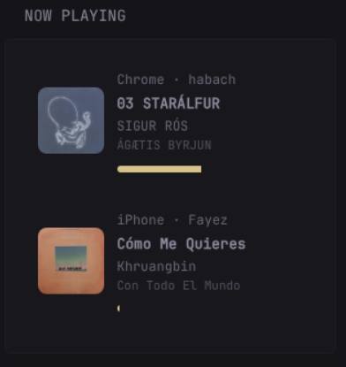

# Jellyfin Now Playing Widget

Displays currently playing sessions on a jellyfin server, with metadata. Displays track name, artist, album,  user and device information. Also shows a minimal progress bar





---
```yaml
        - type: custom-api
          cache: 1m
          title: Now Playing
          url: ${JELLYFIN_URL}/Sessions
          headers:
            X-Emby-Token: ${API_TOKEN}
          template: |
            {{ $sessions := .JSON.Array "" }}
            {{ $found := false }}
            {{ $showArt := true }}

            {{ range $index, $s := $sessions }}

              {{ $type := $.JSON.String (printf "%d.NowPlayingItem.MediaType" $index) }}

              {{ if eq $type "Audio" }}
                {{ $found = true }}

                {{ $user := $.JSON.String (printf "%d.UserName" $index) }}
                {{ $device := $.JSON.String (printf "%d.DeviceName" $index) }}
                {{ $client := $.JSON.String (printf "%d.Client" $index) }}

                {{ if eq $device "" }}
                  {{ $device = $client }}
                {{ end }}

                {{ $name := $.JSON.String (printf "%d.NowPlayingItem.Name" $index) }}
                {{ $artist := $.JSON.String (printf "%d.NowPlayingItem.Artists.0" $index) }}
                {{ $album := $.JSON.String (printf "%d.NowPlayingItem.Album" $index) }}
                {{ $albumId := $.JSON.String (printf "%d.NowPlayingItem.AlbumId" $index) }}

                {{ $position := $.JSON.Float (printf "%d.PlayState.PositionTicks" $index) }}
                {{ $runtime := $.JSON.Float (printf "%d.NowPlayingItem.RunTimeTicks" $index) }}

                {{ $progress := 0.0 }}
                {{ if gt $runtime 0.0 }}
                  {{ $progress = mul (div $position $runtime) 100.0 }}
                {{ end }}

                <div style="
                  display:flex;
                  gap:12px;
                  align-items:center;
                  padding:12px;
                  border-radius:12px;
                  background:var(--color-subdue);
                  margin-bottom:10px;
                ">

                  {{ if and $showArt (ne $albumId "") }}
                  
                  {{ end }}

                  <div style="flex:1; overflow:hidden;">

                    <div style="font-size:12px;opacity:0.7;margin-bottom:2px;">
                      {{ $device }} · {{ $user }}
                    </div>

                    <div style="font-weight:600;white-space:nowrap;overflow:hidden;text-overflow:ellipsis;">
                      {{ $name }}
                    </div>

                    <div style="font-size:12px;opacity:0.7;">
                      {{ $artist }}
                    </div>

                    <div style="font-size:11px;opacity:0.5;">
                      {{ $album }}
                    </div>

                    <div style="margin-top:8px;">
                      <div style="
                        background:var(--color-highlight);
                        height:6px;
                        border-radius:5px;
                        overflow:hidden;
                      ">
                        <div style="
                          width:{{ printf "%.2f" $progress }}%;
                          background:var(--color-positive);
                          height:100%;
                          transition: width 0.5s ease;
                        "></div>
                      </div>
                    </div>

                  </div>
                </div>

              {{ end }}

            {{ end }}

            {{ if not $found }}
              <div style="opacity:0.6;">Nothing playing</div>
            {{ end }}
```


## Configuration

### Required environment variables

| Variable | Description |
|----------|-------------|
| `JELLYFIN_URL` | Base URL of your Jellyfin server (e.g. `https://jellyfin.example.com`) |
| `API_TOKEN` | Jellyfin API key / access token |

---

## Note on Album Artwork

Album artwork is enabled by default.

To disable it (recommended if you want to avoid exposing API tokens in image URLs), set:

```go
{{ $showArt := false }}
```

inside the widget template.

---

