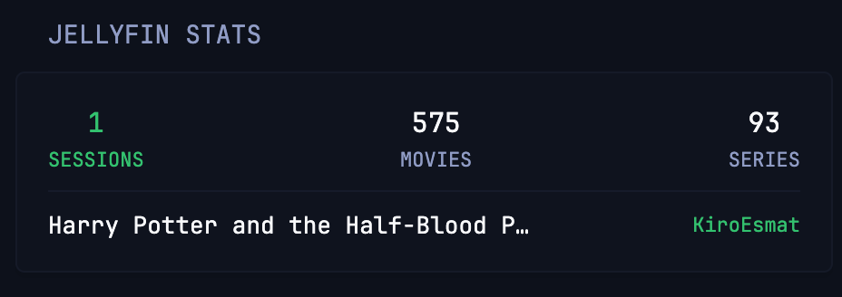

# Jellyfin Stats

Live active playback streams (with dynamic highlight when sessions are active) and total movies & series counts.



```yaml
- type: custom-api
  refresh-interval: 5s
  title: Jellyfin Stats
  cache: 2s
  url: ${JELLYFIN_URL}/Sessions?api_key=${JELLYFIN_API_KEY}
  subrequests:
    counts:
      url: ${JELLYFIN_URL}/Items/Counts?api_key=${JELLYFIN_API_KEY}
  template: |
    {{- $activeStreams := 0 -}}
    {{- range .JSON.Array "" -}}
      {{- if .Exists "NowPlayingItem" -}}
        {{- $activeStreams = add $activeStreams 1 -}}
      {{- end -}}
    {{- end -}}
    <div class="flex justify-between text-center">
      <div>
        <div class="{{ if gt $activeStreams 0 }}color-positive{{ else }}color-highlight{{ end }} size-h3">{{ $activeStreams }}</div>
        <div class="size-h6{{ if gt $activeStreams 0 }} color-positive{{ end }}">SESSIONS</div>
      </div>
      <div>
        <div class="color-highlight size-h3">{{ (.Subrequest "counts").JSON.Int "MovieCount" }}</div>
        <div class="size-h6">MOVIES</div>
      </div>
      <div>
        <div class="color-highlight size-h3">{{ (.Subrequest "counts").JSON.Int "SeriesCount" }}</div>
        <div class="size-h6">SERIES</div>
      </div>
    </div>
```

## Environment variables

- `JELLYFIN_URL` - The full URL of your Jellyfin server, e.g. `http://192.168.1.100:8096`
- `JELLYFIN_API_KEY` - Your Jellyfin API key, generated from Dashboard -> API Keys
