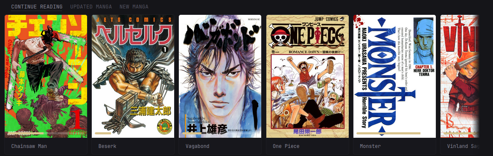
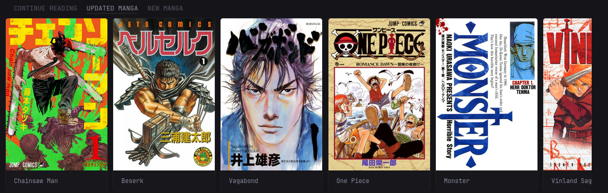
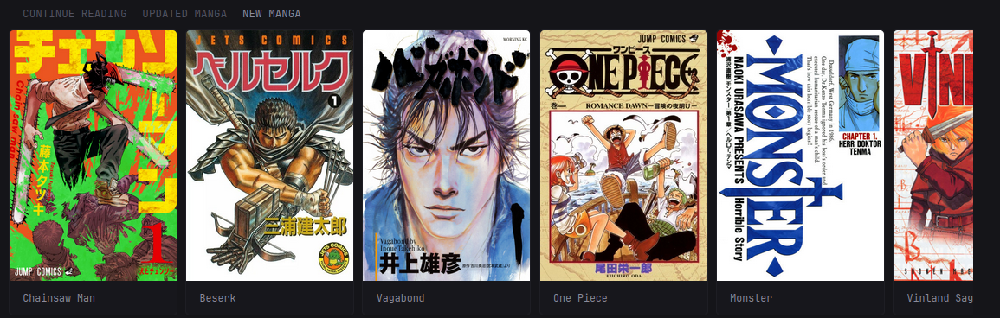

* [Introduction](#introduction)
* [Preview](#preview)
* [Environment Variables](#environment-variables)
* [Secrets](#secrets)
* [Options](#options)
* [Widget YAML](#widget-yaml)
* [🍻 Cheers](#cheers)

## Introduction
This is a widget for displaying the "On Deck", "Recently Updated" and "Recently
Added" views for Kavita. It supports three modes:

1. `on-deck` - Showing the on-deck for a given user, this includes in progress
   series.
2. `recently-updated` - Showing any series which has recently been updated.
3. `recently-added` - Showing any new series recently added to Kavita.

If you encounter any issues, please open an issue, tag me, and I’ll investigate further.

Customisation can be applied using the `options:` field. See [Options](#options) for more details.

## Preview
### On Deck



### Recently Updated



### Recently Added



## Environment Variables

> [!IMPORTANT]
>
> For URLs, you **MUST** include `http://` or `https://`.
> Do **NOT** include a trailing `/` at the end of URLs.

### Kavita 
* `KAVITA_URL` - The KAVITA URL, e.g., `http://<ip_address>:<port>` or `https://<domain>`
* `KAVITA_KEY` - The Kavita API key, available in `Settings` -> `Account` -> `API Key / OPDS`

## Secrets
Since `v0.8.0`, you can use Docker secrets instead of environment variables. See [v0.8.0 Release Notes](https://github.com/glanceapp/glance/releases/tag/v0.8.0#g-rh-5) for more information.  
If you do, replace `${YOUR_API_KEY}` with `${secret:your-api-key-secret}`.

## Options
Since `v0.8.0`, you can use the `options:` field to customise the widget.  
See [v0.8.0 Release Notes](https://github.com/glanceapp/glance/releases/tag/v0.8.0#g-rh-15) for more information.

> [!CAUTION]
>
> Enabling thumbnails **will** expose your token/API keys in the HTML.
> Do **not** enable this in production or on internet-exposed services.

Default options are:
```yaml
options:
  # Required options
  base-url: ${KAVITA_URL} # Your environment-variables for the URL
  api-key: ${KAVITA_KEY}  # Your environment-variables for the API key/token. Can a secret as well `${secret:plex-token}`

  # Optional options
  mode: "recently-added"                  # Display mode for the widget, either `on-deck`, 'recently-added', or 'recently-updated'
  library: "0"                            # The library ID to get content from or `"0"` for all libraries (must be quoted).
  small-column: false                     # `true` if using the widget in a small column
  show-thumbnail: false                   # `true` to show thumbnails
  progress-bar: true                      # `true` to display a progress bar (only applied in `on-deck` mode)
  thumbnail-aspect-ratio: "default"       # see options below
```

* `thumbnail-aspect-ratio`:
    * `default`: original aspect ratio
    * `square`: aspect ratio of `1`
    * `portrait`: aspect ratio of `2/3`
    * `landscape`: aspect ratio of `16/9`

## Widget YAML
```yaml
- type: custom-api
  title: On Deck
  frameless: true
  cache: 5m
  options:
    base-url: ${KAVITA_URL}
    api-key: ${KAVITA_KEY}
    mode: "on-deck"
    small-column: false
    show-thumbnail: false
    thumbnail-aspect-ratio: "portrait"
  template: |
    {{/* Required config options */}}
    {{ $baseURL := .Options.StringOr "base-url" "" }}
    {{ $apiKey := .Options.StringOr "api-key" "" }}
    {{ $mode := .Options.StringOr "mode" "recently-added" }}

    {{/* Optional config options */}}
    {{ $library := .Options.StringOr "library" "0" }}
    {{ $isSmallColumn:= .Options.BoolOr "small-column" false }}
    {{ $thumbAspectRatio := .Options.StringOr "thumbnail-aspect-ratio" "" }}
    {{ $showThumbnail := .Options.BoolOr "show-thumbnail" false }}
    {{ $showProgressBar := .Options.BoolOr "progress-bar" true }}

    {{/* Error message template */}}
    {{ define "errorMsg" }}
      <div class="widget-error-header">
        <div class="color-negative size-h3">ERROR</div>
        <svg class="widget-error-icon" xmlns="http://www.w3.org/2000/svg" fill="none" viewBox="0 0 24 24" stroke-width="1.5">
          <path stroke-linecap="round" stroke-linejoin="round" d="M12 9v3.75m-9.303 3.376c-.866 1.5.217 3.374 1.948 3.374h14.71c1.73 0 2.813-1.874 1.948-3.374L13.949 3.378c-.866-1.5-3.032-1.5-3.898 0L2.697 16.126ZM12 15.75h.007v.008H12v-.008Z"></path>
        </svg>
      </div>
      <p class="break-all">{{ . }}</p>
    {{ end }}

    {{/* Check required fields */}}
    {{ if or (eq $baseURL "") (eq $apiKey "") (eq $mode "")  }}
      {{ template "errorMsg" "Some required options are not set." }}
    {{ else }}

      {{/* Authenticate user */}}
      {{ $authenticateCall := newRequest (print $baseURL "/api/Plugin/authenticate")
          | withParameter "apiKey" $apiKey
          | withParameter "pluginName" "glance"
          | withHeader "Accept" "application/json"
          | withStringBody ""
          | getResponse }}
      {{ $token := concat "Bearer " ($authenticateCall.JSON.String "token") }}

      {{ if eq $token "" }}
        {{ template "errorMsg" (printf "Error authneticating: %s" $authenticateCall) }}
      {{ else }}
        {{ $items := "" }}

        {{ if eq $mode "recently-added" }}
          {{ $recentlyAddedCall := newRequest (print $baseURL "/api/Series/recently-added-v2")
              | withParameter "pageNumber" "1"
              | withParameter "pageSize" "20"
              | withHeader "Authorization" $token
              | withHeader "Accept" "application/json"
              | withHeader "Content-Type" "application/json"
              | withStringBody "{}"
              | getResponse }}
          {{ $items = $recentlyAddedCall.JSON.Array "" }}

        {{ else if eq $mode "recently-updated" }}
          {{ $recentlyUpdatedCall := newRequest (print $baseURL "/api/Series/recently-updated-series")
              | withHeader "Authorization" $token
              | withHeader "Accept" "application/json"
              | withStringBody ""
              | getResponse }}
          {{ $items = $recentlyUpdatedCall.JSON.Array "" }}

        {{ else if eq $mode "on-deck" }}
          {{ $onDeckCall:= newRequest (print $baseURL "/api/Series/on-deck")
              | withParameter "libraryId" $library
              | withHeader "Authorization" $token
              | withHeader "Accept" "application/json"
              | withStringBody ""
              | getResponse }}
          {{ $items = $onDeckCall.JSON.Array "" }}
        {{ else }}
          {{ template "errorMsg" "Unknown mode, expected 'recently-added', 'recently-updated', or 'on-deck'" }}
        {{ end }}

        {{ if eq (len $items) 0 }}
          <p>No items found, start reading something!</p>
        {{ else }}

          {{/* Display the item carousel */}}
          <div class="carousel-container show-right-cutoff">
            <div class="cards-horizontal carousel-items-container">
              {{ range $n, $item := $items }}
                {{/* Common item variables */}}
                {{ $libraryID := $item.String "libraryId" }}
                {{ $seriesID := $item.String "id" }}
                {{ $title := $item.String "name" }}

                {{ $progressPercent := ""}}

                {{ if eq $mode "recently-updated" }}
                  {{ $title = $item.String "seriesName" }}
                  {{ $seriesID = $item.String "seriesId" }}
                {{ else if eq $mode "on-deck" }}
                  {{ $pagesRead := $item.Float "pagesRead" }}
                  {{ $pages := $item.Float "pages" }}
                  {{ $progress := div $pagesRead $pages }}
                  {{ $progressPercent = printf "%f" (mul 100 $progress) }}
                {{ end }}

                {{ $linkURL := concat $baseURL "/library/" $libraryID "/series/" $seriesID }}
                {{ $thumbURL := concat $baseURL "/api/image/series-cover?seriesId=" $seriesID "&apiKey=" $apiKey }}

                <a class="card widget-content-frame" href="{{ $linkURL | safeURL }}">
                  {{ if $showThumbnail }}
                    <div style="position: relative;">
                      

                      {{ if and ($showProgressBar) (not (eq $progressPercent "")) }}
                        <div style="
                          position: absolute;
                          bottom: 8px;
                          left: 8px;
                          right: 8px;
                          height: 6px;
                          border-radius: var(--border-radius);
                          overflow: hidden;
                          background-color: rgba(255, 255, 255, 0.2);
                        ">
                          <div style="
                            width: {{ print $progressPercent "%" }};
                            height: 100%;
                            border-radius: var(--border-radius) 0 0 var(--border-radius);
                            background-color: var(--color-primary)
                          "></div>
                        </div>
                      {{ end }}
                    </div>
                  {{ end }}

                  <div class="grow padding-inline-widget margin-top-10 margin-bottom-10">
                    <ul class="flex flex-column justify-evenly margin-bottom-3 {{if $isSmallColumn}}size-h6{{end}}" style="height: 100%;">
                    <li class="text-truncate">{{ $title }}</li>
                    </ul>
                  </div>
                </a>
              {{ end }}
            </div>
          </div>
        {{ end }}
      {{ end }}

    {{ end }}
```

## 🍻 Cheers

* [titembaatar](https://github.com/titembaatar) - For the [Media Server
  History](https://github.com/glanceapp/community-widgets/tree/main/widgets/media-server-history-by-titembaatar)
  widget that much of this was based on.
