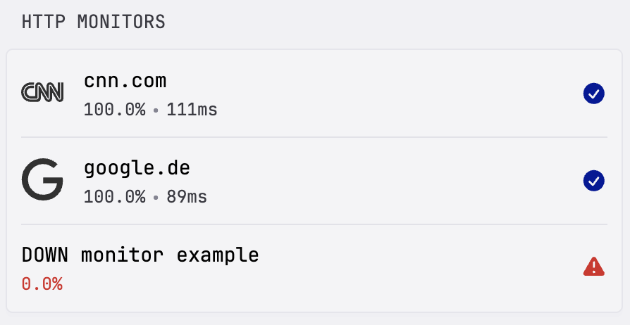
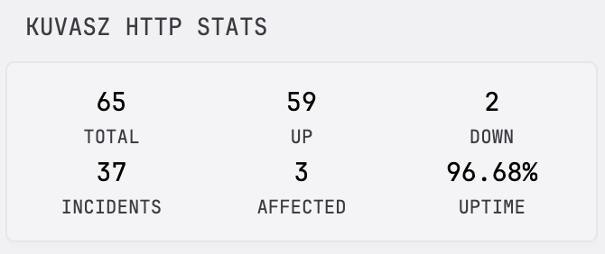

## Introduction

These are some nice widgets to display various type of data from a [Kuvasz Uptime](https://kuvasz-uptime.dev) instance, using the custom-api widget type.

_Kudos to the makers of the Gatus community widgets ([**Nedra1988**](https://github.com/Nedra1998) and [**Jack-Overflow**](https://github.com/Jack-Overflow)), they made a really nice foundation to work with!)_

If you experience any issues, just open an issue and tag me (`@adamkobor`)!

## Preview






## Stats

This widget can be used for both HTTP and push monitor stats, depending on the configuration option. It shows the total count, the up and down monitors, and the count of the incidents, the affected monitors and the uptime ratio over a given period (also configurable).

**Options**

* `base-url`: your Kuvasz host (mandatory), better to set it up via the KUVASZ_HOST environment variable
* `api-key`: your own API key for Kuvasz, optional if you disabled authentication. Better to set it up via the KUVASZ_API_KEY
* `monitor-type`: either "http" or "push" (mandatory)
* `period`: an ISO-8601 interval string for the cumulative stats (incidents, affected monitors, uptime ratio), the default is 24 hours

**YAML**

```yaml
- type: custom-api
  title: Kuvasz HTTP stats
  cache: 5m
  options:
    base-url: ${KUVASZ_HOST}
    api-key: ${KUVASZ_API_KEY}
    period: 7d
    monitor-type: http
  template: |
    {{/* Required config options */}}
    {{ $baseURL := .Options.StringOr "base-url" "" }}
    {{ $monitorType := .Options.StringOr "monitor-type" "" }}

    {{/* Optional config options */}}
    {{ $apiKey := .Options.StringOr "api-key" "" }}
    {{ $period := .Options.StringOr "period" "24h" }}

    {{ $stats := newRequest (print $baseURL "/api/v2/" $monitorType "-monitors/stats/?period=" $period )
      | withHeader "X-Api-Key" $apiKey
      | getResponse }}
    {{ $uptimeValue := mul 100 ($stats.JSON.Float "history.uptimeStats.uptimeRatio") }}

    <div class="widget-small-content-bounds">
      <div style="display: grid; grid-template-columns: 1fr 1fr 1fr; gap: 10px; text-align: center;">
        <div>
          <p class="size-h3 color-highlight">{{ $stats.JSON.Int "actual.uptimeStats.total" }}</p>
          <p class="size-h6">TOTAL</p>
        </div>
        <div>
          <p class="size-h3 color-highlight">{{ $stats.JSON.Int "actual.uptimeStats.up" }}</p>
          <p class="size-h6">UP</p>
        </div>
        <div>
          <p class="size-h3 color-highlight">{{ $stats.JSON.Int "actual.uptimeStats.down" }}</p>
          <p class="size-h6">DOWN</p>
        </div>
      </div>
      <div style="display: grid; grid-template-columns: 1fr 1fr 1fr; gap: 10px; text-align: center;">
        <div>
          <p class="size-h3 color-highlight">{{ $stats.JSON.Int "history.uptimeStats.incidents" }}</p>
          <p class="size-h6">INCIDENTS</p>
        </div>
        <div>
          <p class="size-h3 color-highlight">{{ $stats.JSON.Int "history.uptimeStats.affectedMonitors" }}</p>
          <p class="size-h6">AFFECTED</p>
        </div>
        <div>
          <p class="size-h3 color-highlight">{{ printf "%.2f" $uptimeValue }}%</p>
          <p class="size-h6">UPTIME</p>
        </div>
      </div>
    </div>
```

## HTTP monitors

This one lists the HTTP monitors from Kuvasz with their uptime ratio, latency metrics (configurable) and state. You can also set up custom icons, URLs or you can decide which monitors you would like to show.

**Options**

* `base-url`: your Kuvasz host (mandatory), better to set it up via the KUVASZ_HOST environment variable
* `api-key`: your own API key for Kuvasz, optional if you disabled authentication. Better to set it up via the KUVASZ_API_KEY environment variable
* `style`: either "full" or "compact". The full version can have custom icons and displays 2 metrics, while the compact variant only shows 1 metric and doesn't support custom icons. Default is "full".
* `period`: an ISO-8601 interval string for the cumulative stats (incidents, affected monitors, uptime ratio), the default is 24 hours
* `show-metrics`: whether to load and display any kind of metrics, or disable them completely. Be aware, that if you would like to show metrics for a lot of monitors, it could slow down your dashboard since the metrics need to be fetched on a per monitor basis.
* `compact-metric`: the metric to show in the compact variant, it's either "uptime" or "latency", default is "uptime.
* `latency-metric`: the latency metric to show, possible options: "average", "min", "max", "p90", "p95", "p99", default is "average"
* `show-failing-only`: if "true" then only the failing (down) monitors will be shown
* `show-configured-only`: if "true" then only the explicitly configured monitors will be shown. Details below.

**Explicit monitor configs:**

Under the `options` you can specify your monitors by using their name, adding custom icons, or overwriting the links for the items (by default the Kuvasz monitor detail page will be used as a link).

To use a custom icon, you need to use the monitor's name as the property key and then you can use any of the following for the icon:

* Simple Icons with the `si:` prefix
* Dashboard icons with `di:`
* Material Design Icons with `mdi:`
* Self-hosted icons with `sh:`
* or a simple, direct URL to an image

```yaml
'cnn.com': si:cnn <- using simple icons
'cnn.com-url': https://cnn.com <- overwriting the link of a given monitor on the dashboard
```

When `show-configured-only` is set to "true" only the monitors that has a custom icon or a custom URL will be shown on the widget!

**YAML**

```yaml
- type: custom-api
  title: HTTP monitors
  cache: 5m
  options:
    base-url: ${KUVASZ_HOST}
    api-key: ${KUVASZ_API_KEY}
    style: full
    period: 1d
    show-metrics: true
    compact-metric: latency
    latency-metric: p95
    show-failing-only: false
    show-configured-only: true
    'cnn.com': si:cnn
    'cnn.com-url': https://cnn.com
    'google.de': si:google
    'DOWN monitor example-url': https://example.com
  template: |
    {{/* Required config options */}}
    {{ $baseURL := .Options.StringOr "base-url" "" }}

    {{/* Optional config options */}}
    {{ $apiKey := .Options.StringOr "api-key" "" }}
    {{ $period := .Options.StringOr "period" "24h" }}
    {{ $style := .Options.StringOr "style" "full" }}
    {{ $showMetrics := .Options.BoolOr "show-metrics" false }}
    {{ $compactMetric := .Options.StringOr "compact-metric" "uptime" }}
    {{ $latencyMetric := .Options.StringOr "latency-metric" "average" }}
    {{ $showFailingOnly := .Options.BoolOr "show-failing-only" false }}
    {{ $showOnlyConfigured := .Options.BoolOr "show-configured-only" false }}

    {{ $monitors := newRequest (print $baseURL "/api/v2/http-monitors?enabled=true") 
      | withHeader "X-Api-Key" $apiKey
      | getResponse }}

    {{ $options := .Options }}
    {{ $displayedItems := 0 }}

    {{ if eq $style "compact" }}
      <ul class="dynamic-columns list-gap-8 ">
      {{ range $i, $monitor := $monitors.JSON.Array "" }}
          {{ $name := $monitor.String "name" }}
          {{ $key := $monitor.String "id" }}
          {{ $icon := $options.StringOr $name "" }}
          {{ $linkUrlOption := $options.StringOr (concat $name "-url") "" }}
          {{ $linkUrl := $options.StringOr (concat $name "-url") (concat $baseURL "/http-monitors/" $key) }}
          {{ $status := $monitor.String "uptimeStatus" }}
          {{ $isUp := eq $status "UP" }}
          {{ $hasLatencyMetrics := false }}

          {{ if and $showFailingOnly $isUp }} {{ continue }} {{ end }}
          {{ if and $showOnlyConfigured (eq $linkUrlOption "") (eq $icon "") }} {{ continue }} {{ end }}
          {{ $displayedItems = add $displayedItems 1 }}

          {{ $metricValue := "" }}
          {{ $stats := "" }}

          {{ if $showMetrics }}
            {{ $stats = newRequest (print $baseURL "/api/v2/http-monitors/" $key "/stats/?period=" $period )
                | withHeader "X-Api-Key" $apiKey
                | getResponse }}
            {{ $hasLatencyMetrics = $stats.JSON.Exists "latencyStats.averageLatencyInMs" }}
          {{ end }}

          <div class="flex items-center gap-12">
            <a class="size-title-dynamic color-highlight text-truncate block grow" href="{{ $linkUrl | safeURL }}" target="_blank" rel="noreferrer">{{ $name }}</a>
            <a href="{{ $linkUrl | safeURL }}" target="_blank" rel="noreferrer">
              {{ if eq $compactMetric "uptime" }}
                {{ $metricValue = mul 100 ($stats.JSON.Float "uptimeHistory.uptimeRatio") }}
                <div>{{ printf "%.2f" $metricValue }}%</div>
              {{ else if $hasLatencyMetrics }}
                <div>{{ $stats.JSON.Int (printf "latencyStats.%sLatencyInMs" $latencyMetric) }}ms</div>
              {{ end }}
            </a>

            {{ if $isUp }}
              <div class="monitor-site-status-icon-compact">
                <a href="{{ $linkUrl | safeURL }}" target="_blank" rel="noreferrer">
                    <svg fill="var(--color-positive)" xmlns="http://www.w3.org/2000/svg" viewBox="0 0 20 20">
                      <path fill-rule="evenodd" d="M10 18a8 8 0 1 0 0-16 8 8 0 0 0 0 16Zm3.857-9.809a.75.75 0 0 0-1.214-.882l-3.483 4.79-1.88-1.88a.75.75 0 1 0-1.06 1.061l2.5 2.5a.75.75 0 0 0 1.137-.089l4-5.5Z" clip-rule="evenodd" />
                    </svg>
                </a>
              </div>
            {{ else }}
              <div class="monitor-site-status-icon-compact" title="{{ $monitor.String "uptimeError" }}">
                <a href="{{ $linkUrl | safeURL }}" target="_blank" rel="noreferrer">
                    <svg fill="var(--color-negative)" xmlns="http://www.w3.org/2000/svg" viewBox="0 0 20 20">
                      <path fill-rule="evenodd" d="M8.485 2.495c.673-1.167 2.357-1.167 3.03 0l6.28 10.875c.673 1.167-.17 2.625-1.516 2.625H3.72c-1.347 0-2.189-1.458-1.515-2.625L8.485 2.495ZM10 5a.75.75 0 0 1 .75.75v3.5a.75.75 0 0 1-1.5 0v-3.5A.75.75 0 0 1 10 5Zm0 9a1 1 0 1 0 0-2 1 1 0 0 0 0 2Z" clip-rule="evenodd" />
                    </svg>
                </a>
              </div>
            {{ end }}
          </div>
        {{ end }}
      </ul>
    {{ else }}
      <ul class="dynamic-columns list-gap-20 list-with-separator">
      {{ range $i, $monitor := $monitors.JSON.Array "" }}
          {{ $name := $monitor.String "name" }}
          {{ $key := $monitor.String "id" }}
          {{ $icon := $options.StringOr $name "" }}
          {{ $linkUrlOption := $options.StringOr (concat $name "-url") "" }}
          {{ $linkUrl := $options.StringOr (concat $name "-url") (concat $baseURL "/http-monitors/" $key) }}
          {{ $status := $monitor.String "uptimeStatus" }}
          {{ $isUp := eq $status "UP" }}
          {{ $hasLatencyMetrics := false }}

          {{ if and $showFailingOnly $isUp }} {{ continue }} {{ end }}
          {{ if and $showOnlyConfigured (eq $linkUrlOption "") (eq $icon "") }} {{ continue }} {{ end }}
          {{ $displayedItems = add $displayedItems 1 }}

          {{ $uptimeValue := "" }}
          {{ $stats := "" }}

          {{ if $showMetrics }}
            {{ $stats = newRequest (print $baseURL "/api/v2/http-monitors/" $key "/stats/?period=" $period )
                | withHeader "X-Api-Key" $apiKey
                | getResponse }}
            {{ $hasLatencyMetrics = $stats.JSON.Exists "latencyStats.averageLatencyInMs" }}
            {{ $uptimeValue = mul 100 ($stats.JSON.Float "uptimeHistory.uptimeRatio") }}
          {{ end }}

          {{ $iconUrl := "" }}
          {{ if $icon }}
            {{ $iconPrefix := findMatch "^(si|di|mdi|sh):" $icon }}
            {{ $iconBase := replaceMatches "^(si|di|mdi|sh):" "" $icon }}

            {{ $iconExt := findMatch "\\.[a-z]+$" $iconBase }}
            {{ $iconExt := replaceMatches "\\." "" $iconExt }}
            {{ $iconBase = replaceMatches "\\.[a-z]+$" "" $iconBase }}
            {{ if eq $iconExt "" }} {{ $iconExt = "svg" }} {{ end }}

            {{ if eq $iconPrefix "si:" }}
              {{ $iconUrl = concat "https://cdn.jsdelivr.net/npm/simple-icons@latest/icons/" $iconBase ".svg" }}
            {{ else if eq $iconPrefix "di:" }}
              {{ $iconUrl = concat "https://cdn.jsdelivr.net/gh/homarr-labs/dashboard-icons/" $iconExt "/" $iconBase "." $iconExt }}
            {{ else if eq $iconPrefix "mdi:" }}
              {{ $iconUrl = concat "https://cdn.jsdelivr.net/npm/@mdi/svg@latest/svg/" $iconBase ".svg" }}
            {{ else if eq $iconPrefix "sh:" }}
              {{ $iconUrl = concat "https://cdn.jsdelivr.net/gh/selfhst/icons@main/png/" $iconBase ".png" }}
            {{ else }}
              {{ $iconUrl = $icon }}
            {{ end }}
          {{ end }}

          <div class="monitor-site flex items-center gap-15">
            {{ if $iconUrl }}
              <a href="{{ $linkUrl | safeURL }}" target="_blank" rel="noreferrer">
                
              </a>
            {{ end }}
            <div class="grow min-width-0">
              <a class="size-h3 color-highlight text-truncate block" href="{{ $linkUrl | safeURL }}" target="_blank" rel="noreferrer">{{ $name }}</a>
              {{ if $showMetrics }}
                <a href="{{ $linkUrl | safeURL }}" target="_blank" rel="noreferrer">
                  <ul class="list-horizontal-text">
                    <li class="{{ if not $isUp }}color-negative{{ end }}">{{ printf "%.2f" $uptimeValue }}%</li>
                    {{ if $hasLatencyMetrics }}
                      <li>{{ $stats.JSON.Int (printf "latencyStats.%sLatencyInMs" $latencyMetric) }}ms</li>
                    {{ end }}
                  </ul>
                </a>
              {{ end }}
            </div>

            {{ if $isUp }}
              <div class="monitor-site-status-icon">
                <a href="{{ $linkUrl | safeURL }}" target="_blank" rel="noreferrer">
                  <svg fill="var(--color-positive)" xmlns="http://www.w3.org/2000/svg" viewBox="0 0 20 20">
                    <path fill-rule="evenodd" d="M10 18a8 8 0 1 0 0-16 8 8 0 0 0 0 16Zm3.857-9.809a.75.75 0 0 0-1.214-.882l-3.483 4.79-1.88-1.88a.75.75 0 1 0-1.06 1.061l2.5 2.5a.75.75 0 0 0 1.137-.089l4-5.5Z" clip-rule="evenodd" />
                  </svg>
                </a>
              </div>
            {{ else }}
              <div class="monitor-site-status-icon" title="{{ $monitor.String "uptimeError" }}">
                <a href="{{ $linkUrl | safeURL }}" target="_blank" rel="noreferrer">
                  <svg fill="var(--color-negative)" xmlns="http://www.w3.org/2000/svg" viewBox="0 0 20 20">
                    <path fill-rule="evenodd" d="M8.485 2.495c.673-1.167 2.357-1.167 3.03 0l6.28 10.875c.673 1.167-.17 2.625-1.516 2.625H3.72c-1.347 0-2.189-1.458-1.515-2.625L8.485 2.495ZM10 5a.75.75 0 0 1 .75.75v3.5a.75.75 0 0 1-1.5 0v-3.5A.75.75 0 0 1 10 5Zm0 9a1 1 0 1 0 0-2 1 1 0 0 0 0 2Z" clip-rule="evenodd" />
                  </svg>
                </a>
              </div>
            {{ end }}

          </div>
        {{ end }}
      </ul>
    {{ end }}

    {{ if eq $displayedItems 0 }}
      <div class="flex items-center justify-center gap-10 padding-block-5">
        <p>All sites are online</p>
        <svg class="shrink-0" style="width: 1.7rem;" xmlns="http://www.w3.org/2000/svg" viewBox="0 0 24 24" fill="var(--color-positive)">
          <path fill-rule="evenodd" d="M2.25 12c0-5.385 4.365-9.75 9.75-9.75s9.75 4.365 9.75 9.75-4.365 9.75-9.75 9.75S2.25 17.385 2.25 12Zm13.36-1.814a.75.75 0 1 0-1.22-.872l-3.236 4.53L9.53 12.22a.75.75 0 0 0-1.06 1.06l2.25 2.25a.75.75 0 0 0 1.14-.094l3.75-5.25Z" clip-rule="evenodd" />
        </svg>
      </div>
    {{ end }}
```

## Push monitors

This one is really similar to HTTP monitors, but the latency is not relevant here.

**Options**

* `base-url`: your Kuvasz host (mandatory), better to set it up via the KUVASZ_HOST environment variable
* `api-key`: your own API key for Kuvasz, optional if you disabled authentication. Better to set it up via the KUVASZ_API_KEY
* `period`: an ISO-8601 interval string for the cumulative stats (incidents, affected monitors, uptime ratio), the default is 24 hours
* `show-uptime`: whether to load and display the uptime ratio, or disable it completely. Be aware, that if you would like to show metrics for a lot of monitors, it could slow down your dashboard since the metrics need to be fetched on a per monitor basis.
* `show-failing-only`: if "true" then only the failing (down) monitors will be shown
* `show-configured-only`: if "true" then only the explicitly configured monitors will be shown. The explicit monitor config is exactly the same as for the HTTP monitors.

**Explicit monitor configs:**

Under the `options` you can specify your monitors by using their name, explicitly enabling them, or overwriting the links for the items (by default the Kuvasz monitor detail page will be used as a link).

```yaml
'a failing job': true <- explicitly adding the monitor to the displayed list
'a failing job-url': https://your-own-url.com <- overwriting the link for it
```

When `show-configured-only` is set to "true" only the monitors that has an explicit configuration entry (either for the visibility or for the URL) will be shown on the widget!

**YAML**

```yaml
- type: custom-api
  title: Push monitors
  cache: 5m
  options:
    base-url: ${KUVASZ_HOST}
    api-key: ${KUVASZ_API_KEY}
    period: 1d
    show-uptime: true
    show-failing-only: false
    show-configured-only: false
    'a failing job': true
    'a failing job-url': https://your-own-url.com
  template: |
    {{/* Required config options */}}
    {{ $baseURL := .Options.StringOr "base-url" "" }}

    {{/* Optional config options */}}
    {{ $apiKey := .Options.StringOr "api-key" "" }}
    {{ $period := .Options.StringOr "period" "24h" }}
    {{ $showUptime := .Options.BoolOr "show-uptime" false }}
    {{ $showFailingOnly := .Options.BoolOr "show-failing-only" false }}
    {{ $showOnlyConfigured := .Options.BoolOr "show-configured-only" false }}

    {{ $monitors := newRequest (print $baseURL "/api/v2/push-monitors?enabled=true") 
      | withHeader "X-Api-Key" $apiKey
      | getResponse }}

    {{ $options := .Options }}
    {{ $displayedItems := 0 }}

    <ul class="dynamic-columns list-gap-8 ">
    {{ range $i, $monitor := $monitors.JSON.Array "" }}
        {{ $name := $monitor.String "name" }}
        {{ $key := $monitor.String "id" }}
        {{ $isConfigured := $options.BoolOr $name false }}
        {{ $linkUrlOption := $options.StringOr (concat $name "-url") "" }}
        {{ $linkUrl := $options.StringOr (concat $name "-url") (concat $baseURL "/push-monitors/" $key) }}
        {{ $status := $monitor.String "uptimeStatus" }}
        {{ $isUp := eq $status "UP" }}

        {{ if and $showFailingOnly $isUp }} {{ continue }} {{ end }}
        {{ if and $showOnlyConfigured (eq $linkUrlOption "") (not $isConfigured) }} {{ continue }} {{ end }}
        {{ $displayedItems = add $displayedItems 1 }}

        {{ $stats := "" }}
        {{ $uptimeValue := "" }}

        {{ if $showUptime }}
          {{ $stats = newRequest (print $baseURL "/api/v2/push-monitors/" $key "/stats/?period=" $period )
              | withHeader "X-Api-Key" $apiKey
              | getResponse }}
          {{ $uptimeValue = mul 100 ($stats.JSON.Float "uptimeHistory.uptimeRatio") }}
        {{ end }}

        <div class="flex items-center gap-12">
          <a class="size-title-dynamic color-highlight text-truncate block grow" href="{{ $linkUrl | safeURL }}" target="_blank" rel="noreferrer">{{ $name }}</a>
          {{ if $showUptime }}
            <a href="{{ $linkUrl | safeURL }}" target="_blank" rel="noreferrer">
              <div>{{ printf "%.2f" $uptimeValue }}%</div>
            </a>
          {{ end }}

          {{ if $isUp }}
            <div class="monitor-site-status-icon-compact">
              <a href="{{ $linkUrl | safeURL }}" target="_blank" rel="noreferrer">
                  <svg fill="var(--color-positive)" xmlns="http://www.w3.org/2000/svg" viewBox="0 0 20 20">
                    <path fill-rule="evenodd" d="M10 18a8 8 0 1 0 0-16 8 8 0 0 0 0 16Zm3.857-9.809a.75.75 0 0 0-1.214-.882l-3.483 4.79-1.88-1.88a.75.75 0 1 0-1.06 1.061l2.5 2.5a.75.75 0 0 0 1.137-.089l4-5.5Z" clip-rule="evenodd" />
                  </svg>
              </a>
            </div>
          {{ else }}
            <div class="monitor-site-status-icon-compact" title="{{ $monitor.String "uptimeError" }}">
              <a href="{{ $linkUrl | safeURL }}" target="_blank" rel="noreferrer">
                  <svg fill="var(--color-negative)" xmlns="http://www.w3.org/2000/svg" viewBox="0 0 20 20">
                    <path fill-rule="evenodd" d="M8.485 2.495c.673-1.167 2.357-1.167 3.03 0l6.28 10.875c.673 1.167-.17 2.625-1.516 2.625H3.72c-1.347 0-2.189-1.458-1.515-2.625L8.485 2.495ZM10 5a.75.75 0 0 1 .75.75v3.5a.75.75 0 0 1-1.5 0v-3.5A.75.75 0 0 1 10 5Zm0 9a1 1 0 1 0 0-2 1 1 0 0 0 0 2Z" clip-rule="evenodd" />
                  </svg>
              </a>
            </div>
          {{ end }}
        </div>
      {{ end }}
    </ul>

    {{ if eq $displayedItems 0 }}
      <div class="flex items-center justify-center gap-10 padding-block-5">
        <p>All sites are online</p>
        <svg class="shrink-0" style="width: 1.7rem;" xmlns="http://www.w3.org/2000/svg" viewBox="0 0 24 24" fill="var(--color-positive)">
          <path fill-rule="evenodd" d="M2.25 12c0-5.385 4.365-9.75 9.75-9.75s9.75 4.365 9.75 9.75-4.365 9.75-9.75 9.75S2.25 17.385 2.25 12Zm13.36-1.814a.75.75 0 1 0-1.22-.872l-3.236 4.53L9.53 12.22a.75.75 0 0 0-1.06 1.06l2.25 2.25a.75.75 0 0 0 1.14-.094l3.75-5.25Z" clip-rule="evenodd" />
        </svg>
      </div>
    {{ end }}
```
