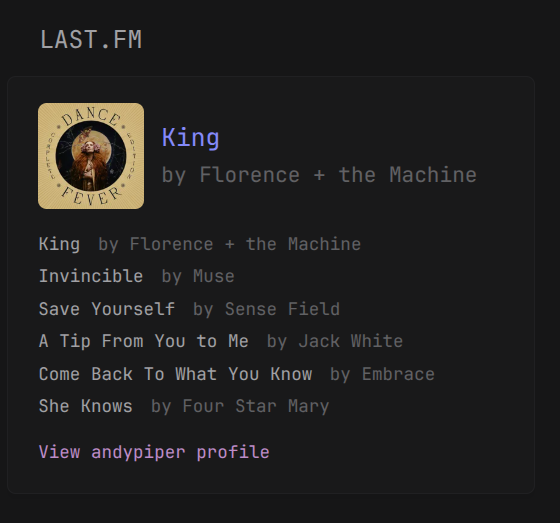

## Preview



## Configuration

```yaml
- type: custom-api
  title: Last.FM
  cache: 60s
  url: http://ws.audioscrobbler.com/2.0/
  parameters:
    method: user.getRecentTracks
    user: ${LASTFM_USERNAME}
    api_key: ${LASTFM_API_KEY}
    format: json
    limit: 5
    nowplaying: true
  template: |
    <div class="widget-content-frameless">
      <div class="lastfm-now-playing">
        {{ $recenttracks := .JSON.Get "recenttracks" }}
        {{ $user := .JSON.String "recenttracks.@attr.user" }}
        {{ if $recenttracks.Exists }}
          {{ $tracks := $recenttracks.Get "track" }}
          {{ if $tracks.Exists }}
            {{ $trackArray := $tracks.Array }}
            {{ if gt (len $trackArray) 0 }}
              {{ $currentTrack := index $trackArray 0 }}
              {{ $nowPlaying := $currentTrack.Get "@attr.nowplaying" }}
              {{ $currentTrackName := $currentTrack.Get "name" }}
              {{ $currentArtistName := $currentTrack.Get "artist.#text" }}
              {{ $imageURL := $currentTrack.Get "image.2.#text" }}
              {{ $trackURL := $currentTrack.Get "url" }}
              {{ if eq ($nowPlaying.String) "true" }}
                <div class="current-track cards-horizontal flex items-center gap-10">
                  {{ if $imageURL.Exists }}
                    
                  {{ end }}
                  <div class="flex-1 min-width-0">
                    <div class="size-h4 color-primary">{{ $currentTrackName.String }}</div>
                    <div class="size-h5 color-subdue">by {{ $currentArtistName }}</div>
                  </div>
                </div>
              {{ else }}
                <div class="last-played cards-horizontal flex items-center gap-10">
                  {{ if $imageURL.Exists }}
                    
                  {{ end }}
                  <div class="flex-1 min-width-0">
                    <div class="size-h4 color-primary">{{ $currentTrackName.String }}</div>
                    <div class="size-h5 color-subdue">by {{ $currentArtistName.String }}</div>
                  </div>
                </div>
              {{ end }}
            {{ end }}
          {{ end }}
          <ul class="recent-tracks">
            {{ range $track := $tracks.Array }}
              {{ $artistName := $track.Get "artist.#text" }}
              {{ $trackName := $track.Get "name" }}
              {{ $trackURL := $track.Get "url" }}
              <li class="flex items-center gap-10">
              <a href="{{ $trackURL.String }}" target="_blank" rel="noreferrer">
               {{ $trackName.String }}
              </a>
              <span class="color-subdue">by
                <a href="https://www.last.fm/music/{{ $artistName.String }}" target="_blank" rel="noreferrer">
                 {{ $artistName }}
                </a>
              </span>
              </li>
            {{ end }}
          </ul>
        {{ end }}
        <div class="user-profile color-positive">
          <a href="https://www.last.fm/user/{{ $user }}" target="_blank" rel="noreferrer">
            View {{ $user }} profile
          </a>
        </div>
      </div>
      <style>
        .lastfm-now-playing { font-size: 1rem; }
        .recent-tracks { list-style: none; padding: 0; margin: 0; }
        .recent-tracks li { margin: 0.25rem 0; }
        .user-profile { margin-top: 1rem; }
        img.album-art { border-radius: 5px; min-width: 6rem; max-width: 6rem; object-fit: cover; }
      </style>
    </div>
```

## Environment Variables

- `LASTFM_USERNAME` - your Last.FM username, e.g. `andypiper`
- `LASTFM_API_KEY` - a Last.FM API key, which you can obtain from [here](https://www.last.fm/api/accounts)
