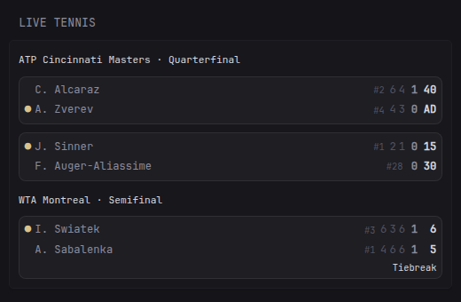

# 🎾 Live Tennis Matches

Shows currently live ATP/WTA tennis matches from the [Live Tennis API](https://livetennisapi.com) —
players (with rankings and a serving indicator), per-set game scores, current game points,
set counts, tiebreak indicator, and tournament/round group headers.

## Preview



## Features

- 🟢 Serving indicator (dot next to the player currently serving)
- Set-by-set game scores + bold sets-won count + current game points (`15/30/40/AD`, tiebreak points)
- `Tiebreak` badge while a tiebreak is in progress
- Tournament · Round group headers, deduplicated across consecutive matches from the same event
- Graceful states: "No live matches" when nothing is on, "score unavailable" when the API returns a
  match without score data, and an explicit error line if your API key is missing/invalid (HTTP 401)

## Setup

1. Get a **free API key** from [livetennisapi.com/subscribe/free](https://livetennisapi.com/subscribe/free)
   (free tier: **1,000 requests/day**).
2. Expose it to Glance as the `LIVETENNIS_API_KEY` environment variable (e.g. in your
   `docker-compose.yml`):

```yaml
environment:
  - LIVETENNIS_API_KEY=your-key-here
```

3. Add the widget below to your `glance.yml`.

### Quota note

The widget uses `cache: 2m`, which means at most ~720 requests/day (30/hour × 24h) — comfortably
inside the free tier's 1,000/day even with the dashboard open around the clock. If you include this
widget on **multiple pages/dashboards sharing one key**, or lower the cache, do the math:
`1440 / cache-minutes` requests/day per widget instance. Anything at `cache: 90s` or below can
exceed the free quota on its own; `2m` is the recommended floor.

## Widget YAML

```yaml
- type: custom-api
  title: Live Tennis
  cache: 2m
  url: https://api.livetennisapi.com/api/public/v1/matches?status=live&limit=10
  headers:
    x-api-key: ${LIVETENNIS_API_KEY}
  template: |
    {{ if ne .Response.StatusCode 200 }}
      <div class="color-negative">Failed to fetch matches (HTTP {{ .Response.StatusCode }}) &mdash; check your LIVETENNIS_API_KEY</div>
    {{ else }}
    {{ $matches := .JSON.Array "data" }}
    {{ if $matches }}
      <div class="flex flex-column gap-10">
        {{ $prevLabel := "" }}
        {{ range $matches }}
          {{ $m := . }}
          {{ $label := $m.String "tournament" }}
          {{ $round := $m.String "round" }}
          {{ $round = trimPrefix $label $round }}
          {{ $round = trimPrefix " - " $round }}
          {{ $round = trimPrefix "- " $round }}
          {{ $round = trimPrefix " " $round }}
          {{ if $round }}{{ $label = concat $label " · " $round }}{{ end }}
          {{ if ne $label $prevLabel }}
            <div class="size-h5 color-highlight text-truncate" style="margin-top: 0.3rem;">{{ $label }}</div>
            {{ $prevLabel = $label }}
          {{ end }}
          {{ $hasScore := $m.Exists "score.sets" }}
          {{ $winner := $m.Int "winner" }}
          {{ $server := $m.Int "score.server" }}
          <div style="padding: 0.4rem 0.6rem; border: 1px solid rgba(255, 255, 255, 0.08); border-radius: 8px; background: rgba(255, 255, 255, 0.03);">
            <div class="flex items-center" style="gap: 0.45rem; padding: 0.15rem 0;">
              <span style="width: 0.8rem; text-align: center; flex-shrink: 0;">{{ if and $hasScore (eq $server 1) (eq $winner 0) }}<span class="color-positive">&#9679;</span>{{ end }}</span>
              <span class="text-truncate{{ if eq $winner 1 }} color-positive{{ end }}" style="flex: 1; min-width: 0;">{{ $m.String "players.p1.name" }}</span>
              {{ if gt ($m.Int "players.p1.ranking") 0 }}<span class="color-subdue size-h6" style="flex-shrink: 0;">#{{ $m.Int "players.p1.ranking" }}</span>{{ end }}
              {{ if $hasScore }}
                <span class="color-subdue" style="font-variant-numeric: tabular-nums; flex-shrink: 0;">{{ range $m.Array "score.games.0" }}<span style="display: inline-block; min-width: 1.1rem; text-align: center;">{{ .Int "" }}</span>{{ end }}</span>
                <span style="font-weight: 700; min-width: 1rem; text-align: center; flex-shrink: 0;">{{ $m.Int "score.sets.0" }}</span>
                <span class="color-highlight" style="font-weight: 600; min-width: 1.7rem; text-align: right; font-variant-numeric: tabular-nums; flex-shrink: 0;">{{ $m.String "score.points.0" }}</span>
              {{ end }}
            </div>
            <div class="flex items-center" style="gap: 0.45rem; padding: 0.15rem 0;">
              <span style="width: 0.8rem; text-align: center; flex-shrink: 0;">{{ if and $hasScore (eq $server 2) (eq $winner 0) }}<span class="color-positive">&#9679;</span>{{ end }}</span>
              <span class="text-truncate{{ if eq $winner 2 }} color-positive{{ end }}" style="flex: 1; min-width: 0;">{{ $m.String "players.p2.name" }}</span>
              {{ if gt ($m.Int "players.p2.ranking") 0 }}<span class="color-subdue size-h6" style="flex-shrink: 0;">#{{ $m.Int "players.p2.ranking" }}</span>{{ end }}
              {{ if $hasScore }}
                <span class="color-subdue" style="font-variant-numeric: tabular-nums; flex-shrink: 0;">{{ range $m.Array "score.games.1" }}<span style="display: inline-block; min-width: 1.1rem; text-align: center;">{{ .Int "" }}</span>{{ end }}</span>
                <span style="font-weight: 700; min-width: 1rem; text-align: center; flex-shrink: 0;">{{ $m.Int "score.sets.1" }}</span>
                <span class="color-highlight" style="font-weight: 600; min-width: 1.7rem; text-align: right; font-variant-numeric: tabular-nums; flex-shrink: 0;">{{ $m.String "score.points.1" }}</span>
              {{ end }}
            </div>
            {{ if and $hasScore ($m.Bool "score.is_tiebreak") }}
              <div class="size-h6 color-highlight" style="text-align: right;">Tiebreak</div>
            {{ end }}
            {{ if not $hasScore }}
              <div class="size-h6 color-subdue" style="text-align: right;">score unavailable</div>
            {{ end }}
          </div>
        {{ end }}
      </div>
    {{ else }}
      <div class="color-subdue">No live matches</div>
    {{ end }}
    {{ end }}
```

## Notes

- The API returns up to 10 live matches with `limit=10`; bump the `limit` URL parameter if you want
  more (the free tier allows it — it's still one request).
- Rankings are hidden for unranked players (e.g. qualifiers, `ranking: 0`).
- Tested in a full-size column; it also fits narrow columns thanks to name truncation.
