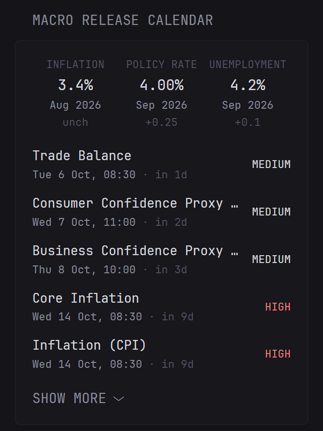

# Macro Release Calendar

Shows the next scheduled US economic data releases (CPI, payrolls, retail sales, Fed decisions and so on) with their release time, a countdown and an importance rating. Above the list is a strip with the latest inflation, policy rate and unemployment prints and the change from the previous release.

Data comes from the [FXMacroData](https://fxmacrodata.com/?utm_source=github&utm_medium=referral&utm_campaign=community-widgets&utm_content=readme) API. USD works without an API key or sign-up.



```yaml
- type: custom-api
  title: Macro Release Calendar
  cache: 15m
  url: https://api.fxmacrodata.com/v1/calendar/usd
  subrequests:
    inflation:
      url: https://api.fxmacrodata.com/v1/announcements/usd/inflation?limit=1
    policy-rate:
      url: https://api.fxmacrodata.com/v1/announcements/usd/policy_rate?limit=1
    unemployment:
      url: https://api.fxmacrodata.com/v1/announcements/usd/unemployment?limit=1
  options:
    min-importance: medium
    max-items: 10
    collapse-after: 5
  template: |
    {{ define "latest-value" }}
      {{ if and (eq .Response.StatusCode 200) (.JSON.Exists "data.0.val") }}
        {{ $decimals := "%.1f" }}
        {{ if eq (.JSON.String "indicator") "policy_rate" }}{{ $decimals = "%.2f" }}{{ end }}
        {{ $change := .JSON.Float "data.0.change_from_previous" }}
        <div class="size-h3 color-highlight">{{ printf $decimals (.JSON.Float "data.0.val") }}%</div>
        <div class="size-h6" title="{{ .JSON.String "name" }}">{{ .JSON.String "data.0.date" | parseTime "DateOnly" | formatTime "Jan 2006" }}</div>
        <div class="size-h6 color-subdue">
          {{ if gt $change 0.0 }}{{ printf (concat "%+" (trimPrefix "%" $decimals)) $change }}
          {{ else if lt $change 0.0 }}{{ printf $decimals $change }}
          {{ else }}unch{{ end }}
        </div>
      {{ else }}
        <div class="size-h3 color-subdue">n/a</div>
        <div class="size-h6 color-negative">{{ .Response.Status }}</div>
      {{ end }}
    {{ end }}

    <div class="flex justify-between text-center" style="margin-bottom: 1.5rem;">
      <div style="flex: 1;">
        <div class="size-h6 color-subdue">INFLATION</div>
        {{ template "latest-value" (.Subrequest "inflation") }}
      </div>
      <div style="flex: 1;">
        <div class="size-h6 color-subdue">POLICY RATE</div>
        {{ template "latest-value" (.Subrequest "policy-rate") }}
      </div>
      <div style="flex: 1;">
        <div class="size-h6 color-subdue">UNEMPLOYMENT</div>
        {{ template "latest-value" (.Subrequest "unemployment") }}
      </div>
    </div>

    {{ if ne .Response.StatusCode 200 }}
      <p class="color-negative">Failed to load the release calendar ({{ .Response.Status }})</p>
    {{ else }}
      {{ $minImportance := .Options.StringOr "min-importance" "medium" }}
      {{ $maxItems := .Options.IntOr "max-items" 10 }}
      {{ $nowUnix := (now).Unix }}
      {{ $count := 0 }}
      <ul class="list list-gap-10 collapsible-container" data-collapse-after="{{ .Options.IntOr "collapse-after" 5 }}">
        {{ range .JSON.Array "data" }}
          {{ $importance := .String "event_importance" }}
          {{ $show := lt $count $maxItems }}
          {{ if lt (.Int "announcement_datetime") $nowUnix }}{{ $show = false }}{{ end }}
          {{ if and (eq $minImportance "high") (ne $importance "high") }}{{ $show = false }}{{ end }}
          {{ if and (eq $minImportance "medium") (eq $importance "low") }}{{ $show = false }}{{ end }}
          {{ if $show }}
            {{ $count = add $count 1 }}
            {{ $at := .String "announcement_datetime" | parseTime "unix" }}
            {{ $name := .String "name" }}
            {{ if eq (.String "release") "policy_rate" }}{{ $name = "Policy Rate Decision" }}{{ end }}
            <li class="flex items-center gap-10">
              <div style="flex: 1; min-width: 0;">
                <div class="color-highlight text-truncate" title="{{ .String "name" }}">{{ $name }}</div>
                <div class="size-h6">
                  {{ $at | formatTime "Mon 2 Jan, 15:04" }}
                  <span class="color-subdue">&middot; <span {{ $at | toRelativeTime }}></span></span>
                </div>
              </div>
              <div class="size-h6 shrink-0 {{ if eq $importance "high" }}color-negative{{ else if eq $importance "medium" }}color-highlight{{ else }}color-subdue{{ end }}" style="text-transform: uppercase;">
                {{ $importance }}
              </div>
            </li>
          {{ end }}
        {{ end }}
      </ul>
      {{ if eq $count 0 }}
        <p class="color-subdue">No upcoming releases match the current filter.</p>
      {{ end }}
    {{ end }}
```

## Options

- `min-importance` - `low`, `medium` or `high`. Releases below this are hidden. Default `medium`.
- `max-items` - maximum number of upcoming releases to list. Default `10`.
- `collapse-after` - how many releases to show before the "show more" toggle. Default `5`.

## Notes

- Release times are rendered in the timezone of the server running Glance. Set the `TZ` environment variable on the container (e.g. `TZ=America/New_York`) to change it. The countdown ("in 2d") is worked out in the browser.
- Without a key, releases show up 15 minutes after they are published, which is fine for a dashboard. A `cache` of `15m` keeps requests low.
- The policy rate is the upper bound of the Fed funds target range.

## Using an API key / other currencies

Other currencies (EUR, GBP, JPY, AUD, CAD and more) need an API key. Replace `usd` in the four URLs with the currency code, e.g. `eur`, and add a `headers` block to the main request and to each of the three subrequests:

```yaml
  url: https://api.fxmacrodata.com/v1/calendar/eur
  headers:
    X-API-Key: ${FXMACRODATA_API_KEY}
  subrequests:
    inflation:
      url: https://api.fxmacrodata.com/v1/announcements/eur/inflation?limit=1
      headers:
        X-API-Key: ${FXMACRODATA_API_KEY}
    # same for policy-rate and unemployment
```

Only add the `headers` lines if `FXMACRODATA_API_KEY` is set, since Glance refuses to start when a referenced environment variable is missing (even inside a YAML comment).

## Environment variables

- `FXMACRODATA_API_KEY` - optional, only needed for non-USD currencies
