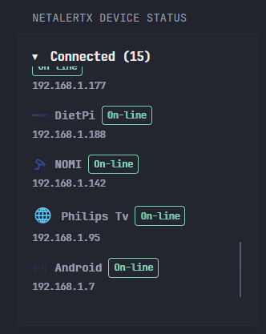

# NetAlertX Device Status Widget# NetAlertX Device Status Widget

This is a custom API widget designed to display the status of devices monitored by NetAlertX.

<p align="center">
  
</p>

## What It Does

- Count the total number of connected devices.
- Identify devices marked as connected
- Shows a scrollable list of connected devices including:
  - Device icon (using an SVG base64 image or a fallback emoji if no valid icon is available).
  - Device name.
  - Device status.
  - Last known IP address.

---

## Prerequisites

- **NetAlertX Server URL and API Token**: You need the base URL for your NetAlertX instance and a valid API token.

## Configuration

 **Environment variables**

   Make sure to define the following environment variables in your dashboard to allow the widget to access the API:

   - `NETALERTX_URL` — Base URL of your NetAlertX server - Example: 192.168.1.200:20211
   - `NETALERTX_API_TOKEN` — Your NetAlertX API bearer token. You can find it in the settings.

## **Widget YAML Configuration**

   Use the following widget YAML snippet in your dashboard configuration:

   ```yaml
   - type: custom-api
     title: NetAlertX Device Status
     method: GET
     cache: 5m
     url: http://${NETALERTX_URL}/php/server/query_json.php?file=table_devices.json
     headers:
       Accept: application/json
       Authorization: Bearer ${NETALERTX_API_TOKEN}
     template: |
       {{ $data := .JSON.Array "data" }}
       {{ $totalDevices := len $data }}
       {{ $connectedDevicesCount := 0 }}
       {{ range $dev := $data }}
         {{ if eq ($dev.Int "devPresentLastScan") 1 }}
           {{ $connectedDevicesCount = add $connectedDevicesCount 1 }}
         {{ end }}
       {{ end }}
       <div style="font-weight: bold; font-size: 1.2em; margin-bottom: 0.5em; display:flex; gap: 1rem;">
         <details style="flex: 1;" open>
           <summary class="color-highlight size-h3" style="cursor: pointer; font-weight: 600;">
             Connected ({{ $connectedDevicesCount }})
           </summary>
           <div style="max-height: 300px; overflow-y: auto; padding-right: 6px;">
             <ul style="padding-left: 0; margin: 0; list-style: none;">
               {{ range $dev := $data }}
                 {{ if eq ($dev.Int "devPresentLastScan") 1 }}
                   {{ $iconData := $dev.String "devIcon" }}
                   {{ $name := $dev.String "devName" }}
                   {{ $displayName := $name }}
                   {{ if gt (len $name) 26 }}
                     {{ $displayName = printf "%s…" (slice $name 0 26) }}
                   {{ end }}
                   <li style="margin-bottom: 1em;">
                     <div style="display: flex; align-items: center; gap: 8px; flex-wrap: wrap;">
                       {{ if or (eq $iconData "") (lt (len $iconData) 20) (and (ge (len $iconData) 2) (eq (slice $iconData 0 2) "PG")) }}
                         <!-- Fallback emoji when icon invalid or empty -->
                         <span style="font-size: 20px;">​🌐​️</span>
                       {{ else }}
                         <!-- Show SVG base64 icon -->
                         
                       {{ end }}
                       <span title="{{ $name }}" style="font-weight: 600; font-size: 0.9em; white-space: nowrap; overflow: hidden; text-overflow: ellipsis; max-width: 200px;">
                         {{ $displayName }}
                       </span>
                       <span style="padding: 2px 6px; font-size: 0.75em; color: var(--color-positive); border: 1px solid var(--color-positive); border-radius: 4px; white-space: normal; max-width: 100px; word-break: break-word;">
                         {{ $dev.String "devStatus" }}
                       </span>
                     </div>
                     <div title="{{ $dev.String "devLastIP" }}" style="font-size: 0.75em; color: var(--color-subtle); margin-top: 2px; white-space: nowrap; overflow: hidden; text-overflow: ellipsis; max-width: 200px;">
                       {{ $dev.String "devLastIP" }}
                     </div>
                   </li>
                 {{ end }}
               {{ end }}
             </ul>
           </div>
         </details>
       </div>
   ```
## Notes

- The widget caches API results for 5 minutes (`cache: 5m`) to stay updated on the status of the devices. But you can increase or decrease it.


---

## Troubleshooting

### In case of problems, check:

- Ensure environment variables `NETALERTX_URL` and `NETALERTX_API_TOKEN` are correctly set.

- Log on to NetAlertX and confirm the NetAlertX API endpoint (`/php/server/query_json.php?file=table_devices.json`) is accessible and returns proper JSON. 

- If icons do not show, the widget falls back to a globe emoji 🌐 by default. The problem is caused by the fact that the standard NetAlertX icons use Fontawesome which is not used by Glance.

- If you want **visible icons**, you have to customize them directly from NetAlertX. You can follow the guide given here > https://github.com/jokob-sk/NetAlertX/blob/main/docs/ICONS.md

---
