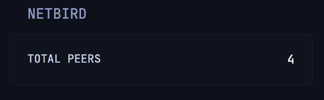

# Netbird Peers Count

Real-time total connected network peer count for your Netbird network.



```yaml
- type: custom-api
  title: Netbird Peers
  refresh-interval: 5s
  cache: 2s
  url: https://api.netbird.io/api/peers
  headers:
    Authorization: "Token ${NETBIRD_API_KEY}"
    Content-Type: application/json
  template: |
    <ul class="list list-gap-10">
      <li class="flex justify-between align-center">
        <span class="size-h6 color-paragraph">TOTAL PEERS</span>
        <span class="size-h5 color-highlight">{{ .JSON.Int "#" }}</span>
      </li>
    </ul>
```

## Environment variables

- `NETBIRD_API_KEY` - Your Netbird API Token (can be created in the NetBird dashboard under User settings)
