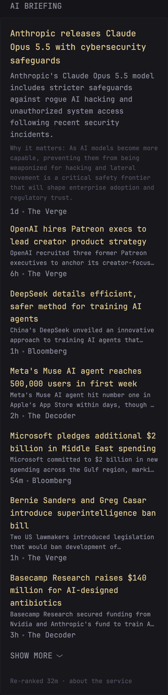

```yaml
- type: custom-api
  title: AI Briefing
  title-url: https://wholemind.tech/x4/
  url: https://briefing-service.wholemind.workers.dev/v1/briefings/ai/summary
  cache: 30m
  template: |
    <div class="margin-bottom-10">
      <a class="size-h3 color-highlight color-primary-if-not-visited" href="{{ .JSON.String "lead.link" }}" target="_blank" rel="noreferrer">{{ .JSON.String "lead.headline" }}</a>
      <p class="margin-top-5">{{ .JSON.String "lead.summary" }}</p>
      {{ if .JSON.Exists "lead.why" }}<p class="size-h6 color-subdue margin-top-5">Why it matters: {{ .JSON.String "lead.why" }}</p>{{ end }}
      <ul class="list-horizontal-text flex-nowrap margin-top-5">
        <li {{ .JSON.String "lead.published" | parseTime "rfc3339" | toRelativeTime }}></li>
        <li class="min-width-0 text-truncate">{{ .JSON.String "lead.source" }}</li>
      </ul>
    </div>
    <ul class="list list-gap-14 collapsible-container" data-collapse-after="6">
      {{ range .JSON.Array "stories" }}
      <li>
        <a class="size-h4 color-primary-if-not-visited" href="{{ .String "link" }}" target="_blank" rel="noreferrer">{{ .String "headline" }}</a>
        <p class="size-h6 text-truncate-2-lines">{{ .String "summary" }}</p>
        <ul class="list-horizontal-text flex-nowrap">
          <li {{ .String "published" | parseTime "rfc3339" | toRelativeTime }}></li>
          <li class="min-width-0 text-truncate">{{ .String "source" }}</li>
        </ul>
      </li>
      {{ end }}
    </ul>
    <div class="size-h6 color-subdue margin-top-10">Re-ranked <span {{ .JSON.String "ranked_at" | parseTime "rfc3339" | toRelativeTime }}></span> · <a href="https://briefing-service.wholemind.workers.dev/llms.txt" target="_blank" rel="noreferrer">about the service</a></div>
```

An LLM editor re-ranks about a hundred sources every hour and writes a one-line summary per story, plus a "why it matters" line for the lead. The widget shows the lead, then the ranked stories with two-line snippets, source and age, collapsed after six. Free, no API key, no sign-up: the `summary` endpoint is unmetered.

## Picking a briefing

Replace `ai` in the `url` (and the `title` / `title-url`) with any key below. Add the widget more than once for several verticals.

| Key | Title | `title-url` (the web page) | Re-ranked |
|---|---|---|---|
| `ai` | AI Briefing | https://wholemind.tech/x4/ | hourly |
| `research` | AI Research | https://wholemind.tech/x4/research/ | hourly |
| `labs` | Frontier Labs | https://wholemind.tech/x4/labs/ | hourly |
| `finance` | Markets | https://wholemind.tech/x4/finance/ | hourly |
| `sports` | US Sports | https://wholemind.tech/x4/sports/ | hourly |
| `soccer` | European Football | https://wholemind.tech/x4/soccer/ | hourly |
| `us` | US News | https://wholemind.tech/x4/us/ | hourly |
| `world` | World News | https://wholemind.tech/x4/world/ | hourly |
| `crypto` | Crypto & Onchain | https://wholemind.tech/x4/crypto/ | hourly |
| `grants` | Grants & Funding | https://wholemind.tech/x4/grants/ | daily |
| `slow-es-b1` | Noticias Lentas (simple Spanish, CEFR B1) | https://wholemind.tech/x4/slow-es-b1/ | daily |

## Options

- `data-collapse-after="6"` in the template sets how many stories show before "show more"; the response carries twelve.
- `cache: 30m` matches the hourly re-rank. Anything shorter only re-fetches the same ranking.
- Remove the `Why it matters` paragraph or the story `<p>` lines for a tighter list.

## About the data

The JSON comes from the Briefing Service (`https://briefing-service.wholemind.workers.dev/v1/briefings/<key>/summary`). Fields used: `lead.headline`, `lead.summary`, `lead.why`, `lead.link`, `lead.source`, `lead.published`, `stories[]` with the same names, and `ranked_at`. The full API, an MCP server and e-ink renders are described at https://briefing-service.wholemind.workers.dev/llms.txt. Questions or a broken layout: open an issue and mention @jshelley.
