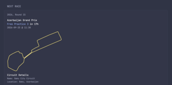
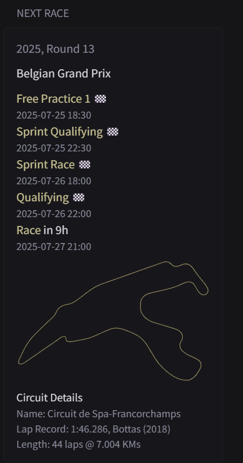
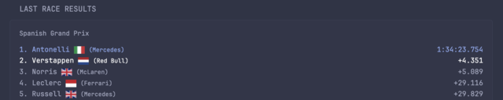
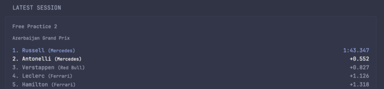
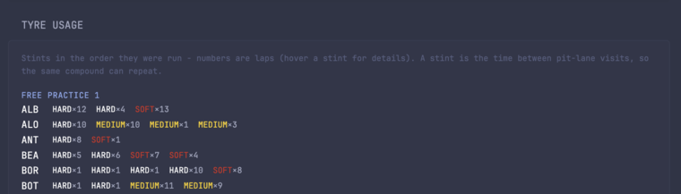
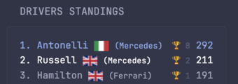
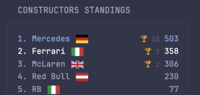

## Preview









F1 widgets backed by [paddock-api](https://github.com/drumandbytes/paddock-api), a small self-hosted API that caches around the race calendar: session times in your own timezone, a track map before qualifying (even for a new circuit), simplified team names, tyre compounds and stint lengths, and results for every session. The styling is borrowed from @abaza738's [Formula 1 Widgets](../formula1-widgets/README.md); only the data source underneath changes.

## Setup

```yaml
services:
  paddock-api:
    image: ghcr.io/drumandbytes/paddock-api:latest
    environment:
      - TIMEZONE=Europe/London   # IANA timezone for every timestamp
      - TRACK_COLOUR=#e5d486     # track-map line colour
    volumes:
      - paddock-cache:/data      # optional: keeps finished-session data across restarts
    ports:
      - 4463:4463
volumes:
  paddock-cache:
```

Every widget reads `F1_API_URL` from Glance's environment: the host where paddock-api runs, e.g. `192.168.1.10`.

## Config

### Next race

```yaml
- type: custom-api
  title: Next Race
  cache: 5m
  url: http://${F1_API_URL}:4463/f1/next_race/
  template: |
    <div class="flex flex-column gap-10">
      {{ $session := index (.JSON.Array "race") 0 }}
      <p class="size-h5">
        {{ .JSON.String "season" }}, Round {{ .JSON.String "round" }}
      </p>

      <div class="margin-block-4">
        <p class="color-highlight">
          <a href="{{ $session.String "url" }}" target="_blank" rel="noreferrer">{{ $session.String "raceName" }}</a>
        </p>
        <p class="color-primary">
          <span>
            {{ .JSON.String "next_event.session" }}
          </span>
          {{ $datetime := .JSON.String "next_event.datetime" }}
          <span
            class="color-highlight"
            {{ parseRelativeTime "rfc3339" $datetime }}
          ></span>
        </p>
        <p class="size-h5">
          {{ .JSON.String "next_event.date" }} @  {{ .JSON.String "next_event.time" }}
        </p>

        <div style="margin-block: 1rem;">
          
        </div>

        <p class="color-highlight">
          Circuit Details
        </p>
        <p class="size-h6">
          Name: <a href="{{ $session.String "circuit.url" }}" target="_blank" rel="noreferrer">{{ $session.String "circuit.circuitName" }}</a>
        </p>
        <p class="size-h6">
          Location: {{ $session.String "circuit.city" }}, {{ $session.String "circuit.country" }}
        </p>
      </div>
    </div>
```

### Next race (full schedule)

```yaml
- type: custom-api
  title: Next Race
  cache: 1h
  url: http://${F1_API_URL}:4463/f1/next_race/
  template: |
    <div class="flex flex-column gap-10">
      {{ $session := index (.JSON.Array "race") 0 }}
      <p class="size-h5" style="font-size: 15px;">
        {{ .JSON.String "season" }}, Round {{ .JSON.String "round" }}
      </p>

      <div class="margin-block-4">
        <p class="color-highlight" style="font-size: 15px;">
          <a href="{{ $session.String "url" }}" target="_blank" rel="noreferrer">{{ $session.String "raceName" }}</a>
        </p>

        <div class="margin-block-10"></div> 
        
        <!--FP1 SCHEDULE-->
        <p class="color-primary" style="font-size: 15px;">
          <span>Free Practice 1</span>
          {{ $fp1datetime := .JSON.String "race.0.schedule.fp1.datetime_rfc3339" }}
          {{ $parsedFP1Time := parseLocalTime "2006-01-02T15:04:05Z07:00" $fp1datetime }}
          {{ $now := now }}
          {{ if $parsedFP1Time.Before $now }}
            <span class="color-highlight">🏁</span>
          {{else}}
            <span
              class="color-highlight"
              {{ parseRelativeTime "rfc3339" $fp1datetime }}
            ></span>
          {{ end }}
        </p>
        {{ $fp1datetime := .JSON.String "race.0.schedule.fp1.datetime_rfc3339" }}
        {{ $part := slice $fp1datetime 0 16 }}
        {{ $fp1formatted := printf "%s %s" (slice $part 0 10) (slice $part 11 16) }}
        <p class="size-h5" style="font-size: 13px;">
          {{ $fp1formatted }}
        </p>

        <!--SQ SCHEDULE-->
        {{ if and (ne ($.JSON.String "race.0.schedule.sprintQualy.date") "null") (ne ($.JSON.String "race.0.schedule.sprintQualy.date") "") }}
          <p class="color-primary" style="font-size: 15px;">
            <span>Sprint Qualifying</span>
            {{ $sqdatetime := .JSON.String "race.0.schedule.sprintQualy.datetime_rfc3339" }}
            {{ $parsedSQTime := parseLocalTime "2006-01-02T15:04:05Z07:00" $sqdatetime }}
            {{ $now := now }}
            {{ if $parsedSQTime.Before $now }}
              <span class="color-highlight">🏁</span>
            {{else}}
              <span
                class="color-highlight"
                {{ parseRelativeTime "rfc3339" $sqdatetime }}
              ></span>
            {{ end }}
            </p>
            {{ $sqdatetime := .JSON.String "race.0.schedule.sprintQualy.datetime_rfc3339" }}
            {{ $part := slice $sqdatetime 0 16 }}
            {{ $sqformatted := printf "%s %s" (slice $part 0 10) (slice $part 11 16) }}
            <p class="size-h5" style="font-size: 13px;">
              {{ $sqformatted }}
            </p>
        {{ end }}

        <!--SR SCHEDULE-->
        {{ if and (ne ($.JSON.String "race.0.schedule.sprintRace.date") "null") (ne ($.JSON.String "race.0.schedule.sprintRace.date") "") }}
          <p class="color-primary" style="font-size: 15px;">
            <span>Sprint Race</span>
            {{ $srdatetime := .JSON.String "race.0.schedule.sprintRace.datetime_rfc3339" }}
            {{ $parsedSRTime := parseLocalTime "2006-01-02T15:04:05Z07:00" $srdatetime }}
            {{ $now := now }}
            {{ if $parsedSRTime.Before $now }}
              <span class="color-highlight">🏁</span>
            {{else}}
              <span
                class="color-highlight"
                {{ parseRelativeTime "rfc3339" $srdatetime }}
              ></span>
            {{ end }}
            </p>
            {{ $srdatetime := .JSON.String "race.0.schedule.sprintRace.datetime_rfc3339" }}
            {{ $part := slice $srdatetime 0 16 }}
            {{ $srformatted := printf "%s %s" (slice $part 0 10) (slice $part 11 16) }}
            <p class="size-h5" style="font-size: 13px;">
              {{ $srformatted }}
            </p>
        {{ end }}

        <!--FP2 SCHEDULE-->
        {{ if and (ne ($.JSON.String "race.0.schedule.fp2.date") "null") (ne ($.JSON.String "race.0.schedule.fp2.date") "") }}
          <p class="color-primary" style="font-size: 15px;">
            <span>Free Practice 2</span>
            {{ $fp2datetime := .JSON.String "race.0.schedule.fp2.datetime_rfc3339" }}
            {{ $parsedFP2Time := parseLocalTime "2006-01-02T15:04:05Z07:00" $fp2datetime }}
            {{ $now := now }}
            {{ if $parsedFP2Time.Before $now }}
              <span class="color-highlight">🏁</span>
            {{else}}
              <span
                class="color-highlight"
                {{ parseRelativeTime "rfc3339" $fp2datetime }}
              ></span>
            {{ end }}
            </p>
            {{ $fp2datetime := .JSON.String "race.0.schedule.fp2.datetime_rfc3339" }}
            {{ $part := slice $fp2datetime 0 16 }}
            {{ $fp2formatted := printf "%s %s" (slice $part 0 10) (slice $part 11 16) }}
            <p class="size-h5" style="font-size: 13px;">
              {{ $fp2formatted }}
            </p>
        {{ end }}        
        
        <!--FP3 SCHEDULE-->
        {{ if and (ne ($.JSON.String "race.0.schedule.fp3.date") "null") (ne ($.JSON.String "race.0.schedule.fp3.date") "") }}
          <p class="color-primary" style="font-size: 15px;">
            <span>Free Practice 3</span>
            {{ $fp3datetime := .JSON.String "race.0.schedule.fp3.datetime_rfc3339" }}
            {{ $parsedFP3Time := parseLocalTime "2006-01-02T15:04:05Z07:00" $fp3datetime }}
            {{ $now := now }}
            {{ if $parsedFP3Time.Before $now }}
              <span class="color-highlight">🏁</span>
            {{else}}
              <span
                class="color-highlight"
                {{ parseRelativeTime "rfc3339" $fp3datetime }}
              ></span>
            {{ end }}
            </p>
            {{ $fp3datetime := .JSON.String "race.0.schedule.fp3.datetime_rfc3339" }}
            {{ $part := slice $fp3datetime 0 16 }}
            {{ $fp3formatted := printf "%s %s" (slice $part 0 10) (slice $part 11 16) }}
            <p class="size-h5" style="font-size: 13px;">
              {{ $fp3formatted }}
            </p>
        {{ end }}

        <!--QUALY SCHEDULE-->
        {{ if and (ne ($.JSON.String "race.0.schedule.qualy.date") "null") (ne ($.JSON.String "race.0.schedule.qualy.date") "") }}
          <p class="color-primary" style="font-size: 15px;">
            <span>Qualifying</span>
            {{ $qualydatetime := .JSON.String "race.0.schedule.qualy.datetime_rfc3339" }}
            {{ $parsedQUALYTime := parseLocalTime "2006-01-02T15:04:05Z07:00" $qualydatetime }}
            {{ $now := now }}
            {{ if $parsedQUALYTime.Before $now }}
              <span class="color-highlight">🏁</span>
            {{else}}
              <span
                class="color-highlight"
                {{ parseRelativeTime "rfc3339" $qualydatetime }}
              ></span>
            {{ end }}
            </p>
            {{ $qualydatetime := .JSON.String "race.0.schedule.qualy.datetime_rfc3339" }}
            {{ $part := slice $qualydatetime 0 16 }}
            {{ $qualyformatted := printf "%s %s" (slice $part 0 10) (slice $part 11 16) }}
            <p class="size-h5" style="font-size: 13px;">
              {{ $qualyformatted }}
            </p>
        {{ end }}

        <!--RACE SCHEDULE-->
        {{ if and (ne ($.JSON.String "race.0.schedule.race.date") "null") (ne ($.JSON.String "race.0.schedule.race.date") "") }}
          <p class="color-primary" style="font-size: 15px;">
            <span>Race</span>
            {{ $racedatetime := .JSON.String "race.0.schedule.race.datetime_rfc3339" }}
            {{ $parsedRACEime := parseLocalTime "2006-01-02T15:04:05Z07:00" $racedatetime }}
            {{ $now := now }}
            {{ if $parsedRACEime.Before $now }}
              <span class="color-highlight">🏁</span>
            {{else}}
              <span
                class="color-highlight"
                {{ parseRelativeTime "rfc3339" $racedatetime }}
              ></span>
            {{ end }}
            </p>
            {{ $racedatetime := .JSON.String "race.0.schedule.race.datetime_rfc3339" }}
            {{ $part := slice $racedatetime 0 16 }}
            {{ $raceformatted := printf "%s %s" (slice $part 0 10) (slice $part 11 16) }}
            <p class="size-h5" style="font-size: 13px;">
              {{ $raceformatted }}
            </p>
        {{ end }}

      </div>
    </div>

        <div style="margin-block: 1rem;">
          
        </div>

        <p class="color-highlight" style="font-size: 14px;">
          Circuit Details
        </p>
        <p class="size-h6" style="font-size: 13px;">
          Name: <a href="{{ $session.String "circuit.url" }}" target="_blank" rel="noreferrer">{{ $session.String "circuit.circuitName" }}</a>
        </p>
        <p class="size-h6" style="font-size: 13px;">
          Location: {{ $session.String "circuit.city" }}, {{ $session.String "circuit.country" }}
        </p>
```

### Last race results

```yaml
- type: custom-api
  title: Last Race Results
  cache: 1d
  url: http://${F1_API_URL}:4463/f1/last_race/
  template: |
    <div class="flex flex-column gap-10">
      {{ $rn := .JSON.String "raceName" }}
      {{ $ru := .JSON.String "url" }}
      <p class="size-h5">
        {{ if $ru }}<a href="{{ $ru }}" target="_blank" rel="noreferrer">{{ $rn }}</a>{{ else }}{{ $rn }}{{ end }}
      </p>
      <ul class="list collapsible-container" data-collapse-after="5">
        {{ range $i, $v := .JSON.Array "results" }}
        <li class="flex items-center {{ if eq $i 0 }}color-primary{{ else if eq $i 1 }}color-highlight{{ end }}">
          <div class="grow min-width-0">
          <span>{{ .String "position" }}. {{ .String "surname" }} 
          </span>
          {{ $id := .String "teamId" }}
            <span class="size-h6">
              ( {{- if eq $id "red_bull" -}}Red Bull
              {{- else if eq $id "aston_martin" -}}Aston Martin
              {{- else if eq $id "mercedes" -}}Mercedes
              {{- else if eq $id "ferrari" -}}Ferrari
              {{- else if eq $id "mclaren" -}}McLaren
              {{- else if eq $id "williams" -}}Williams
              {{- else if eq $id "alpine" -}}Alpine
              {{- else if eq $id "haas" -}}Haas
              {{- else if eq $id "rb" -}}RB
              {{- else if eq $id "sauber" -}}Sauber
              {{- else if eq $id "audi" -}}Audi
              {{- else if eq $id "cadillac" -}}Cadillac
              {{- else -}}{{ $id }}{{- end -}})
            </span>
        </div>
          <span class="shrink-0 text-right">{{ .String "time" }}</span>
        </li>
        {{ end }}
      </ul>
    </div>
```

### Latest session (practice, qualifying, sprint)

```yaml
- type: custom-api
  title: Latest Session
  cache: 5m
  url: http://${F1_API_URL}:4463/f1/latest_session/
  # Latest finished non-race session (the GP is Last Race Results' job). OpenF1
  # locks out free access while a session is live, so until the new one shows up
  # the previous session's results are shown with a note.
  template: |
    {{ $session := .JSON.String "session" }}
    {{ $rows := .JSON.Array "results" }}
    {{ if not $session }}
    <p class="color-base text-center">No completed session yet.</p>
    {{ else }}
    <div class="flex flex-column gap-10">
      <p class="size-h5">{{ $session }}</p>
      {{ $pending := .JSON.String "pending" }}
      {{ if $pending }}<p class="size-h6 color-negative">{{ $pending }} results not available yet - showing the last complete session.</p>{{ end }}
      <p class="size-h6 color-base">
        {{ $url := .JSON.String "url" }}
        {{ if $url }}<a href="{{ $url }}" target="_blank" rel="noreferrer">{{ .JSON.String "raceName" }}</a>{{ else }}{{ .JSON.String "raceName" }}{{ end }}
      </p>
      {{ if eq (len $rows) 0 }}
        {{ if .JSON.String "upstream_error" }}
        <p class="color-base text-center">Results unavailable right now - OpenF1 locks out free access while a session is live. Back shortly after it ends.</p>
        {{ else }}
        <p class="color-base text-center">No results yet.</p>
        {{ end }}
      {{ else }}
      <ul class="list collapsible-container" data-collapse-after="5">
        {{ range $i, $v := $rows }}
        <li class="flex items-center {{ if eq $i 0 }}color-primary{{ else if eq $i 1 }}color-highlight{{ end }}">
          <div class="grow min-width-0">
            <span>{{ .String "position" }}. {{ .String "surname" }}</span>
            {{ if .String "team" }}<span class="size-h6">({{ .String "team" }})</span>{{ end }}
          </div>
          <span class="shrink-0 text-right">{{ .String "time" }}</span>
        </li>
        {{ end }}
      </ul>
      {{ end }}
    </div>
    {{ end }}
```

### Tyre usage per session

```yaml
- type: custom-api
  title: Tyre Usage
  cache: 5m
  url: http://${F1_API_URL}:4463/f1/tyre_usage/
  # Usage only: there's no source for pre-weekend allocation. Session keys are null
  # until scheduled, so between weekends this prints an explicit "no data yet"
  # (Glance renders the title regardless, so the tile can't be hidden).
  template: |
    <div class="flex flex-column gap-15">
      {{ $fp1 := .JSON.Array "sessions.fp1" }}
      {{ $fp2 := .JSON.Array "sessions.fp2" }}
      {{ $fp3 := .JSON.Array "sessions.fp3" }}
      {{ $sq := .JSON.Array "sessions.sprintQualy" }}
      {{ $sr := .JSON.Array "sessions.sprintRace" }}
      {{ $qualy := .JSON.Array "sessions.qualy" }}
      {{ $race := .JSON.Array "sessions.race" }}
      {{ if and (eq (len $fp1) 0) (eq (len $fp2) 0) (eq (len $fp3) 0) (eq (len $sq) 0) (eq (len $sr) 0) (eq (len $qualy) 0) (eq (len $race) 0) }}
      {{ if .JSON.String "upstream_error" }}
      <p class="color-base text-center">Tyre data unavailable right now - OpenF1 locks out free access while a session is live. Back shortly after it ends.</p>
      {{ else }}
      <p class="color-base text-center">No tyre data yet - check back once a session starts.</p>
      {{ end }}
      {{ else }}
      <p class="size-h6 color-subdue">Stints in the order they were run - numbers are laps (hover a stint for details). A stint is the time between pit-lane visits, so the same compound can repeat.</p>
      {{ if gt (len $fp1) 0 }}
      <div>
        <p class="color-primary size-h6 uppercase margin-bottom-6" style="letter-spacing: 0.5px;">Free Practice 1</p>
        <ul class="list collapsible-container" data-collapse-after="6" style="--list-gap: 6px;">
          {{ range $fp1 }}
          <li class="flex items-center" style="gap: 8px;">
            <span class="color-highlight" style="min-width: 34px;">{{ .String "driver" }}</span>
            <span class="size-h6">
              {{ range $i, $st := .Array "stints" }}{{ $c := $st.String "compound" }}{{ $n := $st.Int "laps" }}<span title="Stint {{ add $i 1 }}: {{ $c }}, {{ $n }} {{ if eq $n 1 }}lap{{ else }}laps{{ end }}">{{ if eq $c "SOFT" }}<span style="color: #da291c;">{{ else if eq $c "MEDIUM" }}<span style="color: #ffd400;">{{ else if eq $c "HARD" }}<span class="color-highlight">{{ else if eq $c "INTERMEDIATE" }}<span style="color: #43b02a;">{{ else if eq $c "WET" }}<span style="color: #0090d4;">{{ else }}<span>{{ end }}{{ $c }}</span>&times;{{ $n }}</span>&nbsp;&nbsp;{{ end }}
            </span>
          </li>
          {{ end }}
        </ul>
      </div>
      {{ end }}

      {{ if gt (len $fp2) 0 }}
      <div>
        <p class="color-primary size-h6 uppercase margin-bottom-6" style="letter-spacing: 0.5px;">Free Practice 2</p>
        <ul class="list collapsible-container" data-collapse-after="6" style="--list-gap: 6px;">
          {{ range $fp2 }}
          <li class="flex items-center" style="gap: 8px;">
            <span class="color-highlight" style="min-width: 34px;">{{ .String "driver" }}</span>
            <span class="size-h6">
              {{ range $i, $st := .Array "stints" }}{{ $c := $st.String "compound" }}{{ $n := $st.Int "laps" }}<span title="Stint {{ add $i 1 }}: {{ $c }}, {{ $n }} {{ if eq $n 1 }}lap{{ else }}laps{{ end }}">{{ if eq $c "SOFT" }}<span style="color: #da291c;">{{ else if eq $c "MEDIUM" }}<span style="color: #ffd400;">{{ else if eq $c "HARD" }}<span class="color-highlight">{{ else if eq $c "INTERMEDIATE" }}<span style="color: #43b02a;">{{ else if eq $c "WET" }}<span style="color: #0090d4;">{{ else }}<span>{{ end }}{{ $c }}</span>&times;{{ $n }}</span>&nbsp;&nbsp;{{ end }}
            </span>
          </li>
          {{ end }}
        </ul>
      </div>
      {{ end }}

      {{ if gt (len $fp3) 0 }}
      <div>
        <p class="color-primary size-h6 uppercase margin-bottom-6" style="letter-spacing: 0.5px;">Free Practice 3</p>
        <ul class="list collapsible-container" data-collapse-after="6" style="--list-gap: 6px;">
          {{ range $fp3 }}
          <li class="flex items-center" style="gap: 8px;">
            <span class="color-highlight" style="min-width: 34px;">{{ .String "driver" }}</span>
            <span class="size-h6">
              {{ range $i, $st := .Array "stints" }}{{ $c := $st.String "compound" }}{{ $n := $st.Int "laps" }}<span title="Stint {{ add $i 1 }}: {{ $c }}, {{ $n }} {{ if eq $n 1 }}lap{{ else }}laps{{ end }}">{{ if eq $c "SOFT" }}<span style="color: #da291c;">{{ else if eq $c "MEDIUM" }}<span style="color: #ffd400;">{{ else if eq $c "HARD" }}<span class="color-highlight">{{ else if eq $c "INTERMEDIATE" }}<span style="color: #43b02a;">{{ else if eq $c "WET" }}<span style="color: #0090d4;">{{ else }}<span>{{ end }}{{ $c }}</span>&times;{{ $n }}</span>&nbsp;&nbsp;{{ end }}
            </span>
          </li>
          {{ end }}
        </ul>
      </div>
      {{ end }}

      {{ if gt (len $sq) 0 }}
      <div>
        <p class="color-primary size-h6 uppercase margin-bottom-6" style="letter-spacing: 0.5px;">Sprint Qualifying</p>
        <ul class="list collapsible-container" data-collapse-after="6" style="--list-gap: 6px;">
          {{ range $sq }}
          <li class="flex items-center" style="gap: 8px;">
            <span class="color-highlight" style="min-width: 34px;">{{ .String "driver" }}</span>
            <span class="size-h6">
              {{ range $i, $st := .Array "stints" }}{{ $c := $st.String "compound" }}{{ $n := $st.Int "laps" }}<span title="Stint {{ add $i 1 }}: {{ $c }}, {{ $n }} {{ if eq $n 1 }}lap{{ else }}laps{{ end }}">{{ if eq $c "SOFT" }}<span style="color: #da291c;">{{ else if eq $c "MEDIUM" }}<span style="color: #ffd400;">{{ else if eq $c "HARD" }}<span class="color-highlight">{{ else if eq $c "INTERMEDIATE" }}<span style="color: #43b02a;">{{ else if eq $c "WET" }}<span style="color: #0090d4;">{{ else }}<span>{{ end }}{{ $c }}</span>&times;{{ $n }}</span>&nbsp;&nbsp;{{ end }}
            </span>
          </li>
          {{ end }}
        </ul>
      </div>
      {{ end }}

      {{ if gt (len $sr) 0 }}
      <div>
        <p class="color-primary size-h6 uppercase margin-bottom-6" style="letter-spacing: 0.5px;">Sprint</p>
        <ul class="list collapsible-container" data-collapse-after="6" style="--list-gap: 6px;">
          {{ range $sr }}
          <li class="flex items-center" style="gap: 8px;">
            <span class="color-highlight" style="min-width: 34px;">{{ .String "driver" }}</span>
            <span class="size-h6">
              {{ range $i, $st := .Array "stints" }}{{ $c := $st.String "compound" }}{{ $n := $st.Int "laps" }}<span title="Stint {{ add $i 1 }}: {{ $c }}, {{ $n }} {{ if eq $n 1 }}lap{{ else }}laps{{ end }}">{{ if eq $c "SOFT" }}<span style="color: #da291c;">{{ else if eq $c "MEDIUM" }}<span style="color: #ffd400;">{{ else if eq $c "HARD" }}<span class="color-highlight">{{ else if eq $c "INTERMEDIATE" }}<span style="color: #43b02a;">{{ else if eq $c "WET" }}<span style="color: #0090d4;">{{ else }}<span>{{ end }}{{ $c }}</span>&times;{{ $n }}</span>&nbsp;&nbsp;{{ end }}
            </span>
          </li>
          {{ end }}
        </ul>
      </div>
      {{ end }}

      {{ if gt (len $qualy) 0 }}
      <div>
        <p class="color-primary size-h6 uppercase margin-bottom-6" style="letter-spacing: 0.5px;">Qualifying</p>
        <ul class="list collapsible-container" data-collapse-after="6" style="--list-gap: 6px;">
          {{ range $qualy }}
          <li class="flex items-center" style="gap: 8px;">
            <span class="color-highlight" style="min-width: 34px;">{{ .String "driver" }}</span>
            <span class="size-h6">
              {{ range $i, $st := .Array "stints" }}{{ $c := $st.String "compound" }}{{ $n := $st.Int "laps" }}<span title="Stint {{ add $i 1 }}: {{ $c }}, {{ $n }} {{ if eq $n 1 }}lap{{ else }}laps{{ end }}">{{ if eq $c "SOFT" }}<span style="color: #da291c;">{{ else if eq $c "MEDIUM" }}<span style="color: #ffd400;">{{ else if eq $c "HARD" }}<span class="color-highlight">{{ else if eq $c "INTERMEDIATE" }}<span style="color: #43b02a;">{{ else if eq $c "WET" }}<span style="color: #0090d4;">{{ else }}<span>{{ end }}{{ $c }}</span>&times;{{ $n }}</span>&nbsp;&nbsp;{{ end }}
            </span>
          </li>
          {{ end }}
        </ul>
      </div>
      {{ end }}

      {{ if gt (len $race) 0 }}
      <div>
        <p class="color-primary size-h6 uppercase margin-bottom-6" style="letter-spacing: 0.5px;">Race</p>
        <ul class="list collapsible-container" data-collapse-after="6" style="--list-gap: 6px;">
          {{ range $race }}
          <li class="flex items-center" style="gap: 8px;">
            <span class="color-highlight" style="min-width: 34px;">{{ .String "driver" }}</span>
            <span class="size-h6">
              {{ range $i, $st := .Array "stints" }}{{ $c := $st.String "compound" }}{{ $n := $st.Int "laps" }}<span title="Stint {{ add $i 1 }}: {{ $c }}, {{ $n }} {{ if eq $n 1 }}lap{{ else }}laps{{ end }}">{{ if eq $c "SOFT" }}<span style="color: #da291c;">{{ else if eq $c "MEDIUM" }}<span style="color: #ffd400;">{{ else if eq $c "HARD" }}<span class="color-highlight">{{ else if eq $c "INTERMEDIATE" }}<span style="color: #43b02a;">{{ else if eq $c "WET" }}<span style="color: #0090d4;">{{ else }}<span>{{ end }}{{ $c }}</span>&times;{{ $n }}</span>&nbsp;&nbsp;{{ end }}
            </span>
          </li>
          {{ end }}
        </ul>
      </div>
      {{ end }}
      {{ end }}
    </div>
```

### Drivers' championship

```yaml
- type: custom-api
  title: Drivers Standings
  cache: 5m
  url: http://${F1_API_URL}:4463/f1/drivers_standings/
  template: |
    <ul class="list collapsible-container" data-collapse-after="3">
      {{ range $i, $v := .JSON.Array "drivers" }}
      <li class="flex items-center {{ if eq $i 0 }}color-primary{{ else if eq $i 1 }}color-highlight{{ end }}">
        <div class="grow min-width-0">
          <span>
            {{ .String "position" }}. {{ .String "surname" }}
            
          </span>

          {{ if .String "teamId" }}
            <span class="size-h6">({{ .String "teamId" }})</span>
          {{ end }}
        </div>
        <span class="shrink-0 text-right">
          {{ $w := .Int "wins" }}{{ if gt $w 0 }}<span class="size-h6 color-subdue" style="display: inline-block; min-width: 3.4em;" title="{{ $w }} {{ if eq $w 1 }}win{{ else }}wins{{ end }}">🏆 {{ $w }}</span> {{ end }}<span title="Points">{{ .String "points" }}</span>
        </span>
      </li>
      {{ end }}
    </ul>
```

### Constructors' championship

```yaml
- type: custom-api
  title: Constructors Standings
  cache: 5m
  url: http://${F1_API_URL}:4463/f1/constructors_standings/
  template: |
    <ul class="list collapsible-container" data-collapse-after="5">
      {{ range $i, $v := .JSON.Array "constructors" }}
      <li class="flex items-center {{ if eq $i 0 }}color-primary{{ else if eq $i 1 }}color-highlight{{ end }}">
        <span class="grow min-width-0">
          {{ .String "position" }}.
          <a href="{{ .String "wiki" }}" target="_blank" rel="noreferrer">{{ .String "team" }}</a>
          <span style="margin-left: 2px;">
            
          </span>
        </span>
        <span class="shrink-0 text-right">
          {{ $w := .Int "wins" }}{{ if gt $w 0 }}<span class="size-h6 color-subdue" style="display: inline-block; min-width: 3.4em;" title="{{ $w }} {{ if eq $w 1 }}win{{ else }}wins{{ end }}">🏆 {{ $w }}</span> {{ end }}<span title="Points">{{ .String "points" }}</span>
        </span>
      </li>
      {{ end }}
    </ul>
```
