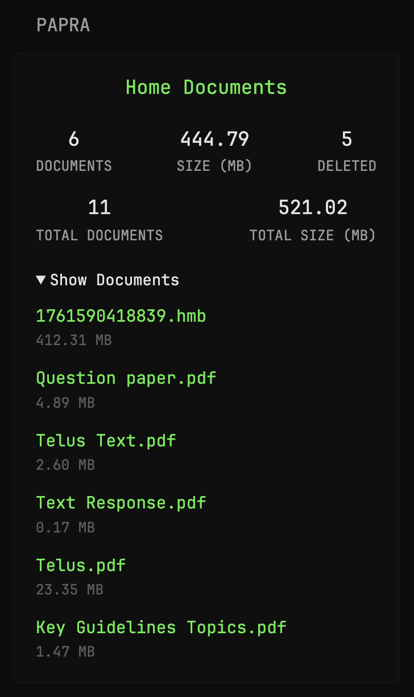

# Papra - Document management platform

A Glance **custom‑api** widget to show stats from the `Papra` application: it displays `documents`, `totalDocuments`, `deletedDocumentCount`, `sizeMB`, and a list of documents with their `name` and `link`.



## Configuration

Go to the Papra application, then navigate to `/api-keys`.  
Click on **Create API Key**, and make sure to grant **all read permissions** (at least read permission is required).  
Once the key is created, **copy** the API key.

Replace the following placeholders accordingly:
- `${PAPRA_URL}` → with your domain or IP address  
- `${ORGANISATION_ID}` → with the organisation ID (you can find it in the URL of the Papra application, **or** you can get it by making a GET request to `https://${PAPRA_URL}/api/organizations`)  
- `${API_KEY}` → with the API key you copied after creating it


```
- type: custom-api
  title: Papra
  url: https://${PAPRA_URL}/api/organizations/${ORGANISATION_ID}/documents/statistics
  headers:
    Authorization: Bearer ${API_KEY}
    Accept: application/json
  cache: 5m
  subrequests:
    documents-list:
      url: https://${PAPRA_URL}/api/organizations/${ORGANISATION_ID}/documents
      headers:
        Authorization: Bearer ${API_KEY}
        Accept: application/json
    organizations:
      url: https://${PAPRA_URL}/api/organizations
      headers:
        Authorization: Bearer ${API_KEY}
        Accept: application/json
  template: |
    {{ $docsList := .Subrequest "documents-list" }}
    {{ $orgId := "" }}
    {{ if eq $docsList.Response.StatusCode 200 }}
      {{ $orgId = $docsList.JSON.String "documents.0.organizationId" }}
    {{ end }}
    {{ $orgs := .Subrequest "organizations" }}
    {{ $orgName := "" }}
    {{ range $orgs.JSON.Array "organizations" }}
      {{ if eq (.String "id") $orgId }}
        {{ $orgName = .String "name" }}
      {{ end }}
    {{ end }}
    {{ $baseUrl := findMatch "https?://[^/]+" .Response.Request.URL.String }}
    {{ $orgUrl := concat $baseUrl "/organizations/" $orgId }}
    <div style="text-align: center; margin-bottom: 16px;">
      <a href="{{ $orgUrl }}" target="_blank" rel="noopener noreferrer" class="color-primary size-h3" style="text-decoration: none;">
        {{ $orgName }}
      </a>
    </div>
    <div class="flex justify-between text-center" style="margin-bottom: 12px;">
      <div>
        <div class="color-highlight size-h3">{{ .JSON.Int "organizationStats.documentsCount" | formatNumber }}</div>
        <div class="size-h6 uppercase">Documents</div>
      </div>
      <div>
        <div class="color-highlight size-h3">{{ div (.JSON.Int "organizationStats.documentsSize" | toFloat) 1000000 | printf "%.2f" }}</div>
        <div class="size-h6 uppercase">Size (MB)</div>
      </div>
      <div>
        <div class="color-highlight size-h3">{{ .JSON.Int "organizationStats.deletedDocumentsCount" | formatNumber }}</div>
        <div class="size-h6 uppercase">Deleted</div>
      </div>
    </div>
    <div class="flex justify-between text-center">
      <div>
        <div class="color-highlight size-h3">{{ .JSON.Int "organizationStats.totalDocumentsCount" | formatNumber }}</div>
        <div class="size-h6 uppercase">Total Documents</div>
      </div>
      <div>
        <div class="color-highlight size-h3">{{ div (.JSON.Int "organizationStats.totalDocumentsSize" | toFloat) 1000000 | printf "%.2f" }}</div>
        <div class="size-h6 uppercase">Total Size (MB)</div>
      </div>
    </div>
    {{ if eq $docsList.Response.StatusCode 200 }}
      <details style="width:100%; margin-top:16px;">
        <summary class="color-highlight size-h5" style="cursor:pointer;">
          Show Documents
        </summary>
        <ul class="list list-gap-10" style="margin-top:8px;">
          {{ range $docsList.JSON.Array "documents" }}
            {{ $docUrl := concat $baseUrl "/organizations/" (.String "organizationId") "/documents/" (.String "id") "?tab=info" }}
            <li>
              <a href="{{ $docUrl }}" target="_blank" rel="noopener noreferrer" class="color-primary" style="text-decoration: none;">
                {{ .String "name" }}
              </a>
              <div class="size-h6 color-subdue">{{ div (.Int "originalSize" | toFloat) 1000000 | printf "%.2f MB" }}</div>
            </li>
          {{ end }}
        </ul>
      </details>
    {{ end }}
```

**Made by: [Saisamarth21](https://github.com/Saisamarth21)**