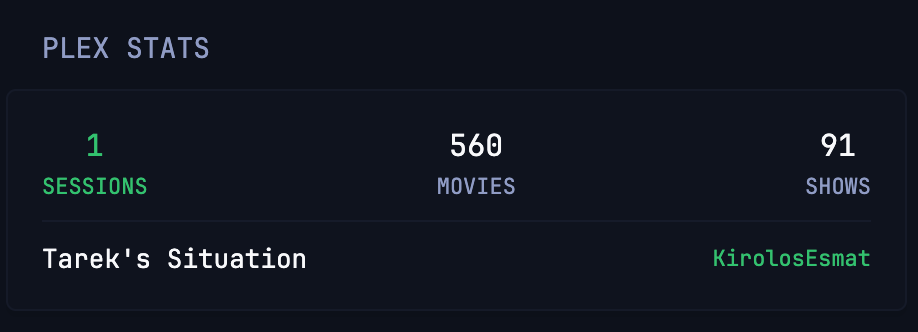

# Plex Stats

Native Plex API active sessions (dynamic highlight), active streams list by user/title, and library movie/show counts.



```yaml
- type: custom-api
  refresh-interval: 5s
  title: Plex Stats
  cache: 2s
  url: ${PLEX_URL}/status/sessions
  headers:
    Accept: application/json
    X-Plex-Token: ${PLEX_TOKEN}
  subrequests:
    movies:
      url: ${PLEX_URL}/library/sections/1/all?X-Plex-Container-Start=0&X-Plex-Container-Size=0
      headers:
        Accept: application/json
        X-Plex-Token: ${PLEX_TOKEN}
    shows:
      url: ${PLEX_URL}/library/sections/2/all?X-Plex-Container-Start=0&X-Plex-Container-Size=0
      headers:
        Accept: application/json
        X-Plex-Token: ${PLEX_TOKEN}
    server:
      url: ${PLEX_URL}/
      headers:
        Accept: application/json
        X-Plex-Token: ${PLEX_TOKEN}
  template: |
    {{- $activeStreams := .JSON.Int "MediaContainer.size" -}}
    <div class="flex justify-between text-center">
      <div>
        <div class="{{ if gt $activeStreams 0 }}color-positive{{ else }}color-highlight{{ end }} size-h3">{{ $activeStreams }}</div>
        <div class="size-h6{{ if gt $activeStreams 0 }} color-positive{{ end }}">SESSIONS</div>
      </div>
      <div>
        <div class="color-highlight size-h3">{{ (.Subrequest "movies").JSON.Int "MediaContainer.totalSize" }}</div>
        <div class="size-h6">MOVIES</div>
      </div>
      <div>
        <div class="color-highlight size-h3">{{ (.Subrequest "shows").JSON.Int "MediaContainer.totalSize" }}</div>
        <div class="size-h6">SHOWS</div>
      </div>
    </div>
    {{ if gt $activeStreams 0 }}
    <div class="margin-top-10">
      {{ range .JSON.Array "MediaContainer.Metadata" }}
        <div class="flex justify-between align-center margin-top-5">
          <span class="size-p color-highlight text-truncate" style="max-width: 65%;">{{ .String "title" }}</span>
          <span class="size-h6 color-positive">{{ .String "User.title" }}</span>
        </div>
      {{ end }}
    </div>
    {{ else }}
    <div class="text-center margin-top-10">
      <span class="size-h6 color-subdue">{{ (.Subrequest "server").JSON.String "MediaContainer.friendlyName" }}</span>
    </div>
    {{ end }}
```

## Environment variables

- `PLEX_URL` - The full URL of your Plex server, e.g. `http://192.168.1.100:32400`
- `PLEX_TOKEN` - Your Plex token for authentication. See [Finding an authentication token / X-Plex-Token](https://support.plex.tv/articles/204059436-finding-an-authentication-token-x-plex-token/)
