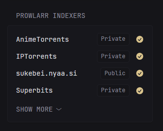

```yaml
- type: custom-api
  title: Prowlarr Indexers
  cache: 1m
  options:
    url: "${PROWLARR_URL}"
    base-url: ${PROWLARR_API_URL}
    api-key: ${PROWLARR_KEY}
    collapse-after: ${PROWLARR_COLLAPSE_AFTER}
  template: |
    {{ $apiBaseUrl := .Options.StringOr "base-url" "" }}
    {{ $key := .Options.StringOr "api-key" "" }}
    {{ $url := .Options.StringOr "url" "" }}
    {{ $collapseAfter := .Options.IntOr "collapse-after" 5 }}

    {{ if or (eq $apiBaseUrl "") (eq $key "") (eq $url "") }}
      <div class="widget-error-header">
          <div class="color-negative size-h3">ERROR</div>
          <svg class="widget-error-icon" xmlns="http://www.w3.org/2000/svg" fill="none" viewBox="0 0 24 24" stroke-width="1.5">
            <path stroke-linecap="round" stroke-linejoin="round" d="M12 9v3.75m-9.303 3.376c-.866 1.5.217 3.374 1.948 3.374h14.71c1.73 0 2.813-1.874 1.948-3.374L13.949 3.378c-.866-1.5-3.032-1.5-3.898 0L2.697 16.126ZM12 15.75h.007v.008H12v-.008Z"></path>
          </svg>
        </div>
        <p class="break-all">
          Some options are not set or malformed
            <table style="border-spacing: 1rem;">
              <tr>
                <td><strong>PROWLARR_URL & PROWLARR_API_URL</strong> <br/> should include http(s):// and port if needed</td>
              </tr>
              <tr>
                <td><strong>PROWLARR_KEY</strong> <br/> must be set (Settings > General > Security)</td>
              </tr>
            </table> 
        </p>
    {{ else }}

      {{ $indexUrl := printf "%s/api/v1/indexer" $apiBaseUrl }}

      {{ $indexData := newRequest $indexUrl
        | withHeader "Accept" "application/json"
        | withHeader "X-Api-Key" $key
        | getResponse }}

      {{ if eq $indexData.Response.StatusCode 200 }}
        <style>
          .prowlarr-indexers .prowlarr-index-item
          {
            align-items: center;        
          }
          .prowlarr-indexers .prowlarr-index-item > span{
            text-transform: capitalize;
            background: var(--color-background);
            padding: 0.2rem 0.75rem;
            border: 1px solid var(--color-widget-content-border);
            border-radius: var(--border-radius);
            font-size: var(--font-size-tiny);
          }
        </style>
  
        <ul class="prowlarr-indexers list list-gap-10 collapsible-container" data-collapse-after="{{ $collapseAfter }}">

          {{ range $indexData.JSON.Array "" }}
            {{ $isEnabled := .String "enable" }}
      
            <li class="flex items-center gap-12 prowlarr-index-item">
              <a href="{{ $url }}" target="_blank" class="size-title-dynamic color-highlight text-truncate block grow">{{ .String "name" }}</a>
              <span>{{ .String "privacy" }}</span>
              {{ if eq $isEnabled "true" }}
                <div class="margin-left-auto shrink-0" data-popover-type="text" data-popover-position="above" data-popover-text="Enabled" aria-label="Enabled">
                  <div class="monitor-site-status-icon-compact" title="Enabled">
                    <svg fill="var(--color-positive)" xmlns="http://www.w3.org/2000/svg" viewBox="0 0 20 20">
                      <path fill-rule="evenodd" d="M10 18a8 8 0 1 0 0-16 8 8 0 0 0 0 16Zm3.857-9.809a.75.75 0 0 0-1.214-.882l-3.483 4.79-1.88-1.88a.75.75 0 1 0-1.06 1.061l2.5 2.5a.75.75 0 0 0 1.137-.089l4-5.5Z" clip-rule="evenodd"></path>
                    </svg>
                  </div>
                </div>
              {{ else }}
                <div class="margin-left-auto shrink-0" data-popover-type="text" data-popover-position="above" data-popover-text="Disabled" aria-label="Disabled">
                  <div class="monitor-site-status-icon-compact" title="Disabled">
                    <svg fill="var(--color-negative)" xmlns="http://www.w3.org/2000/svg" viewBox="0 0 20 20">
                      <path fill-rule="evenodd" d="M8.485 2.495c.673-1.167 2.357-1.167 3.03 0l6.28 10.875c.673 1.167-.17 2.625-1.516 2.625H3.72c-1.347 0-2.189-1.458-1.515-2.625L8.485 2.495ZM10 5a.75.75 0 0 1 .75.75v3.5a.75.75 0 0 1-1.5 0v-3.5A.75.75 0 0 1 10 5Zm0 9a1 1 0 1 0 0-2 1 1 0 0 0 0 2Z" clip-rule="evenodd"></path>
                    </svg>
                  </div>
                </div>
              {{ end }}
              
            </li>
          {{ end }}

        </ul>
      {{ else }}
        <p>Failed to fetch data (Status: {{ $indexData.Response.StatusCode }})</p>
      {{ end }}

    {{ end }}
```
## Environment variables
- `PROWLARR_API_URL` `http(s)://ip:port`
- `PROWLARR_KEY` API Key
- `PROWLARR_URL` `http(s)://ip:port`
- `PROWLARR_COLLAPSE_AFTER` (default 5)