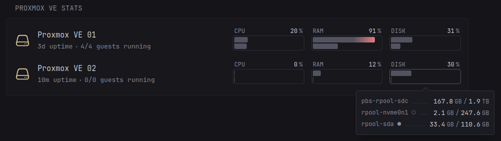

# Proxmox VE InfluxDB Stats



For each Proxmox VE node it shows the hostname, uptime, and how many guests are running out of the total (templates don't count). CPU comes with 1m/15m load averages and iowait, RAM shows usage alongside swap and ZFS ARC, and you can pick two disks per node to track, shown as a filled dot and an empty dot in the popover. A node that can't be reached just says so instead of showing stale numbers. Visually it matches Glance's built-in [Server Stats](https://github.com/glanceapp/glance/blob/main/docs/configuration.md#server-stats) widget.

## Setup

1. Run an InfluxDB server (2.x) and create a bucket for the metrics, named whatever you like, e.g. `proxmox_ve_metrics`.
2. In Proxmox VE, go to **Datacenter -> Metric Server -> Add -> InfluxDB** and point it at that server and bucket. Do this on every node or cluster you want in the widget; they can all write to the same bucket.
3. Give it a minute to start writing data, then check the bucket for the `cpustat`, `memory` and `system` measurements.
4. Create a token for the widget from the influxdb ui under **Load Data -> API Tokens -> Generate API Token -> Custom API Token**. Make it read-only and scope it to that bucket; this is your `INFLUXDB_TOKEN` below.

## Environment variables

- `INFLUXDB_URL` - base URL of your InfluxDB server, e.g. `http://192.168.1.10:8086`
- `INFLUXDB_BUCKET` - the bucket name you created in the setup step
- `INFLUXDB_TOKEN` - the read-only token you created in the setup step

## Options

- `<host>-name` - display name for the node whose InfluxDB `host` tag is `<host>` (defaults to `<host>` itself)
- `<host>-disk-1` / `<host>-disk-2` - the two storages to show for that node, matched by their `host` tag; leave unset and the two most-used disks are picked automatically

```yaml
- type: custom-api
  title: Proxmox VE Stats
  cache: 1m
  url: ${INFLUXDB_URL}/query
  headers:
    Authorization: Token ${INFLUXDB_TOKEN}
  options:
    pve-node-01-name: "Proxmox VE 01"
    pve-node-01-disk-1: "rpool-local"
    pve-node-01-disk-2: "rpool-sda"
    pve-node-02-name: "Proxmox VE 02"
    pve-node-02-disk-1: "rpool-sda"
    pve-node-02-disk-2: "rpool-nvme0n1"
  parameters:
    db: ${INFLUXDB_BUCKET}
    q: |
      SELECT last("cpus") AS cpus FROM "cpustat" WHERE time > now() - 24h GROUP BY "host";
      SELECT last("avg1") AS avg1, last("avg15") AS avg15, last("cpus") AS cpus, last("wait") AS wait FROM "cpustat" WHERE time > now() - 1m GROUP BY "host";
      SELECT last("memused") AS memused, last("memtotal") AS memtotal, last("swapused") AS swapused, last("swaptotal") AS swaptotal, last("arcsize") AS arcsize FROM "memory" WHERE time > now() - 1m GROUP BY "host";
      SELECT last("uptime") AS uptime FROM "system" WHERE "object"='nodes' AND time > now() - 1m GROUP BY "host";
      SELECT last("used") AS used, last("total") AS total, last("used")*100/last("total") AS pct FROM "system" WHERE "object"='storages' AND time > now() - 1m GROUP BY "nodename","host";
      SELECT last("status") AS status, last("template") AS template FROM "system" WHERE "object"='qemu' AND time > now() - 1m GROUP BY "nodename","vmid";
      SELECT last("status") AS status, last("template") AS template FROM "system" WHERE "object"='lxc' AND time > now() - 1m GROUP BY "nodename","vmid"
  template: |
    {{ define "fmtBytes" }}
      {{- if lt . 1000000000.0 -}}
        {{ printf "%.0f" (div . 1000000.0) }} <span class="color-base size-h5">MB</span>
      {{- else if lt . 1000000000000.0 -}}
        {{ printf "%.1f" (div . 1000000000.0) }} <span class="color-base size-h5">GB</span>
      {{- else -}}
        {{ printf "%.1f" (div . 1000000000000.0) }} <span class="color-base size-h5">TB</span>
      {{- end -}}
    {{ end }}

    <svg style="display:none" aria-hidden="true">
        <symbol id="proxmox-stats-server-icon" viewBox="0 0 24 24" fill="none" stroke-width="1.5">
            <path stroke-linecap="round" stroke-linejoin="round" d="M21.75 17.25v-.228a4.5 4.5 0 0 0-.12-1.03l-2.268-9.64a3.375 3.375 0 0 0-3.285-2.602H7.923a3.375 3.375 0 0 0-3.285 2.602l-2.268 9.64a4.5 4.5 0 0 0-.12 1.03v.228m19.5 0a3 3 0 0 1-3 3H5.25a3 3 0 0 1-3-3m19.5 0a3 3 0 0 0-3-3H5.25a3 3 0 0 0-3 3m16.5 0h.008v.008h-.008v-.008Zm-3 0h.008v.008h-.008v-.008Z" />
        </symbol>
    </svg>

    {{ $nodes := sortByString "tags.host" "asc" (.JSON.Array "results.0.series") }}
    {{ $storagesRaw := .JSON.Array "results.4.series" }}
    {{ $storagesByUsage := sortByFloat "values.0.3" "desc" $storagesRaw }}
    {{ $storagesAlpha := sortByString "tags.host" "asc" $storagesRaw }}

    {{ if eq (len $nodes) 0 }}
    <p class="color-negative">No Proxmox nodes found in InfluxDB.</p>
    {{ end }}

    {{ range $nodes }}
      {{ $host := .String "tags.host" }}
      {{ $name := $.Options.StringOr (concat $host "-name") $host }}
      {{ $d1Name := $.Options.StringOr (concat $host "-disk-1") "" }}
      {{ $d2Name := $.Options.StringOr (concat $host "-disk-2") "" }}

      {{/* --- CPU --- */}}
      {{ $reachable := false }}
      {{ $cpus := 0.0 }}
      {{ $avg1 := 0.0 }}
      {{ $avg15 := 0.0 }}
      {{ $wait := 0.0 }}
      {{ range $.JSON.Array "results.1.series" }}
        {{ if eq (.String "tags.host") $host }}
          {{ $reachable = true }}
          {{ $avg1 = .Float "values.0.1" }}
          {{ $avg15 = .Float "values.0.2" }}
          {{ $cpus = .Float "values.0.3" }}
          {{ $wait = .Float "values.0.4" }}
        {{ end }}
      {{ end }}
      {{ $load1 := div (mul $avg1 100.0) $cpus }}
      {{ if gt $load1 100.0 }}{{ $load1 = 100.0 }}{{ end }}
      {{ $load15 := div (mul $avg15 100.0) $cpus }}
      {{ if gt $load15 100.0 }}{{ $load15 = 100.0 }}{{ end }}
      {{ $iowaitPct := mul $wait 100.0 }}

      {{/* --- RAM --- */}}
      {{ $memUsed := 0.0 }}
      {{ $memTotal := 0.0 }}
      {{ $swapUsed := 0.0 }}
      {{ $swapTotal := 0.0 }}
      {{ $arc := 0.0 }}
      {{ range $.JSON.Array "results.2.series" }}
        {{ if eq (.String "tags.host") $host }}
          {{ $memUsed = .Float "values.0.1" }}
          {{ $memTotal = .Float "values.0.2" }}
          {{ $swapUsed = .Float "values.0.3" }}
          {{ $swapTotal = .Float "values.0.4" }}
          {{ $arc = .Float "values.0.5" }}
        {{ end }}
      {{ end }}
      {{ $memPct := div (mul $memUsed 100.0) $memTotal }}
      {{ $swapPct := div (mul $swapUsed 100.0) $swapTotal }}

      {{/* --- Uptime --- */}}
      {{ $uptime := 0 }}
      {{ range $.JSON.Array "results.3.series" }}
        {{ if eq (.String "tags.host") $host }}{{ $uptime = .Int "values.0.1" }}{{ end }}
      {{ end }}

      {{/* --- Disk: ranked from the shared sorted-by-usage array, filtered to this node --- */}}
      {{ $diskCount := 0 }}
      {{ $d1Found := false }}
      {{ $d1Label := "" }}
      {{ $d1Pct := 0.0 }}
      {{ $d2Found := false }}
      {{ $d2Label := "" }}
      {{ $d2Pct := 0.0 }}
      {{ $rank := 0 }}
      {{ range $storagesByUsage }}
        {{ if eq (.String "tags.nodename") $host }}
          {{ $sName := .String "tags.host" }}
          {{ $diskCount = add $diskCount 1 }}
          {{ $rank = add $rank 1 }}
          {{ if or (eq $sName $d1Name) (and (eq $d1Name "") (eq $rank 1)) }}
            {{ $d1Found = true }}{{ $d1Label = $sName }}{{ $d1Pct = .Float "values.0.3" }}
          {{ end }}
          {{ if or (eq $sName $d2Name) (and (eq $d2Name "") (eq $rank 2)) }}
            {{ $d2Found = true }}{{ $d2Label = $sName }}{{ $d2Pct = .Float "values.0.3" }}
          {{ end }}
        {{ end }}
      {{ end }}

      {{/* --- Guests (qemu + lxc), templates excluded --- */}}
      {{ $guestsTotal := 0 }}
      {{ $guestsRunning := 0 }}
      {{ range $.JSON.Array "results.5.series" }}
        {{ if and (eq (.String "tags.nodename") $host) (ne (.Float "values.0.2") 1.0) }}
          {{ $guestsTotal = add $guestsTotal 1 }}
          {{ if eq (.String "values.0.1") "running" }}{{ $guestsRunning = add $guestsRunning 1 }}{{ end }}
        {{ end }}
      {{ end }}
      {{ range $.JSON.Array "results.6.series" }}
        {{ if and (eq (.String "tags.nodename") $host) (ne (.Float "values.0.2") 1.0) }}
          {{ $guestsTotal = add $guestsTotal 1 }}
          {{ if eq (.String "values.0.1") "running" }}{{ $guestsRunning = add $guestsRunning 1 }}{{ end }}
        {{ end }}
      {{ end }}

      <div class="server">
          <div class="server-info">
              <div class="server-details">
                  <div class="server-name color-highlight size-h3">{{ $name }}</div>
                  <div>
                      {{- if $reachable }}
                      <ul class="list-horizontal-text">
                          <li><span {{ offsetNow (printf "-%ds" $uptime) | toRelativeTime }}></span> uptime</li>
                          <li>{{ $guestsRunning }}/{{ $guestsTotal }} guests running</li>
                      </ul>
                      {{- else }}
                          unreachable
                      {{- end }}
                  </div>
              </div>
              <div class="shrink-0">
                  <svg class="server-icon" stroke="var(--color-{{ if $reachable }}positive{{ else }}negative{{ end }})" xmlns="http://www.w3.org/2000/svg">
                      <use href="#proxmox-stats-server-icon" />
                  </svg>
              </div>
          </div>
          <div class="server-stats">
              <div class="flex-1{{ if not $reachable }} server-stat-unavailable{{ end }}">
                  <div class="flex justify-between items-end size-h5">
                      <div>CPU</div>
                      <div class="color-highlight text-very-compact">{{ if $reachable }}{{ $load1 | toInt }} <span class="color-base">%</span>{{ else }}n/a{{ end }}</div>
                  </div>
                  <div{{ if $reachable }} data-popover-type="html"{{ end }}>
                      {{- if $reachable }}
                      <div data-popover-html>
                          <div class="flex">
                              <div class="size-h5">1M AVG</div>
                              <div class="value-separator"></div>
                              <div class="color-highlight text-very-compact">{{ $load1 | toInt }} <span class="color-base size-h5">%</span></div>
                          </div>
                          <div class="flex margin-top-3">
                              <div class="size-h5">15M AVG</div>
                              <div class="value-separator"></div>
                              <div class="color-highlight text-very-compact">{{ $load15 | toInt }} <span class="color-base size-h5">%</span></div>
                          </div>
                          <div class="flex margin-top-3">
                              <div class="size-h5">IOWAIT</div>
                              <div class="value-separator"></div>
                              <div class="color-highlight text-very-compact">{{ $iowaitPct | printf "%.1f" }} <span class="color-base size-h5">%</span></div>
                          </div>
                      </div>
                      {{- end }}
                      <div class="progress-bar progress-bar-combined">
                          {{- if $reachable }}
                          <div class="progress-value{{ if ge $load1 85.0 }} progress-value-notice{{ end }}" style="--percent: {{ $load1 | toInt }}"></div>
                          <div class="progress-value{{ if ge $load15 85.0 }} progress-value-notice{{ end }}" style="--percent: {{ $load15 | toInt }}"></div>
                          {{- end }}
                      </div>
                  </div>
              </div>
              <div class="flex-1{{ if not $reachable }} server-stat-unavailable{{ end }}">
                  <div class="flex justify-between items-end size-h5">
                      <div>RAM</div>
                      <div class="color-highlight text-very-compact">{{ if $reachable }}{{ $memPct | toInt }} <span class="color-base">%</span>{{ else }}n/a{{ end }}</div>
                  </div>
                  <div{{ if $reachable }} data-popover-type="html"{{ end }}>
                      {{- if $reachable }}
                      <div data-popover-html>
                          <div class="flex">
                              <div class="size-h5">RAM</div>
                              <div class="value-separator"></div>
                              <div class="color-highlight text-very-compact">
                                  {{ template "fmtBytes" $memUsed }} <span class="color-base size-h5">/</span> {{ template "fmtBytes" $memTotal }}
                              </div>
                          </div>
                          {{- if gt $swapTotal 0.0 }}
                          <div class="flex margin-top-3">
                              <div class="size-h5">SWAP</div>
                              <div class="value-separator"></div>
                              <div class="color-highlight text-very-compact">
                                  {{ template "fmtBytes" $swapUsed }} <span class="color-base size-h5">/</span> {{ template "fmtBytes" $swapTotal }}
                              </div>
                          </div>
                          {{- end }}
                          {{- if gt $arc 0.0 }}
                          <div class="flex margin-top-3">
                              <div class="size-h5">ZFS ARC</div>
                              <div class="value-separator"></div>
                              <div class="color-highlight text-very-compact">{{ template "fmtBytes" $arc }}</div>
                          </div>
                          {{- end }}
                      </div>
                      {{- end }}
                      <div class="progress-bar progress-bar-combined">
                          {{- if $reachable }}
                          <div class="progress-value{{ if ge $memPct 85.0 }} progress-value-notice{{ end }}" style="--percent: {{ $memPct | toInt }}"></div>
                          {{- if gt $swapTotal 0.0 }}
                          <div class="progress-value{{ if ge $swapPct 85.0 }} progress-value-notice{{ end }}" style="--percent: {{ $swapPct | toInt }}"></div>
                          {{- end }}
                          {{- end }}
                      </div>
                  </div>
              </div>
              <div class="flex-1{{ if not $d1Found }} server-stat-unavailable{{ end }}">
                  <div class="flex justify-between items-end size-h5">
                      <div>DISK</div>
                      <div class="color-highlight text-very-compact">{{ if $d1Found }}{{ $d1Pct | toInt }} <span class="color-base">%</span>{{ else }}n/a{{ end }}</div>
                  </div>
                  <div{{ if gt $diskCount 0 }} data-popover-type="html"{{ end }}>
                      {{- if gt $diskCount 0 }}
                      <div data-popover-html>
                          <ul class="list list-gap-2">
                              {{- range $storagesAlpha }}
                              {{- if eq (.String "tags.nodename") $host }}
                              <li class="flex">
                                  <div class="size-h5">{{ .String "tags.host" }}{{ if eq (.String "tags.host") $d1Label }} ●{{ else if eq (.String "tags.host") $d2Label }} ○{{ end }}</div>
                                  <div class="value-separator"></div>
                                  <div class="color-highlight text-very-compact">
                                      {{ template "fmtBytes" (.Float "values.0.1") }} <span class="color-base size-h5">/</span> {{ template "fmtBytes" (.Float "values.0.2") }}
                                  </div>
                              </li>
                              {{- end }}
                              {{- end }}
                          </ul>
                      </div>
                      {{- end }}
                      <div class="progress-bar progress-bar-combined">
                          {{- if $d1Found }}
                          <div class="progress-value{{ if ge $d1Pct 85.0 }} progress-value-notice{{ end }}" style="--percent: {{ $d1Pct | toInt }}"></div>
                          {{- end }}
                          {{- if $d2Found }}
                          <div class="progress-value{{ if ge $d2Pct 85.0 }} progress-value-notice{{ end }}" style="--percent: {{ $d2Pct | toInt }}"></div>
                          {{- end }}
                      </div>
                  </div>
              </div>
          </div>
      </div>
    {{ end }}
```
