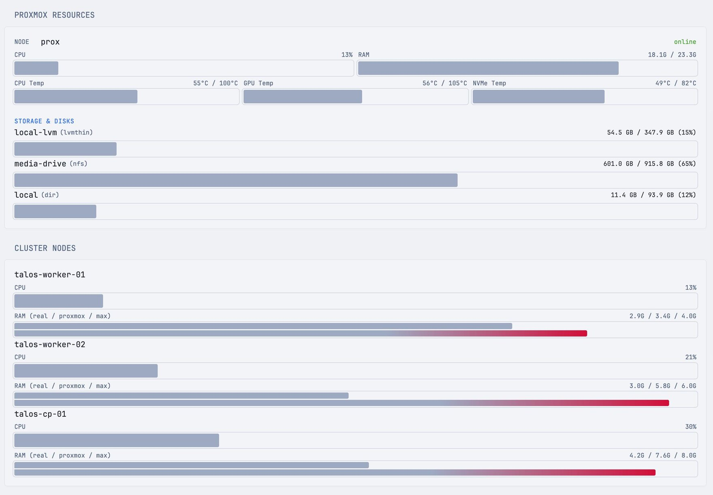

Node CPU and RAM, **CPU/GPU/NVMe temperatures**, storage and cluster nodes for Proxmox VE. It reads the `/api/summary` endpoint of [pve-metrics-exporter](https://github.com/drumandbytes/pve-metrics-exporter), which also serves Prometheus metrics from the same cache.

## Setup

Run the exporter with a read-only Proxmox API token:

```sh
docker run -d -p 9221:9221 \
  -e PROXMOX_URL=https://your-proxmox-host:8006 \
  -e PROXMOX_TOKEN='PVEAPIToken=user@pve!tokenid=uuid' \
  ghcr.io/drumandbytes/pve-metrics-exporter:latest
```

Then set `PVE_METRICS_URL` in Glance's environment to wherever it runs, e.g. `192.168.1.10:9221`. Temperatures need lm-sensors on the Proxmox host; see the exporter's README.

## Config

```yaml
- type: custom-api
  title: Proxmox VE
  cache: 30s
  url: http://${PVE_METRICS_URL}/api/summary
  template: |
    {{ if eq .Response.StatusCode 200 }}
    <div class="flex flex-column gap-5">
      <div class="flex justify-between text-center">
        <div>
          {{ $nodes := .JSON.Array "nodes" }}
          {{ $nodes_online := 0 }}
          {{ range $nodes }}{{ if eq (.String "status") "online" }}{{ $nodes_online = add $nodes_online 1 }}{{ end }}{{ end }}
          <div class="color-highlight size-h3">{{ $nodes_online }}/{{ len $nodes }}</div>
          <div class="size-h5 uppercase">Node</div>
        </div>
        <div>
          {{ $lxcs := .JSON.Array "lxcs" }}
          {{ $lxcs_running := 0 }}
          {{ range $lxcs }}{{ if eq (.String "status") "running" }}{{ $lxcs_running = add $lxcs_running 1 }}{{ end }}{{ end }}
          <div class="color-highlight size-h3">{{ $lxcs_running }}/{{ len $lxcs }}</div>
          <div class="size-h5 uppercase">LXC</div>
        </div>
        <div>
          {{ $vms := .JSON.Array "vms" }}
          {{ $vms_running := 0 }}
          {{ range $vms }}{{ if eq (.String "status") "running" }}{{ $vms_running = add $vms_running 1 }}{{ end }}{{ end }}
          <div class="color-highlight size-h3">{{ $vms_running }}/{{ len $vms }}</div>
          <div class="size-h5 uppercase">VM</div>
        </div>
        <div>
          {{ $storages := .JSON.Array "storages" }}
          {{ $storages_available := 0 }}
          {{ range $storages }}{{ if eq (.String "status") "available" }}{{ $storages_available = add $storages_available 1 }}{{ end }}{{ end }}
          <div class="color-highlight size-h3">{{ $storages_available }}/{{ len $storages }}</div>
          <div class="size-h5 uppercase">Storage</div>
        </div>
      </div>
    </div>
    {{ else }}
    <div class="color-negative text-center">
      <p class="size-sm">Proxmox exporter unavailable</p>
    </div>
    {{ end }}
```
