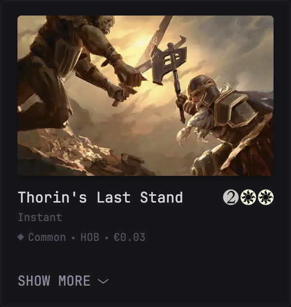
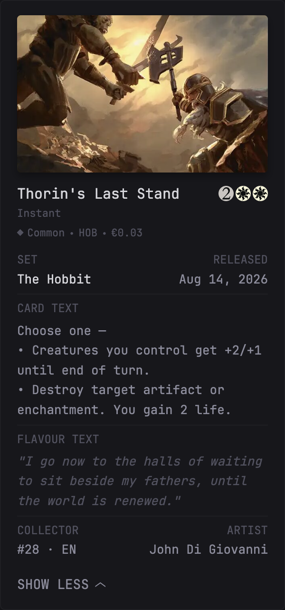

# Random MTG Card



### Expanded preview



A Glance `custom-api` widget that displays a random Magic: The Gathering card from [Scryfall](https://scryfall.com), including its artwork, card text, set information, artist, rarity, and optional market price.

Requires Glance `v0.8.0` or newer.

## Options

The default configuration searches paper expansion and core sets from the two most recently released sets, plus the next upcoming set. All options are optional.

```yaml
options:
  query: "game:paper -is:funny -set_type:token -layout:art_series"  # any Scryfall search syntax
  recent-sets: 2            # 0 = search all released sets
  include-upcoming: true    # include the next unreleased set
  set-types: "expansion,core"
  currency: eur             # eur | usd | none
```

- `query` - Additional [Scryfall search syntax](https://scryfall.com/docs/syntax).
- `recent-sets` - Number of recent released sets to include. Use `0` to search all released sets.
- `include-upcoming` - Whether to include the next upcoming set.
- `set-types` - Comma-separated set types to include, such as `expansion,core`.
- `currency` - Price currency to display: `eur`, `usd`, or `none`.

## Widget YAML

```yaml
- type: custom-api
  title: Random MTG Card
  cache: 10m
  url: https://api.scryfall.com/sets
  headers:
    User-Agent: Glance # Scryfall rejects requests without a User-Agent
    Accept: application/json
  options:
    query: "game:paper -is:funny -set_type:token -layout:art_series"  # any Scryfall search
    recent-sets: 2            # 0 = search all sets
    include-upcoming: true    # also include the next unreleased set
    set-types: "expansion,core"
    currency: eur             # eur | usd | none
  template: |
    {{ if ne .Response.StatusCode 200 }}
      <p class="color-negative">Scryfall returned {{ .Response.StatusCode }}.</p>
    {{ else }}
      {{ $query := .Options.StringOr "query" "" }}
      {{ $recentSets := .Options.IntOr "recent-sets" 2 }}
      {{ $includeUpcoming := .Options.BoolOr "include-upcoming" true }}
      {{ $setTypes := concat "," (replaceAll " " "" (.Options.StringOr "set-types" "expansion,core")) "," }}
      {{ $preferredCurrency := .Options.StringOr "currency" "eur" }}
      {{ $today := formatTime "2006-01-02" now }}
      {{ $sets := "" }}
      {{ $released := 0 }}
      {{ range sortByTime "released_at" "2006-01-02" "desc" (.JSON.Array "data") }}
        {{ $typeMatches := ne (findMatch (concat "," (.String "set_type") ",") $setTypes) "" }}
        {{ if and (lt $released $recentSets) (not (.Bool "digital")) $typeMatches (le (.String "released_at") $today) }}
          {{ if ne $sets "" }}{{ $sets = concat $sets " or " }}{{ end }}
          {{ $sets = concat $sets "set:" (.String "code") }}
          {{ $released = add $released 1 }}
        {{ end }}
      {{ end }}
      {{ if $includeUpcoming }}
        {{ $upcoming := 0 }}
        {{ range sortByTime "released_at" "2006-01-02" "asc" (.JSON.Array "data") }}
          {{ $typeMatches := ne (findMatch (concat "," (.String "set_type") ",") $setTypes) "" }}
          {{ if and (eq $upcoming 0) (not (.Bool "digital")) $typeMatches (gt (.String "released_at") $today) }}
            {{ if ne $sets "" }}{{ $sets = concat $sets " or " }}{{ end }}
            {{ $sets = concat $sets "set:" (.String "code") }}
            {{ $upcoming = 1 }}
          {{ end }}
        {{ end }}
      {{ end }}
      {{ if ne $sets "" }}{{ $query = trimSpace (concat $query " (" $sets ")") }}{{ end }}
      {{ $card := newRequest "https://api.scryfall.com/cards/random"
          | withHeader "User-Agent" "Glance"
          | withHeader "Accept" "application/json"
          | withParameter "q" $query
          | getResponse }}

      {{ if and $card.Response (eq $card.Response.StatusCode 200) }}
      {{ $c := $card.JSON }}
      {{ $url := $c.String "scryfall_uri" }}
      {{ $img := $c.String "image_uris.art_crop" }}
      {{ if eq $img "" }}{{ $img = $c.String "card_faces.0.image_uris.art_crop" }}{{ end }}
      {{ if eq $img "" }}{{ $img = $c.String "image_uris.normal" }}{{ end }}
      {{ if eq $img "" }}{{ $img = $c.String "card_faces.0.image_uris.normal" }}{{ end }}
      {{ $mana := $c.String "mana_cost" }}
      {{ if eq $mana "" }}{{ $mana = $c.String "card_faces.0.mana_cost" }}{{ end }}
      {{ $power := $c.String "power" }}
      {{ if eq $power "" }}{{ $power = $c.String "card_faces.0.power" }}{{ end }}
      {{ $toughness := $c.String "toughness" }}
      {{ if eq $toughness "" }}{{ $toughness = $c.String "card_faces.0.toughness" }}{{ end }}
      {{ $loyalty := $c.String "loyalty" }}
      {{ if eq $loyalty "" }}{{ $loyalty = $c.String "card_faces.0.loyalty" }}{{ end }}
      {{ $defense := $c.String "defense" }}
      {{ if eq $defense "" }}{{ $defense = $c.String "card_faces.0.defense" }}{{ end }}
      {{ $oracle := $c.String "oracle_text" }}
      {{ if eq $oracle "" }}{{ $oracle = $c.String "card_faces.0.oracle_text" }}{{ end }}
      {{ $flavor := $c.String "flavor_text" }}
      {{ if eq $flavor "" }}{{ $flavor = $c.String "card_faces.0.flavor_text" }}{{ end }}
      {{ $artist := $c.String "artist" }}
      {{ if eq $artist "" }}{{ $artist = $c.String "card_faces.0.artist" }}{{ end }}
      {{ $price := "" }}
      {{ $currency := "" }}
      {{ if ne $preferredCurrency "none" }}
        {{ $fallback := "usd" }}
        {{ if eq $preferredCurrency "usd" }}{{ $fallback = "eur" }}{{ end }}
        {{ $price = $c.String (concat "prices." $preferredCurrency) }}
        {{ $currency = $preferredCurrency }}
        {{ if eq $price "" }}{{ $price = $c.String (concat "prices." $fallback) }}{{ $currency = $fallback }}{{ end }}
        {{ if eq $currency "eur" }}{{ $currency = "€" }}{{ else }}{{ $currency = "$" }}{{ end }}
      {{ end }}
      {{ $rarity := $c.String "rarity" }}
      {{ $rarityColor := "var(--color-text-base)" }}
      {{ if eq $rarity "uncommon" }}{{ $rarityColor = "#b6c6d1" }}
      {{ else if eq $rarity "rare" }}{{ $rarityColor = "#d4b25c" }}
      {{ else if eq $rarity "mythic" }}{{ $rarityColor = "#e5622a" }}
      {{ end }}
      {{ $release := parseTime "2006-01-02" ($c.String "released_at") }}
      {{ $isPreview := gt ($c.String "released_at") $today }}

      <style>
        .mtg-mana-cost{display:flex;align-items:center;justify-content:flex-end;gap:2px}
        .mtg-mana-symbol{display:block;width:1.6rem;height:1.6rem;}
        .mtg-inline-symbol{display:inline-block;width:1.3rem;height:1.3rem;margin:0 .08rem;vertical-align:-.2rem;}
      </style>

      <div class="flex flex-column gap-10">
        <a href="{{ $url }}" target="_blank" rel="noreferrer" class="block">
          
        </a>
        <div class="min-width-0">
          <div class="flex justify-between items-center gap-10">
            <a class="size-h3 color-highlight text-truncate" href="{{ $url }}" target="_blank" rel="noreferrer">{{ $c.String "name" }}</a>
            {{ if ne $mana "" }}
              {{ $remainingMana := $mana }}
              <span class="mtg-mana-cost shrink-0" aria-label="Mana cost: {{ $mana }}" title="{{ $mana }}">
                {{ range 16 }}
                  {{ if ne $remainingMana "" }}
                    {{ $symbol := findSubmatch "^[{]([^}]+)[}]" $remainingMana }}
                    {{ if ne $symbol "" }}
                      
                      {{ $remainingMana = replaceMatches "^[{][^}]+[}]" "" $remainingMana }}
                    {{ else }}
                      {{ $remainingMana = "" }}
                    {{ end }}
                  {{ end }}
                {{ end }}
              </span>
            {{ end }}
          </div>
          <div class="size-h6 color-subdue text-truncate">{{ $c.String "type_line" }}</div>
          <ul class="list-horizontal-text size-h6 color-subdue margin-top-3">
            {{ if and (ne $power "") (ne $toughness "") }}<li title="Power / Toughness">{{ $power }}/{{ $toughness }}</li>{{ end }}
            {{ if ne $loyalty "" }}<li title="Starting loyalty">Loyalty {{ $loyalty }}</li>{{ end }}
            {{ if ne $defense "" }}<li title="Starting defense">Defense {{ $defense }}</li>{{ end }}
            <li style="text-transform:capitalize;"><span aria-hidden="true" style="display:inline-block; margin-right:4px; color:{{ $rarityColor }}; font-size:1.1rem; line-height:1;">◆</span>{{ $rarity }}</li>
            <li style="text-transform:uppercase;">{{ $c.String "set" }}</li>
            {{ if ne $price "" }}<li>{{ $currency }}{{ $price }}</li>{{ end }}
          </ul>
        </div>

        <div>
        <ul class="list list-gap-10 list-with-separator collapsible-container" data-collapse-after="0">
          <li>
            <div class="flex justify-between gap-10">
              <div class="min-width-0">
                <div class="size-h5 color-subdue">SET</div>
                <div class="color-highlight text-truncate">{{ $c.String "set_name" }}</div>
              </div>
              <div class="shrink-0" style="text-align:right;">
                <div class="size-h5 color-subdue">{{ if $isPreview }}PREVIEW{{ else }}RELEASED{{ end }}</div>
                <div{{ if $isPreview }} class="color-primary"{{ end }}>{{ formatTime "Jan 2, 2006" $release }}</div>
              </div>
            </div>
          </li>

          {{ if ne $oracle "" }}
          <li>
            <div class="size-h5 color-subdue margin-bottom-3">CARD TEXT</div>
            <div style="white-space:pre-line;">{{- $remainingOracle := $oracle -}}{{- range 48 -}}{{- if ne $remainingOracle "" -}}{{- $text := findMatch "^[^{]*" $remainingOracle -}}{{ $text }}{{- $symbol := findSubmatch "^[^{]*[{]([^}]+)[}]" $remainingOracle -}}{{- if ne $symbol "" -}}{{- $remainingOracle = replaceMatches "^[^{]*[{][^}]+[}]" "" $remainingOracle -}}{{- else -}}{{- $remainingOracle = "" -}}{{- end -}}{{- end -}}{{- end -}}</div>
          </li>
          {{ end }}

          {{ if ne $flavor "" }}
          <li>
            <div class="size-h5 color-subdue margin-bottom-3">FLAVOUR TEXT</div>
            <div class="color-subdue" style="font-style:italic; white-space:pre-line;">{{ $flavor }}</div>
          </li>
          {{ end }}

          <li>
            <div class="flex justify-between gap-10">
              <div>
                <div class="size-h5 color-subdue">COLLECTOR</div>
                <div>#{{ $c.String "collector_number" }} · <span style="text-transform:uppercase;">{{ $c.String "lang" }}</span></div>
              </div>
              <div style="text-align:right;">
                <div class="size-h5 color-subdue">ARTIST</div>
                <div>{{ $artist }}</div>
              </div>
            </div>
          </li>
        </ul>
        </div>
      </div>
      {{ else }}
        <p class="color-negative">No card matched the query.</p>
        <p class="size-h6 color-subdue">{{ $query }}</p>
      {{ end }}
    {{ end }}
```
