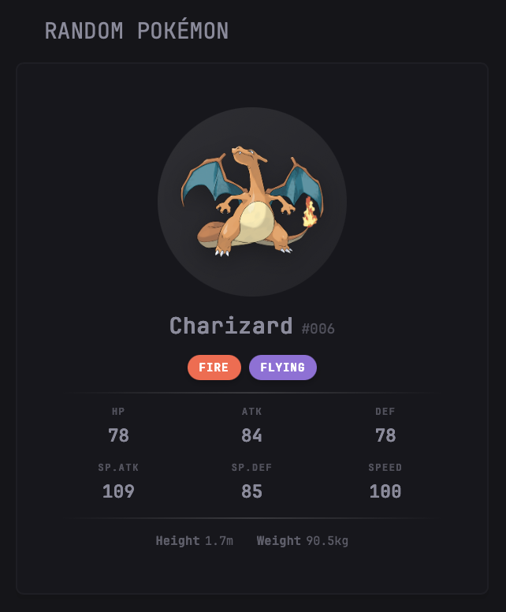

# Poké-Glance

A custom Pokémon widget for [Glance](https://github.com/glanceapp/glance) that displays a random Gen 1 Pokémon using the [PokeAPI](https://pokeapi.co/).



## Features

- Displays official Pokémon artwork
- Pokémon name and Pokedex number
- Type badges with authentic colors
- Full stat breakdown (HP, ATK, DEF, SP.ATK, SP.DEF, SPD)
- Height and weight in metric units

## Installation

Copy the widget configuration into your `glance.yml` under a page's widgets section:

## Widget Versions

### Random API Version (`pokemon-widget.yaml`)

Uses [randomnumberapi.com](https://www.randomnumberapi.com/) to fetch a random Pokémon ID (1-151) on each refresh.

```yml
- type: custom-api
  title: Random Pokémon
  cache: 1h
  url: https://www.randomnumberapi.com/api/v1.0/random?min=1&max=151&count=1
  template: |
    {{ $pokemonId := .JSON.Int "0" }}
    {{ $pokemon := newRequest (concat "https://pokeapi.co/api/v2/pokemon/" (printf "%d" $pokemonId)) | getResponse }}

    <style>
      .card-pokemon{text-align:center;padding:1.25rem 1rem;display:flex;flex-direction:column;align-items:center;gap:.75rem}
      .image-wrap-pokemon{background:linear-gradient(135deg,rgba(255,255,255,.1),rgba(255,255,255,.05));border-radius:50%;padding:1rem}
      .image-pokemon{width:100px;height:100px;filter:drop-shadow(0 4px 8px rgba(0,0,0,.3))}
      .header-pokemon{display:flex;align-items:baseline;gap:.5rem}
      .name-pokemon{font-size:1.4rem;font-weight:700;text-transform:capitalize}
      .number-pokemon{font-size:.9rem;opacity:.5}
      .types-pokemon{display:flex;gap:.5rem}
      .type-pokemon{padding:.25rem .75rem;border-radius:2rem;font-size:.7rem;text-transform:uppercase;font-weight:700;letter-spacing:.05em;box-shadow:0 2px 4px rgba(0,0,0,.2)}
      .divider-pokemon{width:100%;height:1px;background:linear-gradient(90deg,transparent,rgba(255,255,255,.15),transparent)}
      .stats-pokemon{display:grid;grid-template-columns:repeat(3,1fr);gap:.75rem 1rem;width:100%}
      .stat-pokemon{display:flex;flex-direction:column;align-items:center;gap:.2rem}
      .stat-label-pokemon{font-size:.6rem;text-transform:uppercase;letter-spacing:.1em;opacity:.5;font-weight:600}
      .stat-value-pokemon{font-size:1.1rem;font-weight:700}
      .physical-pokemon{display:flex;gap:1.5rem;font-size:.75rem;opacity:.6}
      .physical-item-pokemon{display:flex;gap:.3rem}
      .physical-label-pokemon{font-weight:600}
      .error-pokemon{text-align:center;padding:2rem;opacity:.6}
      .type-normal{background:darkkhaki;color:#fff}
      .type-fire{background:tomato;color:#fff}
      .type-water{background:dodgerblue;color:#fff}
      .type-electric{background:gold;color:#000}
      .type-grass{background:mediumseagreen;color:#fff}
      .type-ice{background:skyblue;color:#000}
      .type-fighting{background:indianred;color:#fff}
      .type-poison{background:mediumorchid;color:#fff}
      .type-ground{background:tan;color:#000}
      .type-flying{background:mediumpurple;color:#fff}
      .type-psychic{background:hotpink;color:#fff}
      .type-bug{background:olivedrab;color:#fff}
      .type-rock{background:peru;color:#fff}
      .type-ghost{background:slateblue;color:#fff}
      .type-dragon{background:slateblue;color:#fff}
      .type-fairy{background:plum;color:#000}
    </style>

    {{ if eq $pokemon.Response.StatusCode 200 }}
    <div class="card-pokemon">
      <div class="image-wrap-pokemon">
        
      </div>
      <div class="header-pokemon">
        <span class="name-pokemon">{{ $pokemon.JSON.String "name" }}</span>
        <span class="number-pokemon">#{{ printf "%03d" ($pokemon.JSON.Int "id") }}</span>
      </div>
      <div class="types-pokemon">
        {{ range $pokemon.JSON.Array "types" }}<span class="type-pokemon type-{{ .String "type.name" }}">{{ .String "type.name" }}</span>{{ end }}
      </div>
      <div class="divider-pokemon"></div>
      <div class="stats-pokemon">
        {{ range $pokemon.JSON.Array "stats" }}{{ $s := .String "stat.name" }}<div class="stat-pokemon"><span class="stat-label-pokemon">{{ if eq $s "hp" }}HP{{ else if eq $s "attack" }}ATK{{ else if eq $s "defense" }}DEF{{ else if eq $s "special-attack" }}SP.ATK{{ else if eq $s "special-defense" }}SP.DEF{{ else if eq $s "speed" }}SPEED{{ end }}</span><span class="stat-value-pokemon">{{ .Int "base_stat" }}</span></div>{{ end }}
      </div>
      <div class="divider-pokemon"></div>
      <div class="physical-pokemon">
        <div class="physical-item-pokemon"><span class="physical-label-pokemon">Height</span><span>{{ printf "%.1f" (div (toFloat ($pokemon.JSON.Int "height")) 10.0) }}m</span></div>
        <div class="physical-item-pokemon"><span class="physical-label-pokemon">Weight</span><span>{{ printf "%.1f" (div (toFloat ($pokemon.JSON.Int "weight")) 10.0) }}kg</span></div>
      </div>
    </div>
    {{ else }}
    <div class="error-pokemon"><p>Failed to catch Pokémon!</p><p style="font-size:.8rem">{{ $pokemon.Response.Status }}</p></div>
    {{ end }}
```

### Standalone Version (`pokemon-widget-standalone.yaml`)

Uses time-based pseudo-random selection. No external random API dependency - only calls PokeAPI once per refresh. The Pokémon changes based on the current hour and minute (not truly random, may have quite a few repeats).

```yml
- type: custom-api
  title: Random Pokémon
  cache: 1h
  template: |
    {{ $pokemonId := add (mod (add (mul now.Hour 60) now.Minute) 151) 1 }}
    {{ $pokemon := newRequest (concat "https://pokeapi.co/api/v2/pokemon/" (printf "%d" $pokemonId)) | getResponse }}

    <style>
      .card-pokemon{text-align:center;padding:1.25rem 1rem;display:flex;flex-direction:column;align-items:center;gap:.75rem}
      .image-wrap-pokemon{background:linear-gradient(135deg,rgba(255,255,255,.1),rgba(255,255,255,.05));border-radius:50%;padding:1rem}
      .image-pokemon{width:100px;height:100px;filter:drop-shadow(0 4px 8px rgba(0,0,0,.3))}
      .header-pokemon{display:flex;align-items:baseline;gap:.5rem}
      .name-pokemon{font-size:1.4rem;font-weight:700;text-transform:capitalize}
      .number-pokemon{font-size:.9rem;opacity:.5}
      .types-pokemon{display:flex;gap:.5rem}
      .type-pokemon{padding:.25rem .75rem;border-radius:2rem;font-size:.7rem;text-transform:uppercase;font-weight:700;letter-spacing:.05em;box-shadow:0 2px 4px rgba(0,0,0,.2)}
      .divider-pokemon{width:100%;height:1px;background:linear-gradient(90deg,transparent,rgba(255,255,255,.15),transparent)}
      .stats-pokemon{display:grid;grid-template-columns:repeat(3,1fr);gap:.75rem 1rem;width:100%}
      .stat-pokemon{display:flex;flex-direction:column;align-items:center;gap:.2rem}
      .stat-label-pokemon{font-size:.6rem;text-transform:uppercase;letter-spacing:.1em;opacity:.5;font-weight:600}
      .stat-value-pokemon{font-size:1.1rem;font-weight:700}
      .physical-pokemon{display:flex;gap:1.5rem;font-size:.75rem;opacity:.6}
      .physical-item-pokemon{display:flex;gap:.3rem}
      .physical-label-pokemon{font-weight:600}
      .error-pokemon{text-align:center;padding:2rem;opacity:.6}
      .type-normal{background:darkkhaki;color:#fff}
      .type-fire{background:tomato;color:#fff}
      .type-water{background:dodgerblue;color:#fff}
      .type-electric{background:gold;color:#000}
      .type-grass{background:mediumseagreen;color:#fff}
      .type-ice{background:skyblue;color:#000}
      .type-fighting{background:indianred;color:#fff}
      .type-poison{background:mediumorchid;color:#fff}
      .type-ground{background:tan;color:#000}
      .type-flying{background:mediumpurple;color:#fff}
      .type-psychic{background:hotpink;color:#fff}
      .type-bug{background:olivedrab;color:#fff}
      .type-rock{background:peru;color:#fff}
      .type-ghost{background:slateblue;color:#fff}
      .type-dragon{background:slateblue;color:#fff}
      .type-fairy{background:plum;color:#000}
    </style>

    {{ if eq $pokemon.Response.StatusCode 200 }}
    <div class="card-pokemon">
      <div class="image-wrap-pokemon">
        
      </div>
      <div class="header-pokemon">
        <span class="name-pokemon">{{ $pokemon.JSON.String "name" }}</span>
        <span class="number-pokemon">#{{ printf "%03d" ($pokemon.JSON.Int "id") }}</span>
      </div>
      <div class="types-pokemon">
        {{ range $pokemon.JSON.Array "types" }}<span class="type-pokemon type-{{ .String "type.name" }}">{{ .String "type.name" }}</span>{{ end }}
      </div>
      <div class="divider-pokemon"></div>
      <div class="stats-pokemon">
        {{ range $pokemon.JSON.Array "stats" }}{{ $s := .String "stat.name" }}<div class="stat-pokemon"><span class="stat-label-pokemon">{{ if eq $s "hp" }}HP{{ else if eq $s "attack" }}ATK{{ else if eq $s "defense" }}DEF{{ else if eq $s "special-attack" }}SP.ATK{{ else if eq $s "special-defense" }}SP.DEF{{ else if eq $s "speed" }}SPEED{{ end }}</span><span class="stat-value-pokemon">{{ .Int "base_stat" }}</span></div>{{ end }}
      </div>
      <div class="divider-pokemon"></div>
      <div class="physical-pokemon">
        <div class="physical-item-pokemon"><span class="physical-label-pokemon">Height</span><span>{{ printf "%.1f" (div (toFloat ($pokemon.JSON.Int "height")) 10.0) }}m</span></div>
        <div class="physical-item-pokemon"><span class="physical-label-pokemon">Weight</span><span>{{ printf "%.1f" (div (toFloat ($pokemon.JSON.Int "weight")) 10.0) }}kg</span></div>
      </div>
    </div>
    {{ else }}
    <div class="error-pokemon"><p>Failed to catch Pokémon!</p><p style="font-size:.8rem">{{ $pokemon.Response.Status }}</p></div>
    {{ end }}
```

## Configuration

| Option | Default | Description |
|--------|---------|-------------|
| `cache` | `1h` | How often to fetch a new Pokémon |
| `title` | `Random Pokémon` | Widget title |

## Credits

- Pokémon data from [PokeAPI](https://pokeapi.co/)
