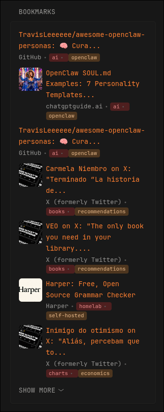

# Readeck Bookmarks

Display your latest bookmarks from [Readeck](https://readeck.org/) with thumbnail previews and color-coded labels.

## Features

- Thumbnail preview for bookmarks with images
- Title truncation (50 characters max)
- Color-coded labels using HSL color rotation
- Site name display
- Collapsible list with configurable visibility

## Preview



## Configuration

```yaml
- type: custom-api
  title: Bookmarks
  cache: 1h
  method: GET
  url: ${READECK_URL}/api/bookmarks?limit=15
  headers:
    Authorization: Bearer ${READECK_API_TOKEN}
  template: |
    <ul class="list list-gap-10 collapsible-container" data-collapse-after="5">
      {{ range .JSON.Array "" }}
        <li>
          {{ $title := .String "title" }}
          {{ if gt (len $title) 50 }}
            {{ $title = (slice $title 0 50) | printf "%s..." }}
          {{ end }}
          {{ $thumb := .String "resources.thumbnail.src" }}
          {{ $hasThumb := gt (len $thumb) 0 }}
          <div style="display: flex; gap: 8px; align-items: flex-start;">
            {{ if $hasThumb }}
              
            {{ end }}
            <div style="flex: 1; min-width: 0;">
              <a class="size-title-dynamic color-primary-if-not-visited"
                 href="{{ .String "url" }}"
                 target="_self"
                 rel="noopener noreferrer">{{ $title }}</a>
              <ul class="list-horizontal-text" style="margin-top: 2px;">
                <li>{{ .String "site_name" }}</li>
                {{ $labels := .Array "labels" }}
                {{ range $index, $label := $labels }}
                  {{ $hue := mul (mod $index 12) 30 }}
                  <li style="background-color: hsl({{ $hue }}, 50%, 20%); color: hsl({{ $hue }}, 60%, 70%); padding: 1px 6px; border-radius: 4px; font-size: 11px; line-height: 1.4;">{{ $s := printf "%s" . }}{{ replaceAll "{" "" (replaceAll "}" "" $s) }}</li>
                {{ end }}
              </ul>
            </div>
          </div>
        </li>
      {{ end }}
    </ul>
```

- `READECK_URL` - Your Readeck instance URL (e.g., `http://readeck.example.com:8000`)
- `READECK_API_TOKEN` - Your API token from Readeck settings

## Notes

- Thumbnail URLs are returned by the Readeck API. If your instance serves thumbnails on a different URL than your main instance (e.g., internal vs external), modify the template to use `replaceAll`:
  ```yaml
  {{ $thumbUrl := replaceAll "https://external.url" "http://internal.url" $thumb }}
  
  ```
- Labels are color-coded using HSL color rotation for visual distinction
- The template handles curly braces `{` and `}` in label names by removing them
- Adjust `data-collapse-after` to control how many items are visible before "Show More"