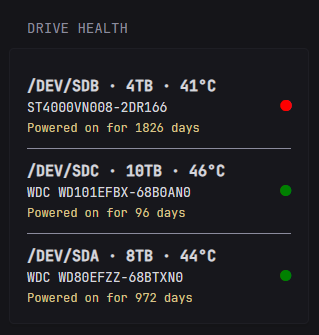

# Overview
For feature requests or issues, contact @SleebySky on the project's Discord server. Thanks to @Haondt for his assistance on this widget. 
# Widget


```yml
- type: custom-api
  title: "Drive Health"
  url: http://${SCRUTINY_URL}/api/summary
  cache: 1h
  method: GET
  options:
    filter_archived: true
    sort_by: "device.device_name"
    sort_order: "asc"
  template: |
    {{- $filterArchived := .Options.filter_archived }}
    {{- $sortBy := .Options.sort_by }}
    {{- $sortOrder := .Options.sort_order }}

    {{- /* Convert summary map into array so we can sort */}}
    {{- $drives := .JSON.Array "data.summary|@values" }}

    {{- /* Sort drives by given string field */}}
    {{- $sorted := $drives }}
    {{- if eq $sortBy "device.capacity" }}
      {{- $sorted = sortByInt $sortBy $sortOrder $drives }}
    {{- else }}
      {{- $sorted = sortByString $sortBy $sortOrder $drives }}
    {{- end }}

    {{- $total := 0 }}
    {{- range $sorted }}
      {{- $archived := .Get "device.archived" }}
      {{- $archivedBool := false }}
      {{- if $archived }}
        {{- $archivedBool = eq $archived.Raw "true" }}
      {{- end }}
      {{- if and $filterArchived $archivedBool }}{{- continue }}{{- end }}
      {{- $total = add $total 1 }}
    {{- end }}

    {{- /* Output each drive */}}
    {{- $count := 0 }}
    {{- range $sorted }}
      {{- $archived := .Get "device.archived" }}
      {{- $archivedBool := false }}
      {{- if $archived }}
        {{- $archivedBool = eq $archived.Raw "true" }}  {{/* compare raw JSON to string "true" */}}
      {{- end }}

      {{- /* Skip archived drives if filter is on */}}
      {{- if and $filterArchived $archivedBool }}{{- continue }}{{- end }}
      {{- $count = add $count 1 }}

      {{- $device := .Get "device" }}
      {{- $deviceName := $device.String "device_name" }} 
      {{- $model := $device.String "model_name" }}
      {{- $days := printf "%.0f" (div (.Get "smart.power_on_hours").Num 24) }}
      {{- $capacity_print := printf "%.0f" (div (.Get "device.capacity").Num 1000000000000) }}
      {{- $status := (.Get "device.device_status").Num }}
      {{- $tempHistory := .Array "temp_history" }}
      {{- $latestTemp := index (.Array "temp_history") (sub (len (.Array "temp_history")) 1) }}
      {{- $latestTempValue := $latestTemp.Int "temp" }}

      <div style="margin-top: 1rem; display: flex; justify-content: space-between; align-items: center;">
        <div>
          <strong class="color-highlight" style="text-transform: uppercase; font-size: 1.5rem;">
            /DEV/{{ $deviceName }} · {{ $capacity_print }}TB · {{ $latestTempValue }}°C
          </strong><br>
          <p class="color-highlight" style="margin: 0;">{{ $model }}</p>
          <div class="color-primary" style="font-size: 1.2rem;">Powered on for {{ $days }} days</div>
        </div>

        <div style="display: flex; align-items: center; gap: 6px;">
          {{- if eq $status 0.0 }}
            <span title="Passed Health Checks" style="font-size: 18px;" class="color-positive">●</span>
          {{- else }}
            <span title="Failed Health Checks" style="font-size: 18px;" class="color-negative">●</span>
          {{- end }}
        </div>
      </div>
      {{- if lt $count $total }}
        <hr class="color-secondary" style="margin: 1rem 0; border: none; border-bottom: 1px solid currentColor;" />
      {{- end }}
    {{- end }}
```
## Options
- `filter_archived` - Whether to show "archived" drives or not.
- `sort_by` - How to sort output. Valid values are device.device_name, device.model_name, or device.capacity.
- `sort_order` - Either "desc" or "asc".

## Environment Variables
- `SCRUTINY_URL` - Address to your scrutiny instance. 
