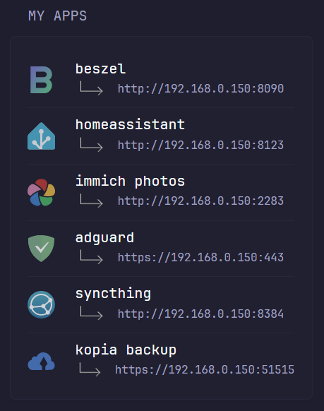

# Self-hosted Apps

External and local links to your self-hosted apps. Theme is consistant with inbuild `Docker Containers` widget.



```yaml
- type: custom-api
  title: My Apps
  hide-header: false
  css-class: "widget-type-self-hosted"
  cache: 1h
  url: http://${MY_GLANCE_URL}/assets/self-hosted-apps.json
  template: |
    <style>
      .widget-type-self-hosted li {
        margin-top: var(--list-half-gap); 
        border-top: 1px solid var(--color-separator);
        padding-top: var(--list-half-gap);
      }
    </style>
    <ul class="dynamic-columns list-gap-15 list-with-separator">
    {{ range .JSON.Array "links" }}
      <li class="flex items-center gap-20">
          <div class="shrink-0">
              
          </div>
          <div class="min-width-0 grow">
            <a href='{{ .String "external_link" }}' class="color-highlight size-title-dynamic block text-truncate" target="_blank" rel="noreferrer" title="{{ .String "hostname" }}">{{ .String "hostname" }}</a>
            {{ if (.String "service") }}
            <div class="flex items-center gap-10" style="margin-bottom: 5px">
              <div class="text-left">
                
              </div>
              <div class="size-h6 flex-1 text-left">
                <a href='{{ .String "service" }}' target="_blank" rel="noreferrer">{{ .String "service" }}</a>
              </div>
            </div>
            {{ end}}
          </div>
      </li>
    {{ end }}
    </ul>
```

## Environment variables
`MY_GLANCE_URL` - the URL your glance instance

## Assets
Modify and upload to your glance `assets` folder.

1. Sample <a href="self-hosted-apps.json">self-hosted-apps.json</a> file.
2. <a href="link-down-right.png">img/link-down-right.png</a> file