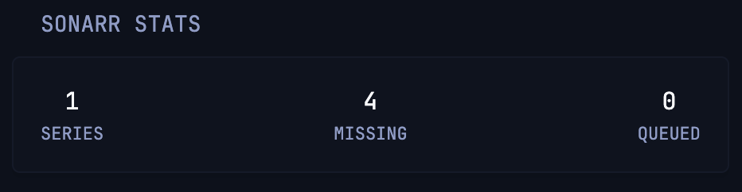

# Sonarr Stats

Total series library count, missing episodes, and active download queue.



```yaml
- type: custom-api
  refresh-interval: 5s
  title: Sonarr Stats
  cache: 2s
  url: ${SONARR_URL}/api/v3/series?apikey=${SONARR_API_KEY}
  subrequests:
    missing:
      url: ${SONARR_URL}/api/v3/wanted/missing?apikey=${SONARR_API_KEY}
    queue:
      url: ${SONARR_URL}/api/v3/queue?apikey=${SONARR_API_KEY}
  template: |
    <div class="flex justify-between text-center">
      <div>
        <div class="color-highlight size-h3">{{ len (.JSON.Array "") }}</div>
        <div class="size-h6">SERIES</div>
      </div>
      <div>
        <div class="color-highlight size-h3">{{ (.Subrequest "missing").JSON.Int "totalRecords" }}</div>
        <div class="size-h6">MISSING</div>
      </div>
      <div>
        <div class="color-highlight size-h3">{{ (.Subrequest "queue").JSON.Int "totalRecords" }}</div>
        <div class="size-h6">QUEUED</div>
      </div>
    </div>
```

## Environment variables

- `SONARR_URL` - The full URL of your Sonarr instance, e.g. `http://192.168.1.100:8989`
- `SONARR_API_KEY` - Your Sonarr API key, found in Settings -> General -> Security
