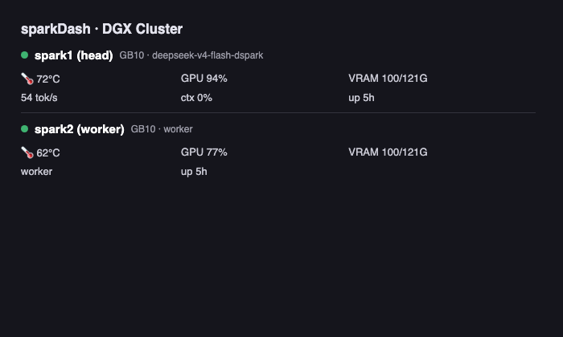

A monitoring widget for [sparkDash](https://github.com/MiaAI-Lab/sparkDash) — the
multi-unit dashboard for NVIDIA DGX Spark (GB10) machines. Shows live GPU
temperature/usage, VRAM, LLM generation tok/s, KV-cache usage and uptime for the
head node and one worker in a single Glance card.

```yaml
- type: custom-api
  title: sparkDash · DGX Cluster
  cache: 30s
  url: ${SPARKDASH_HEAD_URL}
  subrequests:
    node2:
      url: ${SPARKDASH_NODE2_URL}
  options:
    dashboardUrl: ${SPARKDASH_DASHBOARD_URL}
  template: |
    {{ $s2 := .Subrequest "node2" }}
    <style>
      .sd-node-sparkdash + .sd-node-sparkdash { border-top: 1px solid var(--color-border); margin-top: 0.7em; padding-top: 0.7em; }
      .sd-gr-sparkdash { display: grid; grid-template-columns: repeat(3, auto); gap: .4em 1em; margin-top: .6em; }
      .sd-meter-sparkdash { display:flex; align-items:center; gap:.4em; }
    </style>
    <div class="sd-node-sparkdash">
      <div class="flex" style="align-items:center; gap:.5em;">
        <span style="width:9px;height:9px;border-radius:50%;background:{{ if .JSON.Bool "online" }}var(--color-positive){{ else }}var(--color-error){{ end }};display:inline-block;"></span>
        <a class="size-h4 color-highlight" target="_blank" href="{{ .Options.StringOr "dashboardUrl" "#" }}">
          <span class="text-truncate">{{ .JSON.String "name" }}</span>
        </a>
        <span class="size-caption">{{ .JSON.String "hardware.cpuModel" }} · {{ .JSON.String "metrics.llm.0.modelId" }}</span>
      </div>
      <div class="sd-gr-sparkdash">
        <div class="sd-meter-sparkdash" title="GPU temperature">
          <svg xmlns="http://www.w3.org/2000/svg" viewBox="0 0 24 24" fill="none" stroke="currentColor" stroke-width="2" stroke-linecap="round" stroke-linejoin="round" style="height:1em;"><path d="M14 4v10.54a4 4 0 1 1-4 0V4a2 2 0 0 1 4 0Z"/></svg>
          <span>{{ .JSON.Int "metrics.gpu.temperature" }}°C</span>
        </div>
        <div class="sd-meter-sparkdash" title="GPU utilization"><span>GPU {{ .JSON.Int "metrics.gpu.usage" }}%</span></div>
        <div class="sd-meter-sparkdash" title="VRAM used/total GB"><span>VRAM {{ div (.JSON.Int "metrics.gpu.vram.used") 1024 }}/{{ div (.JSON.Int "metrics.gpu.vram.total") 1024 }}G</span></div>
        <div class="sd-meter-sparkdash" title="Generation tok/s"><span>{{ printf "%.0f" (.JSON.Float "metrics.llm.0.generationTps") }} tok/s</span></div>
        <div class="sd-meter-sparkdash" title="KV cache usage"><span>ctx {{ printf "%.0f" (mul (.JSON.Float "metrics.llm.0.kvCacheUsage") 100) }}%</span></div>
        <div class="sd-meter-sparkdash" title="Uptime hours"><span>up {{ div (.JSON.Int "uptime") 3600 }}h</span></div>
      </div>
    </div>
    <div class="sd-node-sparkdash">
      <div class="flex" style="align-items:center; gap:.5em;">
        <span style="width:9px;height:9px;border-radius:50%;background:{{ if $s2.JSON.Bool "online" }}var(--color-positive){{ else }}var(--color-error){{ end }};display:inline-block;"></span>
        <a class="size-h4 color-highlight" target="_blank" href="{{ .Options.StringOr "dashboardUrl" "#" }}">
          <span class="text-truncate">{{ $s2.JSON.String "name" }}</span>
        </a>
        <span class="size-caption">{{ $s2.JSON.String "hardware.cpuModel" }} · {{ $s2.JSON.String "metrics.llm.0.modelId" }}</span>
      </div>
      <div class="sd-gr-sparkdash">
        <div class="sd-meter-sparkdash" title="GPU temperature">
          <svg xmlns="http://www.w3.org/2000/svg" viewBox="0 0 24 24" fill="none" stroke="currentColor" stroke-width="2" stroke-linecap="round" stroke-linejoin="round" style="height:1em;"><path d="M14 4v10.54a4 4 0 1 1-4 0V4a2 2 0 0 1 4 0Z"/></svg>
          <span>{{ $s2.JSON.Int "metrics.gpu.temperature" }}°C</span>
        </div>
        <div class="sd-meter-sparkdash" title="GPU utilization"><span>GPU {{ $s2.JSON.Int "metrics.gpu.usage" }}%</span></div>
        <div class="sd-meter-sparkdash" title="VRAM used/total GB"><span>VRAM {{ div ($s2.JSON.Int "metrics.gpu.vram.used") 1024 }}/{{ div ($s2.JSON.Int "metrics.gpu.vram.total") 1024 }}G</span></div>
        <div class="sd-meter-sparkdash" title="Generation tok/s"><span>{{ printf "%.0f" ($s2.JSON.Float "metrics.llm.0.generationTps") }} tok/s</span></div>
        <div class="sd-meter-sparkdash" title="KV cache usage"><span>ctx {{ printf "%.0f" (mul ($s2.JSON.Float "metrics.llm.0.kvCacheUsage") 100) }}%</span></div>
        <div class="sd-meter-sparkdash" title="Uptime hours"><span>up {{ div ($s2.JSON.Int "uptime") 3600 }}h</span></div>
      </div>
    </div>
```

## Environment variables

- `SPARKDASH_HEAD_URL` — full URL of the head node's metrics endpoint, e.g. `https://sparkdash.example.com/api/sparks/spark1/metrics`
- `SPARKDASH_NODE2_URL` — full URL of a second node's metrics endpoint (any sparkDash unit)
- `SPARKDASH_DASHBOARD_URL` — base URL of the sparkDash dashboard (used for the title link), e.g. `https://sparkdash.example.com`

## Requirements

- A running [sparkDash](https://github.com/MiaAI-Lab/sparkDash) instance reachable from Glance. The `/api/sparks/:id/metrics` endpoint is unauthenticated by design, so expose it only on a trusted network (or behind your reverse proxy).
- For a single-node setup, delete the second `sd-node-sparkdash` block and the `subrequests` map.
