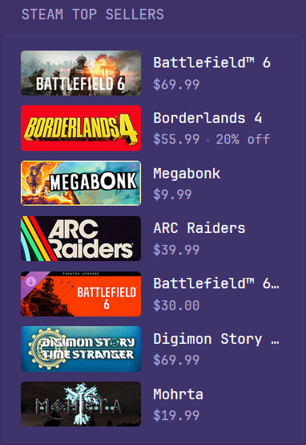

## Screenshots
#### Normal


```yaml
- type: custom-api
  title: Steam Top Sellers
  cache: 12h
  url: https://store.steampowered.com/api/featuredcategories?cc=us
  options:
    limit: 5
  template: |
    {{ $items := .JSON.Array "top_sellers.items" }}
    {{ $limit := .Options.IntOr "limit" 0 }}
    {{ $count := 0 }}
    <ul class="list list-gap-10 collapsible-contain" data-collapse-after="15">
      {{ range $i, $v := $items }}
        {{ if or (eq $limit 0) (lt $count $limit) }}
          {{ $id := $v.Int "id" }}
          {{ $name := $v.String "name" }}
          {{ $isDuplicate := false }}
          {{ range $j, $prev := $items }}
            {{ if and (lt $j $i) (eq ($prev.Int "id") $id) }}
              {{ $isDuplicate = true }}
            {{ end }}
          {{ end }}
          {{ if and (ne $name "Steam Deck") (not $isDuplicate) }}
            {{ $count = add $count 1 }}
            <li style="display: flex; align-items: center; gap: 1rem;">
              
              <div style="min-width: 0;">
                <a class="size-h4 color-highlight text-truncate" style="display: block;"
                    href="https://store.steampowered.com/app/{{ $id }}/">
                  {{ $name }}
                </a>
                <ul class="list-horizontal-text">
                  <li>{{ div ($v.Int "final_price" | toFloat) 100 | printf "€%.2f" }}</li>
                  {{ $discount := $v.Int "discount_percent" }}
                  {{ if gt $discount 0 }}
                    <li{{ if ge $discount 40 }} class="color-positive" {{ end }}>
                      {{ $discount }}% off
                    </li>
                  {{ end }}
                </ul>
              </div>
            </li>
          {{ end }}
        {{ end }}
      {{ end }}
    </ul>
```

## Options

The widget supports the following options:

- `limit` (integer)
    - Maximum number of unique items to display.
    - `0` (or omitting the option) shows all available items.