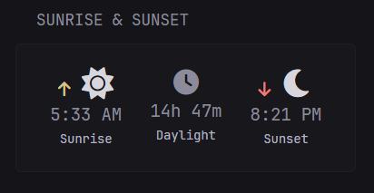

# Sunrise & Sunset

A Glance `custom-api` widget that shows today's sunrise time, daylight duration, and sunset time for a configured location. It uses Open-Meteo's free public APIs — first the geocoding endpoint to resolve the location to coordinates, then the forecast endpoint to fetch daily sunrise/sunset and daylight duration. No API key is required. The location is supplied via the `WEATHER_LOCATION` environment variable, the same variable used by the `weather-seven-day` widget, so the two can share configuration.



```yaml
- type: custom-api
  title: Sunrise & Sunset
  body-type: string
  cache: 12h
  options:
    location: ${WEATHER_LOCATION}
  template: |
    {{ $timeLayout := "3:04 PM" }}

    {{/* Step 1: geocode the location */}}
    {{ $loc := replaceAll " " "%20" (.Options.StringOr "location" "") }}
    {{ $geoUrl := printf "https://geocoding-api.open-meteo.com/v1/search?name=%s&count=1&language=en&format=json" $loc }}
    {{ $geo := newRequest $geoUrl | getResponse }}
    {{ $results := $geo.JSON.Array "results" }}

    <link rel="stylesheet" href="https://cdnjs.cloudflare.com/ajax/libs/font-awesome/6.0.0-beta3/css/all.min.css">

    {{ if eq (len $results) 0 }}
      <p class="color-paragraph">Location "{{ .Options.StringOr "location" "" }}" not found.</p>
    {{ else }}
      {{ $lat := $geo.JSON.String "results.0.latitude" }}
      {{ $lon := $geo.JSON.String "results.0.longitude" }}

      {{/* Step 2: today's sunrise/sunset/daylight from Open-Meteo */}}
      {{ $fcUrl := printf "https://api.open-meteo.com/v1/forecast?latitude=%s&longitude=%s&daily=sunrise,sunset,daylight_duration&forecast_days=1&timezone=auto" $lat $lon }}
      {{ $fc := newRequest $fcUrl | getResponse }}

      {{ $sunriseRaw := $fc.JSON.String "daily.sunrise.0" }}
      {{ $sunsetRaw  := $fc.JSON.String "daily.sunset.0" }}
      {{ $daylight   := $fc.JSON.Int    "daily.daylight_duration.0" }}

      {{ if or (eq $sunriseRaw "") (eq $sunsetRaw "") }}
        <p class="color-paragraph"><i class="fas fa-circle-exclamation"></i> No sunrise/sunset today (polar region).</p>
      {{ else }}
        {{ $sunrise := $sunriseRaw | parseTime "2006-01-02T15:04" }}
        {{ $sunset  := $sunsetRaw  | parseTime "2006-01-02T15:04" }}
        {{ $hours   := div $daylight 3600 }}
        {{ $mins    := div (mod $daylight 3600) 60 }}

        <div style="display:flex; justify-content:space-around; align-items:center; padding:0.5rem 0;">
          <div style="text-align:center;">
            <i class="fas fa-arrow-up" style="color: var(--color-positive); font-size: 14px; margin-right: 0.25rem;"></i>
            <i class="fas fa-sun" style="color: var(--color-text-highlight); font-size: 28px;"></i>
            <p class="size-h3 color-text-highlight">{{ $sunrise.Format $timeLayout }}</p>
            <p class="size-h6 color-paragraph">Sunrise</p>
          </div>
          <div style="text-align:center;">
            <i class="fas fa-clock" style="color: var(--color-paragraph); font-size: 22px;"></i>
            <p class="size-h3 color-text-highlight">{{ $hours }}h {{ $mins }}m</p>
            <p class="size-h6 color-paragraph">Daylight</p>
          </div>
          <div style="text-align:center;">
            <i class="fas fa-arrow-down" style="color: var(--color-negative); font-size: 14px; margin-right: 0.25rem;"></i>
            <i class="fas fa-moon" style="color: var(--color-text-highlight); font-size: 28px;"></i>
            <p class="size-h3 color-text-highlight">{{ $sunset.Format $timeLayout }}</p>
            <p class="size-h6 color-paragraph">Sunset</p>
          </div>
        </div>
      {{ end }}
    {{ end }}
```

## Environment variables

- `WEATHER_LOCATION` — An Open-Meteo-recognized location string, such as `London, United Kingdom` or `New York, United States`. This is the same variable used by the `weather-seven-day` widget, so a single value can drive both widgets.

## Options

- `location` — Open-Meteo-recognized location, set by default from the `WEATHER_LOCATION` environment variable.

## Notes

- **Polar regions:** at extreme latitudes Open-Meteo may return an empty `sunrise` or `sunset` for days with no sunrise or no sunset. The template detects this and falls back to a short message instead of a broken layout.
- **Time format:** times render in 12-hour format (`3:04 PM`) by default. To switch to 24-hour, change `{{ $timeLayout := "3:04 PM" }}` to `{{ $timeLayout := "15:04" }}` near the top of the template.
- **Timezone:** the forecast request uses `timezone=auto`, so sunrise and sunset are reported in the local time of the resolved location, not the host running Glance.
