# Tautulli Widgets
For feature requests or issues, contact @SleebySky on the project's Discord server.
## Recently Added

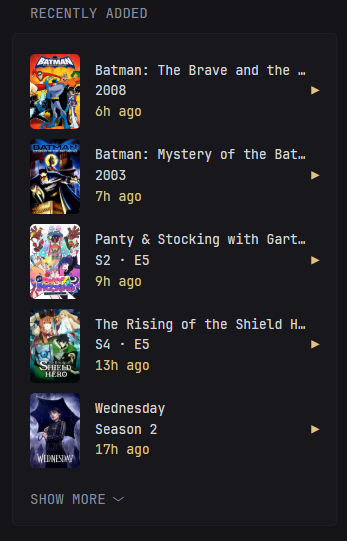
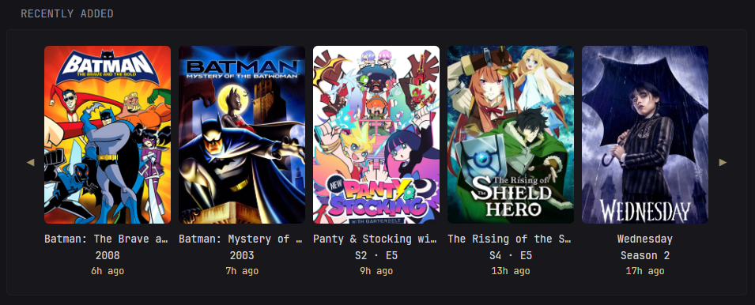

```yml
- type: custom-api
  title: Recently Added
  cache: 5m
  url: http://${TAUTULLI_IP}:${TAUTULLI_PORT}/api/v2?apikey=${TAUTULLI_API_KEY}&cmd=get_recently_added&count=10
  options:
    size: "small" 
    collapse: 5
  template: |
    {{ $isLarge := eq (.Options.StringOr "size" "large") "large" }}
    {{ $serverID := "${SERVER_ID}" }}
    {{ $uniqueID := "recently_added" }}
    {{ $collapse := .Options.IntOr "collapse" 5 }}
    {{ $rows := .JSON.Array "response.data.recently_added" }}

    {{ if $isLarge }}
      <!-- Large View -->
      <div style="display: flex; align-items: center; gap: 0.5rem;">
        <!-- Left Arrow -->
        <div id="scrollLeft-{{ $uniqueID }}" onclick='document.getElementById("scrollContainer-{{ $uniqueID }}").scrollBy({ left: -150, behavior: "smooth" })'
          style="flex: 0 0 2.5rem; height: 100px; display: flex; align-items: center; justify-content: center; background: var(--color-surface); cursor: pointer;">
          <span class="color-primary" style="font-size: 1.5rem; opacity: 0.7;">◀</span>
        </div>

        <!-- Scroll Content -->
        <div id="scrollContainer-{{ $uniqueID }}"
          style="display: flex; overflow-x: auto; gap: 1rem; padding-block: 0.5rem; scroll-behavior: smooth; scrollbar-width: none; -ms-overflow-style: none;">
          {{ range $i, $v := $rows }}
            {{ $type := $v.String "media_type" }}
            {{ $isEpisode := eq $type "episode" }}
            {{ $isMovie := eq $type "movie" }}
            {{ $isSeason := eq $type "season" }}
            {{ $isShow := eq $type "show" }}
            {{ $ratingKey := $v.String "rating_key" }}
            {{ $lastWatch := printf "%d" ($v.Int "added_at") }}

            {{ $img := "" }}
            {{ $title := "" }}
            {{ $sub := "" }}

            {{ if $isEpisode }}
              {{ $img = $v.String "grandparent_thumb" }}
              {{ $title = $v.String "grandparent_title" }}
              {{ $sub = printf "S%d · E%d" ($v.Int "parent_media_index") ($v.Int "media_index") }}
            {{ else if $isMovie }}
              {{ $img = $v.String "thumb" }}
              {{ $title = $v.String "title" }}
              {{ $sub = printf "%d" ($v.Int "year") }}
            {{ else if $isSeason }}
              {{ $img = $v.String "parent_thumb" }}
              {{ $title = $v.String "parent_title" }}
              {{ $sub = $v.String "title" }}
            {{ else if $isShow }}
              {{ $img = $v.String "thumb" }}
              {{ $title = $v.String "title" }}
              {{ $sub = printf "%d" ($v.Int "year") }}
            {{ end }}

            <a href="https://app.plex.tv/desktop/#!/server/{{ $serverID }}/details?key=%2Flibrary%2Fmetadata%2F{{ $ratingKey }}" target="_blank"
              style="min-width: 160px; text-align: center; text-decoration: none;">
              <div style="max-height: 225px; overflow: hidden; border-radius: 6px;">
                
              </div>
              <div class="color-highlight" style="margin-top: 1rem; overflow: hidden; white-space: nowrap; text-overflow: ellipsis;" title="{{ $title }}">
                {{ $title }}
              </div>
              <div class="color-highlight" style="overflow: hidden; white-space: nowrap; text-overflow: ellipsis;">
                {{ $sub }}
              </div>
              <div class="color-primary" style="font-size: 0.9em;">
                <span {{ parseRelativeTime "unix" $lastWatch }}></span> ago
              </div>
            </a>
          {{ end }}
        </div>

        <!-- Right Arrow -->
        <div id="scrollRight-{{ $uniqueID }}"
          onclick='document.getElementById("scrollContainer-{{ $uniqueID }}").scrollBy({ left: 150, behavior: "smooth" })'
          style="flex: 0 0 2.5rem; height: 100px; display: flex; align-items: center; justify-content: center; background: var(--color-surface); cursor: pointer;">
          <span class="color-primary" style="font-size: 1.5rem; opacity: 0.7;">▶</span>
        </div>
      </div>
    {{ else }}
      <!-- Small View -->
      <ul class="list collapsible-container" data-collapse-after="{{ $collapse }}">
        {{ range $i, $v := $rows }}
          {{ $type := $v.String "media_type" }}
          {{ $isEpisode := eq $type "episode" }}
          {{ $isMovie := eq $type "movie" }}
          {{ $isSeason := eq $type "season" }}
          {{ $isShow := eq $type "show" }}
          {{ $ratingKey := $v.String "rating_key" }}
          {{ $lastWatch := printf "%d" ($v.Int "added_at") }}

          {{ $img := "" }}
          {{ $title := "" }}
          {{ $sub := "" }}

          {{ if $isEpisode }}
            {{ $img = $v.String "grandparent_thumb" }}
            {{ $title = $v.String "grandparent_title" }}
            {{ $sub = printf "S%d · E%d" ($v.Int "parent_media_index") ($v.Int "media_index") }}
          {{ else if $isMovie }}
            {{ $img = $v.String "thumb" }}
            {{ $title = $v.String "title" }}
            {{ $sub = printf "%d" ($v.Int "year") }}
          {{ else if $isSeason }}
            {{ $img = $v.String "parent_thumb" }}
            {{ $title = $v.String "parent_title" }}
            {{ $sub = $v.String "title" }}
          {{ else if $isShow }}
            {{ $img = $v.String "thumb" }}
            {{ $title = $v.String "title" }}
            {{ $sub = printf "%d" ($v.Int "year") }}
          {{ end }}

          <li class="flex items-center gap-2" style="padding: 0.5rem 0; border-bottom: 1px solid var(--color-border);">
            
            <div class="min-width-0 grow">
              <div class="color-highlight" style="overflow: hidden; white-space: nowrap; text-overflow: ellipsis;" title="{{ $title }}">
                {{ $title }}
              </div>
              <div class="color-highlight" style="overflow: hidden; white-space: nowrap; text-overflow: ellipsis;">
                {{ $sub }}
              </div>
              <div class="color-primary">
                <span {{ parseRelativeTime "unix" $lastWatch }}></span> ago
              </div>
            </div>
            <a href="https://app.plex.tv/desktop/#!/server/{{ $serverID }}/details?key=%2Flibrary%2Fmetadata%2F{{ $ratingKey }}" target="_blank"
              class="color-primary">▶</a>
          </li>
        {{ end }}
      </ul>
    {{ end }}
```
### Options
- `size` - Set to "small" for small version, "full" version.
- `collapse` - Set the number of items shown by default in "small" mode before showing 'show more.'

### Environment Variables
- `TAUTULLI_IP` - local ip address of your tautulli instance
- `TAUTULLI_PORT` - port of your tautulli instance
- `TAUTULLI_API_KEY` - API key for your tautulli instance. Can be found in settings -> Web Interface -> API 
- `SERVER_ID` - Unique ID key for your Plex server. This is required for links to your plex to work. Can be found using this URL {TAUTULLI_IP}:{TAUTULLI_PORT}/api/v2?apikey={TAUTULLI_API_KEY}&cmd=get_server_id&hostname={PLEX_IP}&port={PLEX_PORT} under "identifier"

## Now Playing

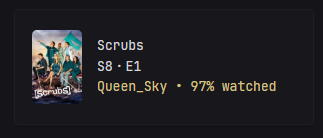

```yml
- type: custom-api
  title: Now Playing
  cache: 5m
  url: http://${TAUTULLI_IP}:${TAUTULLI_PORT}/api/v2?apikey=${TAUTULLI_API_KEY}&cmd=get_activity
  template: |
    {{ $sessions := .JSON.Array "response.data.sessions" }}
    {{ $collapse := .Options.IntOr "collapse" 5 }}

    {{ if eq (len $sessions) 0 }}
      <div class="color-dim">No one is watching anything right now.</div>
    {{ else }}
      <ul class="list collapsible-container" data-collapse-after="{{ $collapse }}">
        {{ range $session := $sessions }}
          {{ $type := $session.String "media_type" }}
          {{ $isEpisode := eq $type "episode" }}
          {{ $isMovie := eq $type "movie" }}
          {{ $thumb := "" }}
          {{ $title := "" }}
          {{ $subtitle := "" }}

          {{ if $isEpisode }}
            {{ $title = $session.String "grandparent_title" }}
            {{ $subtitle = printf "S%02dE%02d - %s" ($session.Int "parent_media_index") ($session.Int "media_index") ($session.String "title") }}
            {{ $thumb = $session.String "grandparent_thumb" }}
          {{ else }}
            {{ $title = $session.String "title" }}
            {{ $thumb = $session.String "thumb" }}
          {{ end }}

          {{ $duration := $session.Int "duration" }}
          {{ $offset := $session.Int "view_offset" }}
          {{ $remaining := div (sub $duration $offset) 1000 }}
          {{ $now := now }}
          {{ $endTime := $now.Add (duration (printf "%ds" $remaining)) | formatTime "3:04PM" }}
          {{ $ratingKey := $session.String "rating_key" }}

          <li class="flex items-center gap-2" style="padding: 0.5rem 0; border-bottom: 1px solid var(--color-border);">
            <a href="https://app.plex.tv/desktop/#!/server/${SERVER_ID}/details?key=%2Flibrary%2Fmetadata%2F{{ $ratingKey }}"
              title="{{ $session.String "summary" }}">
              
            </a>

            <div class="min-width-0 grow">
              <div class="color-highlight"
                style="overflow: hidden; white-space: nowrap; text-overflow: ellipsis;"
                title="{{ $title }}">
                {{ $title }}
              </div>

              {{ if $isEpisode }}
                <div class="color-highlight" title="{{ $session.String "title" }}">
                  S{{ $session.Int "parent_media_index" }}&thinsp;·&thinsp;E{{ $session.Int "media_index" }}
                </div>
              {{ else if $isMovie }}
                <div class="color-highlight" title="{{ $session.String "summary" }}">
                  {{ $session.Int "year" }}
                </div>
              {{ end }}

              <div class="color-primary">
                <span title="{{ $session.String "player" }}">
                  {{ $session.String "friendly_name" }}
                </span> •
                <span title="Ends at: {{ $endTime }}">
                  {{ $session.String "progress_percent" }}% watched
                </span>
              </div>
            </div>
          </li>
        {{ end }}
      </ul>
    {{ end }}
```
### Environment Variables
- `TAUTULLI_IP` - local ip address of your tautulli instance
- `TAUTULLI_PORT` - port of your tautulli instance
- `TAUTULLI_API_KEY` - API key for your tautulli instance. Can be found in settings -> Web Interface -> API 
- `SERVER_ID` - Unique ID key for your Plex server. This is required for links to your plex to work. Can be found using this URL {TAUTULLI_IP}:{TAUTULLI_PORT}/api/v2?apikey={TAUTULLI_API_KEY}&cmd=get_server_id&hostname={PLEX_IP}&port={PLEX_PORT} under "identifier"

## Recently Watched
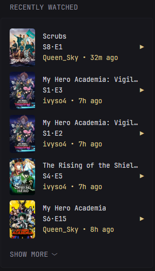
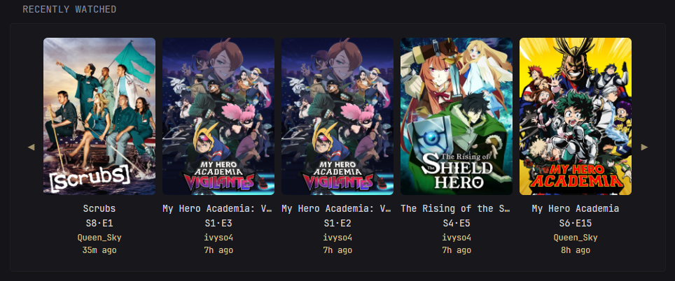

```yml
- type: custom-api
  title: Recently Watched
  cache: 5m
  url: http://${TAUTULLI_IP}:${TAUTULLI_PORT}/api/v2?apikey=${TAUTULLI_API_KEY}&cmd=get_home_stats&stat_id=last_watched
  template: |
    {{ $isLarge := eq (.Options.StringOr "size" "large") "large" }}
    {{ $serverID := "${SERVER_ID}" }}
    {{ $uniqueID := "recently_watched" }}
    {{ $collapse := .Options.IntOr "collapse" 5 }}

    {{ if $isLarge }}
      {{ $rows := .JSON.Array "response.data.rows" }}
      <div style="display: flex; align-items: center; gap: 0.5rem;">
        <!-- Left scroll arrow -->
        <div id="scrollLeft-{{ $uniqueID }}" title="Scroll left"
          onclick='document.getElementById("scrollContainer-{{ $uniqueID }}").scrollBy({ left: -150, behavior: "smooth" })'
          style="flex: 0 0 2.5rem; height: 100px; display: flex; align-items: center; justify-content: center; background: var(--color-surface); cursor: pointer;">
          <span class="color-primary" style="font-size: 1.5rem; opacity: 0.7;">◀</span>
        </div>

        <!-- Scrollable content -->
        <div id="scrollContainer-{{ $uniqueID }}"
          style="display: flex; overflow-x: auto; gap: 1rem; padding-block: 0.5rem; scroll-behavior: smooth; scrollbar-width: none; -ms-overflow-style: none;">
          {{ range $i, $v := $rows }}
            {{ $mediaType := $v.String "media_type" }}
            {{ $isEpisode := eq $mediaType "episode" }}
            {{ $titleHover := "" }}
              {{ if $isEpisode }}
                {{ $titleHover = $v.String "grandchild_title" }}
              {{ else }}
                {{ $titleHover = $v.String "title" }}
              {{ end }}
            {{ $ratingKey := $v.String "rating_key" }}
            {{ $thumb := $v.String "thumb" }}

            <a href="https://app.plex.tv/desktop/#!/server/{{ $serverID }}/details?key=%2Flibrary%2Fmetadata%2F{{ $ratingKey }}"
              target="_blank"
              style="min-width: 160px; text-align: center; text-decoration: none;">
              
              <div style="max-height: 225px; overflow: hidden; border-radius: 6px;">
                
              </div>

              <!-- Media info -->
              {{ if $isEpisode }}
                <div class="color-highlight" title="{{ $v.String "grandparent_title" }}"
                  style="margin-top: 1rem; overflow: hidden; white-space: nowrap; text-overflow: ellipsis;">
                  {{ $v.String "grandparent_title" }}
                </div>
                <div class="color-highlight" title="{{ $titleHover }}"
                  style="overflow: hidden; white-space: nowrap; text-overflow: ellipsis;">
                  S{{ $v.Int "parent_media_index" }}·E{{ $v.Int "media_index" }}
                </div>
              {{ else }}
                <div class="color-highlight" title="{{ $v.String "title" }}"
                  style="margin-top: 1rem; overflow: hidden; white-space: nowrap; text-overflow: ellipsis;">
                  {{ $v.String "title" }}
                </div>
                <div class="color-highlight"
                  style="overflow: hidden; white-space: nowrap; text-overflow: ellipsis;">
                  {{ $v.Int "year" }}
                </div>
              {{ end }}

              <div class="color-primary" style="font-size: 0.9em;">
                <span title="{{ $v.String "player" }}">{{ $v.String "friendly_name" }}</span><br>
                <span {{ parseRelativeTime "unix" ($v.String "last_watch") }}></span> ago
              </div>
            </a>
          {{ end }}
        </div>

        <!-- Right scroll arrow -->
        <div id="scrollRight-{{ $uniqueID }}" title="Scroll right"
          onclick='document.getElementById("scrollContainer-{{ $uniqueID }}").scrollBy({ left: 150, behavior: "smooth" })'
          style="flex: 0 0 2.5rem; height: 100px; display: flex; align-items: center; justify-content: center; background: var(--color-surface); cursor: pointer;">
          <span class="color-primary" style="font-size: 1.5rem; opacity: 0.7;">▶</span>
        </div>
      </div>

    {{ else }}
      <!-- Compact list version -->
      <ul class="list collapsible-container" data-collapse-after="{{ $collapse }}">
        {{ range $i, $v := .JSON.Array "response.data.rows" }}
          {{ $mediaType := $v.String "media_type" }}
          {{ $isEpisode := eq $mediaType "episode" }}
          {{ $titleHover := "" }}
            {{ if $isEpisode }}
              {{ $titleHover = $v.String "grandchild_title" }}
            {{ else }}
              {{ $titleHover = $v.String "title" }}
            {{ end }}
          {{ $ratingKey := $v.String "rating_key" }}
          {{ $thumb := $v.String "thumb" }}

          <li class="flex items-center gap-2" style="padding: 0.5rem 0; border-bottom: 1px solid var(--color-border);">
            
            <div class="min-width-0 grow">
              {{ if $isEpisode }}
                <div class="color-highlight" title="{{ $v.String "grandparent_title" }}"
                  style="overflow: hidden; white-space: nowrap; text-overflow: ellipsis;">
                  {{ $v.String "grandparent_title" }}
                </div>
                <div class="color-highlight" title="{{ $titleHover }}">
                  S{{ $v.Int "parent_media_index" }}·E{{ $v.Int "media_index" }}
                </div>
              {{ else }}
                <div class="color-highlight" title="{{ $v.String "title" }}"
                  style="overflow: hidden; white-space: nowrap; text-overflow: ellipsis;">
                  {{ $v.String "title" }}
                </div>
                <div class="color-highlight"
                  style="overflow: hidden; white-space: nowrap; text-overflow: ellipsis;">
                  {{ $v.Int "year" }}
                </div>
              {{ end }}
              <div class="color-primary">
                <span title="{{ $v.String "player" }}">{{ $v.String "friendly_name" }}</span> • 
                <span {{ parseRelativeTime "unix" ($v.String "last_watch") }}></span> ago
              </div>
            </div>
            <a href="https://app.plex.tv/desktop/#!/server/{{ $serverID }}/details?key=%2Flibrary%2Fmetadata%2F{{ $ratingKey }}"
              target="_blank"
              class="color-primary">▶</a>
          </li>
        {{ end }}
      </ul>
    {{ end }}
```

### Options
- `size` - Set to "small" for small version, "full" version.
- `collapse` - Set the number of items shown by default in "small" mode before showing 'show more.'

### Environment Variables
- `TAUTULLI_IP` - local ip address of your tautulli instance
- `TAUTULLI_PORT` - port of your tautulli instance
- `TAUTULLI_API_KEY` - API key for your tautulli instance. Can be found in settings -> Web Interface -> API 
- `SERVER_ID` - Unique ID key for your Plex server. This is required for links to your plex to work. Can be found using this URL {TAUTULLI_IP}:{TAUTULLI_PORT}/api/v2?apikey={TAUTULLI_API_KEY}&cmd=get_server_id&hostname={PLEX_IP}&port={PLEX_PORT} under "identifier"

## Top Movies
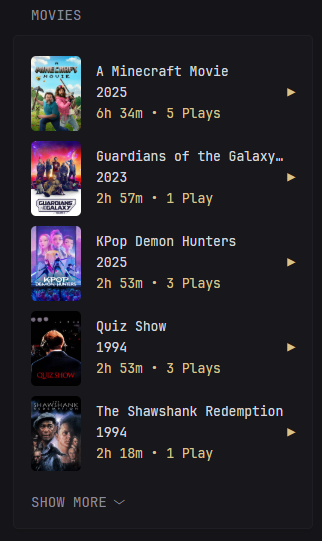
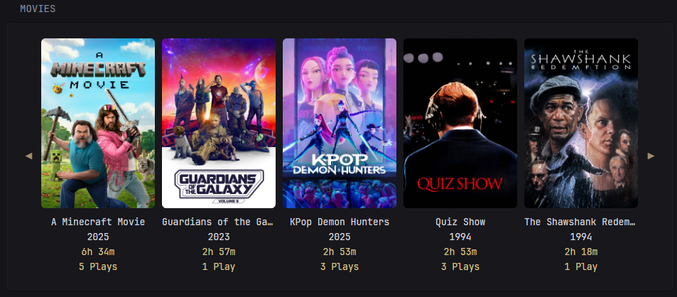

```yml
- type: custom-api
  title: Movies
  cache: 60m
  url: http://${TAUTULLI_IP}:${TAUTULLI_PORT}/api/v2?
  allow-potentially-dangerous-html: true
  options:
    size: "small"
    collapse: 5
  parameters:
    time_range: 90
    apikey: ${TAUTULLI_API_KEY}
    cmd: get_home_stats
    stat_id: top_movies
    stats_type: duration
  template: |
    {{ $isLarge := eq (.Options.StringOr "size" "large") "large" }}
    {{ $serverID := "${SERVER_ID}" }}
    {{ $uniqueID := "top_movies" }}
    {{ $collapse := .Options.IntOr "collapse" 5 }}
    {{ $rows := .JSON.Array "response.data.rows" }}

    {{ if $isLarge }}
      <div style="display: flex; align-items: center; gap: 0.5rem;">
        <!-- Left scroll arrow -->
        <div id="scrollLeft-{{ $uniqueID }}" title="Scroll left"
          onclick='document.getElementById("scrollContainer-{{ $uniqueID }}").scrollBy({ left: -150, behavior: "smooth" })'
          style="flex: 0 0 2.5rem; height: 100px; display: flex; align-items: center; justify-content: center; background: var(--color-surface); cursor: pointer; user-select: none;">
          <span class="color-primary" style="font-size: 1.5rem; opacity: 0.7;">◀</span>
        </div>

        <!-- Scrollable movie list -->
        <div id="scrollContainer-{{ $uniqueID }}"
          style="display: flex; overflow-x: auto; gap: 1rem; padding-block: 0.5rem; scroll-behavior: smooth; scrollbar-width: none; -ms-overflow-style: none;">
          {{ range $v := $rows }}
            {{ $title := $v.String "title" }}
            {{ $thumb := $v.String "thumb" }}
            {{ $year := $v.Int "year" }}
            {{ $plays := $v.Int "total_plays" }}
            {{ $duration := $v.Int "total_duration" }}
            {{ $hours := div $duration 3600 }}
            {{ $minutes := mod (div $duration 60) 60 }}
            {{ $ratingKey := $v.String "rating_key" }}

            <a href="https://app.plex.tv/desktop/#!/server/{{ $serverID }}/details?key=%2Flibrary%2Fmetadata%2F{{ $ratingKey }}"
              target="_blank"
              style="min-width: 160px; text-align: center; text-decoration: none;">
              <div style="max-height: 250px; overflow: hidden; border-radius: 6px;">
                
              </div>
              <div class="color-highlight"
                style="margin-top: 1rem; overflow: hidden; white-space: nowrap; text-overflow: ellipsis;"
                title="{{ $title }}">
                {{ $title }}
              </div>
              <div class="color-highlight"
                style="overflow: hidden; white-space: nowrap; text-overflow: ellipsis;">
                {{ $year }}
              </div>
              <div class="color-primary">
                <span>
                  {{ if gt $hours 0 }}
                    {{ printf "%dh %dm" $hours $minutes }}
                  {{ else }}
                    {{ printf "%dm" $minutes }}
                  {{ end }}
                </span><br>
                <span>
                  {{ if eq $plays 1 }}1 Play{{ else }}{{ $plays }} Plays{{ end }}
                </span>
              </div>
            </a>
          {{ end }}
        </div>

        <!-- Right scroll arrow -->
        <div id="scrollRight-{{ $uniqueID }}" title="Scroll right"
          onclick='document.getElementById("scrollContainer-{{ $uniqueID }}").scrollBy({ left: 150, behavior: "smooth" })'
          style="flex: 0 0 2.5rem; height: 100px; display: flex; align-items: center; justify-content: center; background: var(--color-surface); cursor: pointer; user-select: none;">
          <span class="color-primary" style="font-size: 1.5rem; opacity: 0.7;">▶</span>
        </div>
      </div>

    {{ else }}
      <!-- Small widget version -->
      <ul class="list collapsible-container" data-collapse-after="{{ $collapse }}">
        {{ range $v := $rows }}
          {{ $title := $v.String "title" }}
          {{ $thumb := $v.String "thumb" }}
          {{ $year := $v.Int "year" }}
          {{ $plays := $v.Int "total_plays" }}
          {{ $duration := $v.Int "total_duration" }}
          {{ $hours := div $duration 3600 }}
          {{ $minutes := mod (div $duration 60) 60 }}
          {{ $ratingKey := $v.String "rating_key" }}

          <li class="flex items-center gap-2" style="padding: 0.5rem 0; border-bottom: 1px solid var(--color-border);">
            
            <div class="min-width-0 grow">
              <div class="color-highlight"
                style="overflow: hidden; white-space: nowrap; text-overflow: ellipsis;"
                title="{{ $title }}">
                {{ $title }}
              </div>
              <div class="color-highlight"
                style="overflow: hidden; white-space: nowrap; text-overflow: ellipsis;">
                {{ $year }}
              </div>
              <div class="color-primary">
                <span>
                  {{ if gt $hours 0 }}
                    {{ printf "%dh %dm" $hours $minutes }}
                  {{ else }}
                    {{ printf "%dm" $minutes }}
                  {{ end }}
                </span> • 
                <span>
                  {{ if eq $plays 1 }}1 Play{{ else }}{{ $plays }} Plays{{ end }}
                </span>
              </div>
            </div>
            <a href="https://app.plex.tv/desktop/#!/server/{{ $serverID }}/details?key=%2Flibrary%2Fmetadata%2F{{ $ratingKey }}"
              target="_blank"
              class="color-primary">▶</a>
          </li>
        {{ end }}
      </ul>
    {{ end }}
```
### Parameters
- `time_range` - The number of days to include when calculating top movies. Defaults to 90 days. 

### Options
- `size` - Set to "small" for small version, "full" version.
- `collapse` - Set the number of items shown by default in "small" mode before showing 'show more.'

### Environment Variables
- `TAUTULLI_IP` - local ip address of your tautulli instance
- `TAUTULLI_PORT` - port of your tautulli instance
- `TAUTULLI_API_KEY` - API key for your tautulli instance. Can be found in settings -> Web Interface -> API 
- `SERVER_ID` - Unique ID key for your Plex server. This is required for links to your plex to work. Can be found using this URL {TAUTULLI_IP}:{TAUTULLI_PORT}/api/v2?apikey={TAUTULLI_API_KEY}&cmd=get_server_id&hostname={PLEX_IP}&port={PLEX_PORT} under "identifier"

## Top Platforms

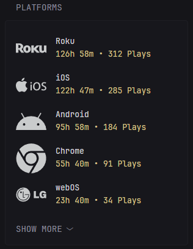
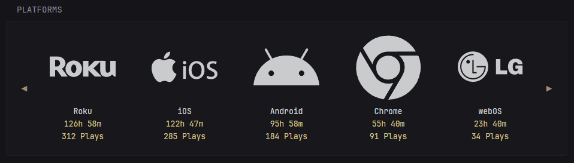

```yml
- type: custom-api
  title: Platforms
  cache: 60m
  url: http://${TAUTULLI_IP}:${TAUTULLI_PORT}/api/v2?
  allow-potentially-dangerous-html: true
  parameters:
    time_range: 90
    apikey: ${TAUTULLI_API_KEY}
    cmd: get_home_stats
    stat_id: top_platforms
    stats_type: duration
  options: 
    filter: "brightness(0) saturate(100%) invert(75%) sepia(73%) saturate(5%) hue-rotate(161deg) brightness(93%) contrast(96%)"
    size: "small"
    collapse: 5
  template: |
    {{ $isLarge := eq (.Options.StringOr "size" "large") "large" }}
    {{ $serverID := "${SERVER_ID}" }}
    {{ $uniqueID := "top_platforms" }}
    {{ $filter := .Options.StringOr "filter" "none" }}
    {{ $collapse := .Options.IntOr "collapse" 5 }}
    {{ $rows := .JSON.Array "response.data.rows" }}

    {{ if $isLarge }}
      <div style="display: flex; align-items: center; gap: 0.5rem;">

        <!-- Left Arrow -->
        <div id="scrollLeft-{{ $uniqueID }}" title="Scroll left"
          onclick='document.getElementById("scrollContainer-{{ $uniqueID }}").scrollBy({ left: -150, behavior: "smooth" })'
          style="flex: 0 0 2.5rem; height: 100px; display: flex; align-items: center; justify-content: center; background: var(--color-surface); cursor: pointer; user-select: none;">
          <span class="color-primary" style="font-size: 1.5rem; opacity: 0.7;">◀</span>
        </div>

        <!-- Scrollable Content -->
        <div id="scrollContainer-{{ $uniqueID }}"
          style="display: flex; overflow-x: auto; gap: 1rem; padding-block: 0.5rem; scroll-behavior: smooth; scrollbar-width: none; -ms-overflow-style: none;">
          {{ range $v := $rows }}
            {{ $platform := $v.String "platform" }}
            {{ $platformName := $v.String "platform_name" }}
            {{ $img := printf "interfaces/default/images/platforms/%s.svg" $platformName }}
            {{ $seconds := $v.Int "total_duration" }}
            {{ $hours := div $seconds 3600 }}
            {{ $minutes := mod (div $seconds 60) 60 }}

            <div style="min-width: 160px; text-align: center;">
              <div style="max-height: 225px; overflow: hidden; border-radius: 6px;" class="color-primary">
                
              </div>
              <div class="color-highlight"
                style="margin-top: 1rem; overflow: hidden; white-space: nowrap; text-overflow: ellipsis;"
                title="{{ $platform }}">
                {{ $platform }}
              </div>
              <div class="color-primary">
                <span title="{{ $v.String "player" }}">
                  {{ if gt $hours 0 }}
                    {{ printf "%dh %dm" $hours $minutes }}
                  {{ else }}
                    {{ printf "%dm" $minutes }}
                  {{ end }}
                </span><br />
                <span>
                  {{ $v.String "total_plays" }} Plays
                </span>
              </div>
            </div>
          {{ end }}
        </div>

        <!-- Right Arrow -->
        <div id="scrollRight-{{ $uniqueID }}" title="Scroll right"
          onclick='document.getElementById("scrollContainer-{{ $uniqueID }}").scrollBy({ left: 150, behavior: "smooth" })'
          style="flex: 0 0 2.5rem; height: 100px; display: flex; align-items: center; justify-content: center; background: var(--color-surface); cursor: pointer; user-select: none;">
          <span class="color-primary" style="font-size: 1.5rem; opacity: 0.7;">▶</span>
        </div>
      </div>
    {{ else }}
      <!-- Small Widget -->
      <ul class="list collapsible-container" data-collapse-after="{{ $collapse }}">
        {{ range $v := $rows }}
          {{ $platform := $v.String "platform" }}
          {{ $platformName := $v.String "platform_name" }}
          {{ $img := printf "interfaces/default/images/platforms/%s.svg" $platformName }}
          {{ $seconds := $v.Int "total_duration" }}
          {{ $hours := div $seconds 3600 }}
          {{ $minutes := mod (div $seconds 60) 60 }}

          <li class="flex items-center gap-2" style="padding: 0.5rem 0; border-bottom: 1px solid var(--color-border);">
            
            <div class="min-width-0 grow">
              <div class="color-highlight"
                style="overflow: hidden; white-space: nowrap; text-overflow: ellipsis;"
                title="{{ $platform }}">
                {{ $platform }}
              </div>
              <div class="color-primary">
                <span title="{{ $v.String "player" }}">
                  {{ if gt $hours 0 }}
                    {{ printf "%dh %dm" $hours $minutes }}
                  {{ else }}
                    {{ printf "%dm" $minutes }}
                  {{ end }}
                </span> •
                <span>{{ $v.String "total_plays" }} Plays</span>
              </div>
            </div>
          </li>
        {{ end }}
      </ul>
    {{ end }}
```

### Parameters
- `time_range` - The number of days to include when calculating top movies. Defaults to 90 days. 

### Options
- `size` - Set to "small" for small version, "full" version.
- `collapse` - Set the number of items shown by default in "small" mode before showing 'show more.'
- `filter` - Icons come from plex as pure white SVGs, so cannot automatically use your default glance styling. To change the color of the icons, use the following [website](https://cssfilterconverter.com/), to input your hex code and get out the necessary CSS filter string. 

### Environment Variables
- `TAUTULLI_IP` - local ip address of your tautulli instance
- `TAUTULLI_PORT` - port of your tautulli instance
- `TAUTULLI_API_KEY` - API key for your tautulli instance. Can be found in settings -> Web Interface -> API 
- `SERVER_ID` - Unique ID key for your Plex server. This is required for links to your plex to work. Can be found using this URL {TAUTULLI_IP}:{TAUTULLI_PORT}/api/v2?apikey={TAUTULLI_API_KEY}&cmd=get_server_id&hostname={PLEX_IP}&port={PLEX_PORT} under "identifier"

## Top Shows

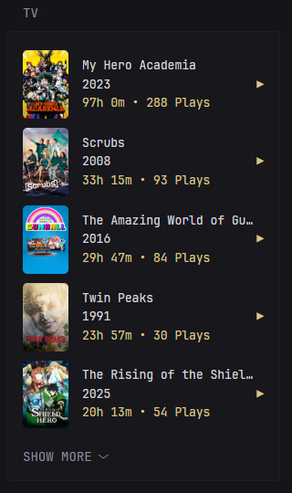
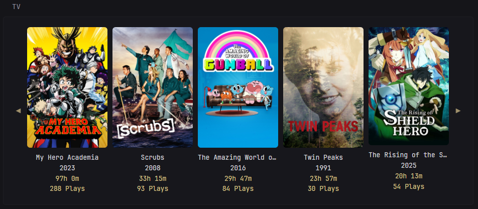

```yml
- type: custom-api
  title: TV
  cache: 60m
  url: http://${TAUTULLI_IP}:${TAUTULLI_PORT}/api/v2?
  parameters:
    time_range: 90
    apikey: ${TAUTULLI_API_KEY}
    cmd: get_home_stats
    stat_id: top_tv
    stats_type: duration
  options:
    size: "small"
    collapse: 5
  template: |
    {{ $isLarge := eq (.Options.StringOr "size" "large") "large" }}
    {{ $serverID := "${SERVER_ID}" }}
    {{ $uniqueID := "top_shows" }}
    {{ $collapse := .Options.IntOr "collapse" 5 }}
    {{ $rows := .JSON.Array "response.data.rows" }}

    {{ if $isLarge }}
      <!-- Large View -->
      <div style="display: flex; align-items: center; gap: 0.5rem;">
        <!-- Left Arrow -->
        <div id="scrollLeft-{{ $uniqueID }}" onclick='document.getElementById("scrollContainer-{{ $uniqueID }}").scrollBy({ left: -150, behavior: "smooth" })'
          style="flex: 0 0 2.5rem; height: 100px; display: flex; align-items: center; justify-content: center; background: var(--color-surface); cursor: pointer;">
          <span class="color-primary" style="font-size: 1.5rem; opacity: 0.7;">◀</span>
        </div>

        <!-- Scrollable Items -->
        <div id="scrollContainer-{{ $uniqueID }}"
          style="display: flex; overflow-x: auto; gap: 1rem; padding-block: 0.5rem; scroll-behavior: smooth; scrollbar-width: none; -ms-overflow-style: none;">
          {{ range $i, $v := $rows }}
            {{ $ratingKey := $v.String "rating_key" }}
            {{ $seconds := $v.Int "total_duration" }}
            {{ $hours := div $seconds 3600 }}
            {{ $minutes := mod (div $seconds 60) 60 }}
            {{ $plays := $v.Int "total_plays" }}
            {{ $thumb := $v.String "thumb" }}
            {{ $title := $v.String "title" }}
            {{ $year := $v.Int "year" }}
            {{ $hover := $v.String "grandchild_title" }}

            <a href="https://app.plex.tv/desktop/#!/server/{{ $serverID }}/details?key=%2Flibrary%2Fmetadata%2F{{ $ratingKey }}" target="_blank"
              style="min-width: 160px; text-align: center; text-decoration: none;">
              <div style="max-height: 250px; overflow: hidden; border-radius: 6px;">
                
              </div>
              <div class="color-highlight"
                style="margin-top: 1rem; overflow: hidden; white-space: nowrap; text-overflow: ellipsis;"
                title="{{ $title }}">
                {{ $title }}
              </div>
              <div class="color-highlight"
                style="overflow: hidden; white-space: nowrap; text-overflow: ellipsis;">
                {{ $year }}
              </div>
              <div class="color-primary">
                <span title="{{ $v.String "player" }}">
                  {{ if gt $hours 0 }}
                    {{ printf "%dh %dm" $hours $minutes }}
                  {{ else }}
                    {{ printf "%dm" $minutes }}
                  {{ end }}
                </span>
                <br>
                <span>
                  {{ if gt $plays 1 }}
                    {{ $plays }} Plays
                  {{ else }}
                    {{ $plays }} Play
                  {{ end }}
                </span>
              </div>
            </a>
          {{ end }}
        </div>

        <!-- Right Arrow -->
        <div id="scrollRight-{{ $uniqueID }}"
          onclick='document.getElementById("scrollContainer-{{ $uniqueID }}").scrollBy({ left: 150, behavior: "smooth" })'
          style="flex: 0 0 2.5rem; height: 100px; display: flex; align-items: center; justify-content: center; background: var(--color-surface); cursor: pointer;">
          <span class="color-primary" style="font-size: 1.5rem; opacity: 0.7;">▶</span>
        </div>
      </div>

    {{ else }}
      <!-- Small View -->
      <ul class="list collapsible-container" data-collapse-after="{{ $collapse }}">
        {{ range $i, $v := $rows }}
          {{ $ratingKey := $v.String "rating_key" }}
          {{ $seconds := $v.Int "total_duration" }}
          {{ $hours := div $seconds 3600 }}
          {{ $minutes := mod (div $seconds 60) 60 }}
          {{ $plays := $v.Int "total_plays" }}
          {{ $thumb := $v.String "thumb" }}
          {{ $title := $v.String "title" }}
          {{ $year := $v.Int "year" }}

          <li class="flex items-center gap-2" style="padding: 0.5rem 0; border-bottom: 1px solid var(--color-border);">
            
            <div class="min-width-0 grow">
              <div class="color-highlight"
                style="overflow: hidden; white-space: nowrap; text-overflow: ellipsis;"
                title="{{ $title }}">
                {{ $title }}
              </div>
              <div class="color-highlight"
                style="overflow: hidden; white-space: nowrap; text-overflow: ellipsis;">
                {{ $year }}
              </div>
              <div class="color-primary">
                <span title="{{ $v.String "player" }}">
                  {{ if gt $hours 0 }}
                    {{ printf "%dh %dm" $hours $minutes }}
                  {{ else }}
                    {{ printf "%dm" $minutes }}
                  {{ end }}
                </span> • 
                <span>
                  {{ if gt $plays 1 }}
                    {{ $plays }} Plays
                  {{ else }}
                    {{ $plays }} Play
                  {{ end }}
                </span>
              </div>
            </div>
            <a href="https://app.plex.tv/desktop/#!/server/{{ $serverID }}/details?key=%2Flibrary%2Fmetadata%2F{{ $ratingKey }}" target="_blank"
               class="color-primary">▶</a>
          </li>
        {{ end }}
      </ul>
    {{ end }}
```
### Parameters
- `time_range` - The number of days to include when calculating top movies. Defaults to 90 days. 

### Options
- `size` - Set to "small" for small version, "full" version.
- `collapse` - Set the number of items shown by default in "small" mode before showing 'show more.'

### Environment Variables
- `TAUTULLI_IP` - local ip address of your tautulli instance
- `TAUTULLI_PORT` - port of your tautulli instance
- `TAUTULLI_API_KEY` - API key for your tautulli instance. Can be found in settings -> Web Interface -> API 
- `SERVER_ID` - Unique ID key for your Plex server. This is required for links to your plex to work. Can be found using this URL {TAUTULLI_IP}:{TAUTULLI_PORT}/api/v2?apikey={TAUTULLI_API_KEY}&cmd=get_server_id&hostname={PLEX_IP}&port={PLEX_PORT} under "identifier"

## Top Users

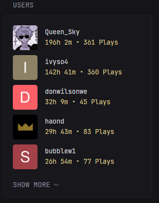
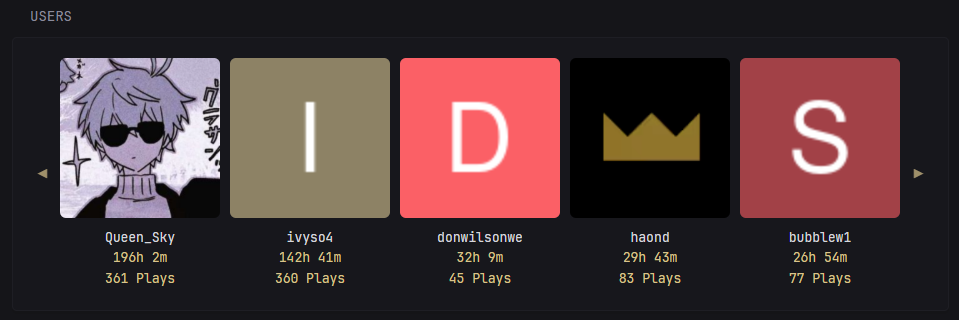

```yml
- type: custom-api
  title: Users
  cache: 60m
  url: http://${TAUTULLI_IP}:${TAUTULLI_PORT}/api/v2?
  allow-potentially-dangerous-html: true
  parameters:
    time_range: 90
    apikey: ${TAUTULLI_API_KEY}
    cmd: get_home_stats
    stat_id: top_users
    stats_type: duration
  options:
    size: "small"
    collapse: 5
  template: |
    {{ $isLarge := eq (.Options.StringOr "size" "large") "large" }}
    {{ $uniqueID := "top_users" }}
    {{ $collapse := .Options.IntOr "collapse" 5 }}
    {{ $rows := .JSON.Array "response.data.rows" }}

    {{ if $isLarge }}
      <div style="display: flex; align-items: center; gap: 0.5rem;">

        <!-- Left Arrow -->
        <div id="scrollLeft-{{ $uniqueID }}" title="Scroll left"
          onclick='document.getElementById("scrollContainer-{{ $uniqueID }}").scrollBy({ left: -150, behavior: "smooth" })'
          style="flex: 0 0 2.5rem; height: 100px; display: flex; align-items: center; justify-content: center; background: var(--color-surface); cursor: pointer; user-select: none;">
          <span class="color-primary" style="font-size: 1.5rem; opacity: 0.7;">◀</span>
        </div>

        <!-- Scrollable Content -->
        <div id="scrollContainer-{{ $uniqueID }}"
          style="display: flex; overflow-x: auto; gap: 1rem; padding-block: 0.5rem; scroll-behavior: smooth; scrollbar-width: none; -ms-overflow-style: none;">
          {{ range $v := $rows }}
            {{ $name := $v.String "friendly_name" }}
            {{ $userimg := $v.String "user_thumb" }}
            {{ $seconds := $v.Int "total_duration" }}
            {{ $hours := div $seconds 3600 }}
            {{ $minutes := mod (div $seconds 60) 60 }}

            <div style="min-width: 160px; text-align: center;">
              <div style="max-height: 275px; overflow: hidden; border-radius: 6px;" class="color-primary">
                
              </div>
              <div class="color-highlight"
                style="margin-top: 1rem; overflow: hidden; white-space: nowrap; text-overflow: ellipsis;"
                title="{{ $name }}">
                {{ $name }}
              </div>
              <div class="color-primary">
                <span>
                  {{ if gt $hours 0 }}
                    {{ printf "%dh %dm" $hours $minutes }}
                  {{ else }}
                    {{ printf "%dm" $minutes }}
                  {{ end }}
                </span><br />
                <span>{{ $v.String "total_plays" }} Plays</span>
              </div>
            </div>
          {{ end }}
        </div>

        <!-- Right Arrow -->
        <div id="scrollRight-{{ $uniqueID }}" title="Scroll right"
          onclick='document.getElementById("scrollContainer-{{ $uniqueID }}").scrollBy({ left: 150, behavior: "smooth" })'
          style="flex: 0 0 2.5rem; height: 100px; display: flex; align-items: center; justify-content: center; background: var(--color-surface); cursor: pointer; user-select: none;">
          <span class="color-primary" style="font-size: 1.5rem; opacity: 0.7;">▶</span>
        </div>
      </div>

    {{ else }}
      <!-- Small Widget -->
      <ul class="list collapsible-container" data-collapse-after="{{ $collapse }}">
        {{ range $v := $rows }}
          {{ $name := $v.String "friendly_name" }}
          {{ $userimg := $v.String "user_thumb" }}
          {{ $seconds := $v.Int "total_duration" }}
          {{ $hours := div $seconds 3600 }}
          {{ $minutes := mod (div $seconds 60) 60 }}

          <li class="flex items-center gap-2" style="padding: 0.5rem 0; border-bottom: 1px solid var(--color-border);">
            
            <div class="min-width-0 grow">
              <div class="color-highlight"
                style="overflow: hidden; white-space: nowrap; text-overflow: ellipsis;"
                title="{{ $name }}">
                {{ $name }}
              </div>
              <div class="color-primary">
                <span>
                  {{ if gt $hours 0 }}
                    {{ printf "%dh %dm" $hours $minutes }}
                  {{ else }}
                    {{ printf "%dm" $minutes }}
                  {{ end }}
                </span> • 
                <span>{{ $v.String "total_plays" }} Plays</span>
              </div>
            </div>
          </li>
        {{ end }}
      </ul>
    {{ end }}
```
### Parameters
- `time_range` - The number of days to include when calculating top movies. Defaults to 90 days. 

### Options
- `size` - Set to "small" for small version, "full" version.
- `collapse` - Set the number of items shown by default in "small" mode before showing 'show more.'

### Environment Variables
- `TAUTULLI_IP` - local ip address of your tautulli instance
- `TAUTULLI_PORT` - port of your tautulli instance
- `TAUTULLI_API_KEY` - API key for your tautulli instance. Can be found in settings -> Web Interface -> API 
- `SERVER_ID` - Unique ID key for your Plex server. This is required for links to your plex to work. Can be found using this URL {TAUTULLI_IP}:{TAUTULLI_PORT}/api/v2?apikey={TAUTULLI_API_KEY}&cmd=get_server_id&hostname={PLEX_IP}&port={PLEX_PORT} under "identifier"
