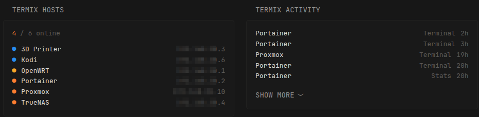

Widgets for [Termix](https://github.com/Termix-SSH/Termix), a self-hosted SSH, file manager, and server-stats dashboard.

## Termix Hosts

Shows all Termix hosts sorted alphabetically with live online/offline indicators. Online hosts display real-time CPU and memory usage; offline hosts show their IP.

> **Note:** Status indicators require an active Termix user session open in a browser. When no session is active, all dots show as grey (unknown). Host names and IPs are always displayed.

## Termix Activity

Shows the most recent connections and activity logged by Termix.

## Environment variables

- `TERMIX_URL`: Base URL of your Termix instance, e.g. `http://192.168.1.100:8080`
- `TERMIX_API_KEY`: API key created in Termix under **Admin → Settings → API Keys** (starts with `tmx_`)
